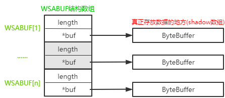

# Java中网络异步I/O之Windows系统下的实现

在上篇文章中，我们讲解了Java中对异步IO的抽象实现；更具体的由于平台实现机制的区别是有平台来提供实现的。本文将聚焦在Windows平台对异步IO的支持-IOCP的原理及Java层面在windows平台上的具体实现。

## 一、认识IOCP

IOCP(I/O completion ports)，即**I/O完成端口**，Windows平台的专有实现。I/O完成端口在多处理机系统上为众多的异步IO请求提供了一个高效的线程处理模型。操作系统给每个I/O完成端口分配一个**队列**，用于服务异步IO请求；并通过与一个**预分配的线程池**合作可以高效且快速的处理许多并发的异步IO请求。其基本原理如下图：


> :warning:**文件句柄**：Windows中的文件句柄是一个系统抽象概念，代表的是一个重叠I/O端点，可以理解为文件描述符，它不仅可以代表打开的文件，还可以表示TCP socket、命名管道、网络端点等等。

> :warning:**工作线程处理任务逻辑**：多个工作线程都同时等待FIFO队列时，如果有异步IO事件完成，那么应该由哪个工作线程去处理这个完成事件呢？遵循的原则是：LIFO，即每个工作线程进入等待堆栈，有任务时再出栈处理任务。

上图是我通过阅读Windows提供的开发文档，根据自己理解所画出来的，可能在一些细节或者是数据结构上跟最终的实现有差距，请各位读者注意分辨。

### 1. IOCP提供的系统接口

Windows的库文件中提供了若干接口，让程序员可以操作IOCP来实现异步IO功能。本文将粗略的介绍Java中用到的几个接口。主要如下：

> **CreateIoCompletionPort**
>
> 方法参数：
> HANDLE  FileHandle：支持重叠I/O的文件句柄，如果值为INVALID_HANDLE_VALUE，则方法会创建一个新的完成端口，且此种情况下，ExistingCompletionPort必须为NULL，同时会忽略CompletionKey参数。
> HANDLE  ExistingCompletionPort：一个已经存在的完成端口；为NULL时会创建一个新的完成端口，并将FileHandle与完成端口关联；
> ULONG_PTR  CompletionKey：用户定义的值，每个IO Completion Packet通过这个值可以关联到FileHandle
> DWORD  NumberOfConcurrentThreads：并行度，系统允许的可以同时用于处理IO Completion Packet的最大线程数

这个接口完成两个功能：

1. 创建一个I/O完成端口；
2. 将指定的文件句柄与I/O完成端口关联起来。

这两个功能都是根据传入参数值来完成的，如果传入的参数值已经指定了I/O完成端口值则不会再创建；如果传入的文件句柄对象不为NULL，就将这个文件句柄与I/O完成端口建立关联关系。这个接口会接收一个并行度参数，这个参数决定了可以同时运行的工作线程数。

>  **GetQueuedCompletionStatus**
>
> 方法参数：
> HANDLE  CompletionPort：完成端口
> LPDWORD  lpNumberOfBytesTransferred：指向一个变量的指针，这个变量值表示的是I/O操作完成之后可以传输的数据大小（字节数）
> PULONG_PTR  lpCompletionKey：指向一个变量的指针，这个变量值表示的是已完成I/O操作的文件句柄的关联的Completion Key
> LPOVERLAPPED  *lpOverlapped：指向一个OVERLAPPED结构起始地址的指针，OVERLAPPED存放的就是I/O操作的结果
> DWORD  dwMilliseconds：毫秒值，表示调用者准备等待Completion Packet出现的时长；为INFINITE表示一直等待，为0表示不等待

如果FIFO队列中有元素，则出队一个Completion Packet；否则等待与I/O完成端口关联的正在进行的I/O操作完成。这个方法可以通过设置一个超时时间值来决定是否等待以及等待的时长。如果想一次出队多个Completion Packet，可以使用**GetQueuedCompletionStatusEx**接口。

> **PostQueuedCompletionStatus**
>
> 方法参数：
> HANDLE  CompletionPort：完成端口
> DWORD  dwNumberOfBytesTransferred：指定GetQueuedCompletionStatus函数将会返回的lpNumberOfBytesTransferred值的大小
> ULONG_PTR  dwCompletionKey：指定GetQueuedCompletionStatus函数将会返回的lpCompletionKey的值
> LPOVERLAPPED  lpOverlapped：指定GetQueuedCompletionStatus函数将会返回的lpOverlapped的值

发送一个Completion Packet到I/O完成端口上，主要用于自定义事件。

Windows还提供了其他支持异步操作的接口函数，比如：**WSASend**、**WSARecv**等一系列支持异步读写的接口函数，这里就不再列举。感兴趣的可以查看Windows提供的开发文档进行查看。

### 2. IOCP的工作流程


> :warning:IOCP涉及多个线程，其执行流程并不是一个严格的线性关系，上图只是从宏观层面粗略的展示一个大体的流程，请各位读者注意。

流程描述：

1. 首先在主线程中，通过调用**CreateIoCompletionPort**接口来新建一个**I/O完成端口**，系统会为这个新建的完成端口分配一个**FIFO队列**；
2. 根据新建完成端口是指定的并行度大小，启动相应的工作线程数，在每个线程中调用接口**GetQueuedCompletionStatus**进入阻塞等待的状态（进入等待状态的线程会进入一个栈结构中，按后进先出的顺序处理I/O完成）；
3. 创建文件句柄（这里是指创建网络socket），并将文件句柄与刚刚创建的I/O完成端口关联起来（在关联的时候有一个重要的参数***CompletionKey***，这个参数会绑定到文件句柄上，在I/O事件完成时可以根据这个值找到对应的文件句柄对象）；
4. 文件句柄发出异步I/O事件（连接事件、读事件、写事件）；
5. 异步I/O事件完成之后会生成一个**Completion Packet**结构，并将这个结构加入到FIFO队列中；
6. 异步I/O事件完成之后会唤醒等待中的工作线程（后进先出的规则），工作线程处理这个I/O完成事件之后，继续调用**GetQueuedCompletionStatus**进入等待或者获取下一个I/O完成事件。

当一个线程第一次调用**GetQueuedCompletionStatus**时，就会和I/O完成端口关联起来，直到这个线程关闭、指定另一个完成端口或者是完成端口关闭。

### 3. IOCP线程池与并行度

**并行度**是I/O完成端口中非常重要的需要认真考虑的一个属性；这个属性值在调用**CreateIoCompletionPort**接口创建完成端口时指定。这个属性值会限制关联到完成端口上的线程的可运行数量；当关联到完成端口上的处于可运行状态线程数达到这个值的时候，后续的关联线程调用将被阻塞，直到运行数下降。

并行度的设计要考虑这样的一种情况：当工作线程一个一个进入等待状态入栈的之后，如果Completion Packet此时源源不断的进入FIFO队列，并且栈顶的线程可以及时处理完这个Completion Packet就有可能造成早入栈的线程饿死一直等不到执行的机会。所以，一般建议设置并行度的大小为处理器个数。

> :warning:并行度控制的是**可同时运行的线程数**；不包括等待线程数在内。

下面我们将结合上文所讲内容，正式进入Java世界对IOCP的封装处理是如何做的。

## 二、Java对IOCP的封装实现

在上文我们已经讲过Java层面对异步IO支持的抽象及其抽象基础实现。那么跟平台具体实现相关的又是怎么样的呢？

### 1. DefaultAsynchronousChannelProvider

我们说过Java中会通过**AsynchronousChannelProvider**服务提供器来提供具体的异步通道相关实例，在其***provider()***方法中会依次通过系统属性、SPI及默认提供器创建器来创建服务提供器；而默认提供器创建器是平台相关的实现，下面看其在Windows平台下的实现，代码如下：

```java
public class DefaultAsynchronousChannelProvider {
    private DefaultAsynchronousChannelProvider() { }

    public static AsynchronousChannelProvider create() {
        return new WindowsAsynchronousChannelProvider();	// 创建一个Windows平台的异步通道提供器
    }
}
```

意味着在Windows平台下，通过***AsynchronousChannelProvider.provider()***方法返回的异步通道提供器最终是一个**WindowsAsynchronousChannelProvider**实例。

### 2. WindowsAsynchronousChannelProvider

**AsynchronousChannelProvider**抽象类的具体实现，我们来看一下它是如何提供异步通道相关的各种实例的，实现代码如下：

```java
public class WindowsAsynchronousChannelProvider extends AsynchronousChannelProvider {
    // 默认的Iocp实例，是AsynchronousChannelGroupImpl的实现
    // 在创建异步通道时传入的异步通道组为null时使用
    private static volatile Iocp defaultIocp;

    // 默认构造方法
    public WindowsAsynchronousChannelProvider() {
    }

    // 为默认Iocp赋值，使用了非常经典的单例设计模式（懒加载方式）
    private Iocp defaultIocp() throws IOException {
        if (defaultIocp == null) {
            synchronized (WindowsAsynchronousChannelProvider.class) {
                if (defaultIocp == null) {
                    // 创建Iocp实例，并启动所有工作线程
                    defaultIocp = new Iocp(this, ThreadPool.getDefault()).start();
                }
            }
        }
        return defaultIocp;
    }

    /**
     * 创建固定数量线程的异步通道组Iocp
     */
    @Override
    public AsynchronousChannelGroup openAsynchronousChannelGroup(int nThreads, ThreadFactory factory)
        throws IOException
    {
        /**
         * 1. 首先通过ThreadPool的静态方法create创建一个Fixed类型的线程池
         *    （方法内部通过Executors.newFixedThreadPool()创建线程池，线程数固定为nThreads）；
         * 2. 然后new一个Iocp类型的实例；
         * 3. 调用Iocp的start方法启动nThreads个工作线程。
         */
        return new Iocp(this, ThreadPool.create(nThreads, factory)).start();
    }

    /**
     * 根据executor线程数量可变的异步通道组Iocp
     */
    @Override
    public AsynchronousChannelGroup openAsynchronousChannelGroup(ExecutorService executor, int initialSize)
        throws IOException
    {
        /**
         * 1. 首先通过ThreadPool的静态方法wrap创建一个nonFixed类型的线程池
         *    （方法内部会判断executor的类型是否为ThreadPoolExecutor类型且是否是cached线程池，
         *     如果是，则重设initialSize的值，如果传入的initialSize<0，则取处理器个数值；否则取0）
         * 2. 如果executor不是ThreadPoolExecutor类型，且initialSize<0，则将initialSize重设为0；
         * 3. new一个Iocp类型实例
         * 4. 调用Iocp的start方法启动[initialSize + internalThreadCount（默认值为1）]个工作线程。
         */
        return new Iocp(this, ThreadPool.wrap(executor, initialSize)).start();
    }

    /**
     * 将创建异步通道时传入的异步通道组对象转换为Iocp类型（因为是windows平台）
     */
    private Iocp toIocp(AsynchronousChannelGroup group) throws IOException {
        if (group == null) {
            return defaultIocp();
        } else {
            if (!(group instanceof Iocp))	// 如果不是Iocp类型实例，抛出异常
                throw new IllegalChannelGroupException();
            return (Iocp)group;
        }
    }

    /**
     * 通过异步通道组来创建一个Windows版本的服务端异步通道实例
     */
    @Override
    public AsynchronousServerSocketChannel openAsynchronousServerSocketChannel(AsynchronousChannelGroup group)
        throws IOException
    {
        return new WindowsAsynchronousServerSocketChannelImpl(toIocp(group));
    }

    /**
     * 通过异步通道组来创建一个Windows版本的客户端异步通道实例
     */
    @Override
    public AsynchronousSocketChannel openAsynchronousSocketChannel(AsynchronousChannelGroup group)
        throws IOException
    {
        return new WindowsAsynchronousSocketChannelImpl(toIocp(group));
    }
}
```

### 3. Iocp

从上面的**WindowsAsynchronousChannelProvider**实现类，我们已经知道了Windows平台下创建的异步通道组是**Iocp**类的实例，**Iocp**类在*sun.nio.ch*包下，继承自**AsynchronousChannelGroupImpl**这个抽象实现类。**Iocp**类是对Windows中Iocp的封装实现，在此类中维护了如下几个关键属性：

#### 关键属性

> long **port**

指向底层IO完成端口的句柄值，根据它可以访问到内核的IO完成端口对象。

> Map<Integer, OverlappedChannel> **keyToChannel**

CompletionKey到Channel的映射关系，在IO操作完成之后，底层会根据Completion Packet获取到CompletionKey，在Java应用层可以通过这个映射关系找到对应的通道对象，从而完成后续的处理。

:warning:**CompletionKey**是Java中指定的值，并不是由内核分配的，在第一部分接口介绍的时候也说过这个值是有用户指定的。

> Set<Long> **staleIoSet**

过期的OVERLAPPED结构。

下面看一下，**Iocp**类中的几个关键方法，看它如何实现对底层Iocp的调用的。

#### 关键函数

> **构造函数**

```java
/**
 * 唯一构造函数，传入一个服务提供器对象和一个线程池对象
 */
Iocp(AsynchronousChannelProvider provider, ThreadPool pool) throws IOException
{
    // 调用父类构造方法，在上文说过线程池对象由AsynchronousChannelGroupImpl维护
    super(provider, pool);
    // 创建IO完成端口，由port属性引用
    this.port = createIoCompletionPort(INVALID_HANDLE_VALUE, 0, 0, fixedThreadCount());
    this.nextCompletionKey = 1;	// 下次待使用的CompletionKey的值
}
```

Iocp中构造函数的实现很简单，核心步骤在于调用***createIoCompletionPort***方法来创建一个**IO完成端口**，这是一个本地方法，其定义如下：

```Java
/**
 * handle：文件句柄值，本次调用传入的INVALID_HANDLE_VALUE（意味着是要创建一个新的IO完成端口）
 * existingPort：已经存在的完成端口值，本次调用传入0值（转换到本地代码之后就是NULL，也是意味着创建新的完成端口）
 * completionKey：completionKey，本次调用传入0，在本次调用这个值会被忽略（后续在唤醒线程时也是用的0）
 * concurrency：并行度，用于控制IO完成端口允许的最大运行线程数，本次通过fixedThreadCount()函数来取值，
 * 			   1. 对于fixed类型的线程池，这个值就是nThreads值
 *             2. 对于非fixed类型的线程池，这个值就是initialSize + internalThreadCount
 */
private static native long createIoCompletionPort(long handle,
        long existingPort, int completionKey, int concurrency) throws IOException;
```

可以看到，这个本地方法的定义和本文第一部分介绍Iocp中的接口**CreateIoCompletionPort**其实是一样的，只不过参数类型都换成了Java中的类型；不错，这个本地方法的实现其实很简单，就是调用的**CreateIoCompletionPort**这一个接口，本地实现代码如下：

```c++
JNIEXPORT jlong JNICALL
Java_sun_nio_ch_Iocp_createIoCompletionPort(JNIEnv* env, jclass this,
    jlong handle, jlong existingPort, jint completionKey, jint concurrency)
{
    ULONG_PTR ck = completionKey;
    // 调用系统提供的接口函数CreateIoCompletionPort
    HANDLE port = CreateIoCompletionPort((HANDLE)jlong_to_ptr(handle), // 将handle转换为HANDLE对象
                                         (HANDLE)jlong_to_ptr(existingPort), // 将existingPort转换为HANDLE对象（0->NULL）
                                         ck,
                                         (DWORD)concurrency);
    if (port == NULL) {	// 创建失败，抛出异常
        JNU_ThrowIOExceptionWithLastError(env, "CreateIoCompletionPort failed");
    }
    return ptr_to_jlong(port);
}
```

在服务提供器代码中，创建异步通道组实例的时候，是以`new Iocp(...).start()`这样的方式实现的，那下面来看看***start()***做了什么。

> **start()**

```java
Iocp start() {
    startThreads(new EventHandlerTask()); // 调用父类的startThreads方法
    return this;	// 还是返回当前实例
}
```

***start()***方法的实现也很简单，调用父类AsynchronousChannelGroupImpl中的***startThreads()***方法并返回当前实例就结束了。***startThreads()***方法在上文讲过，主要就是启动线程池内nThreads个线程来执行Task，忘了的同学可以去回顾一下。那这里的核心就剩下**EventhandlerTask**类了，这个类是用了完成什么任务呢，我们可以看一下：

```Java
private class EventHandlerTask implements Runnable {
    public void run() {
        Invoker.GroupAndInvokeCount myGroupAndInvokeCount =
            Invoker.getGroupAndInvokeCount();	// 获取当前线程本地变量表中的Iocp实例
        boolean canInvokeDirect = (myGroupAndInvokeCount != null);
        CompletionStatus ioResult = new CompletionStatus();	// 存放IO操作完成结果
        boolean replaceMe = false;

        try {
            for (;;) {	// 无限循环
                if (myGroupAndInvokeCount != null)
                    myGroupAndInvokeCount.resetInvokeCount();	// 重置调用次数

                replaceMe = false;
                try {
                    // 等待IO操作完成事件（一直等待）
                    // 反应到底层就是等待FIFO队列中的Completion Packet
                    getQueuedCompletionStatus(port, ioResult);	// 本地方法
                } catch (IOException x) {
                    x.printStackTrace();
                    return;
                }

                /**
                 * 线程唤醒或者是关闭操作
                 * 如果线程执行到了这，说明线程已经等到了一个Completion Packet
                 * 如果Completion Packet对应的completionKey=0并且overlapped=0，说明这是一个自定义唤醒（指通过调用wakeup()来唤醒）操作或者是关闭操作（也会调用wakeup()）
                 * 唤醒操作是通过发送一个自定义的模拟消息到FIFO队列来实现的，具体在wakeup()方法会介绍
                 */
                if (ioResult.completionKey() == 0 &&
                    ioResult.overlapped() == 0L)
                {
                    // 唤醒线程的目的：用于处理IO操作完成之后相应的业务逻辑任务，
                    // 因为这里监听IO完成事件的线程也是属于线程池中的线程，而有些CompletionHandler任务也是要扔到池中取执行的，
                    // 所以可能存在当CompletionHandler扔到池中时，所有线程都处于等待IO完成事件的状态，这个时候就需要唤醒线程来执行CompletionHandler任务
                    // 所以这里会先从任务队列中获取任务，taskQueue属于AsynchronousChannelGroupImpl中维护的队列，只有在fixed类型线程池才会有
                    Runnable task = pollTask();
                    if (task == null) {
                        /**
                         * 任务为空，说明没有需要处理的任务，或者已经被处理了，则线程执行结束
                         * 这里也说明这样一个事实，我被唤醒来处理任务，但是去任务队列取任务的时候，
                         * 却没有需要处理的任务，说明这个任务已经被其他线程处理；这也意味着当前系统的处理能力
                         * 是非常强的，不需要这么多的线程就可以处理完所有的任务；所以当前这个被唤醒的任务就可以结束了
                         * 没必要继续循环等待io完成事件，所以这里才会直接return。
                         */
                        return;
                    }

                    // 任务不为空，执行任务
                    // 任务执行完毕之后，继续进入等待IO完成事件的状态
                    replaceMe = true;
                    task.run();
                    continue;
                }

                /**
                 * 到这里说明线程等到的Completion Packet对应的CompletionKey != 0或者overlapped != 0
                 * 意味着是某个文件句柄（socket）对应的异步IO操作完成了
                 * 这个时候我们要根据对应的CompletionKey值取到对应的Channel实例
                 */
                OverlappedChannel ch = null;
                keyToChannelLock.readLock().lock();
                try {
                    ch = keyToChannel.get(ioResult.completionKey());
                    if (ch == null) {	// 对应的通道不存在了，可能是已经关闭了
                        checkIfStale(ioResult.overlapped());
                        continue;
                    }
                } finally {
                    keyToChannelLock.readLock().unlock();
                }

                // 根据overlapped值获取对应的发出这个I/O请求的封装了相关信息的Future对象
                // PendingFuture内部保存了发出I/O请求时的相关上下文属性：ServerSocketChannel、CompletionHandler以及attachment
                PendingFuture<?,?> result = ch.getByOverlapped(ioResult.overlapped());
                if (result == null) {
                    checkIfStale(ioResult.overlapped());
                    continue;
                }

                // 如果I/O操作完成任务已经执行完毕了（被发出I/O操作的线程执行完毕或直接设置了完成态），则继续循环
                synchronized (result) {
                    if (result.isDone()) {
                        continue;
                    }
                }

                // 调用I/O操作结果处理器
                int error = ioResult.error();
                ResultHandler rh = (ResultHandler)result.getContext();
                replaceMe = true;
                if (error == 0) {	// 如果I/O操作正常完成，最终会调用到CompletionHandler
                    rh.completed(ioResult.bytesTransferred(), canInvokeDirect);
                } else {	// I/O操作异常完成，最终会调用到CompletionHandler
                    rh.failed(error, translateErrorToIOException(error));
                }
            }
        } finally {
            // 到了这里，说明已经退出了循环，线程已经不需要做任务了
            // 首先关闭当前线程
            // 然后判断当前关闭的线程是否最后一个（remaining=0）
            // 如果是最后一个关闭线程且当前是关闭状态，则执行关闭操作来关闭Iocp（关闭底层完成端口以及释放占用的资源）
            int remaining = threadExit(this, replaceMe);
            if (remaining == 0 && isShutdown()) {
                implClose();
            }
        }
    }
}
```

从**EventHandlerTask**的实现，其主要任务便是调用本地方法**getQueuedCompletionStatus**等待IO完成事件，并将IO操作结果分发到结果处理器**ResultHandler**（ResultHandler是一个接口，至于具体的实现做了什么在后续介绍）。我们继续看一下本地方法**getQueuedCompletionStatus**的定义吧，看看它的本地实现：

```java
/**
 * completionPort：IO完成端口，这里传入的是Iocp中port这个属性值
 * status：CompletionStatus实例，用于接收异步IO操作的结果值，
 *        其包含有：completionKey、error、overlapped、bytesTransferred属性值（对应到第一部分介绍系统接口的参数）
 */
private static native void getQueuedCompletionStatus(long completionPort,
        CompletionStatus status) throws IOException;
```

本地实现是通过调用接口**GetQueuedCompletionStatus**实现的，代码如下：

```c++
JNIEXPORT void JNICALL
Java_sun_nio_ch_Iocp_getQueuedCompletionStatus(JNIEnv* env, jclass this,
    jlong completionPort, jobject obj) // obj就是传进来的status实例对象
{
    DWORD bytesTransferred;
    ULONG_PTR completionKey;
    OVERLAPPED *lpOverlapped;
    BOOL res;

    res = GetQueuedCompletionStatus((HANDLE)jlong_to_ptr(completionPort),
                                  &bytesTransferred,
                                  &completionKey,
                                  &lpOverlapped,
                                  INFINITE); // INFINITE表示一直等待，知道有completion packet
    if (res == 0 && lpOverlapped == NULL) { // 出现异常
        JNU_ThrowIOExceptionWithLastError(env, "GetQueuedCompletionStatus failed");
    } else {
        // 将bytesTransferred、completionKey、lpOverlapped、error状态设置到传入的CompletionStatus对象上
        DWORD ioResult = (res == 0) ? GetLastError() : 0;
        (*env)->SetIntField(env, obj, completionStatus_error, ioResult);
        (*env)->SetIntField(env, obj, completionStatus_bytesTransferred,
            (jint)bytesTransferred);
        (*env)->SetIntField(env, obj, completionStatus_completionKey,
            (jint)completionKey);
        (*env)->SetLongField(env, obj, completionStatus_overlapped,
            ptr_to_jlong(lpOverlapped));

    }
}
```

至此，Iocp创建IO完成端口及工作线程监听IO完成事件的工作都已经完成，那么文件句柄（socket）是怎么关联到IO完成端口及解除关联的呢？

> **associate**

用于将指定的文件句柄和IOCP关联起来，并在**Iocp**类中保存一个对应的映射关系，代码分析如下：

```java
/**
 * ch：通道实例，这里传入的应该是WindowsAsynchronousServerSocketChannelImpl或者是WindowsAsynchronousSocketChannelImpl的实例，
 * handle：文件句柄，在创建WindowsAsynchronousServerSocketChannelImpl或者是WindowsAsynchronousSocketChannelImpl实例时创建的
 */
int associate(OverlappedChannel ch, long handle) throws IOException {
    keyToChannelLock.writeLock().lock();	// 获取一个写锁

    int key;
    try {
        if (isShutdown())	// Iocp（异步通道组）已经执行了关闭命令，就不允许再建立关联了
            throw new ShutdownChannelGroupException();

        // 生成一个新的completionkey
        do {
            key = nextCompletionKey++;
        } while ((key == 0) || keyToChannel.containsKey(key));

        // 将文件句柄与完成端口port关联起来
        if (handle != 0L) {
            // 本地方法，上面有介绍
            // 注意这里调用的区别在于参数值的不一样
            createIoCompletionPort(handle, port, key, 0);
        }

        // 将completionkey与Channel的映射关系保存起来
        keyToChannel.put(key, ch);
    } finally {
        keyToChannelLock.writeLock().unlock();	// 释放写锁
    }
    return key;
}
```

关联操作是由具体的异步通道实例在创建的过程中发起的。

> **disassociate**

在java层面解除异步通道与异步通道组的绑定关系，代码分析如下：

```java
/**
 * key：CompletionKey值
 */
void disassociate(int key) {
    boolean checkForShutdown = false;

    keyToChannelLock.writeLock().lock();
    try {
        keyToChannel.remove(key); // 直接移除

        if (keyToChannel.isEmpty())	// 如果是异步通道组绑定的最后一个异步通道
            checkForShutdown = true;

    } finally {
        keyToChannelLock.writeLock().unlock();
    }

    // 如果执行了关闭命令且是最后一个解除绑定关系的异步通道，则马上关闭异步通道组
    if (checkForShutdown && isShutdown()) {
        try {
            shutdownNow();
        } catch (IOException ignore) { }
    }
}
```

:warning:这里解除的只是异步通道与Iocp实例的绑定关系，在底层这个关联关系此时是还没有解除的，因此在Java层面调用了**disassociate**函数之后，应调用Chanel的close方法来关闭通道已解除底层的关联关系。

> **executeOnHandlerTask**

这是**AsynchronousChannelGroupImpl**中定义的方法，在介绍***executeOnPooledThread***方法时有提到过，用于在fixed类型的线程池下，将任务加入队列并唤醒相关线程来处理任务队列，代码分析如下：

```java
@Override
void executeOnHandlerTask(Runnable task) {
    synchronized (this) {
        if (closed)
            throw new RejectedExecutionException();
        offerTask(task);	// 将任务加入到任务队列中
        wakeup();	// 唤醒正在等待IO完成事件的线程用于处理任务
    }

}
```

> **wakeup**

唤醒等待IO完成事件的线程，代码实现如下：

```java
private void wakeup() {
    try {
        postQueuedCompletionStatus(port, 0); // 本地方法，用于往完成端口发送一个自定义消息来激活处理等待中的线程
    } catch (IOException e) {
        throw new AssertionError(e);
    }
}
```

***postQueuedCompletionStatus***方法定义如下：

```java
/**
 * completionPort：完成端口，这里传入的是port属性值，向这个端口发送Completion Packet
 * completionKey：这里传入0，在通过GetQueuedCompletionStatus获取结果时，
 *                将获取到这里传入的completionKey值，从而在被激活线程中可以通过completionKey的值来判断线程是被自定义唤醒的还是被特性的IO完成事件唤醒的
 */
private static native void postQueuedCompletionStatus(long completionPort,
        int completionKey) throws IOException;
```

毫无疑问，跟上面提到的两个本地方法一样，这个本地方法内部肯定也是调用的**PostQueuedCompletionStatus**接口函数来实现的，具体代码如下：

```c++
JNIEXPORT void JNICALL
Java_sun_nio_ch_Iocp_postQueuedCompletionStatus(JNIEnv* env, jclass this,
    jlong completionPort, jint completionKey)
{
    BOOL res;

    res = PostQueuedCompletionStatus((HANDLE)jlong_to_ptr(completionPort),
                                     (DWORD)0, // dwNumberOfBytesTransferred的值为0，意味着通过GetQueuedCompletionstatus获取到的numberOfBytesTransferred的值也是0
                                     (DWORD)completionKey, // Java传入的completionKey值
                                     NULL); // lpOverlapped值为NULL，意味着通过GetQueuedCompletionstatus获取到的lpOverlapped值也为NULL（转换到Java中的值会变成0）
    if (res == 0) {
        JNU_ThrowIOExceptionWithLastError(env, "PostQueuedCompletionStatus");
    }
}
```

### 4. WindowsAsynchronousServerSocketChannelImpl

**WindowsAsynchronousServerSocketChannelImpl**是Java在Windows平台下提供的服务端异步通道实现，继承自**AsynchronousServerSocketChannelImpl**，同时实现了**Iocp**类的内部接口**OverlappedChannel**。本类也属于*sun.nio.ch*包下的实现。下面我们来分析一下这个实现类。

#### 关键属性

> long **handle**

文件句柄，指向底层的服务端socket，是通过父类的**fd**属性获取的。

> int **completionKey**

跟当前实例关联的completionKey值，在当前实例跟Iocp进行关联的时候获得。

> Iocp **iocp**

记录当前通道关联到的Iocp实例。

> PendingIoCache **ioCache**

用于缓存PendingFuture（这里的话主要是存放Accept类型的Future任务），overlapped到PendingFuture实例的一个映射关系。一般情况下这个缓存大小是0或者是1，在PendingIoCache中也维护了一个OVERLAPPED结构的缓存（维护的这个缓存好像并没有用于存放具体的数据，好像只在映射关系起到了作用）。

> long **dataBuffer**

用于缓存跟客户端socket相关的本地地址和远程地址信息，通过Unsafe分配的一个本地内存，它的大小由**DATA_BUFFER_SIZE(88)**控制。

> AtomicBoolean **accepting**

用于标记当前是否已经发出过一个异步accept命令。

#### 关键函数

> 构造函数

```java
WindowsAsynchronousServerSocketChannelImpl(Iocp iocp) throws IOException {
    super(iocp);	// 调用父类构造函数，传入Iocp异步通道组实例

    // 通过父类的fd对象获取到其内部封装的文件句柄（文件描述符）
    long h = IOUtil.fdVal(fd);
    int key;
    try {
        // 调用iocp的associate方法，将当前异步通道实例绑定到iocp组中，同时将文件句柄关联完成端口，并返回completionKey值
        // associate方法解析见上文
        key = iocp.associate(this, h);
    } catch (IOException x) {
        closesocket0(h);   // 出现异常就关闭已经创建的底层socket回收资源，防止内存泄露
        throw x;
    }

    // 初始化各属性值
    this.handle = h;
    this.completionKey = key;
    this.iocp = iocp;
    this.ioCache = new PendingIoCache();
    this.dataBuffer = unsafe.allocateMemory(DATA_BUFFER_SIZE); // 分配指定大小的本地内存，并将首地址记录下来
}
```

> **getByOverlapped(long overlapped)**

实现自**Iocp.OverlappedChannel**接口的函数，用于根据overlapped的值（在IO操作完成的时候会获取到这个值）来取到对应的PendingFuture对象，从而可以通过PendingFuture来执行IO完成工作。代码实现分析如下：

```java
@Override
public <V,A> PendingFuture<V,A> getByOverlapped(long overlapped) {
    return ioCache.remove(overlapped); 	// 从ioCache属性中取出PendingFuture，并从缓存中移除（存放进去的时机是在发出accept命令之前）
}
```

> **implAccept(Object attachment, CompletionHandler handler)**

实现自**AsynchronousServerSocketChannelImpl**类（在上文讲这个类的时候，我们讲过重载的两个***accept()***方法最终都是通过调用抽象方法***implAccept()***来完成的）中的方法，下面我们来看一下异步通道是如何来实现接收一个客户端请求的。代码分析如下：

```java
@Override
Future<AsynchronousSocketChannel> implAccept(Object attachment,
                                             final CompletionHandler<AsynchronousSocketChannel,Object> handler)
{
    if (!isOpen()) {
        // 如果当前通道已经处于关闭状态，则初始化一个关闭异常
        Throwable exc = new ClosedChannelException();
        if (handler == null)	// 判断完成处理器是否为空，来确定是哪种异步操作方式
            return CompletedFuture.withFailure(exc);	// 为空，返回一个Future实例
        
        // 否则通过调用CompletionHandler完成处理器实例来处理
        // invokeIndirectly方式是指不是直接通过当前线程来处理结果，而是把这个handler封装成一个任务扔到iocp的线程池去处理
        Invoker.invokeIndirectly(this, handler, attachment, null, exc);
        return null;
    }
    if (isAcceptKilled())
        // isAcceptKilled：是否杀死了accept，是则抛出异常
        // 发生场景：
        // 在调用accept之后返回了一个Future类型实例（PendingFuture），然后在这个Future实例的任务完成之前调用了这个Future实例的cancel方法会造成isAcceptKilled返回true
        
        // 这就意味着，虽然我们没有直接调用通道的关闭方法，而只是调用了其一个任务的cancel方法也有可能造成通道不再处理接收连接的任务
        // 建议在调用Future的cancel之后，应该要在调用Iocp.shutdown命令来命令式关闭，已释放所有的资源
        throw new RuntimeException("Accept not allowed due to cancellation");

    if (localAddress == null)
        // 还没有绑定本地端口，抛出异常
        throw new NotYetBoundException();

    WindowsAsynchronousSocketChannelImpl ch = null;
    IOException ioe = null;
    try {
        begin();
        // 创建一个客户端异步通道，在创建的时候也会绑定到iocp上，具体在文章后续讲解
        ch = new WindowsAsynchronousSocketChannelImpl(iocp, false);
    } catch (IOException x) {
        ioe = x;
    } finally {
        end();
    }
    if (ioe != null) {
        if (handler == null)
            return CompletedFuture.withFailure(ioe);
        Invoker.invokeIndirectly(this, handler, attachment, null, ioe);
        return null;
    }

    // 获取一个资源权限访问控制器上下文用于处理资源访问权限的问题
    AccessControlContext acc = (System.getSecurityManager() == null) ?
        null : AccessController.getContext();

    /*********************************************************
     ****************** 重点 *******  *************************
     * 利用当前通道实例、完成处理器实例handler、以及attachment三个属性创建一个PendingFuture实例
     * 这个PendingFuture其实是保存了一个上下文的环境，在accept这个io操作完成的时候可以根据overlapped的值
     * 获取到这个PendingFuture，从而可以根据其保存的环境来处理相关完成任务。
     */
    PendingFuture<AsynchronousSocketChannel,Object> result =
        new PendingFuture<AsynchronousSocketChannel,Object>(this, handler, attachment);
    // 利用客户端异步通道实例、权限控制器以及PendingFuture实例result来新建一个Accept任务，
    // AcceptTask继承了Iocp.ResultHandler结果处理器接口，这个任务对象做了什么在下面会分析
    AcceptTask task = new AcceptTask(ch, acc, result);
    // 将AcceptTask这个ResultHandler实例也设置到result这个PendingFuture的实例中
    // 在IO操作完成的时候就是根据result.getContext()取出的AcceptTask这个结果处理器来处理结果的
    result.setContext(task);

	// CAS操作，如果accepting之前是false（表示没有发出过accept或者发出的accept已经结束），则表示现在可以发出accept命令，并将accepting设置为true
    if (!accepting.compareAndSet(false, true))
        throw new AcceptPendingException();

    // 发出accept操作
    // 两种方式：
    // 1. 直接由当前执行accept()方法线程发出异步io操作命令；
    // 2. 将异步io操作命令丢到线程池中去，由线程池处理这个任务（存在这样一种情况：当当前执行accept()方法的线程本身也是池中线程，则也会有当前线程执行执行io命令）。
    if (Iocp.supportsThreadAgnosticIo()) {	// 当操作系统支持AgnosticIo时（windows操作系统的主版本>=6的时候即支持-即win7/win2008或者更新的系统）
        task.run();
    } else {
        Invoker.invokeOnThreadInThreadPool(this, task);
    }
    return result;
}
```

从***implAccept()***的实现我们只看到了PendingFuture的创建，但是overlapped与PendingFuture的映射是什么时候建立的好像并没有看到。其实这个映射关系是在**AcceptTask**中建立的，**AcceptTask**是一个内部类，实现了**Iocp.ResultHandler**接口，我们看一下它的***run()***方法，看一下这个任务到底做了什么：

```java
@Override
public void run() {
    long overlapped = 0L;	// 初始化一个overlapped值，overlapped其实是一个指向一块OVERLAPPED结构大小的本地内存地址

    try {
        begin();	// 获取服务端异步通道的关闭读锁，防止被关闭
        try {
            channel.begin(); // 获取上面创建的客户端异步通道的关闭读锁，防止被关闭

            // 注意这里锁住了result实例（PendingFuture实例），
            // 跟上面的EventHandlerTask中处理IO完成事件时判断result.isDone()时锁result是呼应的
            synchronized (result) {
                // 将result加入到ioCache中，做了两件事：
                // 1. 判断ioCache中OVERLAPPED结构的缓存是否有空闲的，没有则分配一个新的内存大小；
                // 2. 将这个新内存的地址与result放入到一个Map中，并将这个新内存块的地址作为结果返回
                overlapped = ioCache.add(result);
				
                // 本地方法调用
                // 利用监听套接字（服务端异步通道封装的套接字）、接收套接字（客户端）、
                // overlapped和dataBuffer（用于指向接收的连接的本地和远程地址）来发出一个accept命令
                // 其实这里overlapped指向的地址不会收到任何数据，因为这里的accept只用于接收连接，并不会去接收连接的第一个发送块
                // 而这里之所以要传overlapped的值是windows提供的接口规定不能不能传NULL
                int n = accept0(handle, channel.handle(), overlapped, dataBuffer);
                if (n == IOStatus.UNAVAILABLE) {
                    // accept0方法返回这个值说明当前没有连接可用，需要等待连接到来
                    // 但是因为现在是异步操作，所以底层会返回一个UNAVAILABLE的状态值标识
                    // 无连接直接结束任务，等有连接的时候有异步处理即可
                    return;
                }

                // 进入到这里，说明一发出accept命令就有连接到来或者之前就有连接在连接队列等待处理
                // 这个时候就需要处理连接完成事件，那在这里可能就会跟上面Iocp中EventhandlerTask中存在竞争
                // （因为有连接完成事件就会有Completion Packet发到FIFO队列，EventHandlerTask阻塞等待状态会被打破）
                // 所以在这里处理结果的时候要对result进行加锁
                
                // 处理连接完成事件
                finishAccept();

                // 重置accepting状态为false，让线程可以继续正常进入implAccept()函数接收新的连接
                enableAccept();
                result.setResult(channel); // 设置PendingFuture实例的结果
            }
        } finally {
            channel.end(); // 释放读锁
        }
    } catch (Throwable x) {
        // 异常处理-释放资源
        if (overlapped != 0L)
            ioCache.remove(overlapped);
        closeChildChannel();
        if (x instanceof ClosedChannelException)
            x = new AsynchronousCloseException();
        if (!(x instanceof IOException) && !(x instanceof SecurityException))
            x = new IOException(x);
        enableAccept();
        result.setFailure(x);
    } finally {
        // 释放读锁
        end();
    }

    // 此种情况是发生在将io操作扔到线程池中处理的情况，可能在线程池中处理的时候，这个io任务在外部被取消了
    // 这个时间也要释放客户端资源
    if (result.isCancelled()) {
        closeChildChannel();
    }

    // 通过Invoker调用CompletionHandler实例来处理IO完成（扔到Iocp的线程池中去处理）
    Invoker.invokeIndirectly(result);
}
```

> **AcceptTask.finishAccept()**

针对每一个新的客户端连接，调用此方法设置新连接的某些属性。

```java
void finishAccept() throws IOException {
    /**
     * 将客户端channel.handle的某些属性值从服务端句柄handle上复制过来（比如接收缓存大小等）
     * 本地方法调用，内部调用系统接口setsocket().
     */
    updateAcceptContext(handle, channel.handle());

    // 获取到客户端socket的本地地址和远端地址，设置到channel对象上
    InetSocketAddress local = Net.localAddress(channel.fd);
    final InetSocketAddress remote = Net.remoteAddress(channel.fd);
    channel.setConnected(local, remote);	// 设置属性值，并将状态设置为已连接状态

    // 权限检查
    if (acc != null) {
        AccessController.doPrivileged(new PrivilegedAction<Void>() {
            public Void run() {
                SecurityManager sm = System.getSecurityManager();
                sm.checkAccept(remote.getAddress().getHostAddress(),
                               remote.getPort());
                return null;
            }
        }, acc);
    }
}
```

> **AcceptTask.completed(bytesTransferred, canInvokeDirect)**

实现继承自**Iocp.ResultHandler**接口的函数，在异步IO操作完成之后，通过调用链*PendingFuture.getContext().completed()*来处理IO操作完成结果。对于连接操作来说，异步IO操作的期望结果是希望获取到一个封装了客户端socket的一个客户端异步通道对象，我们来看这个方法的代码实现：

```java
@Override
public void completed(int bytesTransferred, boolean canInvokeDirect) {
    try {
        // iocp已经关闭了，抛出异常
        if (iocp.isShutdown()) {
            throw new IOException(new ShutdownChannelGroupException());
        }

        try {
            begin();
            try {
                channel.begin();
                finishAccept(); // 调用finishAccept()
            } finally {
                channel.end();
            }
        } finally {
            end();
        }
		// 重置accepting属性为false，从而可以允许另一个请求连接的方法调用发生
        enableAccept();
        result.setResult(channel);	// 将impleAccept()方法中创建的客户端异步通道实例设置到结果中
    } catch (Throwable x) {
        enableAccept();
        closeChildChannel();
        if (x instanceof ClosedChannelException)
            x = new AsynchronousCloseException();
        if (!(x instanceof IOException) && !(x instanceof SecurityException))
            result.setFailure(x);
    }

    // 如果任务已经被异步取消了，则关闭客户端通道释放资源
    if (result.isCancelled()) {
        closeChildChannel();
    }

    // 将任务扔到线程池中，由线程池调用CompletionHandler对应的completed方法来处理完成任务
    Invoker.invokeIndirectly(result);
}
```

> **AcceptTask.failed(error, exception)**

实现继承自**Iocp.ResultHandler**的方法，在异步IO操作出现错误的时候调用。

```java
@Override
public void failed(int error, IOException x) {
    enableAccept();	// 重置accepting属性为false，允许另一个接收连接的函数调用执行
    closeChildChannel();	// 关闭客户端通道释放资源

    // 检测服务端通道是否关闭
    if (isOpen()) {
        result.setFailure(x);	// 设置异常对象
    } else {
        result.setFailure(new AsynchronousCloseException()); // 抛出异步关闭异常
    }
    Invoker.invokeIndirectly(result); // 将任务扔到线程池，由线程池调用CompletionHandler对应的failed方法来处理
}
```

#### 流程


### 5. WindowsAsynchronousSocketChannelImpl

**WindowsAsynchronousServerSocketChannelImpl**是Java提供的Windows平台下客户端异步通道的实现。继承自**AsynchronousSocketChannelImpl**，同时实现了**Iocp**类的内部接口**OverlappedChannel**。本类也属于*sun.nio.ch*包下的实现。下面我们来分析一下这个实现类。

#### 关键属性

这个类中的属性其实跟**WindowsAsynchronousServerSocketChannelImpl**中的属性差不多，唯一多了的就是接收和发送相关的属性，我们还是看一下吧。

> long **handle**

文件句柄，用于关联底层的客户端socket，是通过父类属性***fd***获取的。

> int **completionKey**

跟当前实例关联的completionKey值，在当前实例跟Iocp进行关联的时候获得。

> Iocp **iocp**

当前实例关联的**AsynchronousChannelGroup**实例Windows下的Iocp。

> PendingIoCache **ioCache**

一个缓存池对象，两个用处：

1. 分配Overlapped结构空间，用户存放异步IO操作的完成结果值，在一个客户端异步通道实例中，这个缓存大小最多**有两个Overlapped空间大小**，分别用于读和写，因为同一个异步通道读和写可以并行进行，但是不能同时进行多次读或者多次写，必须等到上一次的读或写完成才能发出一次新的读或写命令；
2. 存放overlapped到PendingFuture的映射关系，在异步IO操作完成的时候可以根据overlapped的值获取到PendingFuture实例来处理完成之后的任务。

> final long **readBufferArray**
>
> final long **writeBufferArray**

用于读和写的本地堆缓存的首地址，在异步通道中读和写时会先将内容读或写到本地堆内存，然后再读到jvm内存或者写到socket中进行发送（在讲Selector的时候提过）；大小为16个WSABUF结构（32位机器是8字节，64位机器是16字节），这里的16个也就限制了我们在write数据时，最多只能一次写入16个bytebuffer，超过16个部分会被放弃，因为大部分在分配bytebuffer的时候是用的1kb，所以这也是为什么大部分人会说write的时候限制了16kb，真实原因其实不是底层限制了发送大小，限制了发送的bytebuffer的个数。底层会控制发送缓存和接收缓存的大小，但是值远不是16kb。

:warning:请注意哦，​这两个属性并不是指的**发送缓存和接收缓存**，只是预分配的本地堆内存。

#### 关键函数

> 构造函数

这个类的构造函数其实跟服务端异步通道类差不多，只是多了对readBufferArray和writeBufferArray的初始化。

```java
WindowsAsynchronousSocketChannelImpl(Iocp iocp, boolean failIfGroupShutdown)
        throws IOException
{
    super(iocp); // 父类初始化，会创建fd，分配socket。

    long h = IOUtil.fdVal(fd);
    int key = 0;
    try {
        key = iocp.associate(this, h);
    } catch (ShutdownChannelGroupException x) {
        if (failIfGroupShutdown) {		// 用于控制异步通道组关闭的情况下，是否关闭新建的客户端异步通道
            closesocket0(h);
            throw x;
        }
    } catch (IOException x) {
        closesocket0(h);
        throw x;
    }

    this.handle = h;
    this.iocp = iocp;
    this.completionKey = key;
    this.ioCache = new PendingIoCache();

    // 分配两个16个WSABUF结构大小的本地堆内存
    // 32位机器：16*8  64位机器：16*16
    /** WSABUF结构：
     * {
     *   u_long len;   // 指定buf的长度
     *   char FAR* buf; // 指向一个内存块的指针，指针所指向的地方才是真正存放数据的地方
     * }
     */
    this.readBufferArray = unsafe.allocateMemory(SIZEOF_WSABUFARRAY);
    this.writeBufferArray = unsafe.allocateMemory(SIZEOF_WSABUFARRAY);
}

WindowsAsynchronousSocketChannelImpl(Iocp iocp) throws IOException {
    this(iocp, true);
}
```

> **implConnect(remote, attachment, handler)**

在上文中讲过，Java层面的抽象实现在调用***connect()***方法时会调用具体实现平台的***implConnect()***方法，下面我们就来看看这个具体实现方法做了什么？看了这个实现之后，你会发现对于**WindowsAsynchronousServerSocketChannelImpl**类中的***implAccept***方法，以及后面要讲的***implRead()***和***implWrite()***方法，其实都是遵循的相同模式。

```java
@Override
<A> Future<Void> implConnect(SocketAddress remote,
                             A attachment,
                             CompletionHandler<Void,? super A> handler)
{
    if (!isOpen()) { // 如果通道已经出去关闭状态的处理
        Throwable exc = new ClosedChannelException();
        if (handler == null)
            return CompletedFuture.withFailure(exc);
        Invoker.invoke(this, handler, attachment, null, exc);
        return null;
    }

    InetSocketAddress isa = Net.checkAddress(remote); // 检查服务端地址

    // 权限检查：是否允许连接指定的服务端地址
    SecurityManager sm = System.getSecurityManager();
    if (sm != null)
        sm.checkConnect(isa.getAddress().getHostAddress(), isa.getPort());

    IOException bindException = null;
    synchronized (stateLock) {
        // 检查客户端套接字的连接状态
        if (state == ST_CONNECTED)
            throw new AlreadyConnectedException();
        if (state == ST_PENDING)
            throw new ConnectionPendingException();
        if (localAddress == null) {
            try {
                // 绑定一个本地端口地址
                SocketAddress any = new InetSocketAddress(0);
                if (sm == null) {
                    bind(any);
                } else {
                    doPrivilegedBind(any);
                }
            } catch (IOException x) {
                bindException = x;
            }
        }
        if (bindException == null)
            state = ST_PENDING; // 设置状态为：正在进行连接
    }

    if (bindException != null) {
        // 绑定出现异常的处理
        try {
            close();
        } catch (IOException ignore) { }
        if (handler == null)
            return CompletedFuture.withFailure(bindException);
        Invoker.invoke(this, handler, attachment, null, bindException);
        return null;
    }

    // 利用当前通道实例、handler完成处理器实例、attachment对象构建一个PendingFuture实例
    PendingFuture<Void,A> result =
        new PendingFuture<Void,A>(this, handler, attachment);
    // 利用PendingFuture实例构建一个ConnectTask连接任务，ConnectTask实现了ResultHandler接口
    ConnectTask<A> task = new ConnectTask<A>(isa, result);
    result.setContext(task); // 设置PendingFuture的ResultHandler结果处理器

    // 发出异步IO命令
    if (Iocp.supportsThreadAgnosticIo()) {
        // 如果Windows版本是大于等于6，即是vista、windows2008或者更新的版本
        // 直接执行任务
        task.run();
    } else {
        // 将连接任务扔到线程池中去执行
        // 其实在invokeOnThreadInThreadPool会有一个额外的条件判断是直接执行还是扔到线程池中执行
        Invoker.invokeOnThreadInThreadPool(this, task);
    }
    return result;
}
```

下面来看一下**ConnectTask**这个核心任务做了什么？

```java
 @Override
public void run() {
    long overlapped = 0L;
    Throwable exc = null;
    try {
        begin(); // 客户端异步通道的读锁锁定，防止修改

        synchronized (result) {
            // 会根据缓存情况分配一个overlapped结构大小的本地堆缓存
            // 并会将overlapped与result(PendingFuture实例)建立映射关系
            // 上面implAccept讲的比较详细，可以往上翻翻
            overlapped = ioCache.add(result);

            // 发出异步IO连接命令
            int n = connect0(handle, Net.isIPv6Available(), remote.getAddress(),
                             remote.getPort(), overlapped);
            if (n == IOStatus.UNAVAILABLE) {
                // 连接正在进行，直接返回结束任务处理，由EventHandlerTask去处理
                return;
            }

            // 到了这里，说明连接立即建立了起来
            afterConnect();	// 连接建立后，主要完成一些属性和属性值的设置
            result.setResult(null); // 连接建立，说明异步IO事件已经完成，设置结果就可以了，因为连接不需要一个具体的结果对象，所以这里设置null
        }
    } catch (Throwable x) {
        if (overlapped != 0L)
            ioCache.remove(overlapped);// 缓存重新入空闲，解除映射关系
        exc = x;
    } finally {
        end();	// 释放读锁
    }

    if (exc != null) {
        // 有异常，关闭当前客户端通道
        closeChannel();
        // 设置失败异常对象
        result.setFailure(toIOException(exc));
    }
    Invoker.invoke(result);	// 还是将结果扔到Invoker处理，invoke方法会根据条件决定是直接处理result还是扔线程池
}
```

上面的ConnectTask任务中，在连接建立之后会调用***afterConnect()***来完成一些连接建立之后的操作，我们看一下这个方法的实现：

```java
private void afterConnect() throws IOException {
    updateConnectContext(handle); // 本地方法调用，设置客户端socket的某些属性状态
    synchronized (stateLock) {
        state = ST_CONNECTED; 	// 设置状态为已经连接状态
        remoteAddress = remote; // 设置服务端地址
    }
}
```

上面我们说了**ConnectTask**实现了**ResultHandler**接口，意味着在异步IO完成之后会调用这个ResultHandler实例的**completed()**方法或者是**failed()**方法来处理结果，我们看一下这两个方法：

```java
/**
 * 异步连接IO完成之后回调的方法
 */
@Override
public void completed(int bytesTransferred, boolean canInvokeDirect) {
    Throwable exc = null;
    try {
        begin(); // 获取读锁
        afterConnect(); // 调用afterConnect设置状态
        result.setResult(null);
    } catch (Throwable x) {
        exc = x;
    } finally {
        end(); // 释放读锁
    }

    if (exc != null) {
        // 异常，关闭通道
        closeChannel();
        result.setFailure(toIOException(exc));
    }

    if (canInvokeDirect) {
        Invoker.invokeUnchecked(result); // 直接调用处理（意思是由发现异步io事件的线程直接处理业务逻辑）
    } else {
        Invoker.invoke(result); // 内部条件判断之后，再决定是否扔线程池处理
    }
}

/**
 * 异步连接IO失败调用
 */
@Override
public void failed(int error, IOException x) {
    if (isOpen()) {
        closeChannel();
        result.setFailure(x);
    } else {
        result.setFailure(new AsynchronousCloseException());
    }
    Invoker.invoke(result);
}
```

> **implRead()**

我们知道了***implAccept()***和***implConnect()***方法的实现之后，再来看***implRead()***就会简单很多，下面我们看看它的具体实现：

:warning:**注意：**由于是异步操作，所以在调用完***read()***方法之后，用于接收读取内容的dst或者是dsts字符缓冲可能不会马上有值，所以我们在应用编程中应该注意对传入的参数dst或者是dsts的引用，以便在Future或者是CompletionHandler中可以访问dst或者dsts以获取到读取的内容。所以针对这种情况，一般我们会将dst或者是dsts放入***attachment***参数，以便在CompletionHandler中可以方便的引用到。

```java
/**
 * 读方法实现
 * V继承自Number，意味着读方法返回的结果是一个数字类型，表示的是这次读操作共读取到的字节数，读取的内容是放到了dst或者dsts中的。
 */
@Override
<V extends Number,A> Future<V> implRead(boolean isScatteringRead, // 表示此方法时将内容读取到dst还是dsts
                                        ByteBuffer dst,			  // 存放读取的内容，isScatteringRead=false时
                                        ByteBuffer[] dsts,		  // 存放读取的内容，isScatteringRead=true时
                                        long timeout,			  // 超时时间控制，会通过一个定时线程来完成超时功能
                                        TimeUnit unit,			  // 时间单位
                                        A attachment,			  // attachment
                                        CompletionHandler<V,? super A> handler) // 完成处理器
{
    // 构建一个PendingFuture实例
    PendingFuture<V,A> result =
        new PendingFuture<V,A>(this, handler, attachment);
    // 用bufs来表示最终接收内容的字节缓冲数组
    ByteBuffer[] bufs;
    if (isScatteringRead) {
        bufs = dsts;
    } else {
        bufs = new ByteBuffer[1];
        bufs[0] = dst;
    }
    
    // 构建一个读任务，ReadTask也是实现自Iocp.ResultHandler接口
    final ReadTask<V,A> readTask =
        new ReadTask<V,A>(bufs, isScatteringRead, result);
    result.setContext(readTask);

    // 如果有设置超时时间，则构建一个指定超时时间之后执行的定时任务
    if (timeout > 0L) {
        Future<?> timeoutTask = iocp.schedule(new Runnable() {
            public void run() {
                readTask.timeout(); // 超时定时任务是调用的ReadTask中的timeout方法，后面我们看看这个方法做了什么
            }
        }, timeout, unit);
        result.setTimeoutTask(timeoutTask); // 设置到PendingFuture中，方便在异步IO完成的情况下可以取消超时定时任务
    }

    // 发出异步IO操作
    if (Iocp.supportsThreadAgnosticIo()) {
        readTask.run();
    } else {
        Invoker.invokeOnThreadInThreadPool(this, readTask);
    }
    return result;
}
```

从实现代码我们就可以看到，***implRead()***的实现套路跟上面的连接方法其实是一样的，主要的不同在于接收缓冲数据的处理及超时任务的设置上，下面我们看一下超时任务***timeout()***方法做了什么事：

```java
void timeout() {
    // 获取result锁，防止竞争（可能异步IO完成的时候恰好超时时间到，所以要对PendingFuture类型的result加锁处理）
    synchronized (result) {
        if (result.isDone())	// 如果IO已经完成，则没必要处理超时异常
            return;

        // enableReading中的true参数值，表示要关闭通道的读功能
        // 意味着，如果有超时发生，则会将通道的读功能关闭，在父类AsynchronousSocketChannelImpl的read()方法中会判断是否读通道已经关闭，如果关闭会抛出异常
        enableReading(true);
        result.setFailure(new InterruptedByTimeoutException()); // 用超时异常来设置任务结果的失败状态
    }

    // 到了这里，说明任务已经失败了，然后将任务扔到Invoker去处理
    Invoker.invoke(result);
}
```

下面我们看一下***implRead()***方法中的核心任务**ReadTask**做了什么吧，它是怎么将内容读取到bufs中的？在看***run()***方法之前，我们先看一个它的构造方法，因为它的构造方法中有一个比较关键的地方，如下：

```java
ReadTask(ByteBuffer[] bufs,
         boolean scatteringRead,
         PendingFuture<V,A> result)
{
    this.bufs = bufs;	// 将bufs属性指向implRead传进来的bufs字节缓冲数组
    /** 关键点 *****
     * 如果bufs数组的长度超过了MAX_WSABUF(也就是16)，则设置numBufs的值为16，否则取它长度，也就是说numBufs的长度不会超过16
     */
    this.numBufs = (bufs.length > MAX_WSABUF) ? MAX_WSABUF : bufs.length;
    this.scatteringRead = scatteringRead; // 记录当前的读方式
    this.result = result;
}
```

然后我们在来看***run()***方法代码：

```java
@Override
@SuppressWarnings("unchecked")
public void run() {
    long overlapped = 0L;
    boolean prepared = false;
    boolean pending = false;

    try {
        begin();	// 一如既往，先获取closeLock属性的读锁

        // 缓冲处理准备，这个方法在下面分析
        // 主要是本地堆缓冲的分配处理
        prepareBuffers();
        prepared = true;

        // Overlapped缓冲处理，上面有说过不再赘述
        overlapped = ioCache.add(result);

        // 本地方法调用，发出异步IO读请求，注意传入的参数值，会调用Windows中的WSARecv接口来接收数据
        // handle：文件句柄
        // numBufs：表示用于接收读取内容的WSABUF结构的个数
        // readBufferArray：表示用于接收内容的WSABUF结构内存块的首地址
        // overlapped：用于在异步IO完成时返回
        int n = read0(handle, numBufs, readBufferArray, overlapped);
        if (n == IOStatus.UNAVAILABLE) {
            // 表示IO正在进行中，直接返回结束任务的处理，由EventHandlerTask去处理
            pending = true;
            return;
        }
        
        // 表示异步IO立即完成了
        if (n == IOStatus.EOF) {
            // 如果是读取内容的末尾，表示读结束了
            // 设置reading=false，表示当前通道可以接收另一个read()操作调用了
            enableReading();
            if (scatteringRead) {
                result.setResult((V)Long.valueOf(-1L)); // 设置结果，表示读取到的内容长度，-1表示结束，这个是常识
            } else {
                result.setResult((V)Integer.valueOf(-1));
            }
        } else {
            // 这里为什么要直接抛出异常呢？跟底层返回值有关，下面介绍本地方法的时候会说
            throw new InternalError("Read completed immediately");
        }
    } catch (Throwable x) {
        // 异常处理
        enableReading();
        if (x instanceof ClosedChannelException)
            x = new AsynchronousCloseException();
        if (!(x instanceof IOException))
            x = new IOException(x);
        result.setFailure(x);
    } finally {
        
        if (!pending) {
            // not Pending，说明io已经完成，需要释放占用的资源
            // 注意这里的完成只可能是两种情况：EOF或抛出异常，所以在下面才要releaBuffers；
            // 否则是需要先将读取的内容拷贝到jvm空间才能释放的
            if (overlapped != 0L)
                ioCache.remove(overlapped);
            if (prepared)
                releaseBuffers(); // 分配的本地堆需要释放，其实是有一个本地堆缓冲池，这里释放是放到了空闲池
        }
        end();	// 释放closeLock的读锁资源，意味着可以close()了
    }

    // 通过Invoker来处理任务
    Invoker.invoke(result);
}
```

你看，这个编程实现模式是不是跟***ConnectTask***任务一样，没多大区别。下面看看***prepareBuffers()***这个函数对缓冲做了什么。

```java
void prepareBuffers() {
    shadow = new ByteBuffer[numBufs]; // ReadTask的属性，为shadow分配一个numBufs长度的字节缓冲数组<=16
    long address = readBufferArray;	  // 将外部类的readBufferArray的值赋给address，readBufferArray表示的是一个内存块的首地址，至于内存块的大小上面介绍属性时就说了
    for (int i=0; i<numBufs; i++) {	  // 遍历从implRead传进来的bufs数组
        ByteBuffer dst = bufs[i];
        int pos = dst.position();
        int lim = dst.limit();
        assert (pos <= lim);
        int rem = (pos <= lim ? lim - pos : 0); // 看每个bytefuffer的可用缓冲大小
        long a;
        if (!(dst instanceof DirectBuffer)) {
            /** **** 重点
             * 如果buf不是DirectBuffer的实例，意思就是说buf代表的字节缓冲不是在本地堆中而是在Java堆中分配的，也就是buf是HeapByteBuffer类型，
             * 则重新从本地堆中分配一个指定可用空间大小的缓冲。
             * Util这个类中会维护一个分配好的本地堆缓冲池（即DirectBuffer数组），最大大小为16个元素
             * getTemporaryDirectBuffer方法首先会从原有缓冲池中查找符合条件的DirectBuffer，如果没有符合条件的DirectBuffer，会新分配一个
             * 注意Util维护的是一个最大16个DirectBuffer的环形本地堆缓冲
             */
            ByteBuffer bb = Util.getTemporaryDirectBuffer(rem);
            shadow[i] = bb; // 让shadow数组的i元素指向这个分配的Directbuffer
            a = ((DirectBuffer)bb).address(); // a记录的是新分配的DirectBuffer的首地址
        } else {
            // 如果buf是DirectBuffer的实例，则不需要分配新的本地堆内存
            shadow[i] = dst;
            a = ((DirectBuffer)dst).address() + pos; // a依然记录的是DirectBuffer可用地址的首地址
        }
        // 下面这个其实就是给一个数组赋值，只不过是通过操作地址的方式
        unsafe.putAddress(address + OFFSETOF_BUF, a);	// 首先将address+OFFSETOF_BUF，也就是WSABUF结构的buf指针属性赋值，让他指向DirectBuffer可用空间的首地址
        unsafe.putInt(address + OFFSETOF_LEN, rem);		// 然后为WSABUF结构的len属性赋值，表示DirectBuffer可用内存的字节大小
        address += SIZEOF_WSABUF;	// 数组下标加1操作，指向下一个WSABUF结构元素
    }
}
```

除了一个***prepareBuffers()***，还有一个***releaseBuffers()***函数，将分配的本地堆内存放入可用缓冲池或者是直接回收：

```java
void releaseBuffers() {
    for (int i=0; i<numBufs; i++) {
        if (!(bufs[i] instanceof DirectBuffer)) { // bufs[i]不是本地堆内存，意味着是在prepareBuffers中有分配过本地堆内存的，要找到对应的shadow释放
            Util.releaseTemporaryDirectBuffer(shadow[i]);  // 将shadow[i]指向的本地堆内存放入环形缓冲池（元素个数小于16）或者是直接free释放
        }
    }
}
```

下面看一下***read0()***这个本地方法的定义及其实现吧：

```java
private static native int read0(long socket, int count, long addres, long overlapped)
        throws IOException;
```

```c
/**
 * env：指向一个JNI环境，不需要传
 * this：表示当前的java实例对象，这里表示的就是调用read()方法的WindowsAsynchronousSocketChannelImpl的实例，不需要传
 * socket：java中传进来的文件句柄，即socket内存地址
 * count：表示的address指向的地址的WSABUF结构的个数
 * address：接收内容的WSABUF结构块的首地址
 * ov：overlapped结构地址的首地址
 */
JNIEXPORT jint JNICALL
Java_sun_nio_ch_WindowsAsynchronousSocketChannelImpl_read0(JNIEnv* env, jclass this,
    jlong socket, jint count, jlong address, jlong ov)
{
    // 值转换
    SOCKET s = (SOCKET) jlong_to_ptr(socket);
    WSABUF* lpWsaBuf = (WSABUF*) jlong_to_ptr(address);
    OVERLAPPED* lpOverlapped = (OVERLAPPED*) jlong_to_ptr(ov);
    BOOL res;
    DWORD flags = 0;

    ZeroMemory((PVOID)lpOverlapped, sizeof(OVERLAPPED)); // overlapped内存块初始化
    // 通过Windows提供的库函数WSARecv发出读请求
    res = WSARecv(s,	// socket地址
                  lpWsaBuf,	// WSABUF内存块地址
                  (DWORD)count,	// WSABUF个数
                  NULL,	// 用于存放接收到的字节数
                  &flags,	// 用户定义WSARecv的行为
                  lpOverlapped, // overlapped结构
                  NULL); // 在Windows的alter io模型中使用，这里传空

    // 处理结果
    if (res == SOCKET_ERROR) {
        int error = WSAGetLastError();
        if (error == WSA_IO_PENDING) { // 表示读取io操作已成功发出，结果需要等待
            return IOS_UNAVAILABLE;
        }
        if (error == WSAESHUTDOWN) { // 表示读取io操作已经完成
            return IOS_EOF;       
        }
        // 其他情况，返回异常
        JNU_ThrowIOExceptionWithLastError(env, "WSARecv failed");
        return IOS_THROWN;
    }
    return IOS_UNAVAILABLE; // 返回io操作已成功发出，结果需要等待
    
    // 现在知道上面获取到read0结果之后，n!=UNAVAILABLE和IOS_EOF时要抛出异常了吧
    // 因为底层就只返回了三种值，除了UNAVAILABLE和EOF，剩下的就是异常值
}
```

可能大家对WSABUF这个结构还是不能理解，画个图方希望对你理解有帮助：



将数据写入到WSABUF数组时，就是根据每个元素的length和buf指针将内容写到buf指向的内存块，每个内存块可写入的字节数为length。

**ReadTask**实现了**Iocp.ResultHandler**接口，在**Iocp.EventHandlerTask**中处理IO操作完成时会调用它的***completed()***或者是***failed()***方法，看一下这两个方法的实现：

```java
/**
 * 读操作完成时的处理调用函数
 * bytesTransferred：这次读操作读到的字节数
 * canInvokeDireck：是直接在当前线程处理还是考虑扔到线程池处理
 */
@Override
@SuppressWarnings("unchecked")
public void completed(int bytesTransferred, boolean canInvokeDirect) {
    if (bytesTransferred == 0) {
        bytesTransferred = -1;  // EOF
    } else {
        // 更新buffer，主要是把在prepareBuffers阶段新分配的本地堆内容更新到read()方法传进来的bufs指定的jvm堆中
        updateBuffers(bytesTransferred);
    }

    // 内容处理完之后，要释放新分配的本地堆
    releaseBuffers();

    // 获取锁，跟超时线程保持同步
    synchronized (result) {
        if (result.isDone()) // 结果已经处理完（可能是超时了，超时线程先获得了锁处理了）
            return;
        enableReading();	// 此次异步读操作结束了，可以开放允许下次读操作发出了
        
        // 将读取到的字节数设置到结果中
        if (scatteringRead) {
            result.setResult((V)Long.valueOf(bytesTransferred));
        } else {
            result.setResult((V)Integer.valueOf(bytesTransferred));
        }
    }
    
    // Invoker处理
    if (canInvokeDirect) {
        Invoker.invokeUnchecked(result); // 直接当前线程调用处理
    } else {
        Invoker.invoke(result); 	// 内部判断是否扔线程池处理
    }
}

/**
 * 此次读操作异常失败
 * error：异常码
 * x：包装的异常实例
 */
@Override
public void failed(int error, IOException x) {
    // 异常了，直接释放新分配的本地堆
    releaseBuffers();

    // 如果实例已经关闭，包装一个异步关闭异常
    if (!isOpen())
        x = new AsynchronousCloseException();

    // 获取锁，跟超时线程竞争
    synchronized (result) {
        if (result.isDone())
            return;
        enableReading(); // 开放下一次读
        result.setFailure(x); // 设置失败结果
    }
    Invoker.invoke(result); // Invoker处理
}
```

还是看一下***updateBuffers()***这个函数吧：

```java
/**
 * bytesRead：此次读操作读到的字节数
 */
void updateBuffers(int bytesRead) {
    // 遍历shadow数组，因为读到的内容都写到了shadow数组中，
    // 为什么到了shadow数组，是在prepareBuffers阶段做的处理
    for (int i=0; i<numBufs; i++) {
        ByteBuffer nextBuffer = shadow[i]; // 去数组中的bytebuffer
        int pos = nextBuffer.position();
        int len = nextBuffer.remaining();
        // 更新bytebuffer的position位置
        if (bytesRead >= len) {
            bytesRead -= len;
            int newPosition = pos + len;
            try {
                nextBuffer.position(newPosition);
            } catch (IllegalArgumentException x) {
                
            }
        } else { 
            if (bytesRead > 0) {
                assert(pos + bytesRead < (long)Integer.MAX_VALUE);
                int newPosition = pos + bytesRead;
                try {
                    nextBuffer.position(newPosition);
                } catch (IllegalArgumentException x) {
                    
                }
            }
            break;
        }
    }

    // 再次遍历，其实这一部分可以写到上面的循环，提高一点效率，不过这个循环最大也就16次
    for (int i=0; i<numBufs; i++) {
        if (!(bufs[i] instanceof DirectBuffer)) {
            // bufs[i]不是DirectBuffer类型的，说明是新分配的本地堆
            // 所以需要将本地堆的内容拷贝put到bufs[i]对应的jvm内存位置
            // 所以，如果我们在read()函数传进来的bufs不是DirectBuffer类型，就会增加一次在本地堆与jvm堆之间的内存拷贝操作
            shadow[i].flip();
            try {
                bufs[i].put(shadow[i]);
            } catch (BufferOverflowException x) {
                
            }
        }
    }
}
```

> **implWrite()**

***implWrite()***函数跟***implRead()***的逻辑是完全一样的，我就不再赘述了。下面列出它们之间的不同点：

1. 用的是**WriteTask**任务；
2. ***write0()***底层使用的是***WSASend()***库函数；
3. ***prepareBuffers()***做的事情是把用户传进来的bufs数组中的非DirectBuffer拷贝到新分配的DirectBuffer中，然后组装层WSABUF结构数组，在发送的时候就是把WSABUF指向的内容发送出去；
4. ***updateBuffers()***就是更新一下bufs数组的position，不用再做额外的操作；

其他方面都跟***implRead()***处理逻辑一样。

:warning:**建议：**从上面的分析可以知道，对于读写操作，如果我们传入的ByteBuffer数组bufs中的类型不是DirectBuffer类型，都会多一次从jvm堆到本地堆的一个内存拷贝过程（读操作是发生在读完成之后，写操作是发生在写操作之前），这无疑会降低读写效率，所以我们在分配bufs数组时最好使用DirectBuffer。

### 6. Invoker

在上面分析中，有多处地方引用到了*sun.nio.ch*包下的**Invoker**这个工具类；此类的主要作用是确定某个任务应该如何被执行，是直接在调用线程中执行还是要扔到线程池中去执行。下面我们也简单看一下几个关键方法吧：

> **invokeIndirectly()**

```java
/**
 * 将一个PendingFuture扔到线程池中处理
 * indirectly：不直接，也就是说调用这个方法的线程不直接执行，而是扔到线程池中执行
 */
static <V,A> void invokeIndirectly(PendingFuture<V,A> future) {
    assert future.isDone();
    CompletionHandler<V,? super A> handler = future.handler(); // 获取CompletionHandler
    if (handler != null) {
        invokeIndirectly(future.channel(), // PendingFuture绑定的通道
                         handler,
                         future.attachment(),
                         future.value(),
                         future.exception());
    }
}

static <V,A> void invokeIndirectly(AsynchronousChannel channel,
                                       final CompletionHandler<V,? super A> handler,
                                       final A attachment,
                                       final V result,
                                       final Throwable exc)
{
    try {
        // 通过Channel获取到通道组(这里就是Iocp实例)，然后调用executeOnPooledThread
        // Iocp的executeOnPooledThread做了什么，在上篇文章介绍AsynchronousChannelGroupImpl的时候有介绍
        // 1. 首先会判断绑定线程池类型，为fixed类型，就走executeOnHandlerTask()方法（Iocp中这个方法的实现在上面介绍了，可以往上翻翻，基本逻辑就是扔任务队列唤醒线程）；
        // 2. 否则，将任务扔到executor线程池中去
        ((Groupable)channel).group().executeOnPooledThread(new Runnable() {
            public void run() {
                GroupAndInvokeCount thisGroupAndInvokeCount =
                    myGroupAndInvokeCount.get();
                if (thisGroupAndInvokeCount != null)
                    thisGroupAndInvokeCount.setInvokeCount(1); // 重置调用次数
                invokeUnchecked(handler, attachment, result, exc); // 在调用invokeUnchecked方法
            }
        });
    } catch (RejectedExecutionException ree) {
        throw new ShutdownChannelGroupException();
    }
}

/**
 * 真正回调CompletionHandler实例的方法
 */
static <V,A> void invokeUnchecked(CompletionHandler<V,? super A> handler,
                                      A attachment,
                                      V value,
                                      Throwable exc)
{
    // 根据exc是否为空来决定IO操作是完成了还是失败了
    if (exc == null) {
        handler.completed(value, attachment);
    } else {
        handler.failed(exc, attachment);
    }

    Thread.interrupted();
}
```

> **invoke()**

```java
static <V,A> void invoke(PendingFuture<V,A> future) {
    assert future.isDone();
    CompletionHandler<V,? super A> handler = future.handler();
    if (handler != null) {
        invoke(future.channel(),
               handler,
               future.attachment(),
               future.value(),
               future.exception());
    }
}

/**
 * 判断任务的执行方式
 */
static <V,A> void invoke(AsynchronousChannel channel,
                             CompletionHandler<V,? super A> handler,
                             A attachment,
                             V result,
                             Throwable exc)
{
    boolean invokeDirect = false;
    boolean identityOkay = false;
    // myGroupAndInvokeCount是一个ThreadLocal变量
    // 获取当前线程本地变量表中的GroupAndInvokeCount变量（里面包装了异步通道组Iocp实例和当前线程的调用次数）
    GroupAndInvokeCount thisGroupAndInvokeCount = myGroupAndInvokeCount.get();
    if (thisGroupAndInvokeCount != null) {
        // 首先判断线程绑定到的Iocp与当前通道channel的Iocp是否是同一个
        if ((thisGroupAndInvokeCount.group() == ((Groupable)channel).group()))
            identityOkay = true;
        if (identityOkay &&
            (thisGroupAndInvokeCount.invokeCount() < maxHandlerInvokeCount)) // 16次
        {
            // 再判断调用次数
            // 这个调用次数的作用有没有用，我一直没想不明白，按照解释是为了防止线程栈溢出（但是又没看到哪里由回收栈空间的操作）
            invokeDirect = true;
        }
    }
    if (invokeDirect) {
        // 直接有当前线程执行
        invokeDirect(thisGroupAndInvokeCount, handler, attachment, result, exc);
    } else {
        try {
            // 扔到线程池中取执行
            invokeIndirectly(channel, handler, attachment, result, exc);
        } catch (RejectedExecutionException ree) {
            if (identityOkay) {
                invokeDirect(thisGroupAndInvokeCount,
                             handler, attachment, result, exc);
            } else {
                throw new ShutdownChannelGroupException();
            }
        }
    }
}

static <V,A> void invokeDirect(GroupAndInvokeCount myGroupAndInvokeCount,
                                   CompletionHandler<V,? super A> handler,
                                   A attachment,
                                   V result,
                                   Throwable exc)
{
    myGroupAndInvokeCount.incrementInvokeCount(); // 调用次数+1
    Invoker.invokeUnchecked(handler, attachment, result, exc);
}
```

