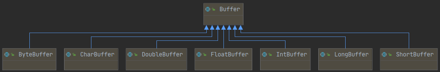
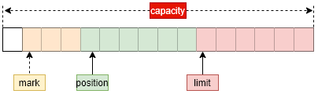

# Java中Buffer的认识

我相信大家应该都用过或者是见过用**ByteBuffer**这个类来申请一个字节缓存用于存放字节数据，尤其是有关于IO操作的应用中这个的使用尤其常见；但是，我也相信大部分同学跟我一样对这个类也是在见过的层面。所以，本篇文章主要就是介绍Java中**Buffer**核心概念及其家族成员**ByteBuffer**（其它类型跟**ByteBuffer**的结构和用法是一样的，区别在于存储的内容是其他的数据类型）。



## 一、从Buffer开始

Java从1.4开始就引入了缓存**Buffer**抽象接口，作为一个限制了大小的容器用于对各种原始数据类型数据的存储，是所有XxxxBuffer的基类。我们可以用下图来表示**Buffer**的基本结构：



### 1. 认识关键属性

> **capacity**

***capacity***：容量，表示**Buffer**内部数组的长度，及理论上Buffer中可存放数据个数的最大值。

> **limit**

**limit**：限制，表示**Buffer**内部数组可以存放数据的截止位置，其值不能超过capacity。

> **position**

***position***属性用于定义下一个数据的存放位置，在每次插入数据到缓冲中的时候会更新，其值不能超过limit，当position等于limit的时候，再插入数据会失败。

> **mark**

***mark***用于标记一个位置，在重置之后可以重新从这个标记位置开始插入数据，这个属性使用的频率相对较小。

这四个属性的值，在我们构建一个**Buffer**实例的时候必须提供相应的值用于初始化。

> **address**

针对本地直接缓存时用的属性值，用于记录内存地址。

### 2. 关键操作

#### put-插入数据

将数据放入缓存中。其实这个操作我们很少使用；因为在使用Buffer的场景我们都是结合NIO一起使用，而在使用NIO的时候一般是把底层流的数据读入到一个Buffer中；而如果我们自己要把数据写入到Buffer的时候，一般也是通过各个子类XxxBuffer的allocate或者是wrap方法来分配或者是将一个已经存在的数组封装成一个Buffer实例。很少有单独使用put操作来将数据放入缓存的情况。

#### rewind-倒带操作

将position属性移动到0这个位置，不会清除已经写入的数据；如果这个时候进行put操作，将会重写buffer中的内容。

会清除mark的值。

#### flip-翻转操作

把limit移动到position的位置，剩下的事情跟rewind操作一样会将position置0。清除mark值。

#### mark-标记操作

记录下当前position的位置，一般跟reset配合使用，在reset之后position重置为上次mark操作的值；reset操作不会清除mark值

#### clear-清除操作

position置0，limit置capacity，mark置-1，注意还是不会清除已经写入到buffer中的数据，始终只是改变属性指向的位置。

## 二、ByteBuffer

ByteBuffer是专用于byte数据类型的缓存类抽象实现。这也是我们最常使用到的一个缓存类。其包含两个子类：

1. HeapByteBuffer：jvm堆中的字节缓存实现；
2. MappedByteBuffer：用于映射文件的字节缓存抽象实现，比起这个，我们更常用的是DirectByteBuffer。

其对应的UML类图结构如下：


因为是字节数据类型的容器，所以其内部拥有一个字节数组属性***hb***，可以用于存放字节数据。我们还是来看一下这个抽象实现提供了哪些能力吧。

### 1. 静态方法分配字节缓存

在整个Buffer体系中，各个具体类的访问域都是包权限的，我们无法直接通过new的方式来创建，只能通过它们提供的静态分配方法来分配一个缓存实例对象。一般有四个静态方法来满足我们不同的需要，分别如下：

#### 直接分配一个新的缓存对象

```java
/**
 * 分配一个非jvm管理的，本地直接内存的缓存对象
 */
public static ByteBuffer allocateDirect(int capacity) {
    return new DirectByteBuffer(capacity);
}
/**
 * 分配一个jvm管理的缓存对象
 */
public static ByteBuffer allocate(int capacity) {
    if (capacity < 0)
        throw new IllegalArgumentException();
    return new HeapByteBuffer(capacity, capacity);
}
```

#### 用现有的数组来构建一个缓存对象

```java
/**
 * 将现有的字节数组构建成一个缓存对象，并指定可用区间
 */
public static ByteBuffer wrap(byte[] array,
                                    int offset, int length)
{
    try {
        return new HeapByteBuffer(array, offset, length);
    } catch (IllegalArgumentException x) {
        throw new IndexOutOfBoundsException();
    }
}
/**
 * 将现有的整个字节数组构建成一个缓存对象
 */
public static ByteBuffer wrap(byte[] array) {
    return wrap(array, 0, array.length);
}
```

### 2. 插入数据

在**ByteBuffer**中提供了一系列重载的**put**方法，可以让我们将字节数据存放到字节缓存容器中，比如：

```java
/**
 * 相对位置操作：将一个字节放入缓存中（以当前的position为坐标），并返回当前实例，这样便于链式调用
 */
public abstract ByteBuffer put(byte b);
/**
 * 绝对位置操作：将一个字节放入缓存的指定索引位置
 */
public abstract ByteBuffer put(int index, byte b);
/**
 * 相对位置操作：将另一个字节缓存中的数据拷贝到当前的字节缓存中，利用的是循环拷贝
 */
public ByteBuffer put(ByteBuffer src) {
    if (src == this)
        throw new IllegalArgumentException();
    if (isReadOnly())
        throw new ReadOnlyBufferException();
    int n = src.remaining();
    if (n > remaining())
        throw new BufferOverflowException();
    for (int i = 0; i < n; i++) // 一个字节一个字节的拷贝
        put(src.get());
    return this;
}
/**
 * 相对位置操作：将指定字节数组中指定位置和长度的字节放入字节缓存中
 */
public ByteBuffer put(byte[] src, int offset, int length) {
    checkBounds(offset, length, src.length);
    if (length > remaining())
        throw new BufferOverflowException();
    int end = offset + length;
    for (int i = offset; i < end; i++)
        this.put(src[i]);
    return this;
}
/**
 * 相对位置操作：将指定字节数组中的字节放入字节缓存中
 */
public final ByteBuffer put(byte[] src) {
    return put(src, 0, src.length);
}
```

相对位置的put操作会改变position的位置。

**ByteBuffer**中还提供了支持存放其他数据类型的方法，比如：***putChar***、***putLong***等，这些方法也都是将数据对应的所有字节组成放入到字节缓存中。注意一个字节序的问题。

### 3. 从缓存获取数据

**ByteBuffer**也提供了一系列的**get**方法让我们可以获取缓存中的值，或者是将缓存中的值拿到字节数组中，我们看一下：

```java
/**
 * 相对位置操作：获取position当前指向位置的字节
 */
public abstract byte get();
/**
 * 绝对位置操作：获取index指向位置的字节
 */
public abstract byte get(int index);
/**
 * 相对位置操作：将字节缓存中的数据取到字节数组的offset位置处，并取length个
 */
public ByteBuffer get(byte[] dst, int offset, int length) {
    checkBounds(offset, length, dst.length);
    if (length > remaining())
        throw new BufferUnderflowException();
    int end = offset + length;
    for (int i = offset; i < end; i++)
        dst[i] = get();
    return this;
}
/**
 * 相对位置操作：将字节缓存中的数据取到字节数组的offset位置处，并取dst.length个
 */
public ByteBuffer get(byte[] dst) {
    return get(dst, 0, dst.length);
}
```

相对位置的get操作会改变position的位置。

跟**put**方法相对，也有一系列用于获取其他数据类型的**get**方法，比如：***getInt***、***getLong***等用于获取对应的整数值和long值，这些方法在取缓存数据的时候会一次读取多个字节，然后将多个字节组装成对应的数值类型。要注意跟存入缓存是的字节序保持一致，否则去除的数据跟存入的数据会不一致。

### 4. slice和dup操作

处了常规的存取方法之外，**ByteBuffer**还提供了两个特殊的方法，分别用于分割缓存和复用缓存。对应的方法分别如下：

```java
/**
 * 将缓存中没有用到的空间（即position~limit之间的空间）重新构建一个缓存实例
 * 注意：这个并不会拷贝一份新的数据，也不会分配一个新的空间，还是在原有的底层结构上操作
 * 相当于在同一个内存块上，有两个position、limit等值用于控制这个内存块的不同部分（逻辑分割为两个部分）
 * 所以针对这种情况，一定要小心操作，不要一不小心就越界造成数据重写覆盖等不可预料的结果
 */
public abstract ByteBuffer slice();
/**
 * 利用当前缓存中的各属性值（position、limit）构建一个新的缓存实例
 * 注意：这个操作也不会拷贝一份新的数据，也不会分配一个新的空间，依然在原有的底层结构上操作
 * 相当于有两个buffer实例中的position、limit等值来控制同一个内存块
 */
public abstract ByteBuffer duplicate();
```

还不知道这两个操作的意义在哪。

### 5. compact操作

从名字意义来看是紧凑，这个操作在某些场景下非常有用，比如：我们已经将数据写入到了字节缓存中，现在要将这个字节缓存的内容写入到底层设备（文件或网卡），但是我们并不确认缓存中的数据是否全部写入到了底层设备（写入完成之后position和limit会重合），这个时候我们就可以通过compact操作来将没有写完的数据拷贝到字节缓存的开头（同时会将position放置在拷贝数据之后的位置），并继续写入新的缓存数据，新的缓存数据会接着拷贝之后的位置写。这就是compact操作的意义。其定义如下：

```java
public abstract ByteBuffer compact();
```

## 三、MappedByteBuffer

对应的是一个文件的内存映射区域，也是数据本地直接内存。不能直接通过new方式创建，即使是通过***ByteBuffer.allocateDirect()***方式申请的也只是一个本地内存，并不会映射到一个文件上。创建这种类型的方式只能通过***FileChannel.map()***方式来实现。

**MappedByteBuffer**中维护了一个文件描述符对象，用于保存其映射的文件。

首先，我们要明确一点，当我们已经拥有这个类型的实例的时候，就意味这个实例代表的内存块(虚拟内存块)已经与某个文件映射起来了。

下面我们来看一下它提供的方法吧。

### 1. 判断文件内容是否已经加载到内存中

```java
/**
 * 映射只是表示的是内存块（虚拟地址空间）与文件的关联关系已经建立起来了，但是是否已经将文件内容读取到了内存块对应的物理内存上则并不确定
 * 此方法就是用于判断文件内容已经加载到了物理内存中
 * 注意此方法返回的结果只是一个暗示，并不能确保
 */
public final boolean isLoaded() {
    checkMapped();
    if ((address == 0) || (capacity() == 0))
        return true;
    long offset = mappingOffset();	// 获取内存页内偏移量
    long length = mappingLength(offset); // 获取内存块的大小
    // 检测内存块是否已经映射到物理内存上
    return isLoaded0(mappingAddress(offset), length, Bits.pageCount(length));
}

private long mappingOffset() {
    int ps = Bits.pageSize();	// 获取内存页的大小，一般是4kb
    long offset = address % ps;	// address是FileChannel.map映射时返回的地址，对内存页取余（因为用于判断地址是否已经映射到物理内存的地址值必须是内存页大小的整数倍）
    return (offset >= 0) ? offset : (ps + offset); // 这个条件判断的意义想不清在哪
}

private long mappingAddress(long mappingOffset) {
    return address - mappingOffset;	// 将地址调整到内存页大小的整数倍位置
}

private long mappingLength(long mappingOffset) {
    return (long)capacity() + mappingOffset; // 待检测的内存块的大小
}
// 本地方法，用于检测基址为address，大小为length的内存块是否映射到了物理内存上，pageCount表示内存页数
private native boolean isLoaded0(long address, long length, int pageCount);
```

其本地实现会调用一个***mincore***的库函数来判断，实现如下：

```c
JNIEXPORT jboolean JNICALL
Java_java_nio_MappedByteBuffer_isLoaded0(JNIEnv *env, jobject obj, jlong address,
                                         jlong len, jint numPages)
{
    jboolean loaded = JNI_TRUE;
    int result = 0;
    int i = 0;
    void *a = (void *) jlong_to_ptr(address);
    
    // 分配一个用于存储检测结果字节数组
#ifdef __linux__
    unsigned char *vec = (unsigned char *)malloc(numPages * sizeof(char));
#else
    char *vec = (char *)malloc(numPages * sizeof(char));
#endif

    if (vec == NULL) {	// 内存分配失败，抛出内存溢出异常
        JNU_ThrowOutOfMemoryError(env, NULL);
        return JNI_FALSE;
    }

    // 调用mincore库函数
    // 会返回一个vector，用于表示调用进程的虚拟内存是否已经映射到物理内存上
    // 注意，我们分配内存的时候都是分配的虚拟内存，只有在第一次使用虚拟内存的时候才会分配物理内存并与虚拟内存进行映射
    result = mincore(a, (size_t)len, vec);
    if (result == -1) {	// 检测失败，抛出IO异常
        JNU_ThrowIOExceptionWithLastError(env, "mincore failed");
        free(vec);	// 释放分配的内存
        return JNI_FALSE;
    }

    // 检测返回结果
    for (i=0; i<numPages; i++) {
        if (vec[i] == 0) {	// 为0表示没有映射
            loaded = JNI_FALSE;
            break;
        }
    }
    free(vec);
    return loaded;	// 返回结果
}
```

### 2. 将文件内容加载到内存中

```java
/**
 * 将映射到的文件内存加载到物理内存中
 */
public final MappedByteBuffer load() {
    checkMapped();	// 检测虚拟地址空间是否与文件映射了
    if ((address == 0) || (capacity() == 0))	
        // 虚拟映射内存地址非法或者文件内容长度为0
        return this;
    long offset = mappingOffset();	// 获取内存页偏移量
    long length = mappingLength(offset); // 获取内存长度
    // 将文件内容预读到物理内存中（虚拟地址映射后的物理内存）
    load0(mappingAddress(offset), length);

    Unsafe unsafe = Unsafe.getUnsafe();	// 获取Unsafe实例方便操作直接内存
    int ps = Bits.pageSize();	// 操作系统内存页大小
    int count = Bits.pageCount(length); // 内存页数量
    long a = mappingAddress(offset);	// 跟内存页对齐的地址
    byte x = 0;
    for (int i=0; i<count; i++) {	// 取每个内存页中首个字节的值
        x ^= unsafe.getByte(a); // 计算一个校验和
        a += ps;
    }
    if (unused != 0)
        unused = x;	// 更新校验和

    return this;
}

private void checkMapped() {
    if (fd == null)
        throw new UnsupportedOperationException();
}

private native void load0(long address, long length);
```

本地方法***load0***是通过系统调用***madvise***来实现的，我们看一下他的实现：

```c
JNIEXPORT void JNICALL
Java_java_nio_MappedByteBuffer_load0(JNIEnv *env, jobject obj, jlong address,
                                     jlong len)
{
    char *a = (char *)jlong_to_ptr(address); // 内存首地址，必须是内存页的倍数值
    // 系统调用函数：给内核建议或者是命令对于内存区间a~a+len之间的处理，目的是提高应用或系统的性能
    // MADV_WILLNEED：指定建议类型枚举值，预读建议，还有其他类型的枚举值，感兴趣的可以查看linux手册
    int result = madvise((caddr_t)a, (size_t)len, MADV_WILLNEED);
    if (result == -1) {
        JNU_ThrowIOExceptionWithLastError(env, "madvise failed");
    }
}
```

### 3. 将修改之后的内存块落盘

```java
/**
 * 通过调用这个函数，任何对本缓存的修改都会写到底层存储设备上
 */
public final MappedByteBuffer force() {
    checkMapped();
    if ((address != 0) && (capacity() != 0)) {
        long offset = mappingOffset();
        force0(fd, mappingAddress(offset), mappingLength(offset));
    }
    return this;
}

private native void force0(FileDescriptor fd, long address, long length);
```

***force0***本地方法通过***msync***来将指定内存块数据写入到磁盘上，我们看一下他的实现：

```c
JNIEXPORT void JNICALL
Java_java_nio_MappedByteBuffer_force0(JNIEnv *env, jobject obj, jobject fdo,
                                      jlong address, jlong len)
{
    void* a = (void *)jlong_to_ptr(address);
    // msync：将通过mmap映射的内存块刷到磁盘上
    // MS_SYNC：表示请求刷盘并等待刷盘完成；
    // MS_ASYNC：表示将一个刷盘请求扔到调度队列就立即返回
    // MS_INVALIDATE：如果这个文件有多个映射内存块，会让其他内存块失效
    int result = msync(a, (size_t)len, MS_SYNC);
    if (result == -1) {
        JNU_ThrowIOExceptionWithLastError(env, "msync failed");
    }
}
```

## 四、本地直接内存

Java中除了由JVM管理的可自动回收的内存外，还有一块内存是不由JVM管理的，分配和回收都要自己编码实现，我们一般管这块内存叫做**本地直接内存**。


JVM启动的时候，限制了应用可用的本地直接内存的大小，默认为64M；我们可以通过启动参数`-XX:MaxDirectMemorySize`来调整可用的本地直接内存大小，单位为字节，设置其为-1，表示不限制。

默认值是通过**VM**类的静态属性设置的，其定义如下：

```java
private static long directMemory = 64 * 1024 * 1024; // 单位字节

public static long maxDirectMemory() {
    return directMemory;
}
```

我们new出来的对象都是由JVM管理，自动分配和回收的内存；那么在我们的Java程序中应该如何使用本地直接内存呢？有两种方式可以分配本地直接内存，如下：

1. 通过反射的方式利用***sun.misc.Unsafe***类中提供的本地方法，我们可以编码分配和回收一块本地直接内存，但是请注意通过这种方式分配的本地直接内存是不受`MaxDirectMemorySize`限制的，只有底层系统来决定是否可分配。但是呢，这种方式是不推荐直接在应用程序中使用的，因为不安全。
2. 通过***sun.nio.ch.DirectBuffer***接口我们可以使用本地直接内存，我们一般通过它在*java.nio*包中的实现类**DirectXxxBuffer**来使用，其中Xxx可替换为Byte、Long等各种基本数据类型，而其中我们最常用的一个实现类便是**DirectByteBuffer**；这也是Java中推荐的对本地直接内存使用的方式，通过这种方式使用本地直接内存是会受到`MaxDirectMemorySize`监控的。

下面我们介绍一下在**DirectByteBuffer**中是如何操作本地直接内存的。

### 1. 分配

从上面介绍**MappedByteBuffer**时，我们知道**DirectByteBuffer**继承自**MappedByteBuffer**，同时我们也知道**DirectByteBuffer**只能通过**ByteBuffer.allocateDirect()**的方法来创建，其实现如下：

```java
/**
 * ByteBuffer.java
 */
public static ByteBuffer allocateDirect(int capacity) {
    return new DirectByteBuffer(capacity);
}

/**
 * DirectByteBuffer.java
 * 其所有的构造方法都是包访问域的，也就是说在外面不能直接new，只能通过上面的方式来创建
 */
DirectByteBuffer(int cap) {

    super(-1, 0, cap, cap); 	// 调用父类Buffer的构造方法，初始化mark、position、limit和capacity
    
    // 用于确定分配的本地内存块首址是否要跟内存页首地址对齐，从1.7开始就不再对齐了
    // 启动参数-XX:+PageAlignDirectMemory也不再支持了
    boolean pa = VM.isDirectMemoryPageAligned();
    int ps = Bits.pageSize();	// 获取内存页的大小，一般是4kb
    // 获取实际分配的内存块大小，对于需要内存对齐的会多分配一个内存页的大小
    long size = Math.max(1L, (long)cap + (pa ? ps : 0));
    
    // 保存此次分配的本地直接内存大小值，用于控制不要超过MaxDirectMemory的限制
    // 这里保存的值是真正需要的cap，而不是size，这也就意味着在pa=true的情况下，
    // 实际分配的本地内存比MaxDirectMemory的限制是要大很多的
    // 如果分配的本地内存超过了限制，会抛出OutOfMemoryError
    Bits.reserveMemory(size, cap);

    long base = 0;
    try {
        // 分配进程虚拟内存空间（使用的时候才会映射到物理内存），并返回分配的内存块的首址
        base = unsafe.allocateMemory(size);
    } catch (OutOfMemoryError x) {
        // 分配失败，回收（减cap操作）
        Bits.unreserveMemory(size, cap);
        throw x;
    }
    unsafe.setMemory(base, size, (byte) 0); // 初始化内存块的值为0，这一步会将内存映射到物理内存
    if (pa && (base % ps != 0)) {
        // 如果是需要内存页对齐的，我们需要对返回的base首址进行处理，让address指向内存页的首地址
        address = base + ps - (base & (ps - 1));
    } else {
        // 不需要内存页对齐的，我们直接让address指向返回的首址就可以
        address = base;
    }
    // 设置本地直接内存的回收机制
    // 在Cleaner回收的时候，会执行Deallocator回收器任务
    // 在构造Deallocator时保存了分配的内存块的首地址、大小和实际用到的容量cap
    // 注意这里不用存address，因为address是我们实际使用时要的地址，而回收内存时我们需要分配时返回的地址
    cleaner = Cleaner.create(this, new Deallocator(base, size, cap));
    att = null;
}
```

从实现我们可以看到，DirectByteBuffer本质也还是通过Unsafe来操作的本地直接内存，只不过在分配之前，我们加了一个***Bit.reserveMemory()***方法来控制分配的大小而已；那现在我们看一下***Bits.reserveMemory()***这个方法是如何来控制对本地内存使用的吧。

```java
static void reserveMemory(long size, int cap) {
    synchronized (Bits.class) {
        if (!memoryLimitSet && VM.isBooted()) {
            maxMemory = VM.maxDirectMemory();	// 设置本地内存最大使用量限制值，只会设置一次
            memoryLimitSet = true;
        }

        // totalCapacity：记录的是当前已经被分配的本地内存总量
        // maxMemory-totalCapacity：表示可分配本地内存的大小
        // cap：此次分配的本地内存大小
        if (cap <= maxMemory - totalCapacity) {
            // 如果此次申请分配的比可分配的小，说明可以分配
            // 我们将相关值增加
            reservedMemory += size;
            totalCapacity += cap;
            count++;
            return;
        }
    }

    // 到了这里，说明可分配本地内存不足，我们触发一次gc操作
    // 此次gc会回收相关的Cleaner实例，从而会触发本地内存的回收
    System.gc();
    try {
        // gc执行之后，我们睡眠等待100ms，等待相关的回收操作结束
        // 这里在后续的jdk版本中有优化，会控制sleep的次数（9次），每次sleep的时间为（1,2,4,……,256ms）
        // 总共耗时0.5s左右，每次sleep结束就会判断一下可用本地直接内存是否够用，够用就会结束sleep
        // 如果9次之后还是不够用，再抛出异常。
        Thread.sleep(100);
    } catch (InterruptedException x) {
        Thread.currentThread().interrupt();
    }
    synchronized (Bits.class) {
        // gc之后再次判断可用本地直接内存是否足够，不够我们就抛出内存溢出错误
        // 否则表示允许此次分配
        if (totalCapacity + cap > maxMemory)
            throw new OutOfMemoryError("Direct buffer memory");
        reservedMemory += size;
        totalCapacity += cap;
        count++;
    }

}
```

### 2. 回收

本地直接内存使用的回收其实质也是通过**Unsafe.freeMemory()**来实现的，因为我们不推荐在应用程序中直接使用**Unsafe**，所以我们现在的关注点是在**DirectByteBuffer**中什么时机会调用freeMemory方法来回收分配出去的本地内存。

在DirectByteBuffer的构造方法中，我们有创建一个**Cleaner**实例保存在cleaner属性中，其继承自**PhantomReference**类，表示有Cleaner维护的这个实例在没有强引用的时候会被回收掉。在被回收时，会执行***Cleaner.clean()***方法，我们可以看一下它的实现：

```java
public void clean() {
    if (!remove(this))	// 将当前实例从Cleaner实例的双向列表中移除
        return;
    try {
        // 移除成功之后，调用thunk的run方法
        // 那么thunk是什么呢？是通过构造方法传入进来的Runnable实例，通过静态方法create传入进来
        // 对应到DirectByteBuffer，就是Deallocator这个类
        thunk.run();
    } catch (final Throwable x) {
        AccessController.doPrivileged(new PrivilegedAction<Void>() {
            public Void run() {
                if (System.err != null)
                    new Error("Cleaner terminated abnormally", x)
                    .printStackTrace();
                System.exit(1);
                return null;
            }});
    }
}
// DirectByteBuffer中就是调用的这个方法创建的Cleaner实例
public static Cleaner create(Object ob, Runnable thunk) {
    if (thunk == null)
        return null;
    return add(new Cleaner(ob, thunk));
}
```

我们看一下**Deallocator**这个类做了什么吧？

```java
private static class Deallocator
        implements Runnable
{

    // 获取Unsafe实例，是个单例
    private static Unsafe unsafe = Unsafe.getUnsafe();

    private long address;
    private long size;
    private int capacity;

    // 构造方法，保存分配内存块的首地址、大小和DirectByteBuffer实际使用的大小
    private Deallocator(long address, long size, int capacity) {
        assert (address != 0);
        this.address = address;
        this.size = size;
        this.capacity = capacity;
    }

    // 在Cleaner的clean方法中调用
    public void run() {
        if (address == 0) {
            // 非法地址，不用处理
            return;
        }
        // 通过freeMemory回收本地直接内存
        unsafe.freeMemory(address);
        address = 0; // 清除地址
        Bits.unreserveMemory(size, capacity); // 将可用容量增大
    }
}
```

通过Cleaner回收内存之后，我们也还是要通过**Bits.unreserveMemeory()**方法来将可用的本地直接内存恢复，以便下次分配的时候可以分配成功，我们看一下这个方法的实现：

```java
static synchronized void unreserveMemory(long size, int cap) {
    if (reservedMemory > 0) {
        reservedMemory -= size;
        totalCapacity -= cap;	// 已经分配的本地内存总量减值
        count--;
        assert (reservedMemory > -1);
    }
}
```

在**DirectByteBuffer**中还有很多其他操作这个本地缓存的方法，比如我们在介绍**ByteBuffer**的时候说的put、get等抽象方法，在DirectByteBuffer中都有对应的实现，其实现也都是通过**Unsafe**来直接控制对内存位置的读写来实现的，相关源代码理解起来也很容易，这里就不再赘述了，敢兴趣的可以翻翻源码了解。**ByteBuffer**还有一个实现类**HeapByteBuffer**，其内部实质就是对一个字节数组的操作，本文也不会再多讲。

在整个Buffer系列中，还有一种只读缓存类型，都是XxxBufferR这种以R结尾的命名方式表示的就是只读，意味着所有的put方法都不支持，只支持get方法。put方法会返回只读异常。

## 五、使用场景

在Java中，Buffer系相关类的使用场景其实都几种在NIO的相关使用场景中。在NIO中提供的相关接口一般是以**ByteBuffer**作为约束，但是建议我们在真实传参时，应该传**DirectByteBuffer**类型，这可以有效的减少在Java进程内部的拷贝次数，用下面几个图来描述一下他们之间的区别：


