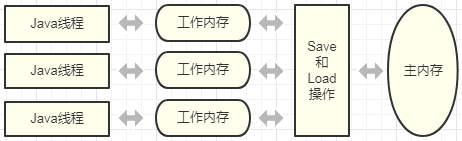

# Java中的内存模型

在[上一篇文章中](./01.内存模型理解.md)，我们聊了一下什么是内存模型，内存模型能帮我们解决什么问题。不同架构的物理机器可以拥有不一样的内存模型，而Java虚拟机也有自己的内存模型；并且Java虚拟机的内存访问操作与硬件的缓存访问操作具有很高的可比性。

Java虚拟机规范中试图定义一种Java内存模型(Java Memory Model，JMM)来屏蔽掉各种硬件和操作系统的内存访问差异，以实现让Java程序在各种平台下都能达到一致的内存访问效果。经过长时间的验证和修补，在JDK1.5（实现了JSR133）发布后，Java内存模型已经成熟和完善起来。

## 一、主内存和工作内存

Java内存模型的主要目标是**定义**程序中各个变量的访问规则，即在虚拟机中将变量（包括实例字段、静态字段和数组元素，以及引用类型的局部变量和方法参数等）存储到内存和从内存中取出变量这样的底层细节。

Java内存模型规范规定所有变量都存储在主内存中（此处的主内存与介绍物理硬件时的主内存名字一样，两者也可以互相类比，但此处仅是虚拟机内存的一部分；其实就是对应于物理硬件的主内存）；每条线程有自己的工作内存（与上一篇文章说的高速缓存类比，其实虚拟机的实现会优先使用底层对应的寄存器和高速缓存），工作内存中保存了被该线程使用到的变量的主内存副本拷贝（volatile变量也有拷贝，只不过它有特殊的操作顺序规定），线程对变量的所有操作（读取、赋值等）必须在工作内存中进行，线程间变量值的传递均需通过主内存来完成。三者交互关系如下图：

**请注意：**这里所讲的主内存、工作内存与Java内存区域中的Java堆、栈、方法区等并不是同一个层次的内存划分，这两者基本上是没有关系的。如果两者一定要勉强对应起来，那从变量、主内存和工作内存的定义来看，主内存主要对应于Java堆中的对象实例数据部分，而工作内存则对应于虚拟机栈中的部分区域。从更低层次上说，主内存就直接对应于物理硬件的内存，而工作内存则优先使用寄存器和高速缓存。

## 二、内存间的交互操作

Java内存模型规范定义了8种操作来限制主内存与工作内存之间具体的交互（即一个变量如何从主内存拷贝到工作内存、如何从工作内存同步回主内存之类的实现细节）；具体的虚拟机实现时，必须保证这8种操作都是原子的、不可再分的（对于double和long类型的变量来说，允许有例外）。这8种操作如下：

- **lock**：作用于主内存的变量，它把一个变量标识为一条线程独占的状态；
- **unlock**：作用于主内存的变量，它把一个处于锁定状态的变量释放出来，释放后的变量才可以被其他线程锁定；
- **read**：作用于主内存的变量，它把一个变量的值从主内存传输到线程的工作内存中，以便随后的load动作使用；
- **load**：作用于工作内存的变量，它把read操作从主内存中得到的变量值放入工作内存的变量副本中；
- **use**：作用于工作内存的变量，它把工作内存中的一个变量的值传递给执行引擎，每当虚拟机遇到一个需要使用到变量的值的字节码指令时将会执行这个操作；
- **assign**：作用于工作内存的变量，它把一个从执行引擎接收到的值赋给工作内存的变量，每当虚拟机遇到一个给变量赋值的字节码指令时执行这个操作；
- **store**：作用于工作内存的变量，它把工作内存中一个变量的值传送到主内存中，以便随后的write操作使用；
- **write**：作用于主内存的变量，它把store操作从工作内存中得到的变量的值放入主内存的变量中。

