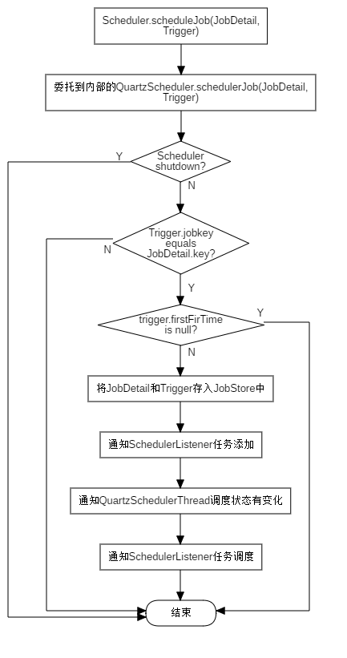
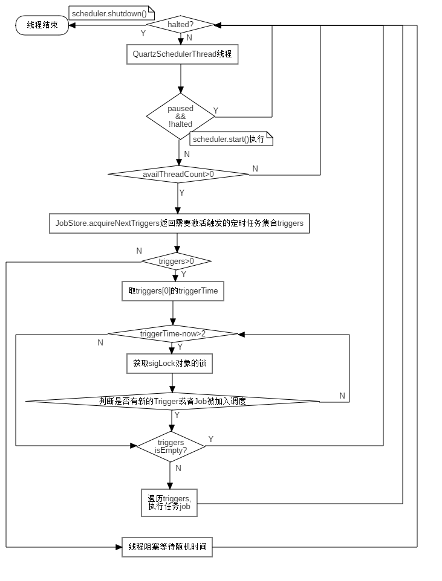

## 定时任务框架Quartz之StdScheduler实现的调度过程详解

###一、调度器的种类


在Quartz中，所有调度器都是接口Scheduler的实现类，有三种实现：

- StdScheduler：最常用的实现，它的所有的方法调用都是直接通过调用内部的QuartzScheduler实例来完成的；
- RemoteScheduler：所有方法调用都是直接通过内部的RemotableQuartzScheduler实例通过RMI方式来完成的；
- RemoteMBeanScheduler：Scheduler的一个抽象实现类，用户如果使用这个抽象类，那么必须自己创建子类来实现到远程MBeanServer的连接。

### 二、调度器的调度过程

下面以最常用的StdScheduler为例，对Quartz的任务调度过程进行分析。

``````java
package org.quartz.examples.example1;

import static org.quartz.DateBuilder.evenMinuteDate;
import static org.quartz.JobBuilder.newJob;
import static org.quartz.TriggerBuilder.newTrigger;

import org.quartz.JobDetail;
import org.quartz.Scheduler;
import org.quartz.SchedulerFactory;
import org.quartz.Trigger;
import org.quartz.impl.StdSchedulerFactory;
import org.slf4j.Logger;
import org.slf4j.LoggerFactory;

import java.util.Date;

/**
 * This Example will demonstrate how to start and shutdown the Quartz scheduler and how to schedule a job to run in
 * Quartz.
 * 
 * @author Bill Kratzer
 */
public class SimpleExample {

  public void run() throws Exception {
    Logger log = LoggerFactory.getLogger(SimpleExample.class);

    log.info("------- Initializing ----------------------");

    // 获取调度器
    SchedulerFactory sf = new StdSchedulerFactory();
    Scheduler sched = sf.getScheduler();

    log.info("------- Initialization Complete -----------");

    // 计算当前时间的下一分钟
    Date runTime = evenMinuteDate(new Date());

    log.info("------- Scheduling Job  -------------------");

    // 定义一个任务
    JobDetail job = newJob(HelloJob.class).withIdentity("job1", "group1").build();

    // 创建一个在下一分钟开始的触发器
    Trigger trigger = newTrigger().withIdentity("trigger1", "group1").startAt(runTime).build();

    // 告诉调度器使用我们创建的触发器来调度任务
    // 这一步会将job信息，trigger信息存放在Quartz指定的存储器中（默认是RAMJobStore内存存储）
    sched.scheduleJob(job, trigger);
    log.info(job.getKey() + " will run at: " + runTime);

    // Start up the scheduler (nothing can actually run until the
    // scheduler has been started)
    // 启动调度器，在调度器启动之前，什么事情都不会做
    sched.start();

    log.info("------- Started Scheduler -----------------");

    // wait long enough so that the scheduler as an opportunity to
    // run the job!
    log.info("------- Waiting 65 seconds... -------------");
    try {
      // wait 65 seconds to show job
      Thread.sleep(65L * 1000L);
      // executing...
    } catch (Exception e) {
      //
    }

    // shut down the scheduler
    log.info("------- Shutting Down ---------------------");
    sched.shutdown(true);
    log.info("------- Shutdown Complete -----------------");
  }

  public static void main(String[] args) throws Exception {

    SimpleExample example = new SimpleExample();
    example.run();

  }

}
``````

####StdScheduler的初始化


1. 首先，我们通过工厂类来获取或者创建一个调度器，对应不同类型的调度器，Quartz提供了两个工厂类：StdSchedulerFactory和DirectSchedulerFactory；new一个StdSchedulerFactory工厂类。
2. 创建了工厂类实例之后，通过StdSchedulerFactory的getScheduler()实例方法获取调度器实例：
   - 第一步：如果初始化工厂类时没有指定配置文件，那么首先查找Quartz的配置文件位置，查找顺序：
     - 系统属性org.quartz.properties指定的文件；
     - 类路径下命名为quartz.properties的文件；
     - 默认的org.quartz包下的quartz.properties文件；
   - 第二步：获取SchedulerRepository调度器仓库实例，在调度器仓库中，根据quartz.properties中配置的调度器名称查找是否已经存在同名的Scheduler实例，如果存在且没有shutdown则直接返回，否则继续下一步；
   - 第三步：根据配置文件实例化一个调度器；
     - 根据配置文件确定创建的调度器类型：RemoteScheduler(org.quartz.scheduler.rmi.proxy=true)、RemoteMBeanScheduler(org.quartz.scheduler.jmx.proxy=true)或者是StdScheduler(默认，下面过程是以这个为例)；
     - 创建JobFactory工厂实例(由配置org.quartz.scheduler.jobFactory.class指定具体类，没有指定时取默认值：org.quartz.simpl.PropertySettingJobFactory.PropertySettingJobFactory)，在触发器被触发时，负责创建具体的Job实例，也就是在具体项目中要实现的；
     - 创建InstanceIdGenerator实例，负责生产调度器的唯一标识id；
     - 创建ThreadLocal线程池实例，并初始化一些属性值，由配置org.quartz.scheduler.jobFactory.class指定具体的线程池实现类，默认值org.quartz.simpl.SimpleThreadPool，负责执行具体的任务，注意这里还只是初始化的一个实例，还并没有创建具体的工作线程对象；
     - 创建JobStore任务存储器实例，由配置org.quartz.jobStore.class指定具体的存储实现类，默认值为org.quartz.simpl.RAMJobStore(将任务信息存放在内存中)，负责用户创建的定时任务信息的存储工作，还有一个实现类为org.quartz.impl.jdbcjobstore.JobStoreSupport(抽象类，将任务信息基于JDBC持久化)；
     - 如果JobStore是JobStoreSupport实现，那么接下来会做一些锁处理器以及数据源的一些初始化配置工作；
     - 调度器的插件安装；
     - JobListener、TriggerListener的初始化工作；
     - 线程执行器ThreadExecutor的创建，由配置org.quartz.threadExecutor.class指定，默认实现为：org.quartz.impl.DefaultThreadExecutor.DefaultThreadExecutor；
     - 创建JobRunShellFactory工厂实例，负责具体任务执行时的封装；
     - 创建QuartzSchedulerResources实例，负责将所有的根据配置信息创建的实例对象保管起来；
     - 工作线程创建，根据配置文件中配置的工作线程数创建具体的工作线程；
     - 创建QuartzScheduler实例，QuartzScheduler是具体任务调度的实现类，Scheduler的实现类里面封装的就是QuartzScheduler，通过Scheduler的调度最终委托给QuartzScheduler处理，在实例化QuartzScheduler的过程中，会启动QuartzShcdulerThread调度线程，此调度线程在Scheduler调用方法start()之前会一直循环阻塞等待，这也是为什么在Scheduler.start()之前，调度器什么都不会做的原理；
     - 将QuartzScheduler实例传递给StdScheduler构造方法，创建Scheduler实例；
     - 将必要的属性实例值绑定到Scheduler实例；
     - 返回Scheduler实例；
   - 返回Scheduler实例。

#### B. 任务提交



1. 通过Scheduler的scheduleJob(Trigger)或者schedulerJob(JobDetail, Trigger)方法，将定时任务提交给调度器，在具体的调度器实现中最终会委托给QuartzScheduler实例的scheduleJob(Trigger)或者schedulerJob(JobDetail, Trigger)方法；
2. 在QuartzScheduler的scheduleJob方法中，首先对调度器的当前状态进行判断，如果调度器已经被关闭则抛出异常，终止任务的提交，否则继续执行下一步；
3. 对提交的JobDetail和Trigger进行验证，如果两者都不为空，且Trigger绑定的job是jobdetail表示的且Trigger的name、group、jobname和jobgroup属性不为null，则继续进入下一步，否则抛出异常，终止任务的提交；
4. 计算Trigger的第一次触发时间ft，如果ft==null，说明Trigger指定的触发时间已经过去了，这个任务永远都不会被触发了，则抛出异常，终止任务提交；否则进入下一步；
5. 调用在初始化时配置的JobStore，将JobDetail和Trigger放入对应的存储器中；
6. 通知SchedulerListener监听器有新任务加入；
7. 通知SchedulerThread(QuartzSchedulerThread)调度器调度线程，改变调度状态，这个状态的变化在我们分析具体的调度时非常有用；
8. 通知SchedulerListener监听器有新任务被调度；

其中，Quartz提供的默认存储器RAMStore存储任务的结构如下：


**jobsByGroup：**HashMap结构，存放JobDetail数据；其中以JobDetail设置的组名group为key，value值则是一个HashMap，value的HashMap以JobDetail的jobkey(由jobname和group组成)为键，值则是JobDetail的包装类(JobWrapper)；

**triggersByGroup：**HashMap结构，存放Trigger数据；与jobsByGroup的结构一样，先以Trigger的所属组名group为key，value则是一个以triggerKey(由triggerName和group组成)为键，Trigger的包装类TriggerWrapper为值的HashMap;

**jobsByKey：**一个以jobkey为键，JobWrapper为值的HashMap结构；

**triggersByKey：**一个以triggerKey为键，TriggerWrapper为值的HashMap结构；

**triggersByJob：**一个以Trigger绑定的jobDetail的jobkey为键，jobList(元素为TriggerWrapper的ArrayList)为值的HashMap结构；

**timeTriggers：**按Trigger的下一次激活触发时间(nextFireTime)升序排序的TreeSet结构，存放可以被激活触发的TriggerWrapper，这个TreeSet里存放的数据也就是要被QuartzSchedulerThread线程调度的；

#### C. 任务调度



在本文档的[StdScheduler的初始化](#StdScheduler的初始化)部分，曾介绍过在StdScheduler的初始化时便会启动QuartzSchedulerThread线程去调度定时任务触发器，只不过在StchScheduler.start()正式触发之前一直是阻塞而已，上面的流程图大概介绍了一下流程；下面，我们通过QuartzSchedulerThread中run方法的代码来查看具体的执行过程：

``````java
public void run() {
    int acquiresFailed = 0;
	
    /**
     * 1. 
     * 循环监听Scheduler调度器是否已经halted(初始值false)，没有halted，则不断的执行循环；
     * Scheduler.shutdown()方法会将halted置为true
     */
    while (!halted.get()) {
        try {
            // 获取sigLock锁
            synchronized (sigLock) {
                /*
                 * 如果Scheduler一直是not halted，并且Scheduler一直没有start()
                 * 也就是一直是paused状态，则不断的wait()一秒；
                 * 这里就是调度器如果没有start()，则不会做任何事情的原因
                 */
                while (paused && !halted.get()) {
                    try {
                        // wait until togglePause(false) is called...
                        sigLock.wait(1000L);
                    } catch (InterruptedException ignore) {
                    }

                    // reset failure counter when paused, so that we don't
                    // wait again after unpausing
                    acquiresFailed = 0;
                }

                if (halted.get()) {
                    break;
                }
            }

            // wait a bit, if reading from job store is consistently
            // failing (e.g. DB is down or restarting)..
            /**
             * 如果有Trigger获取失败，则适当让线程睡眠
             * 只有当Trigger是存放在数据库这类永久存储器，或者在获取trigger的过程中发生运行时异常，
             * 才会出现获取Trigger失败的情况
             */
            if (acquiresFailed > 1) {
                try {
                    long delay = computeDelayForRepeatedErrors(qsRsrcs.getJobStore(), acquiresFailed);
                    Thread.sleep(delay);
                } catch (Exception ignore) {
                }
            }
			
            /**
             * 获取当前可用线程数
             * 注意blockForAvailableThreads()这个方法会一直阻塞，知道有可用线程为止
             */
            int availThreadCount = qsRsrcs.getThreadPool().blockForAvailableThreads();
            if(availThreadCount > 0) { // will always be true, due to semantics of blockForAvailableThreads...

                List<OperableTrigger> triggers;

                long now = System.currentTimeMillis();

                clearSignaledSchedulingChange();
                try {
                    /**
                     * 获取在指定时间(now + idleWaitTime(默认值30秒))之前该激活触发的Triggers
                     * 根据默认的JobStore的实现类RAMJobStore的实现，这里会有一些细节，在下面讲
                     * acquireNextTriggers()的实现时会说到
                     * 这里获取到的triggers集合，我认为很大概率上里面只会包含一个trigger
                     */
                    triggers = qsRsrcs.getJobStore().acquireNextTriggers(
                        now + idleWaitTime, Math.min(availThreadCount, qsRsrcs.getMaxBatchSize()), qsRsrcs.getBatchTimeWindow());
                    acquiresFailed = 0;
                    if (log.isDebugEnabled())
                        log.debug("batch acquisition of " + (triggers == null ? 0 : triggers.size()) + " triggers");
                } catch (JobPersistenceException jpe) { 
                    // 只有JobStoreSupport及其之类会抛出这个异常，RAMJobStore不会抛出这个异常
                    if (acquiresFailed == 0) {
                        qs.notifySchedulerListenersError(
                            "An error occurred while scanning for the next triggers to fire.",
                            jpe);
                    }
                    if (acquiresFailed < Integer.MAX_VALUE)
                        acquiresFailed++;
                    continue;
                } catch (RuntimeException e) {
                    if (acquiresFailed == 0) {
                        getLog().error("quartzSchedulerThreadLoop: RuntimeException "
                                       +e.getMessage(), e);
                    }
                    if (acquiresFailed < Integer.MAX_VALUE)
                        acquiresFailed++;
                    continue;
                }
				
                // triggers集合有元素
                if (triggers != null && !triggers.isEmpty()) {

                    now = System.currentTimeMillis();
                    /**
                     * 获取triggers集合中的第一个trigger的下次该激活的时间
                     * 这里为什么是第一个trigger的原因是: triggers中的trigger其实是按照触发时间升序排序的
                     * 这更RAMJobStore中timeTriggers的TreeSet存储结构有关。
                     */
                    long triggerTime = triggers.get(0).getNextFireTime().getTime();
                    long timeUntilTrigger = triggerTime - now;
                    /**
                     * 循环判断激活时间距离现在的时间超过2毫秒，超过则不断循环，知道小于2毫秒结束循环
                     */
                    while(timeUntilTrigger > 2) {
                        synchronized (sigLock) {
                            if (halted.get()) {
                                break;
                            }
                            
                            /**
                             * 判断在此过程中，是否又有新的定时任务提交到调度器中
                             * isCandidateNewTimeEarlierWithinReason这个函数的作用：
                             * 1. 首先判断是否有新任务提交，没有则直接返回false值
                             * 2. 有，则获取新任务的激活触发时间
                             * 3. 如果新任务是马上出发或者触发时间在当前trigger的triggerTime之前，
                             *    并且当前trigger的triggerTime比系统时间大7毫秒或者70毫秒(如果任务需要持久存储(JobStoreSupport及其子类)则是70毫秒，否则(RAMJobStore)是7毫秒)，
                             *    表示的意思是新任务需要在当前trigger之前执行，则返回true；
                             * 4. 否则返回false
                             */
                            if (!isCandidateNewTimeEarlierWithinReason(triggerTime, false)) {
                                try {
                                    // we could have blocked a long while
                                    // on 'synchronize', so we must recompute
                                    now = System.currentTimeMillis();
                                    timeUntilTrigger = triggerTime - now;
                                    // triggerTime比当前时间仍然超过1毫秒的时间间隔
                                    // 则线程wait()
                                    if(timeUntilTrigger >= 1)
                                        sigLock.wait(timeUntilTrigger);
                                } catch (InterruptedException ignore) {
                                }
                            }
                        }
                        /**
                         * releaseIfScheduleChangedSignificantly函数的作用：
                         * 如果isCandidateNewTimeEarlierWithinReason=true(也即是有新任务提交，且新任务要在当前trigger之前执行)
                         *  则把triggers清空，且返回true；
                         * 否则：返回false
                         */
                        if(releaseIfScheduleChangedSignificantly(triggers, triggerTime)) {
                            break;
                        }
                        now = System.currentTimeMillis();
                        timeUntilTrigger = triggerTime - now;
                    }

                    // triggers为空
                    // 也就是isCandidateNewTimeEarlierWithinReason=true这个条件满足了则退出当前循环，
                    // 继续下一轮循环(重新获取triggers(此时就会取到新增加的任务了)，继续判断等流程)
                    if(triggers.isEmpty())
                        continue;

                    List<TriggerFiredResult> bndles = new ArrayList<TriggerFiredResult>();

                    boolean goAhead = true;
                    synchronized(sigLock) {
                        goAhead = !halted.get();
                    }
                    if(goAhead) {
                        try {
                            // 封装triggers中的每个trigger，同时会修改封装trigger的状态值
                            List<TriggerFiredResult> res = qsRsrcs.getJobStore().triggersFired(triggers);
                            if(res != null)
                                bndles = res;
                        } catch (SchedulerException se) {
                            qs.notifySchedulerListenersError(
                                "An error occurred while firing triggers '"
                                + triggers + "'", se);
                            //QTZ-179 : a problem occurred interacting with the triggers from the db
                            //we release them and loop again
                            for (int i = 0; i < triggers.size(); i++) {
                                qsRsrcs.getJobStore().releaseAcquiredTrigger(triggers.get(i));
                            }
                            continue;
                        }

                    }
					
                    // 开始循环执行定时任务了
                    for (int i = 0; i < bndles.size(); i++) {
                        TriggerFiredResult result =  bndles.get(i);
                        TriggerFiredBundle bndle =  result.getTriggerFiredBundle();
                        Exception exception = result.getException();

                        if (exception instanceof RuntimeException) {
                            getLog().error("RuntimeException while firing trigger " + triggers.get(i), exception);
                            qsRsrcs.getJobStore().releaseAcquiredTrigger(triggers.get(i));
                            continue;
                        }

                        // it's possible to get 'null' if the triggers was paused,
                        // blocked, or other similar occurrences that prevent it being
                        // fired at this time...  or if the scheduler was shutdown (halted)
                        if (bndle == null) {
                            qsRsrcs.getJobStore().releaseAcquiredTrigger(triggers.get(i));
                            continue;
                        }

                        JobRunShell shell = null;
                        try {
                            // 创建JobRunShell
                            shell = qsRsrcs.getJobRunShellFactory().createJobRunShell(bndle);
                            // 这一步会创建Job实例，会封装Job执行上下文环境
                            shell.initialize(qs);
                        } catch (SchedulerException se) {
                            qsRsrcs.getJobStore().triggeredJobComplete(triggers.get(i), bndle.getJobDetail(), CompletedExecutionInstruction.SET_ALL_JOB_TRIGGERS_ERROR);
                            continue;
                        }
						
                        // 具体的分配线程运行Job
                        if (qsRsrcs.getThreadPool().runInThread(shell) == false) {
                            // this case should never happen, as it is indicative of the
                            // scheduler being shutdown or a bug in the thread pool or
                            // a thread pool being used concurrently - which the docs
                            // say not to do...
                            getLog().error("ThreadPool.runInThread() return false!");
                            qsRsrcs.getJobStore().triggeredJobComplete(triggers.get(i), bndle.getJobDetail(), CompletedExecutionInstruction.SET_ALL_JOB_TRIGGERS_ERROR);
                        }

                    }

                    continue; // while (!halted)
                }
            } else { // if(availThreadCount > 0)
                // should never happen, if threadPool.blockForAvailableThreads() follows contract
                continue; // while (!halted)
            }
			
            // 从JobStore中获取的triggers为空时会执行到这个分支
            long now = System.currentTimeMillis();
            long waitTime = now + getRandomizedIdleWaitTime();
            long timeUntilContinue = waitTime - now;
            synchronized(sigLock) {
                try {
                    // 调度器没有shutdown()
                    if(!halted.get()) {
                        if (!isScheduleChanged()) {
                            // 没有新任务提交，线程阻塞随机毫秒数(idleWaitTime(默认值30秒) - random.nextInt(idleWaitVariablness(默认值7秒)))之内
                            sigLock.wait(timeUntilContinue);
                        }
                    }
                } catch (InterruptedException ignore) {
                }
            }

        } catch(RuntimeException re) {
            getLog().error("Runtime error occurred in main trigger firing loop.", re);
        }
    } // while (!halted)

    // drop references to scheduler stuff to aid garbage collection...
    qs = null;
    qsRsrcs = null;
}
``````

在上面的QuartzSchedulerThread.run()方法中，有个重要的过程就是获取下次将要被激活触发的Triggers，那么我们应该怎么判断哪些Triggers应该是要在接下来被激活的，而哪些又不是呢？这里以Quartz的默认JobStore实现类RAMJobStore为例，进行说明，主要流程集中的acquireNextTriggers()这个方法实现上，下面我们来看看RAMJobStore中的acquireNextTriggers方法的具体实现代码：

``````java
public List<OperableTrigger> acquireNextTriggers(long noLaterThan, int maxCount, long timeWindow) {
    synchronized (lock) {
        List<OperableTrigger> result = new ArrayList<OperableTrigger>();
        Set<JobKey> acquiredJobKeysForNoConcurrentExec = new HashSet<JobKey>();
        Set<TriggerWrapper> excludedTriggers = new HashSet<TriggerWrapper>();
        long batchEnd = noLaterThan;

        /**
         * 在本文档的上面我们就提过，timeTriggers中存放的是可以被激活触发的triggers的
         * 如果为0，说明没有，则返回空激活直接退出当前方法即可。
         */
        if (timeTriggers.size() == 0)
            return result;

        while (true) {
            TriggerWrapper tw;

            try {
                /**
                 * 取出第一个trigger，也就是应该最先被激活触发的trigger
                 * 上面提到过timeTriggers是按时间升序的TreeSet集合结构
                 */
                tw = timeTriggers.first();
                if (tw == null)
                    break;
                timeTriggers.remove(tw);
            } catch (java.util.NoSuchElementException nsee) {
                break;
            }
			
            // 如果取出的trigger的下一次触发时间为空，说明这个定时任务所有的定时已经完了，不再需要计算了，则继续取下一个trigger就可以
            if (tw.trigger.getNextFireTime() == null) {
                continue;
            }
			
            // 判断trigger的激活失败规则，具体的判断规则请参考我的另一篇文章:quartz-任务触发失败处理机制
            // 这里我们假设applyMisFire=false
            if (applyMisfire(tw)) {
                if (tw.trigger.getNextFireTime() != null) {
                    timeTriggers.add(tw);
                }
                continue;
            }
			
            // 判断trigger的下一次激活触发时间是否超过指定的batchEnd值(now + idleWaitTime)
            // 注意batchEnd值在第一次将trigger加入result时会改变值
            if (tw.getTrigger().getNextFireTime().getTime() > batchEnd) {
                // 如果超过了，那么这个trigger不是我们这次需要的
                // 由于timeTriggers是按时间升序排序，如果当前这个trigger都不是我们需要的
                // 那么排在后面trigger肯定也不是此次调度需要的，所以可以直接break介绍循环了
                timeTriggers.add(tw);
                break;
            }

            JobKey jobKey = tw.trigger.getJobKey();
            JobDetail job = jobsByKey.get(tw.trigger.getJobKey()).jobDetail;
            // 针对Job是isConcurrentExectionDisallowed的处理
            if (job.isConcurrentExectionDisallowed()) {
                if (acquiredJobKeysForNoConcurrentExec.contains(jobKey)) {
                    excludedTriggers.add(tw);
                    continue; // go to next trigger in store.
                } else {
                    acquiredJobKeysForNoConcurrentExec.add(jobKey);
                }
            }

            tw.state = TriggerWrapper.STATE_ACQUIRED;
            tw.trigger.setFireInstanceId(getFiredTriggerRecordId());
            OperableTrigger trig = (OperableTrigger) tw.trigger.clone();
            /**
             * 这里是非常重要的一点了，也就是我为什么说这个方法很大概率最终返回的集合可能只包含一个trigger的原因了
             */
            if (result.isEmpty()) {
                /**
                 * 如果result为空，也就是当前的trigger是第一个
                 * 这里会将batchEnd值重新设定为Math.max(tw.trigger.getNextFireTime().getTime(), System.currentTimeMillis()) + timeWindow
                 * 而在正常情况下，trigger.getNextFireTime().getTime会大于等于System.currentTimeMillis，而默认情况下timeWindow又是=0，
                 * 所以，在没有修改timeWindow值的情况下，batchEnd就等于trigger.getNextFireTime().getTime
                 * 又因为timeTrigger的升序排序的特点，再获取下一个trigger时，他的nextFireTime肯定是要大于batchEnd(也就是当前的trigger.getNextFireTime().getTime)的
                 * 而根据上面的if条件，如果trigger.getNextFireTime().getTime() > batchEnd会退出循环，结束方法
                 * 所以会造成result集合中在只有一个trigger时就会退出循环，结束方法的执行
                 * 所以这里timeWindow的配置(配置文件中org.quartz.scheduler.batchTriggerAcquisitionFireAheadTimeWindow的值)的意思就显而易见了，它表示的就是定时任务可以在规定的时间之前提前多长时间执行
                 */
                batchEnd = Math.max(tw.trigger.getNextFireTime().getTime(), System.currentTimeMillis()) + timeWindow;
            }
            result.add(trig);
            if (result.size() == maxCount)
                break;
        }

        // If we did excluded triggers to prevent ACQUIRE state due to DisallowConcurrentExecution, we need to add them back to store.
        if (excludedTriggers.size() > 0)
            timeTriggers.addAll(excludedTriggers);
        return result;
    }
}
``````


