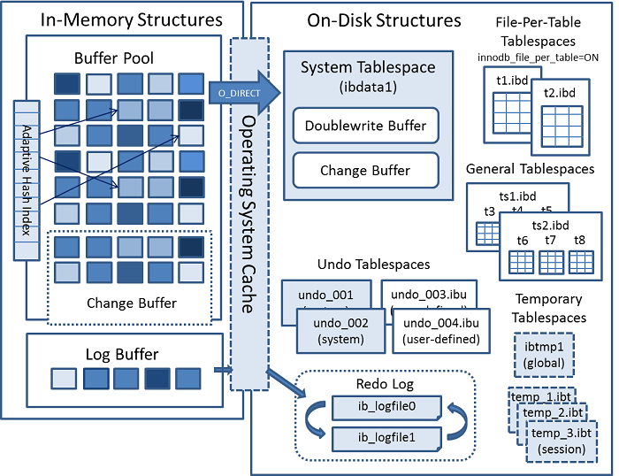

# InnoDB存储引擎

##一、介绍

InnoDB是一种通用存储引擎，可以平衡高可靠性和高性能。在mysql5.7及以上版本中，InnoDB是mysql数据库的默认存储引擎。

### 1.1 InnoDB的主要优势

- DML操作遵循ACID事物模型中，可以通过提交，回滚和崩溃恢复的能力来保护用户数据；
- 行级锁定和Oracle风格的一致性读取可提高多用户并发性和性能；
- InnoDB表将您的数据排列在磁盘上，以优化基于主键的查询。每个InnoDB表都有一个称为聚簇索引的主键索引，用于组织数据以最大限度地减少主键查找的I / O；
- 为了保持数据完整性，InnoDB支持FOREIGN KEY约束。使用外键，将检查插入，更新和删除，以确保它们不会导致不同表之间的不一致。

### 1.2 使用InnoDB表的好处

- 如果您的服务器因硬件或软件问题而崩溃，无论当时数据库中发生了什么，您都无需在重新启动数据库后执行任何特殊操作。 InnoDB崩溃恢复功能会自动完成在崩溃之前提交的所有更改，并撤消正在进行但未提交的任何更改。只需重新启动并继续做崩溃时您正在执行的操作；
- InnoDB存储引擎维护自己的缓冲池，在访问数据时将表和索引数据缓存在内存中。经常使用的数据直接从内存中处理。此缓存适用于许多类型的信息并可以加快处理速度。在数据库专用服务器上，通常会将80％的物理内存分配给缓冲池；
- 如果您将有相关性的数据拆分存储到不同的表中，则可以通过设置外键来增加引用完整性。在更新或删除数据时，就能自动更新或删除其他表中的相关数据；
- 如果数据在磁盘或内存中损坏，校验和机制会在您使用之前提醒您这是损坏数据；
- 当您为数据库中的每个表设计了相应的主键列，InnoDB将自动优化涉及这些列的操作。在WHERE子句，ORDER BY子句，GROUP BY子句和连接操作中引用主键列速度会非常快；
- 插入，更新和删除通过称为change buffering的自动机制进行优化。 InnoDB不仅允许对同一个表进行并发读写访问，还可以缓存已更改的数据以简化磁盘I / O；
- 性能优势不仅限于具有长时间运行查询的巨型表。当从表中反复访问相同的行时，一种称为Adaptive Hash Index(自适应哈希索引)的功能会接管以使这些查找更快，就像它们来自哈希表一样；
- 您可以压缩表和关联的索引；
- 您可以创建和删除对性能和可用性影响相对小的索引；
- 截断file-per-table的表空间非常快，并且可以释放磁盘空间以供操作系统重用，而释放系统级表空间的磁盘空间只有InnoDB可以重用
- 对于具有DYNAMIC行格式的BLOB和长文本字段，表数据的存储布局更有效；
- 您可以通过查询INFORMATION_SCHEMA表来监视存储引擎的内部工作方式；
- 您可以通过查询性能架构表来监控存储引擎的性能详细信息；
- 您可以自由地将InnoDB表与来自其他MySQL存储引擎的表混合，甚至在同一语句中也是如此。例如，您可以使用连接操作在单个查询中组合InnoDB和MEMORY表中的数据；
- InnoDB专为处理大量数据时的CPU效率和最高性能而设计；
- 即使在文件大小限制为2GB的操作系统上，InnoDB表也可以处理大量数据。

### 1.3 InnoDB表的最佳实践

- 使用最常查询的列为每个表指定主键，如果没有明显的主键，则指定自动增量值；
- 针对join操作的表定义合适外键以加快执行速度；
- 关闭自动提交。每秒提交数百次会限制性能（受存储设备写入速度的限制）；
- 将一组相关的DML操作组合到事务中，方法是将它们用START TRANSACTION和COMMIT语句括起来。虽然您不想经常提交，但您也不希望发出大量的INSERT，UPDATE或DELETE语句，这些语句在没有提交的情况下运行数小时；
- 不使用LOCK TABLES语句。 InnoDB可以同时处理多个会话，同时读取和写入同一个表，而不会牺牲可靠性或高性能。要获得对一组行的独占写访问权，请使用SELECT ... FOR UPDATE语法仅锁定要更新的行；
- 启用innodb_file_per_table选项或使用通用表空间将表的数据和索引放入单独的文件中，而不是系统表空间。 默认情况下启用innodb_file_per_table选项；
- 评估您的数据和访问模式是否受益于InnoDB表或页面压缩功能。您可以在不牺牲读/写功能的情况下压缩InnoDB表；
- 使用选项--sql_mode = NO_ENGINE_SUBSTITUTION运行服务器，以防止在CREATE TABLE的ENGINE =子句中指定的引擎出现问题时使用其他存储引擎创建表。

## 二、InnoDB架构



### 2.1 InnoDB内存结构

#### 2.1.1 Buffer Pool

缓冲池是内存中的一个区域，用于在访问时缓存表和索引数据。缓冲池允许直接从内存处理常用数据，从而加快处理速度。在专用服务器上，通常会将最多80％的物理内存分配给缓冲池。

为了提高大容量读取操作的效率，缓冲池被分成可以容纳多行或一行(取决去一行记录的数据大小)的页。为了提高缓存管理的效率，缓冲池被实现为以页为元素的链表；使用LRU算法的变体，很少使用的数据会从缓存池中移除。

了解如何利用缓冲池将频繁访问的数据保存在内存中是MySQL调优的一个重要方面。

##### 缓冲池的LRU算法

使用最近最少使用（LRU）算法的变体将缓冲池作为列表进行管理。当需要空间将新页添加到缓冲池中时，最近最少使用的页被逐出，并且新页面被添加到列表的中间。此中点插入策略将列表视为两个子列表：

- 在头部，最近访问过的新页的子列表；
- 在尾部，最近访问少的老页的子列表。


该算法将被查询语句重度使用的数据页保留在头部新子列表；很少被使用的数据页包含在尾部旧子列表中，作为待移除列表项。

默认情况下，算法操作如下：

- 整个缓存池的3/8被放入尾部旧子列表中；
- 列表的中点是新子列表的尾部与旧子列表的头部相交的边界；
- 当InnoDB将数据页读入缓冲池时，最初将其插入缓存池列表的中点（旧子列表的头部）。可以读取页面，因为它是用户指定的操作（如SQL查询）所必需的，或者是InnoDB自动执行的预读操作的一部分；
- 访问旧子列表中的数据页会使其“年轻”，从而将其移动到缓冲池的头部（新子列表的头部）。如果因为需要而读取页面，则会立即进行第一次访问，并使页面变得年轻。如果由于预读而读取了页面，则第一次访问不会立即发生（并且在页面被逐出之前可能根本不会发生）；
- 当数据库运行时，缓冲池中没有被访问的数据页被移动到列表尾部。新旧子列表中的页随着其他数据页被访问而变旧。旧子列表中的页也会随着插入中点而老化。最终，仍然未使用的页到达旧子列表的尾部并被逐出。

默认情况下，查询读取的数据页会立即移动到新的子列表中，这意味着它们会更长时间地保留在缓冲池中。表扫描（例如执行mysqldump操作，或者没有WHERE子句的SELECT语句）会将大量数据带入缓冲池并驱逐等量的旧数据，即使新数据从未再次使用过。类似地，由预读后台线程加载然后仅访问一次的页面也会移动到新列表的头部。这些情况会将经常使用的页面推送到旧的子列表中，在那里它们会被驱逐。至于如何优化这些情况，请参考后续。

##### 缓冲池配置

您可以配置缓冲池的各个方面以提高性能。

- 理想情况下，您可以将缓冲池的大小设置为尽可能大的值，只需为服务器上的其他进程留出足够的内存。缓冲池越大，InnoDB就像内存数据库一样，只需从磁盘读取数据一次，然后在后续读取期间直接从内存中访问数据。关于如何配置，请参考后续；
- 在具有足够内存的64位系统上，您可以将缓冲池拆分为多个部分，以最大限度地减少并发操作之间内存结构的争用；
- 您可以将频繁访问的数据保留在内存中，而不管操作中的活动突然出现高峰，这些操作会将大量不经常访问的数据带入缓冲池；
- 您可以控制何时以及如何执行预读请求，以异步方式将页面预取到缓冲池中，以预期很快就会需要页面；
- 您可以控制何时发生后台flush以及是否根据工作负载动态调flush频率；
- 您可以微调缓冲池flush行为的各个方面以提高性能；
- 您可以配置InnoDB如何保留当前缓冲池状态，以避免服务器重新启动后的长时间预热。

##### 使用InnoDB标准监控器监控缓冲区

InnoDB的标准监控输出，可以通过执行命令`SHOW ENGINE INNODB STATUS`来查看，输出结果中提供了缓冲区操作的各个指标。整个输出中，关于缓冲区的指标在`BUFFER POOL AND MEMORY`部分，输出内容类似如下：

``````shell
----------------------
BUFFER POOL AND MEMORY
----------------------
Total large memory allocated 2198863872
Dictionary memory allocated 776332
Buffer pool size   131072
Free buffers       124908
Database pages     5720
Old database pages 2071
Modified db pages  910
Pending reads 0
Pending writes: LRU 0, flush list 0, single page 0
Pages made young 4, not young 0
0.10 youngs/s, 0.00 non-youngs/s
Pages read 197, created 5523, written 5060
0.00 reads/s, 190.89 creates/s, 244.94 writes/s
Buffer pool hit rate 1000 / 1000, young-making rate 0 / 1000 not
0 / 1000
Pages read ahead 0.00/s, evicted without access 0.00/s, Random read
ahead 0.00/s
LRU len: 5720, unzip_LRU len: 0
I/O sum[0]:cur[0], unzip sum[0]:cur[0]
``````

下表描述各个指标的含义：

| 指标名称                     | 含义描述                                                     |
| ---------------------------- | ------------------------------------------------------------ |
| Total memory allocated       | 为缓冲池分配的总内存（以字节为单位）                         |
| Dictionary memory allocated  | 为InnoDB数据字典分配的总内存（以字节为单位）                 |
| Buffer pool size             | 分配给缓冲池的数据页的总大小（列表的长度）                   |
| Free buffers                 | 缓冲池空闲列表的页面总大小                                   |
| Database pages               | 缓冲池LRU列表的页面总大小                                    |
| Old database pages           | 缓冲池旧LRU子列表的页面总大小                                |
| Modified db pages            | 缓冲池中当前修改的页数                                       |
| Pending reads                | 等待读入缓冲池的缓冲池页数                                   |
| Pending writes LRU           | 要从LRU列表底部写入的缓冲池中的旧脏页数                      |
| Pending writes flush list    | 在检查点期间要刷新的缓冲池页数                               |
| Pending writes single page   | 缓冲池中挂起的独立页面写入次数                               |
| Pages made young             | 缓冲池LRU列表中的年轻页总数（移动到“新”页的子列表的头部）    |
| Pages made not young         | 缓冲池LRU列表中未完成的页面总数（保留在“旧”子列表中的页面，而不是年轻） |
| youngs/s                     | 在缓冲池LRU列表中对旧页面的每秒平均访问次数导致页面变得年轻  |
| non-youngs/s                 | 在缓冲池LRU列表中对旧页面的每秒平均访问次数导致不使页面变得年轻 |
| Pages read                   | 从缓冲池中读取的总页数                                       |
| Pages created                | 缓冲池中创建的总页数                                         |
| Pages written                | 从缓冲池写入的总页数                                         |
| reads/s                      | 每秒缓冲池页面读取的平均数                                   |
| creates/s                    | 每秒创建的缓冲池页面的平均数                                 |
| writes/s                     | 每秒缓冲池页面写入的平均数                                   |
| Buffer pool hit rate         | 从缓冲池内存中读取的页面与从磁盘存储中读取的页面的缓冲池页面命中率 |
| young-making rate            | 页面访问的平均命中率导致页面变得年轻                         |
| not (young-making rate)      | 页面访问的平均命中率并未导致页面变得年轻                     |
| Pages read ahead             | 每秒预读操作的平均值                                         |
| Pages evicted without access | 在没有从缓冲池访问的情况下被逐出的页面的每秒平均值           |
| Random read ahead            | 随机预读操作的每秒平均值                                     |
| LRU len                      | 缓冲池LRU列表的页面总大小                                    |
| unzip_LRU len                | 缓冲池的总页面大小unzip_LRU列表                              |
| I/O sum                      | 访问的缓冲池LRU列表页面总数，最近50秒                        |
| I/O cur                      | 访问的缓冲池LRU列表页面的总数                                |
| I/O unzip sum                | 访问的缓冲池unzip_LRU列表页面总数，最近50秒                  |
| I/O unzip cur                | 访问的缓冲池unzip_LRU列表页面总数                            |

#### 2.1.2 Change Buffer

change buffer是一种特殊的数据结构，当访问的数据页不在缓冲池(buffer pool)中时，InnoDB引擎会将变动缓存到二级索引页(secondary index)。这些变动由INSERT，UPDATE或者DELETE操作引起；当有其他读取操作要加载这些变动数据页到buffer pool时，这些变动就会合并。


与聚簇索引不同，二级索引通常不是唯一的，并且插入二级索引的顺序相对随机。同样，删除和更新可能会影响不在索引树中相邻的二级索引页。当受影响的页面被其他操作读入缓冲池时，合并缓存的更改，避免了从磁盘读取二级索引页到缓冲池所需的大量随机访问I / O。

当系统处于空闲状态时或在慢速关闭期间，定期运行的purge操作会将更新的索引页写入磁盘。与将每个值立即写入磁盘相比，purge操作可以更有效地为一系列索引值写入磁盘块。

当有许多受影响的行和许多要更新的secondary index时，change buffer合并可能需要几个小时。在此期间，磁盘I / O会增加，这会导致磁盘查询显著减慢。当提交事务后，或者在服务器关闭并重新启动后，也可能会继续发生change buffer合并。

在内存中，change buffer占用buffer pool的一部分。在磁盘上，change buffer是系统表空间的一部分，存储着在关闭数据库服务器时change buffer的状态。

change buffer中缓存的数据类型由innodb_change_buffering变量控制。

如果索引包含降序索引列或主键包含降序索引列，则secondary index不支持change buffer。

##### 配置Change buffer

当对表执行INSERT，UPDATE和DELETE操作时，索引列的值（特别是secondary index的值）通常处于未排序的顺序，这就需要大量I / O才能使secondary index保持最新(why)。当相关页面不在缓冲池中时，change buffer会缓存对seconday index条目的更改，从而避免由于不立即从磁盘读取页面而进行昂贵的I / O操作。当页面加载到缓冲池中时，将合并change buffer中的更改，稍后将更新的页面刷新到磁盘。 InnoDB主线程在服务器几乎空闲时以及在慢速关闭期间也会合并change buffer中的更改。

因为它可以减少磁盘读取和写入，所以change buffer功能对于I / O密集的工作最有价值，例如具有大量DML操作的应用程序（如批量插入）。

但是，change buffer占用缓冲池的一部分，从而减少了可用于缓存数据页的内存。如果工作数据集几乎都在缓冲池，或者您的表具有相对较少的二级索引，则禁用change buffer可能很有用。如果工作数据集完全在缓冲池，则change buffer不会产生额外开销，因为它仅适用于不在缓冲池中的页面。

您可以使用innodb_change_buffering配置参数控制InnoDB执行change buffer的程度。您可以为插入，删除操作（当索引记录最初标记为删除时）和清除操作（物理删除索引记录时）启用或禁用change buffer。更新操作是插入和删除的组合。默认的innodb_change_buffering值是all。

innodb_change_buffering允许的值有：

- all：默认值，缓存插入、删除和清除操作
- none：不缓存任何操作
- inserts：只缓存insert
- deletes：只缓存delete
- changes：缓存insert和删除操作
- purges：缓存清除操作(在后台发生的操作)

您可以在MySQL选项文件（my.cnf或my.ini）中设置innodb_change_buffering参数，或使用SET GLOBAL语句动态更改它，这需要设置全局系统变量的权限。更改设置会影响新操作的缓冲;现有缓冲条目的合并不受影响。

#### 2.1.3 Adaptive Hash Index

自适应散列索引功能使InnoDB能够在系统上执行更多类似内存数据库的工作，并为缓冲池提供适当的工作负载和足够的内存，而不会牺牲事务功能或可靠性。自适应哈希索引功能由innodb_adaptive_hash_index变量启用，或在服务器启动时由--skip-innodb-adaptive-hash-index关闭。

基于观察到的搜索模式，使用索引关键字的前缀构建哈希索引。前缀可以是任何长度，并且可能只有B树中的某些值出现在哈希索引中。哈希索引是根据需要经常访问的索引页面构建的。

如果表几乎完全适合主内存，则哈希索引可以通过启用任何元素的直接查找来加速查询，将索引值转换为一种指针。 InnoDB有一种监控索引搜索的机制。如果InnoDB注意到查询可以从构建哈希索引中受益，那么它会自动执行。

对于某些工作负载，哈希索引查找的加速大大超过了监视索引查找和维护哈希索引结构的额外消耗。在高负载（例如多个并发连接）下，对自适应哈希索引的访问有时会成为争用的资源。使用LIKE运算符和％通配符查询也不会受益。对于无法从自适应哈希索引功能中受益的工作负载，将其关闭可减少不必要的性能开销。由于很难预先预测自适应散列索引功能是否适合特定系统和工作负载，因此请考虑在基准测试时通过启用和禁用进行测试。 MySQL 5.6中的体系结构更改使其更适合禁用自适应哈希索引功能，而不是早期版本。

自适应哈希索引功能会进行分区。每个索引都绑定到一个特定的分区，每个分区都由一个单独的锁存器保护。分区由innodb_adaptive_hash_index_parts变量控制。 innodb_adaptive_hash_index_parts变量默认设置为8。最大设置为512。

您可以在SHOW ENGINE INNODB STATUS输出的SEMAPHORES部分中查看自适应哈希索引的使用和争用情况。如果有许多线程在btr0sea.c中创建的RW锁存器上等待，请考虑增加自适应哈希索引分区的数量或禁用自适应哈希索引功能。

#### 2.1.4 Log Buffer

日志缓冲区是保存要写入磁盘上日志文件的数据的内存区域。日志缓冲区大小由innodb_log_buffer_size变量定义。默认大小为16MB。日志缓冲区的内容会定期刷新到磁盘。大型日志缓冲区使大型事务能够运行，而无需在事务提交之前将redo log数据写入磁盘。因此，如果您有更新，插入或删除许多行的事务，则增加日志缓冲区的大小可以节省磁盘I / O。

innodb_flush_log_at_trx_commit变量控制如何写入日志缓冲区的内容并刷新到磁盘。 innodb_flush_log_at_timeout变量控制日志刷新频率。

### 2.2 InnoDB磁盘结构

TODO

