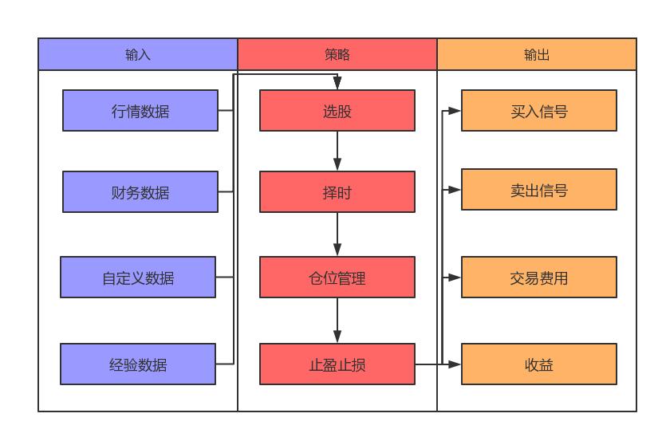

# 量化投资

## 什么是量化投资

提起量化投资，就不得不提量化投资的标杆——华尔街传奇人物[詹姆斯·西蒙斯](http://baike.baidu.com/view/2887902.htm)。

那么什么是量化投资？量化投资就是通过将数学理论与投资理论融合，利用计算机技术并且采用一定的数学模型去实践投资理念，实现投资策略的过程。

[价值投资](http://baike.baidu.com/subview/391694/5135866.htm?f=joinquant&m=1025)和[趋势投资](http://baike.baidu.com/view/2246767.htm)（[技术分析](http://baike.baidu.com/link?url=Yr75DsU1C6gveAjKtktyzvts9llEc57jRmiY6lkfnV-xw8oOBGVPf1YJvHEVgwCMppGBecqlPWiPZkU4PjaILa)）是引领过去一个世纪的投资方法，随着计算机技术的发展，已有的投资方法和计算机技术相融合，产生了量化投资。

## 量化投资的优势

量化投资的优势在于纪律性、系统性、及时性、准确性和分散化。

1. 纪律性：严格执行投资策略，不随投资者情绪的变化而随意更改。这样可以克服人性的弱点，如贪婪、恐惧、侥幸心理，也可以克服认知偏差。
2. 系统性：量化投资的系统性特征包括多层次的量化模型、多角度的观察及海量数据的观察等。多层次模型包括大类资产配置模型、行业选择模型、精选个股模型等。多角度观察主要包括对宏观周期、市场结构、估值、成长、盈利质量、市场情绪等多个角度分析。此外，海量数据的处理能力能够更好地在广大的资本市场捕捉到更多的投资机会，拓展更大的投资机会。
3. 及时性：及时快速地跟踪市场变化，不断发现能够提供超额收益的新的统计模型，寻找新的交易机会。
4. 准确性：准确客观评价交易机会，克服主观情绪偏差，从而盈利。
5. 分散化：在控制风险的条件下，量化投资可以充当分散化投资的工具。表现为两个方面：一是量化投资不断地从历史中挖掘有望在未来重复的历史规律并且加以利用，这些历史规律都是较大概率取胜的策略；二是依靠筛选出股票组合来取胜，而不是一只或几只股票取胜，从投资组合的理念来看也是捕捉大概率获胜的股票，而不是押宝到单个股票。

# 策略

## 什么是策略

策略，可以实现目标的方案集合；在证券交易中，策略是指当预先设定的事件或者信号发生时，就采取相应的交易动作。

## 什么是量化策略

量化策略是指使用计算机作为工具，通过一套固定的逻辑来分析、判断和决策；量化策略既可以自动执行，也可以人工执行。

## 一个完整的量化策略包含哪些内容

一个完整的策略需要包含输入、策略处理逻辑、输出；策略处理逻辑需要考虑选股、择时、仓位管理和止盈止损等因素。

### 选股

量化选股就是用量化的方法选择确定的投资组合，期望这样的投资组合可以获得超越大盘的投资收益。常用的选股方法有多因子选股、行业轮动选股、趋势跟踪选股等。

**1 多因子选股**

多因子选股是最经典的选股方法，该方法采用一系列的因子（比如市盈率、市净率、市销率等）作为选股标准，满足这些因子的股票被买入，不满足的被卖出。比如巴菲特这样的价值投资者就会买入低PE的股票，在PE回归时卖出股票。

**2 风格轮动选股**

风格轮动选股是利用市场风格特征进行投资，市场在某个时刻偏好大盘股，某个时刻偏好小盘股，如果发现市场切换偏好的规律，并在风格转换的初期介入，就可能获得较大的收益。

**3 行业轮动选股**

行业轮动选股是由于经济周期的的原因，有些行业启动后会有其他行业跟随启动，通过发现这些跟随规律，我们可以在前者启动后买入后者获得更高的收益，不同的宏观经济阶段和货币政策下，都可能产生不同特征的行业轮动特点。

**4 资金流选股**

资金流选股是利用资金的流向来判断股票走势。巴菲特说过，股市短期是投票机，长期看一定是称重机。短期投资者的交易，就是一种投票行为，而所谓的票，就是资金。如果资金流入，股票应该会上涨，如果资金流出，股票应该下跌。所以根据资金流向就可以构建相应的投资策略。

**5 动量反转选股**

动量反转选股方法是利用投资者投资行为特点而构建的投资组合。索罗斯所谓的反身性理论强调了价格上涨的正反馈作用会导致投资者继续买入，这就是动量选股的基本根据。动量效应就是前一段强势的股票在未来一段时间继续保持强势。在正反馈到达无法持续的阶段，价格就会崩溃回归，在这样的环境下就会出现反转特征，就是前一段时间弱势的股票，未来一段时间会变强。

**6 趋势跟踪策略**

当股价在出现上涨趋势的时候进行买入，而在出现下降趋势的时候进行卖出，本质上是一种追涨杀跌的策略，很多市场由于羊群效用存在较多的趋势，如果可以控制好亏损时的额度，坚持住对趋势的捕捉，长期下来是可以获得额外收益的。

### 择时

量化择时是指采用量化的方式判断买入卖出点。如果判断是上涨，则买入持有；如果判断是下跌，则卖出清仓；如果判断是震荡，则进行高抛低吸。
常用的择时方法有：趋势量化择时、市场情绪量化择时、有效资金量化择时、SVM量化择时等。

### 仓位管理

仓位管理就是在你决定投资某个股票组合时，决定如何分批入场，又如何止盈止损离场的技术。
常用的仓位管理方法有：漏斗型仓位管理法、矩形仓位管理法、金字塔形仓位管理法等

### 止盈止损

止盈，顾名思义，在获得收益的时候及时卖出，获得盈利；止损，在股票亏损的时候及时卖出股票，避免更大的损失。
及时的止盈止损是获取稳定收益的有效方式。

### 策略的生命周期

一个策略往往会经历产生想法、实现策略、检验策略、运行策略、策略失效几个阶段。

#### **产生想法**

任何人任何时间都可能产生一个策略想法，可以根据自己的投资经验，也可以根据他人的成功经验。

#### **实现策略**

产生想法到实现策略是最大的跨越，实现策略可以参照上文提到的“一个完整的量化策略包含哪些内容？”

#### **检验策略**

策略实现之后，需要通过历史数据的回测和模拟交易的检验，这也是实盘前的关键环节，筛选优质的策略，淘汰劣质的策略。

#### **实盘交易**

投入资金，通过市场检验策略的有效性，承担风险，赚取收益。

#### **策略失效**

市场是千变万化的，需要实时监控策略的有效性，一旦策略失效，需要及时停止策略或进一步优化策略。

