## 基于Ambari管理工具的分布式计算集群搭建详细指导书

由于我们是部署分布式计算集群，涉及的主机肯定不止一台，我这篇文档将以5台虚拟主机部署作为例子来详细说明分布式计算集群的部署过程，此文档初版肯定会有很多不足，会逐渐完善。

### 一、在VMware上安装CentOS虚拟机

#### （一）虚拟机配置

**第一步：打开VMware软件，在主页选择卡中选择【创建新的虚拟机】**


**第二步：在弹出框中选择【典型】单选框，并点击下一步**


**第三步：在窗口的文件位置中选中你下载的linux操作系统镜像文件，并点击下一步**


**第四步：给你的虚拟机命名，并制定安装位置，点击下一步**


**第五步：给你要创建的虚拟机分配磁盘大小(这个可以在安装之后更改的)，并选择【将虚拟磁盘拆分成多个文件】**


**至此，虚拟机基本配置完成**

#### （二）系统安装启动

**第一步：根据上面步骤，将虚拟机配置完成之后，你将在VMware上看到如下界面**


点击【网络适配器】，选择虚拟机的联网方式，这里我们选择桥接模式，记住要选择下面的复选框，点击确定保存；至于这几种联网方式有什么区别，请自行百度去吧


点击【开启此虚拟机】进行系统的启动安装。

**第二步：在启动虚拟机之后，将进入如下界面，选择安装方式，我们选择第二种(选择项变白色)：检测硬件并安装**


**第三步：接下来的操作跟安装window系统类似，选择系统语言，并点击【继续】**


**第四步：选择你想要安装的软件和磁盘分区方式，这里我们磁盘分区就选自动，安装的软件选最小安装，不要再选其他的软件去安装，因为最小安装是最纯净版的，点击【开始安装】**


**第五步：在开始安装界面，我们切记要设置root用户的密码，如果忘记设置处理会比较麻烦**


配置完密码之后，我们只需静静等待系统安装，安装完毕后会提示你重启系统。至此，一台虚拟机的系统安装过程全部完毕。

在第一台虚拟机安装成功之后，另外4台虚拟主机的安装有两种方式：第一种：完全遵循上面的步骤，一步步来创建；第二种：如果另外的主机都是安装在同一个宿主机器之上，那么VMware这个软件为我们提供了一种快捷的方式：克隆；我们可以基于创建好的虚拟机直接克隆一台配置完全一模一样的虚拟主机，方式步骤如下：


根据如上步骤，在同一个宿主机器克隆出4台虚拟主机，至此5台虚拟主机搭建完毕，分别命名为：strategy1、strategy2、strategy3、strategy4和strategy5

### 二、虚拟机网络配置规划

各个虚拟机的ip设定规划，由于我们选择桥接方式来使虚拟机接入网络(桥接方式使得每台虚拟机在网络环境中就像真正的物理机一样，他的网络配置跟局域网内的真实物理机是一样一样的，所以每台虚拟机的网关、DNS都跟宿主机器是一样的)

| 虚拟机名      | IP             |
| --------- | -------------- |
| strategy1 | 192.168.10.166 |
| strategy2 | 192.168.10.167 |
| strategy3 | 192.168.10.168 |
| strategy4 | 192.168.10.169 |
| strategy5 | 192.168.10.164 |

在虚拟机系统安装成功完成之后，我们需要设置虚拟机的联网方式，我们选择通过桥接方式来接入互联网，设置方式如下：


设置完毕之后，重启虚拟机系统，并用root用户登录，输入你在安装过程设置的root用户密码。

登录成功之后，我们可以通过命令`ifconfig`查看系统当前的网络信息：


图中红色框框住的ens33和lo分别表示的是系统的网卡名字，lo是系统本地网卡，ens33负责外部通信的网卡，而我们要设置的就是ens33的网络配置。那么我们如何来修改这个配置呢？首先我们要知道这个配置文件的位置，在CentOS或者说红帽系列的Linux系统中，网卡配置相关的文件均在目录`/etc/sysconfig/network-scripts`下，在此目录下找到ifcfg-ens33文件，并编辑修改即可(关于在linux中如何编辑文本文件，请百度搜索：vi编辑器的使用或者vim编辑器的使用)，修改后内容如下：


```properties
BOOTPROTO=static  # 设置为静态ip
ONBOOT=yes        # 设置网络服务在系统启动的生效
DNS1=202.96.134.133  # 设置DNS，注意这里的名字是DNS1，DNS设置更宿主机器一样
IPADDR=192.168.10.166  # 设置ip
GATEWAY=192.168.10.1   # 设置网关，桥接方式的网关设置跟宿主机器一样
NETMASK=255.255.255.0  # 设置子网掩码
```

修改完成并保存之后，执行命令``systemctl restart network``重启系统网络服务使配置生效，执行命令`systemctl status network`查看网络服务的状态，通过`ping ip`的方式检查网络。


### 三、root的ssh登录配置和ansible的安装使用

首先要解释一下为什么我要配置root的ssh免密访问其他主机？第一：因为有好多相同的操作都需要在集群中的各个主机上执行，比如配置jdk、创建用户的同样的操作；这样在每个机器上进行重复的工作，显然不是标准程序猿的风格；第二：有第三方运维工具(比如标题中的ansible工具)，可以通过基于ssh的通信方式来同时管理多个机器，可以在一台机器上同时对多个机器执行相同的操作；第三：配置root的ssh是可以防止权限带来问题带来的不便。

#### （一）root的ssh免密登录配置

配置两台机器间ssh免密互访的具体步骤如下：

1、首先配置单台机器免密码登录，将登录用户切换到root，并将工作目录切换到root用户的家目录(/root)下(也可以不用切换，默认会将生成的文件放在家目录下面)；ssh加密的方式有很多种，常用的有dsa和rsa两种，我们这里选择dsa加密方式来执行ssh登录认证，rsa配置是一样的，把dsa改成rsa即可

执行命令：**ssh-keygen -t dsa -P '' -f ~/.ssh/id_dsa**

如果不存在ssh-keygen这个命令，请安装ssh命令行工具，执行命令之后再家目录的.ssh目录中会生成两个文件：id_dsa和id_dsa.pub

执行命令：**cat ~/.ssh/id_dsa.pub >> ~/.ssh/authorized_keys**，cat命令执行中的authorized_keys这个文件名是固定的，这个名字必须和**/etc/ssh/sshd_config**这个ssh配置文件中的**AuthorizedKeysFile**属性的值一样，否则上述cat命令执行之后将没有作用。

在网上的大部分文章说到这里就会结束了，就会认为已经可以ssh免密码登录，有时，当我输入**ssh localhost**登录本机时，结果却是不行的，依然要输入密码才能登录，也就是我们的配置没有用。这个因为还缺少一个步骤，必须执行命令：**chmod 600 ~/.ssh/authorized_keys**，再次输入ssh localhost成功登录，不再需要输入密码。步骤如下：


2、单机ssh免密登录配置成功之后，依葫芦画瓢，在另一台机器上执行相同的步骤；

3、将第一台机器上的**authorized_keys**文件通过如下命令将第一台机器的ssh公钥文件拷贝到第二台机器上(命令在第一台机器上执行)：**scp ~/.ssh/authorized_keys root@ip:~/.ssh/authorized_keys_2**(记得将ip改成实际的ip地址喔)，再在第二台机器上将~/.ssh/authorized_keys_2文件合并到authorized_keys文件中，执行如下命令实现：**cat ~/.ssh/authorized_keys\_2 >>~/.ssh/authorized_keys**；

4、在第一台机器上通过如下命令测试ssh免密登录是否成功：**ssh ip** (实际的ip地址)

​至此第一台到第二台机器的ssh免密登录配置完成，如要配置多台机器间ssh免密登录，如法炮制在不同机器间完成如上配置即可。机制的你是不是发现，要是集群机器很多，会把自己给累死；为了减少这样的工作，下面将提供一个完全自动化脚本来帮助你完成这些操作，代码如下：(在公司机器环境完全确定配置好了之后，将提供此文件的下载路径，目前仅已附件形式提供(附件名：ssh\_installer.sh)，敬请期待:smiley: )

```shell
#!/bin/bash
#############################################
# 脚本功能：通过ssh-copy-id命令将本机的ssh公钥分布到参数文件中列出的所有机器，
# 从而实现本机到参数文件中指定机器的ssh免密登录
#############################################
function Echo() {
    filename=$1
    echo -e "\nUsage:  $filename  ip.list\n"
    echo -e "        please input ip.list file which contained ip and password string\n"
    exit 1
}

function LocalSsh() {
    remote=$1
    passwd=$2
    echo "------------------------------------------------------------"
    echo "         Begin to set Local-Remote free login!"
	
	username=`whoami`
	
	# 如果没有创建ssh公钥文件，则先创建
	if [ ! -f "$HOME/.ssh/id_rsa.pub" ]; then
		echo -n "creating id_rsa file ..."
		ssh-keygen -t rsa -P '' -f $HOME/.ssh/id_rsa>> /dev/null
		echo "OK"
	fi
	
	# 当前用户的ssh公钥文件
    pubkey=`cat $HOME/.ssh/id_rsa.pub`
    if [ -n "$pubkey" ];then
		# 检查是否已经安装expect软件
		expect -v>> /dev/null 2>&1
		# 如果没有安装expect，则通过yum方式安装expect
		if [ $? -ne 0 ]; then
			echo -n "Installing soft: expect ..."
			if [ `id -u` -ne 0 ]; then
			   sudo yum install -y expect>> /dev/null
			else
			   yum install -y expect>> /dev/null
			fi
			echo "OK"
		fi
		
        sed -i "s/^$remote/#$remote/" ~/.ssh/kown_hosts
        /usr/bin/expect << EOF
        spawn  ssh-copy-id -i $HOME/.ssh/id_rsa.pub $username@$remote
        expect "(yes)"
        send "yes\r"
        expect "password:"
        send "$passwd\r"
        expect eof;
EOF
        echo "            Local-Remote free login set Ok!"
        echo "------------------------------------------------------------"
    else
        echo "please create SSH service first!"
        exit 1
    fi
}

if [ $# -ne 1 ];then
    Echo $0
else
    iplist=$1
    passwd=$2
    if [ -f $iplist ];then
        for row in `cat ${iplist} | awk '{printf("%s:%s:%s\n"),$1,$2,$3}'`
        do
            ip=`echo ${row} | awk -F ':' '{print $1}'`
            passwd=`echo ${row} | awk -F ':' '{print $2}'`
            echo "IP=${ip}"
            LocalSsh $ip $passwd
        done
    else
        echo -e "\nplease input ip.list file!"
        Echo $0
    fi
fi
```

将上述脚本文件拷贝到虚拟机strategy1的/usr/local/src目录下(这个目录没有定死，你可以自己选择放在哪个目录下)，文件默认是不具备执行权限的，通过如下命令赋予脚本执行权限：`chmod +x ssh_installer.sh`


执行这个脚本需要提供一个文件的路径作为参数，文件的内容是什么呢？文件的内容就是你要ssh免密登录机器ip:password。password为对应ip上对应用户的登录密码，比如，现在我想在strategy1机器上使用root用户通过ssh免密登录到本机、strategy2、strategy3、strategy4和strategy5，那么ip就是strategy2机器的ip以及strategy2机器上root用户的密码，具体文件内容如下：

```properties
192.168.10.164:xinxun5admin1
192.168.10.166:xinxun5admin1
192.168.10.167:xinxun5admin1
192.168.10.168:xinxun5admin1
192.168.10.169:xinxun5admin1
```


将各个机器ip和密码内容文件创建好之后，就可以通过`./ssh_installer.sh iplist.txt`命令完成全自动ssh免密配置，注意上述命令的执行方式均使用的相对目录的方式在执行，如果不了解相对目录，建议使用绝对路径，比如：`/usr/local/src/ssh_installer.sh /usr/local/src/iplist.txt`；输入命令，按下确定键，此后你只需做个安静的美男子，静静等待如下界面到来就可以享受ssh免密登录带来的快感：


接下来测试ssh登录：


**注意：**上述脚本执行完了之后，只支持strategy1机器到其他各个机器的ssh免密登录，而其他机器之间是不能直接ssh免密登录；也就是在strategy2上不能ssh免密到strategy3上，也不能在strategy2上免密到strategy1上，而如果你想要所有机器间都是可以ssh免密的，没每台机器上执行上述脚本即可。

#### （二）ansible的安装使用

ansible的安装、介绍和使用，请移步[这里](http://ansible-tran.readthedocs.io/en/latest/docs/intro_installation.html#yum)

##### ansible安装

我们将通过yum方式在strategy1主机上安装ansible软件，将strategy1主机作为ansible的管理机器。通过命令`yum list | grep ansible`我们发现在默认的yum仓库中根本找不到ansible的安装包；这是由于ansible属于Extra Packages for Enterprise Linux(EPEL)库的一部分，默认情况下，在CentOS7中是不包含ansible的仓库的，所以我们必须先安装EPEL，执行如下命令：`yum install epel-release`；安装成功之后可再次执行`yum list | grep ansible`命令检查，执行命令`yum install -y ansible`进行安装。


安装完成之后，可通过`ansible --version`命令检查：


至此，ansible安装完毕

##### ansible的简单使用

ansible通过可以通过简单以及它提供的操作模块来实现和简化你管理集群的方式；配置ansible的hosts文件，ansible通过它自己的hosts配置文件来操作你制定的机器组。ansible中包含的大模块有[参考](http://docs.ansible.com/ansible/replace_module.html)：

- Cloud模块
- Clustering模块
- Commands模块
- Crypto模块
- Database模块
- Files模块
- Identity模块
- Invertory模块
- Messaging模块
- Monitoring模块
- Network模块
- Notification模块
- Packaging模块
- Remote Management模块
- Source Control模块
- Storage模块
- System模块
- Utilities模块
- Web Infrastructure模块
- Windows模块

在上述模块中包含了很多小的子模块，在实际使用中我们就是使用的上述模块中的子模块来完成我们的实际工作，比较常用的子模块有：

- copy模块：在集群间拷贝文件
- file模块：文件操作模块，比如文件权限、所有者操作等
- cron模块：在指定节点上定义计划任务
- group模块：用户组操作模块
- user模块：用户操作模块
- yum模块
- service模块：启动服务
- script模块：执行脚本
- command模块：执行系统命令
- raw模块
- get_url模块：下载文件
- synchronize模块：同步文件、目录等

ansible的host配置文件在/etc/ansible目录下，针对我的环境，我将所有主机分为两个组，一个组包含集群所有机器，一个组包含除ansible管理机器之外的所有机器，修改文件内容如下：

```ini
# This is the default ansible 'hosts' file.
#
# It should live in /etc/ansible/hosts
#
#   - Comments begin with the '#' character
#   - Blank lines are ignored
#   - Groups of hosts are delimited by [header] elements
#   - You can enter hostnames or ip addresses
#   - A hostname/ip can be a member of multiple groups

# Ex 1: Ungrouped hosts, specify before any group headers.

192.168.10.164
192.168.10.166
192.168.10.167
192.168.10.168
192.168.10.169
## green.example.com
## blue.example.com
## 192.168.100.1
## 192.168.100.10

# Ex 2: A collection of hosts belonging to the 'webservers' group
# 制定机器组，这里all是组名，下面是组中包含的机器
[all]
192.168.10.164
192.168.10.166
192.168.10.167
192.168.10.168
192.168.10.169

# 组名clients，下面是clients组中包含的机器
[clients]
192.168.10.164
192.168.10.167
192.168.10.168
192.168.10.169
## [webservers]
## alpha.example.org
## beta.example.org
## 192.168.1.100
## 192.168.1.110

# If you have multiple hosts following a pattern you can specify
# them like this:

## www[001:006].example.com

# Ex 3: A collection of database servers in the 'dbservers' group

## [dbservers]
## 
## db01.intranet.mydomain.net
## db02.intranet.mydomain.net
## 10.25.1.56
## 10.25.1.57

# Here's another example of host ranges, this time there are no
# leading 0s:

## db-[99:101]-node.example.com
```

配置好ansible的hosts文件之后，我们可以进行简单的测试看看他带给我们的效果：

执行shell命令：

检查各节点的内核版本：`ansible -m command -a 'uname -r' 'all'`  其中的all即在hosts中配置机器组名


至此，ansible的安装和简单实用介绍完毕，ansible的详细使用需要自己慢慢深入了解琢磨。

### 四、机器角色规划和集群用户创建

#### （一）集群角色规划

| 主机             |                      | 角色   | 服务部署                                     |
| -------------- | -------------------- | ---- | ---------------------------------------- |
| 192.168.10.164 | strategy5.xinxun.com | 管理工具 | Ambari-server、mysql、HiveMetastore、Ambari-metrics、Ambari-infra、SmartSense、Storm UI、Grafana |
| 192.168.10.166 | strategy1.xinxun.com | 主节点  | NameNode、ResourceManager、Ambari-agent、Metrics-monitor、History Server、Spark Master、Storm Nimbus、Spark Thrift、Storm DRPC、ansible管理、httpd服务器 |
| 192.168.10.167 | strategy2.xinxun.com | 主备   | SecondaryNameNode、Zookeeper、Zepplin、hive server、Ambari-agent、Metrics-monitor、App Timeline |
| 192.168.10.168 | strategy3.xinxun.com | 计算节点 | DataNode、NodeManger、Zookeeper、Worker、Supervisor、Ambari-agent、Metrics-monitor |
| 192.168.10.169 | strategy4.xinxun.com | 计算节点 | DataNode、NodeManger、Zookeeper、Worker、Supervisor、Ambari-agent、Metrics-monitor |

主机命名规划

| 主机             | 主机名                  |
| -------------- | -------------------- |
| 192.168.10.166 | strategy1.xinxun.com |
| 192.168.10.167 | strategy2.xinxun.com |
| 192.168.10.168 | strategy3.xinxun.com |
| 192.168.10.169 | strategy4.xinxun.com |
| 192.168.10.164 | strategy5.xinxun.com |

下面就是为每个机器设置主机名，配置/etc/sysconfig/network和/etc/hosts文件。同样的下面介绍直接使用系统命令和通过ansible两种方式。

##### 第一种：使用系统命令

使用系统命令的方式必须要在集群的每个机器上执行如下的命令：

这里以strategy1虚拟机为例，也就是192.168.10.166主机为例进行举例，在其他机器执行下述命令是修改相应的值即可

```shell
hostname -f # 查看主机名命令
hostname strategy1.xinxun.com # 重新设置主机名为strategy1.xinxun.com
# 编辑/etc/sysconfig/network文件，在文件中添加HOSTNAME属性
HOSTNAME=strategy1.xinxun.com  # strategy1.xinxun.com为你重新设置的主机名

# 编辑/etc/hosts文件，添加如下内容
192.168.10.166 strategy1.xinxun.com
192.168.10.167 strategy2.xinxun.com
192.168.10.168 strategy3.xinxun.com
192.168.10.169 strategy4.xinxun.com
192.168.10.164 strategy5.xinxun.com
```

在集群的其他机器执行上述命令，主机名改为对应的即可。

测试修改是否成功，在strategy1虚拟机上通过ping命令，ping每个主机名即可，比如在strategy1上，执行如下命令：

```shell
ping strategy1.xinxun.com
ping strategy2.xinxun.com
ping strategy3.xinxun.com
ping strategy4.xinxun.com
ping strategy5.xinxun.com
```

##### 第二种：使用ansible工具

使用ansible配置主机名，注意这里ansible命令使用的前提条件是：他的配置文件都是基于**ansible安装和简单使用**那一章对应的配置；在strategy1虚拟机(安装ansible软件的管理主机上)上执行如下命令：

```shell
ansible 192.168.10.166 -m hostname -a 'name=strategy1.xinxun.com'
ansible 192.168.10.167 -m hostname -a 'name=strategy2.xinxun.com'
ansible 192.168.10.168 -m hostname -a 'name=strategy3.xinxun.com'
ansible 192.168.10.169 -m hostname -a 'name=strategy4.xinxun.com'
ansible 192.168.10.164 -m hostname -a 'name=strategy5.xinxun.com'
```

这里配置主机名应该还有更好的设置方式的，只不过目前对于ansible强大的功能还没有熟悉掌握，目前就暂时用这种方式来设置主机名。查看修改是否成功，可执行如下命令：

```shell
ansible all -m command -a 'hostname -f'
```

主机名配置完毕，接下来就是修改/etc/sysconfig/network文件，在strategy1虚拟机上执行如下命令：

```shell
ansible all -m shell -a 'echo "HOSTNAME=`hostname -f`">> /etc/sysconfig/network'
```

查看是否修改成功，可执行如下命令：

```shell
ansible all -m command -a 'cat /etc/sysconfig/network'
```

接下来就是配置/etc/hosts文件，使得集群各机器之间可以通过主机名互相访问，具体步骤如下：

在当前工作目录下创建文件hostssetting.yml(文件名可以任意，后缀必须为yml)，文件内容如下：

```yaml
---
- hosts: all
  remote_user: root
  tasks:
  - name: Add mappings to /etc/hosts
    blockinfile:
      dest: /etc/hosts
      block: |
          192.168.10.166 strategy1.xinxun.com
          192.168.10.167 strategy2.xinxun.com
          192.168.10.168 strategy3.xinxun.com
          192.168.10.169 strategy4.xinxun.com
          192.168.10.164 strategy5.xinxun.com
...
```

保存之后，在当前工作目录，执行如下命令：

```shell
ansible-playbook hostssetting.yml
```

执行此命令，根据输出日志判断是否执行成功，此命令执行成功之后，查看本机(本文档对应的就是strategy1虚拟机)的/etc/hosts文件，内容如下：

```ini
127.0.0.1   localhost localhost.localdomain localhost4 localhost4.localdomain4
::1         localhost localhost.localdomain localhost6 localhost6.localdomain6
# BEGIN ANSIBLE MANAGED BLOCK
192.168.10.166 strategy1.xinxun.com
192.168.10.167 strategy2.xinxun.com
192.168.10.168 strategy3.xinxun.com
192.168.10.169 strategy4.xinxun.com
192.168.10.164 strategy5.xinxun.com
# END ANSIBLE MANAGED BLOCK
```

至此，通过ansible工具配置host全部完毕。

#### （二）创建集群用户-hadoop

为了避免使用root用户带来的误操作损坏系统，因此建议创建一个专门的用户组和用户来管理分布式计算集群。这里我们分配一个**用户组bigdata和用户hadoop**来管理我们的集群，那么在集群中用户组和用户怎么创建呢？下面我也分两种方式，第一种相对繁琐方式和第二种很简单的方式。如果是为了学习熟练linux命令，你可以用第一种方式；如果你对linux命令已经相当熟悉，建议你使用第二种方式。

##### 第一种方式：使用系统命令

linux中添加用户组的命令：`groupadd groupname`

linux中添加用户的命令：`adduser username`，为用户设置密码命令：`passwd username`

将用户添加到指定的用户组命令：`usermod -G groupname username`

了解了linux中使用系统命令创建用户、用户组和为用户指定用户组的命令之后，我们在集群中的每台机器执行如下命令来创建用户hadoop和用户组bigdata：

```shell
groupadd bigdata # 添加用户组
adduser hadoop  # 添加用户
passwd hadoop # 为hadoop用户设置密码，确定后输入你想设置的密码，我设定的密码为：xinxun#bigdata
usermod -G bigdata hadoop # 将hadoop用户加入到bigdata用户组中
```

在集群中的每台机器中执行如上命令，即可添加用户

##### 第二种方式：使用ansible工具

在上一部分我们介绍了ansible，ansible可以通过配置的方式集中式的管理集群中的各个机器。下面我将通过ansible工具来为我们的集群创建用户组bigdata和用户hadoop并为她设置密码。具体步骤如下：

使用ansible的group模块或者command模块在集群中指定机器上创建用户组，只需在ansible管理机器上(在本文档环境也就是strategy1虚拟机)执行如下命令：

```shell
ansible all -m command -a 'groupadd bigdata'
```

命令解释：ansible命令是ansible工具的使用方式，参数all是你要操作的集群机器组，这个定义在上一部分的hosts配置文件中我们就已经指定过，-m表示你想使用的模块(这里我们使用command模块)，-a指定具体要在集群机器组上执行的命令(这里我们指定在集群所有机器上执行groupadd命令)。执行结果截图如下：


利用ansible的user模块在集群中指定机器上创建用户，只需在ansbile管理机器上执行如下命令：

```shell
# 将xinxun#bigdata加密，得到的结果：$1$jfMv9JjM$bZGDqcXP1MbtPcwqFwPiF1
openssl passwd -1 "xinxun#bigdata"  
ansible all -m user -a 'name=hadoop group=bigdata password=$1$jfMv9JjM$bZGDqcXP1MbtPcwqFwPiF1'
```

参数：name=要添加的用户名，group=添加用户所属的组(这里的组必须是事先存在的，ansible不会自动为你创建组)，password=为用户设置密码(一定是要加密后的密码)。

**针对password加密的一点说明：**这里记住一定要加密，否则你这里设置的明文密码一点作用也没有，我就被这个在配饰ssh的时候坑了一把；ansible官方网站给出的加密方式是通过mkpasswd工具或者通过python工具，我在网上找到有openssl加密也是可以的。官方加密点击[这里](http://docs.ansible.com/ansible/faq.html#how-do-i-generate-crypted-passwords-for-the-user-module)

执行结果截图如下(部分，超过一屏截不全，**截图中的命令执行方式password是错误的，请自行按照我上面的方式更改**)：


至此，创建用户和用户组的两种方式介绍完毕，上述两种方式只需选择一种即可。当用户hadoop创建完毕之后，我们必须要为用户hadoop分配sudo权限，因为新建的用户默认是不能使用所有的命令的，有些命令的执行需要root权限才能够执行，所以为了hadoop用户可以正常使用命令，必须为他配置sudo权限。跟创建用户一样，可以有两种方式来分配sudo权限，这里我就不再介绍繁琐的方式，我这里直接介绍如何通过ansible来为集群机器用户分配sudo权限。

在集群ansible管理机器(本文档对应strategy1虚拟机)上，通过ansible的file模块执行如下命令，为用户组bigdata下的用户分配sudo权限：

```shell
ansible all -m lineinfile -a 'dest=/etc/sudoers state=present regexp="^%wheel\s" line="%bigdata ALL=(ALL) NOPASSWD:ALL"'
```

执行结果截图如下：


执行完命令之后，我们可以在strategy2虚拟机上做测试，查看通过ansible方式分配的sudo权限是否确实是成功的，测试方式如下截图：


至此，关于集群用户创建以及sudo权限的分配已经全部完毕。

#### （三）hadoop的ssh免密登录配置

在集群用户hadoop创建成功的前提下，我们要为集群用户hadoop配置ssh免密访问，那么我们为集群用户配置免密访问的原则是什么呢？是集群中所有机器可以免密互访还是某台机器到其他所有机器免密访问？主机间免密访问的原则：所有做主节点角色的机器到其他节点间必须是免密访问的。拿我们本文档对应的环境来说，机器角色如本章第一节表格所述，那么我们配置免密访问的原则就是：主节点(也就是192.168.10.166对应的strategy1虚拟机节点)到其他所有机器要可以通过hadoop用户ssh免密访问，同时管理工具节点(strategy5虚拟机)也要可以用hadoop用户ssh免密访问其他节点(因为这个节点上有ansible、ambari-server服务)，同时建议开通主备节点(strategy2虚拟机)到其他节点的ssh免密访问。

好，如同我们在第三章配置root用户ssh免密登录一样，我们下面为hadoop用户配置ssh免密登录。

在主节点机器strategy1虚拟机上，在为root用户配置ssh免密登录时，目录/etc/local/src目录下已经有了自动配置ssh免密登录的ssh_installer.sh脚本文件，查看此文件的权限是否其他用户拥有执行权限，如果没有，在/etc/local/src目录下执行如下命令给其他用户分配执行此脚本文件的权限：

```shell
chmod o+x ssh_installer.sh
```

执行完之后，文件权限应该是如下这样：


在strategy1上，将当前登录用户**从root切换到集群用户hadoop**，执行如下命令切换登录用户：

```shell
su hadoop  # hadoop为你要切换的用户
```

切换完之后，执行如下命令，为hadoop用户配置本机到其他机器的ssh免密登录

```shell
./ssh_installer.sh iplist.txt
```

注意这里的iplist.txt文件内容如下：

```properties
# xinxun#bigdata是hadoop用户的密码，这是在上一章添加hadoop用户时设置的密码
192.168.10.164:xinxun#bigdata
192.168.10.166:xinxun#bigdata
192.168.10.167:xinxun#bigdata
192.168.10.168:xinxun#bigdata
192.168.10.169:xinxun#bigdata
strategy1.xinxun.com:xinxun#bigdata
strategy2.xinxun.com:xinxun#bigdata
strategy3.xinxun.com:xinxun#bigdata
strategy4.xinxun.com:xinxun#bigdata
strategy5.xinxun.com:xinxun#bigdata
```

在strategy1虚拟机上执行上述命令之后，将ssh_installer.sh和iplist.txt文件拷贝到strategy2和strategy5机器上，并通过hadoop用户来执行ssh_installer.sh脚本生成ssh免密登录。

### 五、系统软件环境配置

#### （一）最大打开文件描述符设置

Ambari安装HDP集群推荐的最大打开文件描述符数是超过10000，通过如下命令，我们可以查看系统当前设置的最大打开文件描述符数：

```shell
ulimit -Sn
ulimit -Hn
```

通过ansible工具，我们可以查看当前集群所有机器的这个值，命令如下：

```shell
# 这里的all换成你自己配置ansible的hosts时指定的机器组名称，其他部分保持一样
ansible all -m shell -a 'ulimit -Sn'
ansible all -m shell -a 'ulimit -Hn'
```


根据结果，当前集群所有机器的这个值是不符合要求的，我们依然可以通过ansible工具来设置，命令如下：

```shell
ansible all -m shell -a 'ulimit -n 10000'
```

哈哈哈，恭喜你，执行完上面这条命令将不起任何作用，虽然结果提示是SUCCESS，但是集群中所有机器并没有被设置成功，具体是什么原因没起作用，我也还不清楚。看来这一步还是只能通过直接的方法解决了，在集群的每个机器执行：`ulimit -n 10000`命令。

#### （二）安装软件

在集群的每个主机上，必须装有如下软件：`yum、rpm、scp、curl、unzip、openssl1.0.1、tar、wget和python2.7`

首先，检查上述软件是否已经安装，通过ansible工具执行如下命令：

```shell
ansible all -m yum -a 'list=scp'
ansible all -m yum -a 'list=curl'
ansible all -m yum -a 'list=unzip'
ansible all -m yum -a 'list=tar'
ansible all -m yum -a 'list=wget'
ansible all -m yum -a 'list=python'
ansible all -m yum -a 'list=openssl'
```


如果没有安装的软件(本文档基于的系统环境，只有wget、curl和unzip没有安装)，通过ansible执行如下命令进行安装：

```shell
ansible all -m yum -a 'name=wget state=latest'
ansible all -m yum -a 'name=curl state=latest'
ansible all -m yum -a 'name=unzip state=latest'
ansible all -m yum -a 'name=openssl state=latest'
ansible all -m yum -a 'name=tar state=latest'
ansible all -m yum -a 'name=scp state=latest'
ansible all -m yum -a 'name=python state=latest'
```

#### （三）安装jdk

目前Hadoop3.0 alpha版本已经不支持jdk1.7，考虑到以后的升级问题以及Spark的函数式编程特性，建议Java运行环境选择安装jdk1.8的版本。当前我选择的版本为jdk1.8.0_121。将下载好的jdk软件包(tar.gz格式)通过xftp工具拷贝到虚拟机strategy1上，放置在目录/usr/local/src下，通过ansible执行如下命令，将jdk软件拷贝到集群中的其他机器上：

```shell
ansible clients -m copy -a 'src=/usr/local/src/jdk-8u121-linux-x64.tar.gz dest=/usr/local/src/jdk-8u121-linux-x64.tar.gz'
```


可通过ansible执行如下命令，查看是否拷贝成功：

```shell
ansible all -m shell -a 'ls /usr/local/src'
```


##### 第一种方式：常规方式

我们首先介绍安装jdk的常用方式，cd到/usr/local/src目录下：

1. 第一步：解压jdk软件包，执行如下命令解压文件在当前目录下：`tar -zxf  jdk-8u121-linux-x64.tar.gz`

2. 第二步：将解压后的文件夹移动到/usr/local/java目录下，执行命令：

   ```shell
   mkdir ../java   # 在/usr/local目录下创建java文件夹
   mv jdk1.8.0_121 ../java  # 将jdk移动到创建的java文件夹中
   ```

3. 第三步：检查系统是否已经安装了java环境，如果有且版本跟我们要安装的不一样，进行移除，我的系统环境安装的时候没有选择安装openjdk，所以并没有jdk，一般如果用户没有自行安装过jdk，系统可能存在的jdk版本就是openjdk，可用如下命令进行检查：`java -version`，如果是openjdk，输出内容会带有openjdk，如果有进行删除，删除方式：

   ```shell
   rpm -qa | grep jdk  # 查找安装的jdk版本文件名
   # 删除安装包，java-1.8.0-openjdk-headless-1.8.0.102-4.b14.el7.x86_64换为你自己的查询结果
   # 如果rpm查出的jdk版本不止有一个，全部进行删除
   rpm -e --nodeps java-1.8.0-openjdk-headless-1.8.0.102-4.b14.el7.x86_64
   # 删除完成后，执行检查
   java -version
   ```

4. 第四步：配置我们要安装的jdk版本的系统环境

   ```shell
   vim /etc/profile # 编辑/etc/profile文件

   # 在/etc/profile文件中添加如下内容
   export JAVA_HOME=/usr/local/java/jdk1.8.0_121
   export CLASSPATH=.:$JAVA_HOME/lib/dt.jar:$JAVA_HOME/lib/tools.jar
   export PATH=$PATH:$JAVA_HOME/bin

   # 添加并保持后，执行如下命令使配置更改生效
   source /etc/profile

   # 检查
   java -version
   ```

5. 至此，jdk安装完毕，以上述步骤在集群的其他机器执行相同的命令即可

##### 第二种方式：执行脚本

从第一种方式，我们就发现过程的繁琐和工作量忒大，所以，作为机智的我们知道，必须要写一个这样的脚本来简化我们的工作。脚本如下(我将它命名为java_installer.sh)：

```shell
#!/bin/bash

# ujavainstaller.sh - Ubuntu Java Installer (Oracle JDK)
# Copyright 2016 Adam Scheller (adamscheller.com)
# To get the newest version of the script or to contribute, visit:
# https://github.com/AdamScheller/UbuntuJavaInstaller
# Licensed under MIT (see LICENSE file distributed with this package) 
# 脚本使用方式：
# java_installer.sh [--remove-openjdk] jdk-8u121-linux-x64.tar.gz
# 参数：
# --remove-openjdk[可选] 表示删除openjdk版本，如果系统安装了这个版本，指定这个参数
# jdk-8u121-linux-x64.tar.gz 本地jdk包的目录路径

ORACLE_DOWNLOAD_LINK="http://www.oracle.com/technetwork/java/javase/downloads/jdk8-downloads-2133151.html"

# Functions
# Displays script usage
function display_usage {
   echo "Usage:   $0 [options] jdk-archive-file.tar.gz"
}

# Displays help (--help option)
function display_help {
   echo "Help page"
   echo
   echo "Download the desired JDK archive (.tar.gz) from Oracle website:"
   echo $ORACLE_DOWNLOAD_LINK
   echo
   display_usage
   echo
   echo "Example: $0 --remove-openjdk jdk-8u121-linux-x64.tar.gz"
   echo
   echo "Available options are:"
   echo "  --remove-openjdk"
   echo "      Removes (purges) OpenJDK from the system. Using this option"
   echo "      ensures that OpenJDK is not present in the system, therefore"
   echo "      no application will use it instead of Oracle JDK."
   echo "      Use this option with caution, as APT may remove other packages"
   echo "      through dependencies. Before APT start removing OpenJDK from"
   echo "      the system it will ask for your confirmation and display"
   echo "      a complete list of software it is going to remove along with"
   echo "      OpenJDK."
   echo
   echo "  --help"
   echo "      Displays this help message."
   echo
}


# Start of the script
echo
echo Linux Java Installer
echo

# Display usage information if no parameters were provided
if [ $# -eq 0 ]; then
   display_usage
   exit 1
fi

# Check what options were provided
REMOVE_OPENJDK=false
JDK_ARCHIVE=""
OPTS=`getopt -q -o '' -l remove-openjdk,help -- "$@"`
while true; do
   case "$1" in
      --remove-openjdk ) REMOVE_OPENJDK=true; shift ;;
      --help ) display_help; exit 1; shift ;;
      -- ) shift; break ;;
      -* ) echo "Unrecognized option $1"
           echo
           exit 1;;
      * ) JDK_ARCHIVE=$1; break ;;
   esac
done

# Check if the script is running with root permissions
if [ `id -u` -ne 0 ]; then
   echo "The script must be run as root! (you can use sudo)"
   exit 1
fi

# Verify the provided JDK archive file
#   Is the file provided?
if [ -z "$JDK_ARCHIVE" ]; then
   display_usage
   exit 1
fi

#   Is the file existing?
if [ ! -f $JDK_ARCHIVE ]; then
   echo "Provided file does not exist: $JDK_ARCHIVE"
   echo
   exit 1
fi

#   Is the file a valid archive?
echo -n "Validating the archive file... "
gunzip -t $JDK_ARCHIVE 2>> /dev/null
if [ $? -ne 0  ]; then
   echo "FAILED"
   echo
   echo "Provided file is not a valid .tar.gz archive: $JDK_ARCHIVE"
   echo
   echo "Be sure to download Linux .tar.gz package from the Oracle website"
   echo $ORACLE_DOWNLOAD_LINK
   echo
   exit 1
fi

#   Is the file containing JDK?
#   Also obtain JDK version using the occassion
JDK_VERSION=`tar -tf $JDK_ARCHIVE | egrep '^[^/]+/$' | head -c -2` 2>> /dev/null
if [[ $JDK_VERSION != "jdk"* ]]; then
   echo "FAILED"
   echo
   echo "The provided archive does not contain JDK: $JDK_ARCHIVE"
   echo
   echo "Please provide valid JDK archive from Oracle Website"
   echo $ORACLE_DOWNLOAD_LINK
   echo
   exit 1
fi
echo "OK"

# Purge OpenJDK if the option was provided
if [ "$REMOVE_OPENJDK" = true ]; then
   echo "Purging OpenJDK... "
   for i in $(rpm -qa | grep openjdk | grep java)
   do
      echo "Purging -->" $i
      yum remove -y $i
   done
fi

# All checks are done at this point


# Begin Java installation

# Extract the archive
echo -n "Extracting the archive... "
JDK_LOCATION=/usr/local/java/$JDK_VERSION
mkdir -p /usr/local/java
tar -xf $JDK_ARCHIVE -C /usr/local/java
echo "OK"

# Update /etc/profile
echo -n "Updating /etc/profile ... "
cat >> /etc/profile <<EOF
JAVA_HOME=$JDK_LOCATION
JRE_HOME=$JDK_LOCATION/jre
PATH=$PATH:$JDK_LOCATION/bin:$JDK_LOCATION/jre/bin
export JAVA_HOME
export JRE_HOME
export PATH
EOF
echo "OK"

echo -n "source /etc/profile ..."
source /etc/profile
echo "OK"

# Update system to use Oracle Java by default
echo -n "Updating system alternatives... "
update-alternatives --install "/usr/bin/java" "java" "$JDK_LOCATION/jre/bin/java" 1 >> /dev/null
update-alternatives --install "/usr/bin/javac" "javac" "$JDK_LOCATION/bin/javac" 1 >> /dev/null
update-alternatives --set java $JDK_LOCATION/jre/bin/java >> /dev/null
update-alternatives --set javac $JDK_LOCATION/bin/javac >> /dev/null
echo "OK"


# Verify and exit installation
echo -n "Verifying Java installation... "
JAVA_CHECK=`java -version 2>&1`
if [[ "$JAVA_CHECK" == *"Java(TM) SE Runtime Environment"* ]]; then
   echo "OK"
   echo
   echo "Java is successfully installed!"
   echo
   java -version
   echo
   exit 0
else
   echo "FAILED"
   echo
   echo "Java installation failed!"
   echo
   exit 1
fi

# vim: set expandtab ts=3 sw=3 ai:
```

将此脚本保存为java_installer.sh文件放置在/usr/local/src目录下，并赋予执行权限，此时即可执行如下命令进行jdk安装：

```shell
chmod +x java_installer.sh # 赋予执行权限
# 当前工作目录/usr/local/src，由于我系统没有安装openjdk版本，所以我没有指定--remove-openjdk参数
./java_installer.sh jdk-8u121-linux-x64.tar.gz
```

依法，将脚本文件拷贝到集群每台机器上，在每台机器上上述命令即可。

##### 第三种方式：使用ansible工具

使用上面的脚本文件，利用ansible工具，在集群中配置jdk环境，一步到位。具体步骤：

如上，先将脚本文件保存在/usr/local/src目录下，并赋予执行权限，编写ansible执行的yml文件，内容如下：

```yaml
---
- hosts: all
  remote_user: root
  tasks:
    - name: install jdk
      script: /usr/local/src/java_installer.sh /usr/local/src/jdk-8u121-linux-x64.tar.gz
...
```

保存为文件名：javainstaller.yml  (在/usr/local/src目录下)

在/usr/local/src目录下执行如下ansible命令，在集群机器上安装jdk环境：

```shell
ansible-playbook javainstaller.yml
```

执行结果截图如下：


检测是否安装成功：

```shell
ansible all -m command -a 'java -version'
```

结果如下：


至此，jdk安装方式介绍完毕。

#### （四）时间同步配置-ntp服务

ntp服务的重要性不是本文的重点，感兴趣的可以自行度娘和谷哥。

在集群中配置时间同步的原则是：配置一台机器作为ntp服务的服务器作为整个集群的内部时间服务器，同时让这台ntp服务器跟外部互联网保持时间同步。这样一来，集群机器的时间服务角色就非常清楚了，用一台作为时间服务器，其他都是客户端跟时间服务器同步即可。

由于我们机器受限，我这里时间同步服务器还是配置在strategy1虚拟机上，跟ansible管理控制节点部署在同一台机器上。如果我们计算机资源充裕，建议单独部署一台时间同步服务器。

查看strategy1机器上是否已经安装ntp服务：`rpm -qa | grep ntp`，如果没有安装，直接通过yum命令：`yum install -y ntp` 即可。

如果已经安装好了ntpd，那么检查ntpd服务是否已经开启：`systemctl status ntpd`

配置ntpd服务，编辑/etc/ntp.com文件，内容如下：

```ini
# For more information about this file, see the man pages
# ntp.conf(5), ntp_acc(5), ntp_auth(5), ntp_clock(5), ntp_misc(5), ntp_mon(5).

driftfile /var/lib/ntp/drift

# Permit time synchronization with our time source, but do not
# permit the source to query or modify the service on this system.
restrict default nomodify notrap nopeer noquery

# Permit all access over the loopback interface.  This could
# be tightened as well, but to do so would effect some of
# the administrative functions.
restrict 127.0.0.1 
restrict ::1

# Hosts on local network are less restricted.
# 配置可访问客户端的ip
# 其中192.168.10.1是我们集群机器的网关
# 下面配置的意思：允许192.168.10网段的ip地址从本机ntp服务器同步时间
restrict 192.168.10.1 mask 255.255.255.0 nomodify notrap

# Use public servers from the pool.ntp.org project.
# Please consider joining the pool (http://www.pool.ntp.org/join.html).
#server 0.centos.pool.ntp.org iburst
#server 1.centos.pool.ntp.org iburst
#server 2.centos.pool.ntp.org iburst
#server 3.centos.pool.ntp.org iburst

# 这里指定本机ntp服务器同步的外部互联网服务器的时间，也就是上游时间服务器
# 这里选择阿里云提供的公共时间服务器，优先级有上到下
server time1.aliyun.com prefer
server time2.aliyun.com
server time3.aliyun.com
server time4.aliyun.com
server time5.aliyun.com
server time6.aliyun.com
server time7.aliyun.com

#broadcast 192.168.1.255 autokey	# broadcast server
#broadcastclient			# broadcast client
#broadcast 224.0.1.1 autokey		# multicast server
#multicastclient 224.0.1.1		# multicast client
#manycastserver 239.255.254.254		# manycast server
#manycastclient 239.255.254.254 autokey # manycast client

# 外部服务不可用时，使用本机时间作为标准
server 127.127.1.0
fudge  127.127.1.0 stratum 10

# Enable public key cryptography.
#crypto

includefile /etc/ntp/crypto/pw

# Key file containing the keys and key identifiers used when operating
# with symmetric key cryptography. 
keys /etc/ntp/keys

# Specify the key identifiers which are trusted.
#trustedkey 4 8 42

# Specify the key identifier to use with the ntpdc utility.
#requestkey 8

# Specify the key identifier to use with the ntpq utility.
#controlkey 8

# Enable writing of statistics records.
#statistics clockstats cryptostats loopstats peerstats

# Disable the monitoring facility to prevent amplification attacks using ntpdc
# monlist command when default restrict does not include the noquery flag. See
# CVE-2013-5211 for more details.
# Note: Monitoring will not be disabled with the limited restriction flag.
disable monitor
```

配置保存后，重启ntpd服务：`systemctl restart ntpd`，并将ntpd服务设置为开机自启动：`systemctl enable ntpd`。同时，ntpd是通过udp协议方式通过123端口号向外部提供服务，所以我们必须将123端口号开放，执行如下命令：

```shell
firewall-cmd --add-port=123/udp --zone=public --permanent  # 开放123端口的udp协议访问
firewall-cmd --reload  # 重启防火墙，使端口配置生效
```

至此，ntp服务端配置完毕。下面将通过ansible来配置集群ntp客户端同步。

```shell
# 注意这里的clients机器组名要换成你自己在/etc/ansible/hosts中配置的组名
# 在客户机上安装ntp
ansible clients -m yum -a 'name=ntp state=latest'
# 在客户机上执行ntpdate命令，同步服务端时间
ansible clients -m command -a 'ntpdate strategy1.xinxun.com' 
# 在客户机上配置定时任务，让客户机每三分钟自动更新同步服务端时间
ansible clients -m cron -a 'name="sync time" minute="*/3" job="ntpdate strategy1.xinxun.com"'
```

至此，服务器时间同步配置全部完毕。

### 六、HTTP服务器安装

- httpd软件包下载
- 编译安装
- httpd服务器启动和关闭
- 测试验证

----

首先，要安装http服务器的原因是：分布式集群的部署涉及了很多的软件，为了在部署过程避免网络因素造成的部署失败，所以我们选择采用离线部署的方式，通过离线部署将整个部署网络访问环境限制在我们内部局域网中，加快部署速度和成功率；离线部署就要求我们先将所需软件下载完整，然后部署在内部服务器中，可供安装工具通过http方式访问下载。

至于为什么要选择apache的httpd作为http服务器，应该就在于httpd中项目部署，不需要过多的配置即可使用

#### （一）httpd软件包下载

apache的httpd官网只提供了源码包，并没有提供直接的安装包。官网上目前的最新文档版本为2.4.25，所以我们将下载2.4.25版本的源码包。[官网下载](http://supergsego.com/apache//httpd/httpd-2.4.25.tar.gz)。

下载完成之后，根据集群机器角色的规划，我们将源码包拷贝到strategy1虚拟机上，并将其放置在/usr/local/src目录中。

#### （二）编译安装

根据官方[安装文档](http://httpd.apache.org/docs/2.4/zh-cn/install.html)，httpd还需要有apr和apr-util在我们的系统中，或者是通过下载apr和apr-util的tar包，将tar包解压后放在httpd目录下的srclib目录中，同时还需要有pcre这个软件包在我们的系统中。

下载pcre软件包，[下载地址](http://www.pcre.org/)。我们选择最新版本8.39的tar.gz包进行下载，将下载好的包上传到strategy1虚拟机中，同样放置在/usr/local/src目录中，接下来是安装pcre，步骤如下：

```shell
# 将工作目录切换到/usr/local/src目录下
cd /usr/local/src
tar -zxf pcre-8.39.tar.gz  # 解压到当前目录
cd pcre-8.39  # 将工作目录切换到解压后文件夹中

# 以下命令的工作目录均在 /usr/local/src/pcre-8.39 下面
./configure --prefix=/usr/local/pcre  # 配置pcre安装路径并编译
make
make install
```

在上面执行configure命令时，可能会报缺少c++编译器的错误，可通过`yum install -y gcc-c++` 安装解决。

安装完成pcre之后，我们需要继续下载apr和apr-util软件包，[下载地址](http://apr.apache.org/download.cgi)，同样将下载好的包放置在/usr/local/src目录下，执行如下命令：

```shell
# 当前工作目录是/usr/local/src
tar -zxf apr-1.5.2.tar.gz
tar -zxf apr-util-1.5.4.tar.gz
tar -zxf httpd-2.4.25.tar.gz
mv apr-1.5.2 httpd-2.4.25/srclib/apr
mv apr-util-1.5.4 httpd-2.4.25/srclib/apr-util
cd httpd-2.4.25

# 当前工作目录是 /usr/local/src/httpd-2.4.25
./configure --prefix=/usr/local/httpd --with-included-apr --with-pcre=/usr/local/pcre
make
make install
```

在上面执行confiure命令时，可能会报缺少C编译器的错误，可通过`yum install -y gcc`安装解决。

#### （三）httpd服务器启动和关闭

在安装完毕之后，执行如下命令启动服务器：

```shell
# 当前工作目录 /usr/local/httpd
bin/apachectl -k start
```

关闭httpd服务器：

```shell
# 当前工作目录 /usr/local/httpd
bin/apachectl -k stop
```

#### （四）测试验证

启动httpd服务器后，我们可以在浏览器中输入ip:port来访问，因为httpd默认是监听80端口，所以我们只需输入ip(当前文档对应的ip为192.168.10.166)即可。如果不能访问，请检查服务器端口是否开放，通过如下命令：

```shell
# 列出当前系统中开放的所有端口
firewall-cmd --list-ports
# 将80端口开放tcp协议
firewall-cmd --add-port=80/tcp --zone=public --permanent
# 重启防火墙，使上述开放端口生效
firewall-cmd --reload
```

如果httpd服务器安装开启成功，你将在浏览器中看到：It works!

### 七、MySQL数据库安装

- 版本要求选择
- 本地安装源配置
- yum仓库repo文件下载及修改
- 安装
- 配置

本次安装将通过yum方式来直接安装mysql，这种安装方式非常简单方便；在安装过程中由于需要下载mysql的安装文件，所以必须要连接网络；默认的mysql的yum仓库包是连接到mysql官方资源仓库下载mysql的安装文件，为了减少网络因素造成安装缓慢，我基于第六章的http服务器部署了一个本机局域网的mysql安装文件源；具体的步骤如下。

#### （一）版本要求选择

目前，官方提供信息显示mysql的最新稳定版本已经到了5.7，很快也将发布8.0版本(mysql内部版本重新规划了，相当于5.8版本)。但是，根据我们集群环境软件需求，我们需要安装的版本为==5.6==。

#### （二）本地安装源配置

所有资源的本地仓库配置，请参见附录。

#### （三）yum仓库repo文件下载及修改

repo文件[下载地址](https://dev.mysql.com/get/mysql57-community-release-el7-9.noarch.rpm)

在strategy5虚拟机上，运行如下命令，下载repo文件：

```shell
# 工作目录 /usr/local/src
wget https://dev.mysql.com/get/mysql57-community-release-el7-9.noarch.rpm
```

下载完成之后，将在当前工作目录/usr/local/src中存在mysql57-community-release-el7-9.noarch.rpm这个文件。运行如下命令，将repo安装配置到本机yum仓库目录：

```shell
# 工作目录 /usr/local/usr
yum localinstall -y mysql57-community-release-el7-9.noarch.rpm
```

编辑/etc/yum.repo.d/mysql-community.repo

```ini
[mysql-connectors-community]
name=MySQL Connectors Community
baseurl=http://repo.mysql.com/yum/mysql-connectors-community/el/7/$basearch/
enabled=1
gpgcheck=1
gpgkey=file:///etc/pki/rpm-gpg/RPM-GPG-KEY-mysql

[mysql-tools-community]
name=MySQL Tools Community
baseurl=http://repo.mysql.com/yum/mysql-tools-community/el/7/$basearch/
enabled=1
gpgcheck=1
gpgkey=file:///etc/pki/rpm-gpg/RPM-GPG-KEY-mysql

# Enable to use MySQL 5.5
[mysql55-community]
name=MySQL 5.5 Community Server
baseurl=http://repo.mysql.com/yum/mysql-5.5-community/el/7/$basearch/
enabled=0
gpgcheck=1
gpgkey=file:///etc/pki/rpm-gpg/RPM-GPG-KEY-mysql

# Enable to use MySQL 5.6
# 将下面baseurl的地址改为本地局域网配置的mysql文件下载地址
# 其他地方保持不变
[mysql56-community]
name=MySQL 5.6 Community Server
baseurl=http://192.168.10.166/repo/mysql/el/7/$basearch/
enabled=0
gpgcheck=1
gpgkey=file:///etc/pki/rpm-gpg/RPM-GPG-KEY-mysql

[mysql57-community]
name=MySQL 5.7 Community Server
baseurl=http://repo.mysql.com/yum/mysql-5.7-community/el/7/$basearch/
enabled=1
gpgcheck=1
gpgkey=file:///etc/pki/rpm-gpg/RPM-GPG-KEY-mysql

[mysql80-community]
name=MySQL 8.0 Community Server
baseurl=http://repo.mysql.com/yum/mysql-8.0-community/el/7/$basearch/
enabled=0
gpgcheck=1
gpgkey=file:///etc/pki/rpm-gpg/RPM-GPG-KEY-mysql

[mysql-tools-preview]
name=MySQL Tools Preview
baseurl=http://repo.mysql.com/yum/mysql-tools-preview/el/7/$basearch/
enabled=0
gpgcheck=1
gpgkey=file:///etc/pki/rpm-gpg/RPM-GPG-KEY-mysql
```

#### （四）安装

执行如下命令进行mysql的安装：

```bash
yum --enablerepo=mysql56-community --disablerepo=mysql57-community install -y mysql-community-server
```

检查mysqld服务：

```shell
systemctl status mysqld  # 检查mysqld的服务状态
systemctl start mysqld   # 启动mysqld
systemctl stop mysqld    # 停止mysqld
systemctl restart mysqld # 重启mysqld
```

#### （五）配置

mysql5.6版本，默认刚开始安装完成情况下是无密码的，也就是说本地通过命令`mysql uroot -p`是可以直接登录mysql命令行的。所以我们必须为mysql设置一个密码。步骤如下：

```shell
mysql uroot -p # 输入此命令，弹出Enter password:；由于目前没有设置密码，直接按Enter键即可

# 在mysql命令行窗口执行如下命令
mysql>use mysql;   # 切换当前数据库为mysql
mysql>update user set password=PASSWORD("xinxun") where user='root'; # 设置密码
mysql>flush privileges  # 使设置生效
mysql>\q  # 退出mysql
```

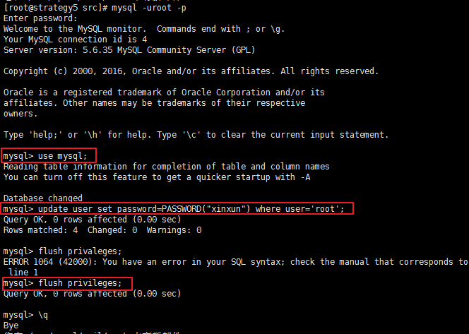

接下来，重新登录，发现必须使用新密码才能登录进入mysql命令行。


密码配置完毕之后，我们必须配置mysql的远程访问，让mysql可以在其他机器上访问，配置方式如下：

```shell
# 开放3306端口
firewall-cmd --add-port=3306/tcp --zone=public --permanent
firewall-cmd --reload

# 在mysql命令行中添加远程访问用户及分配权限
mysql>grant all privileges on *.* to remoter@localhost identified by 'xinxun#remoter' with grant option;
mysql>grant all privileges on *.* to remoter@"%" identified by 'xinxun#remoter' with grant option;
mysql>flush privileges
```


测试，在远程机器上测试连接：


### 八、Ambari-Server安装

- 介绍
- Ambari版本选择
- 本地安装源配置
- yum仓库下载配置
- 安装
- 配置和启动


#### （一）介绍

Ambari系统最初是由Hortonworks公司开发，后来捐献给Apache基金会的一个完全开源的项目，所以在[Hortonworks](https://zh.hortonworks.com/)和[Apache网站](http://ambari.apache.org/)上都可以找到Ambari相关的文档（Hortonworks上的比较详细齐全）。Ambari是一个Hadoop集群管理和监控的平台系统，它的目的是简化集群安装配置、集群管理和集群监控的工作。Ambari基于其灵活的RESTful API实现，提供了一个直观的、易于使用的Hadoop管理Web UI界面，让我们可以方便的对Hadoop集群进行管理。

#### （二）Ambari版本选择

在写本文档之时，Ambari的最新版本是2.5.0.3。基于一般的原则，最新版本可能会存在bug或者不稳定的情况，我们这里选择Ambari2.4.2.0版本，这是属于2.4版本中的最新版本，同时这个版本也不太老，并且支持的hadoop的最新稳定版本2.7，所以2.4.2.0版是一个比较安全又合适选择。

#### （三）本地安装源配置

Apache和Hortonworks网站均提供了Ambari的安装方式，但是Apache上的方式过于简单不够详细，依照Apache的安装方式，我认为是很难成功安装的。所以我参考的是Hortonworks上提供的[安装方式](http://docs.hortonworks.com/HDPDocuments/Ambari-2.4.2.0/bk_ambari-installation/content/download_the_ambari_repo_lnx7.html)。Hortonworks提供了不同Linux发行版系统上安装ambari的方式，在CentOS上是通过yum方式安装。yum安装方式也就是要通过网络下载安装文件，由yum工具自动解析安装。网络实时下载Ambari的安装文件非常大，耗时比较久，可能由于网络原因造成安装失败，所以Hortonworks提供了一种==离线安装==的方式。离线安装，通过将Ambari的安装文件包单独下载到本地局域网，并放置在内部局域网可访问下载，也就是本地安装源，然后修改yum仓库对应的ambari下载url来加快yum安装过程。具体的本地源怎么配置，参考附录。

#### （四）yum仓库下载配置

下面步骤是介绍怎么修改yum仓库配置，将ambari的下载地址改为本地局域网的下载地址。根据机器角色规划，ambari-server将安装在strategy5虚拟机上，在strategy5虚拟机上执行如下命令：

```ini
# 以下命令的工作目录均为:/usr/local/src

# 下载ambari.repo文件,这里我已经将ambari.repo文件放置在本地局域网服务器中
# 官方ambari.repo文件下载地址为：
# http://public-repo-1.hortonworks.com/ambari/centos7/2.x/updates/2.4.2.0/ambari.repo -O /etc/yum.repos.d/ambari.repo
wget http://192.168.10.166/repo/bigdata/ambari.repo

# 下载完成之后，将ambari.repo文件移到/etc/yum.repo.d目录下
mv ambari.repo /etc/yum.repo.d

# 编辑修改ambari.repo文件
vi /etc/yum.repo.d/ambari.repo

###############################################
# 修改后文件内容如下：
[Updates-ambari-2.4.2.0]
name=ambari-2.4.2.0 - Updates
# 改为本机局域网下载地址
baseurl=http://192.168.10.166/repo/bigdata/AMBARI-2.4.2.0/centos7/2.4.2.0-136
gpgcheck=1
gpgkey=http://192.168.10.166/repo/bigdata/AMBARI-2.4.2.0/centos7/2.4.2.0-136/RPM-GPG-KEY/RPM-GPG-KEY-Jenkins
enabled=1
priority=1
##############################################

# 执行yum repolist命令，检查ambari是否在仓库列表中
yum repolist
```

#### （五）安装

CentOS中yum安装软件非常简单，只需执行如下命令即可：

```ini
yum install -y ambari-server
```

由于，我们配置的下载文件位置为本机局域网，上述安装过程2分钟以内即可完成。

#### （六）配置和启动

ambari平台系统必须要配置一个数据库来收集和存储集群相关的信息以及ambari系统本身用户和权限的信息。ambari默认配置的数据库为PostgreSQL，如果我们采用默认配置，那么我不需要为配置数据库做额外的工作；但是我们现在将使用mysql作为ambari的数据库。下面，将介绍mysql作为ambari的数据库所必须的配置。

##### mysql数据库配置

首先确保在ambari-server机器(也就是strategy5机器)的/usr/share/java目录下，存在mysql-connector-java的jar包用于连接mysql进行操作的。

```ini
# 查看目录
ls /usr/share/java
```

如果不存在mysql-connector-java的jar包，则执行如下命令安装：

```ini
yum install -y mysql-connector-java
```

下载完毕之后，查看/usr/share/java目录下是否有mysql-connector-java.jar文件，并将此文件的权限设置为644，默认权限就是644，可以不需要更改，如果不是，可以执行如下命令进行更改。

```ini
chmod 644 /usr/share/java/mysql-connector-java.jar
```

注意，上述mysql-connector-java.jar包是放在ambari-server所在机器上，并不是mysql数据库所在机器上。当然，本文档真的的环境ambari-server和mysql是在同一个机器上，所以没有区别。

为Ambari创建一个用户，并为这个用户分配权限：

```ini
mysql -uroot -pxinxun # 进入mysql命令行

# 创建远程访问用户名:ambari 密码:bigdata
mysql> create user 'ambari'@'%' identified by 'bigdata';
mysql> grant all privileges on *.* to 'ambari'@'%';

# 本地访问用户 ambari/bigdata
mysql> create user 'ambari'@'localhost' identified by 'bigdata';
mysql> grant all privileges on *.* to 'ambari'@'localhost';

# 主机名访问用户 ambari/bigdata
# 这里主机名要视情况改为你安装ambari-server服务机器的主机名
mysql> create user 'ambari'@'strategy5.xinxun.com' identified by 'bigdata';
mysql> grant all privileges on *.* to 'ambari'@'strategy5.xinxun.com';
mysql> flush privileges;
```

用户创建完成之后，创建ambari系统所需的数据库，数据库的结构文件位于/var/lib/ambari-server/resources/Ambari-DDL-MySQL-CREATE.sql目录下(在ambari-server安装完成之后存在这个文件)。将这个文件拷贝到mysql数据库所在的机器(本文档对应环境不需要拷贝)。

```ini
mysql -uambari -pbigdata # 用ambari用户登录mysql

mysql> create database ambari;
mysql> use ambari;
# sql文件路径换成你自己放置的绝对位置
mysql> source /var/lib/ambari-server/resources/Ambari-DDL-MySQL-CREATE.sql
```

针对ambari的数据库配置完毕。

##### 配置

禁用SELinux和关闭防火墙

```ini
setenforce 0
systemctl stop firewalld
```

执行命令：`ambari-server setup`开始ambari-server的配置。


注意ambari-server的配置是可以重复进行的，也就是说如果你想修改它的配置，那么你可以再次运行`ambari-server setup`重新配置。

##### 启动

执行命令：`ambari-server start` 启动ambari-server。启动成功之后，通过浏览器访问。

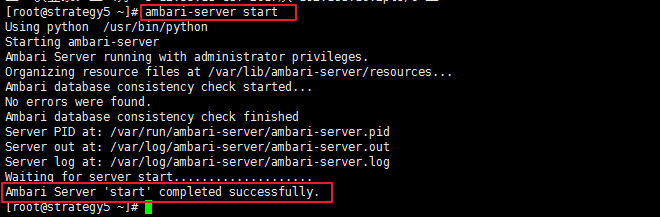

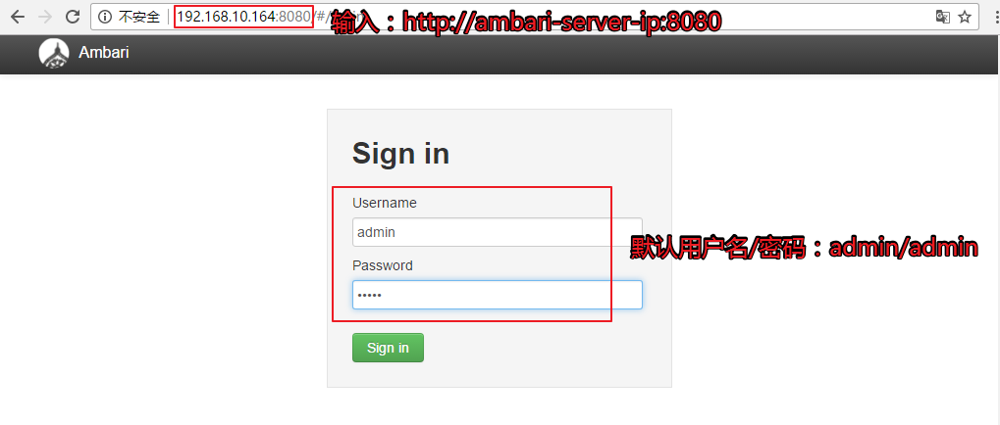

至此，Ambari-server安装配置完毕。

### 九、Hadoop集群安装

#### （一）关闭SELinux和防火墙

在strategy1虚拟机上执行如下命令：

```shell
ansible all -m command -a 'setenforce 0'
ansible all -m service -a 'name=firewalld state=stopped'
```

#### （二）安装步骤

##### 1. 登录Ambari


##### 2. 加载安装向导

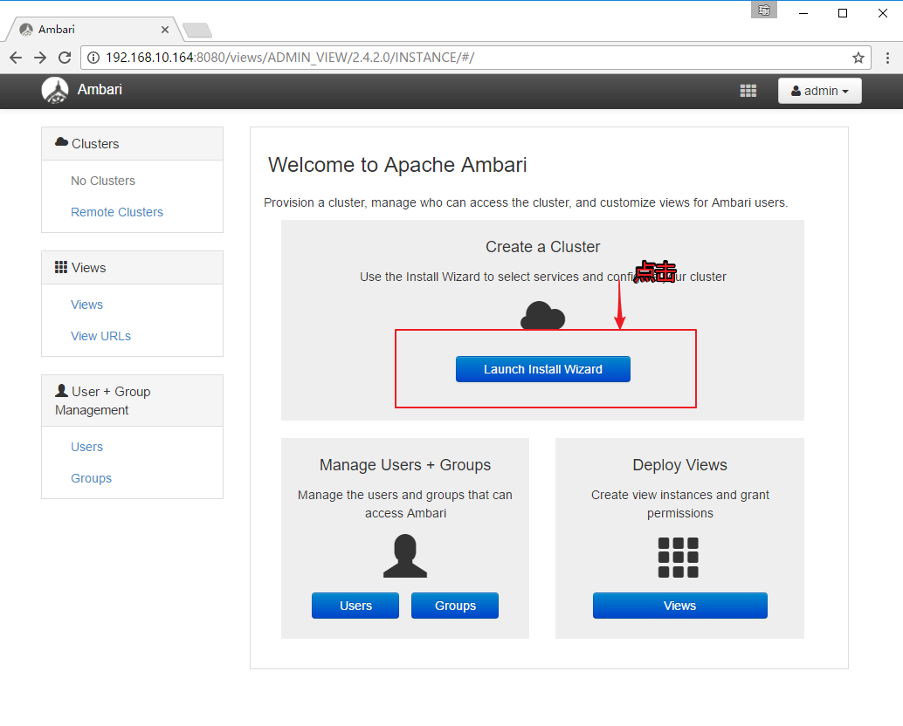

##### 3. 集群命名

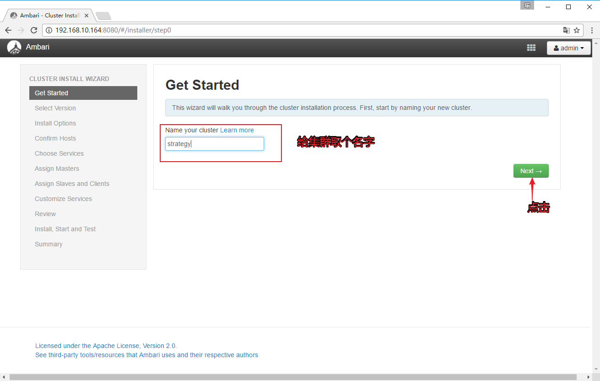

##### 4. 选择版本


我们这里选择HDP2.5.3版本，因为这个版本包含的hadoop项目都是比较新和稳定的，比如其中的hadoop版本就是2.7的版本。同时，我们这里也要选择本地局域网仓库，原因还是网络因素会影响安装。至于本地局域网仓库怎么配置，参考附录。

##### 5. 安装选项

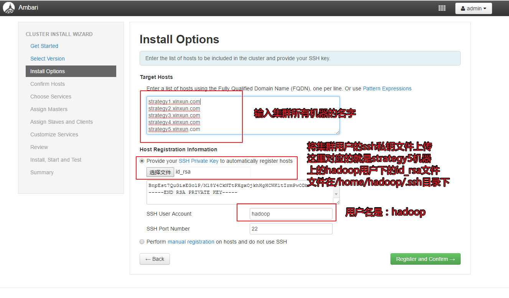

##### 6. 确定主机

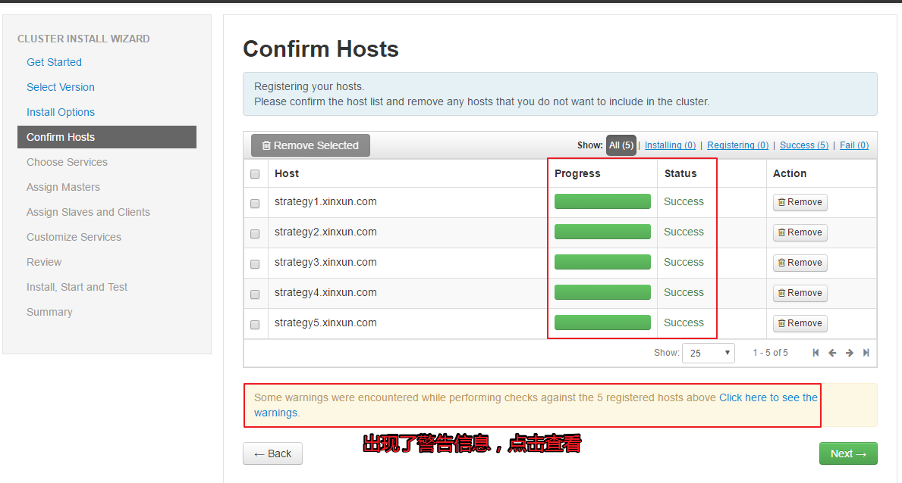

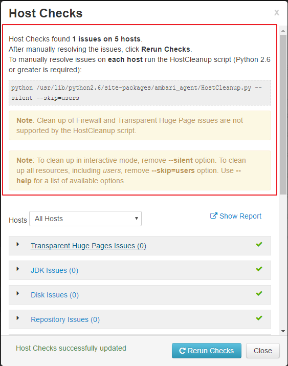

根据他的指示，在每个主机上运行`python /usr/lib/python2.6/site-packages/ambari_agent/HostCleanup.py --silent --skip=users`命令，并且关闭了Transparent Huge Page这个功能，这里的警告信息依然会存在，那么我们可以忽略这个警告信息。

##### 7. 选择安装的服务

目前我们需要的服务只有：HDFS、YARN+MR2、Strom、Spark。Zookeeper是服务协调工具，这里也选择安装，Ambari Infra、Ambari Metrics和SmartSense是Ambari的辅助工具，这里也选择。至于Pig、Hive、Tez、Slider择时Ambari必须要选择的项，否则点击Next按钮不会往下一步走。


##### 8. 主节点规划


##### 9. 从节点和客户端


##### 10. 自定义服务配置

有些服务还需要我们手动配置一些选择，比如Hive需要我们配置元数据库的位置，SmartSense需要配置用户密码等，如下图所示，所有需要我们特意配置的，会用警示信息提示我们。

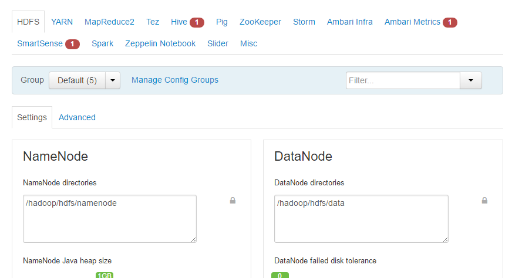

Hive的元数据库配置如下图，需要我们在数据库中建立好hive用户和权限，以及创建存储hive元数据的数据库，配置方式文档前面均有涉及，这里不再赘述。

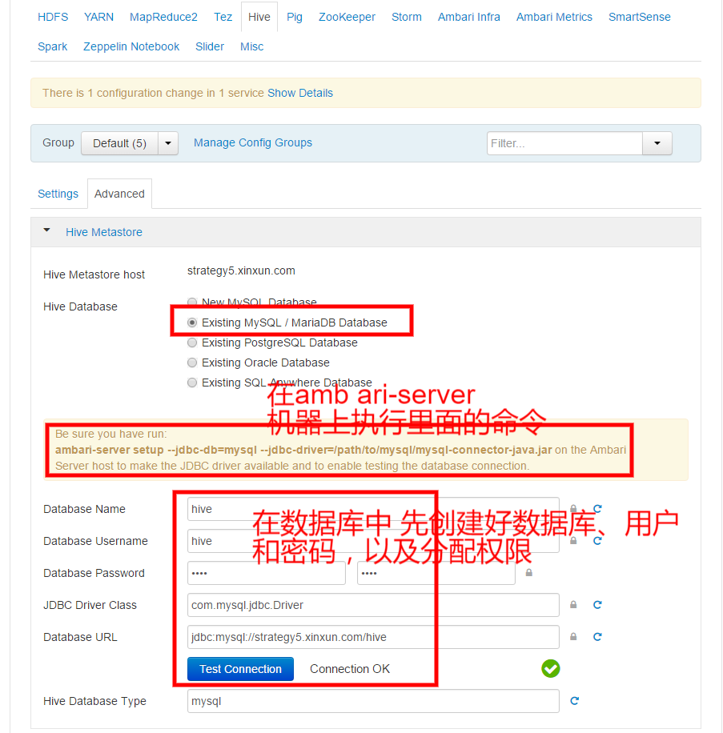

Ambari Metrics配置：


SmartSense 配置：

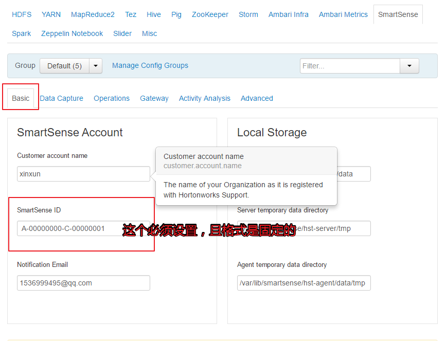


##### 11.  预览

上述配置完毕之后，会有一个集群信息的预览，确认配置正确之后，点击部署，就开始正式安装部署。在点击部署按钮之前，请认证确认信息，在这一步是还可往回修改的，如果点击了部署按钮，那么所有配置都不可以再修改，必须等待集群安装完毕之后才可以。

##### 12. 部署安装


##### 13. 完成


安装完成之后，会有些节点有警告信息，有警告的信息是没事的，我们可以直接跳过，因为这些警告信息可以在稍后继续修改。


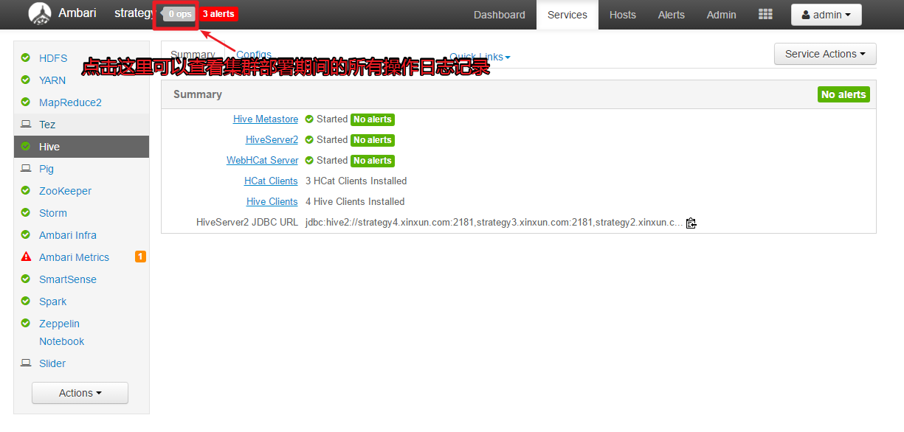


至此，集群的安装部署全部完成。