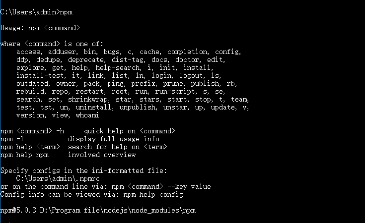

# 接口文档生成工具-APIDOC

每一个做服务端程序的程序员也许都曾有过无休止编写或修改接口请求规范文档的经历，都渴望能有这样或者那样的工具帮助我们自动生成一份漂亮的接口请求规范文档。在我没有用这些工具之前，我也是老老实实一个字一个字的编写接口请求访问规范文档；从最初的用word文档编写，再到用markdown语法编写；使用word文档编写调整文档格式及生成漂亮的代码示例都很麻烦，用markdown语法编写，不管是格式和还是美观，我认为都是在word编写的文档之上；之后也就有一段时间一直是用markdown编写的接口请求规范文档。直到后来，有听同学问到是否有自动生成接口文档的工具，我才突然想到为什么没有在网上找找这种类似的工具。

网上确实有很多这种类似的工具，比如：swagger，blueprint，yaml，apidoc等等，一找一大堆。之前也简单的用过swagger，确实相对自己手工编写要方便很多，只需要在代码里面简单的配置，在相应的接口上添加swagger定义的注解就可以生成很漂亮的接口文档，并可以提供接口测试，但是我认为有一点不好的是：代码侵入性太强，由于swagger是直接通过java注解实现的，要生成文档必须在controller层的每个接口方法上添加必要的注解，这样会导致生成文档的注解代码和原本的业务实现耦合在一起了；所以我认为这一点上不太优雅。

apidoc是最近找到的一个文档生成工具：
**优点：**

- 生成文档的代码可以防止单独的文件中，可以和原本业务代码完美的解耦；
- 支持文档的版本化，并且可以直接对比各个不同版本之间，接口文档之间的具体变化，相当于可以记住历史；
- 界面简洁漂亮。

**缺点：**

- js实现的框架，必须通过nodejs工具生成文档；
- 需根据其定义规范额外的编写接口请求文档，有一点点维护成本。

下面我将一步步介绍如何使用apidoc这个工具。

## 一、环境准备安装

正如前文所说，apidoc是一个js框架，可以借助nodejs的包管理工具来安装，首先下载[nodejs](https://nodejs.org/en/)并安装，安装成功之后，打开命令行输入npm命令看到如下信息表示nodejs已经安装成功。



nodejs安装成功之后，我们就可以直接通过npm工具安装apidoc了，在命令行输入如下命令来安装apidoc环境：

```
npm install apidoc -g
```

输入如下命令检查apidoc安装是否成功：

```
apidoc -h
```


## 二、使用

### 2.1 项目信息配置

apidoc提供了一个可选的项目级配置文件（**apidoc.json**）来配置项目的信息，需将此配置文件放在项目的根目录下；包括：项目名称、项目当前版本、项目描述等等信息。