[TOC]

# HDFS从部署到代码实现

### 1. 功能介绍

​      HDFS是一个分布式文件存储系统，是Hadoop应用中最重要的分布式数据存储系统，同时也是Hadoop生态系统中最基础的部分。一个HDFS集群通过一个管理节点Namenode和多个数据节点Datanode实现整个集群中的数据文件管理；包括文件的创建、删除和查找等。HDFS提供对应用系统数据的高吞吐量访问，非常适合那些海量数据集的应用系统。

### 2. 环境搭建

####       2.1 环境准备

1. 4台虚拟机，ip：192.168.157.128(master);192.168.157.129(slave1);192.168.157.130(slave2);192.168.157.131(slave3)
2. 操作系统：centOs7
3. jdk版本：1.7.0_79

#### 2.2 hadoop安装

HDFS是属于hadoop系统中最基础的部分，所以我们直接安装hadoop就会安装好HDFS。

##### 1.hadoop下载

​      首先我们要选择一个hadoop的版本来进行安装，截至我写这篇文章之前hadoop的最新版本是2.7.3。我选择的是2.6.4，选择相对早一点的版本会稳定点。从[官网](http://hadoop.apache.org/releases.html)下载对应的linux安装包。

##### 2.解包

​      将官网下载的hadoop-2.6.4.tar.gz解压，我把它重命名为hadoop，如下图： 

​                 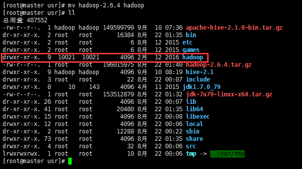

解压之后hadoop的目录结构如下： 

​                                  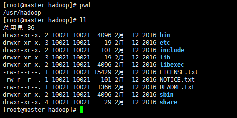

##### 3.单个节点配置

​     以192.168.157.128节点为例

​    a.修改配置文件*$hadoop_home/etc/hadoop/hadoop-env.sh*，将JAVA_HOME改为你本机中jdk的安装目录:

```shell
export JAVA_HOME=/usr/jdk1.7.0_79
```

​    b.修改配置文件*$hadoop_home/etc/hadoop/core-site.xml*:[更多配置信息](http://hadoop.apache.org/docs/r2.6.4/hadoop-project-dist/hadoop-common/core-default.xml)

```xml
<?xml version="1.0" encoding="UTF-8"?>
<?xml-stylesheet type="text/xsl" href="configuration.xsl"?>
<configuration>
  <!-- 指定文件系统的名字，客户端通过这个值可以访问hdfs文件系统 -->
  <!-- fs.default.name属性已经被此属性取代，建议使用下面的属性-->
  <property>
    <name>fs.defaultFS</name>
    <value>hdfs://master:9000</value>
  </property>
   <!-- 临时文件的存放目录 -->
  <property>
    <name>hadoop.tmp.dir</name>
    <value>/usr/hadoop/tmp</value>
  </property>
  <!-- 垃圾回收器中执行时间间隔，单位：分钟 -->
  <property>
    <name>fs.trash.intervale</name>
    <value>1440</value>
  </property>
</configuration>
```

   c.修改配置文件*$hadoop_home/etc/hadoop/hdfs-site.xml*:[更多配置信息](http://hadoop.apache.org/docs/r2.6.4/hadoop-project-dist/hadoop-hdfs/hdfs-default.xml)

```xml
<?xml version="1.0" encoding="UTF-8"?>
<?xml-stylesheet type="text/xsl" href="configuration.xsl"?>
<configuration>
  <!-- hdfs中每个数据块的副本数，注意这个值可以在create文件的时在代码中指定 -->
  <property>
    <name>dfs.replication</name>
    <value>4</value>
  </property>
  <!-- namenode节点上，存放文件系统元数据的文件存放位置，file协议表示存放在本地文件系统中 -->
  <property>
    <name>dfs.namenode.name.dir</name>
    <value>file:/usr/hadoop/dfs/name</value>
  </property>
  <!-- datanode节点上，文件系统元数据的文件存放位置 -->
  <property>
    <name>dfs.datanode.data.dir</name>
    <value>file:/usr/hadoop/dfs/data</value>
  </property>
  <!-- 在访问hdfs上的文件时，是否执行权限检查 -->
  <property>
    <name>dfs.permissions.enabled</name>
    <value>false</value>
  </property>
</configuration>
```

​    d.修改配置文件*$hadoop_home/etc/hadoop/mapred-site.xml*:[更多配置信息](http://hadoop.apache.org/docs/r2.6.4/hadoop-mapreduce-client/hadoop-mapreduce-client-core/mapred-default.xml)

```xml
<?xml version="1.0" encoding="UTF-8"?>
<?xml-stylesheet type="text/xsl" href="configuration.xsl"?>
<configuration>
  <!-- 执行MapReduce任务的运行框架，取值有：local、classic和yarn，默认值为local -->
  <property>
    <name>mapreduce.framework.name</name>
    <value>yarn</value>
  </property>
</configuration>
```

​     e.修改配置文件*$hadoop_home/etc/hadoop/yarn-site.xml*:[更多配置信息](http://hadoop.apache.org/docs/r2.6.4/hadoop-yarn/hadoop-yarn-common/yarn-default.xml)

```xml
<?xml version="1.0" encoding="UTF-8"?>
<?xml-stylesheet type="text/xsl" href="configuration.xsl"?>
<configuration>
  <property>
    <name>yarn.nodemanager.aux-services</name>
    <value>mapreduce_shuffle</value>
  </property>
  <!-- 这个跟默认配置一样，可以不用写 -->
  <property>
    <name>yarn.nodemanager.aux-services.mapreduce.shuffle.class</name>
    <value>org.apache.hadoop.mapred.ShuffleHandler</value>
  </property>
  <!-- 这个配置在分布式环境中是必须要配置的，否则在分布式环境中会报总是找不到resourcemanager节点 -->
  <property>
    <name>yarn.resourcemanager.hostname</name>
    <value>master</value>
  </property>
</configuration>
```

##### 4.单个节点启动hdfs

  a.执行命令：$hadoop_home/bin/hdfs namenode -format 对文件系统进行格式化  

  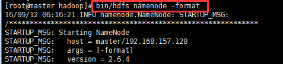

  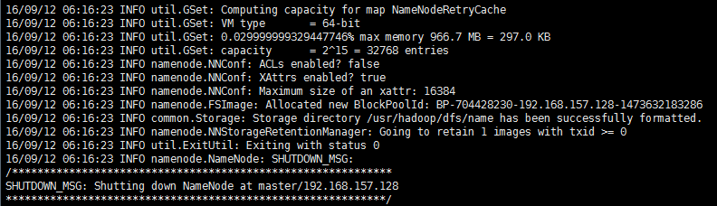

 b.执行命令：$hadoop_home/sbin/start-dfs.sh 启动hdfs节点，执行jps（java提供的现在当前系统中的java进程命令）

 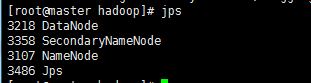

有上图所示结果，说明hdfs配置启动成功，同时也可以通过浏览器访问192.168.157.128:50070来查看是否启动成功，如下图： 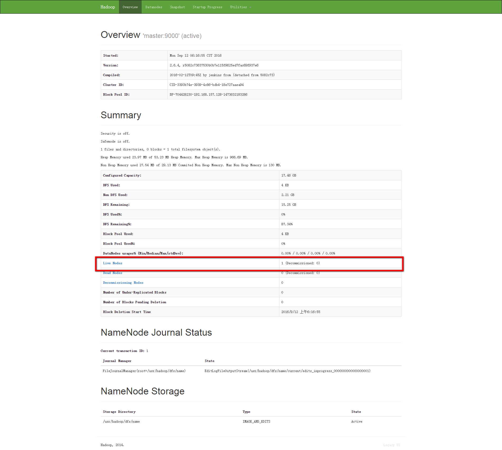

##### 5.多节点完全分布式配置

a. 修改配置文件*$hadoop_home/etc/hadoop/slaves*

在slaves文件中，添加slave1和slave2两个节点

b.将master机器上整个hadoop文件夹传输到slave1和slave2两个机器上的usr目录中。

   使用命令：scp -r /usr/hadoop  hadoop@slave1:/usr

   可能出现的错误：Permission denied。出现这个错误的原因是，在slave1和slave2的机器上，hadoop用户对于目录/usr没有写入的权限导致，所以只需要在slave1和slave2两个机器上将/usr的文件模式设置为777

c.在master上重新执行文件系统格式化命令：*$hadoop_home/bin/hdfs namenode -format*

d.在master上启动hdfs集群：*$hadoop_home/sbin/start-dfs.sh*

e.查看是否启动成功：jps命令查看进程和$hadoop_home/bin/hdfs dfsadmin -report查看集群节点状况。

 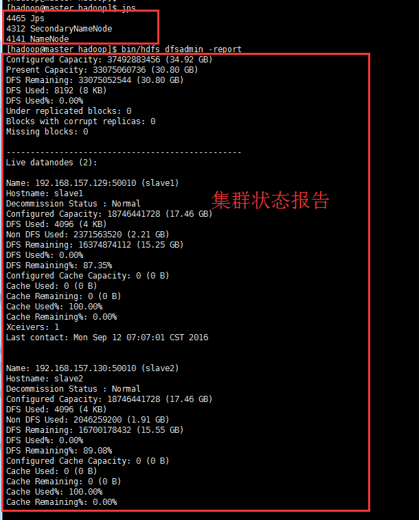

从结果我们会发现，跟单节点的jps命令比较，会只有3个java进程，是因为现在是在集群环境下，datanode已经运行在不同的机器slave1和slave2上了。在slave1和slave2上我们可以执行jps命令查看，结果如下图：

​    

通过浏览器查看集群：访问master:50070

 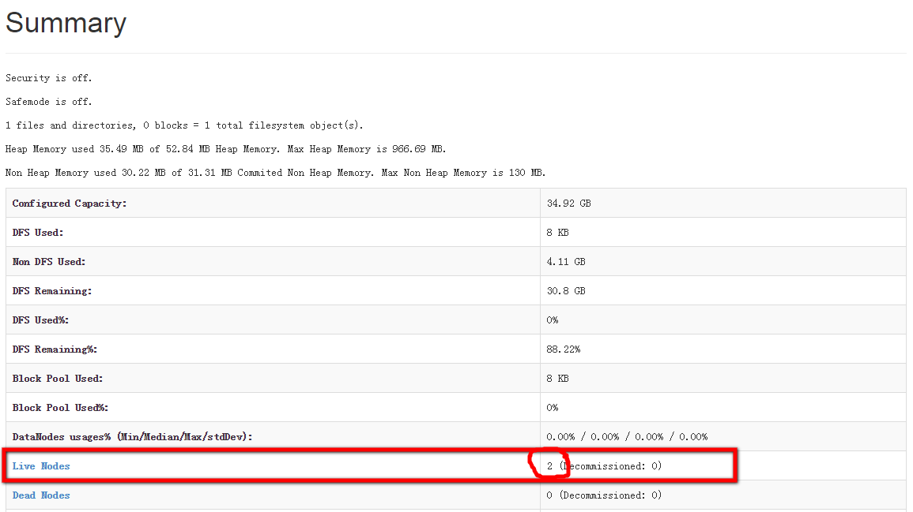

 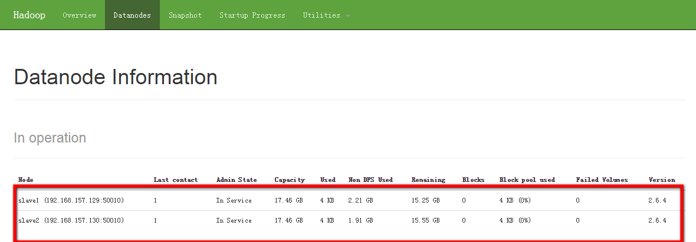

**注意：通过scp命令传输文件到slave1和slave2上，而不需要做任何修改的前提是slave1和slave2中关于jdk等的配置跟master机器上是一模一样的才会不需要修改，否则请修改成正确的jdk安装路径**

##### 6.动态添加节点slave3

a.将hadoop文件夹传入到slave3机器上：scp -r /usr/hadoop hadoop@slave3:/usr

b.将slave3作为datanode节点启动，在slave3上执行命令：$hadoop_home/bin/hdfs datanode

 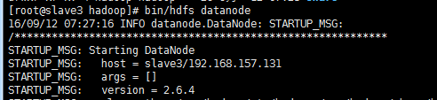

c.在namenode节点（master上）中的slaves配置文件中加入slave3

d.在master上执行命令刷行集群的节点信息：$hadoop_home/bin/hdfs dfsadmin -refreshNodes

e.查看集群节点状态信息：$hadoop_home/bin/hdfs dfsadmin -report

 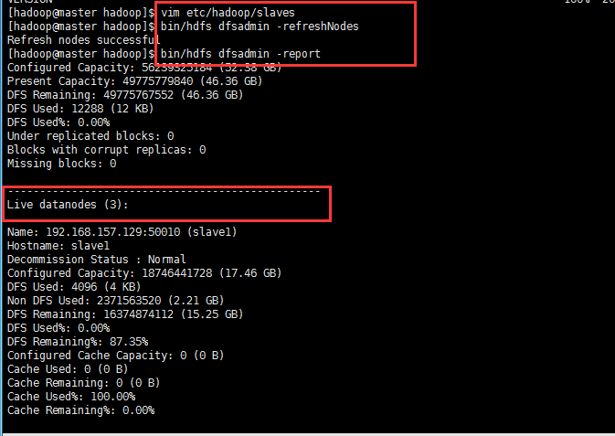

刷新浏览器，查看集群节点信息

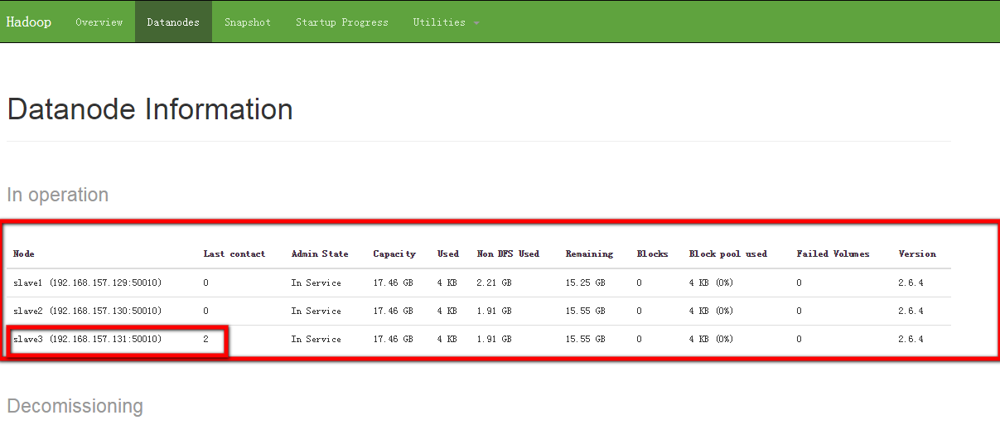

### 3. HDFS架构

 

​    HDFS集群采用Master/Slaver架构，由一个管理节点NameNode(在新的Federation的架构中，可以同时支持多个NameNode存在)和多个数据节点DataNode组成。NameNode节点上存储整个HDFS文件系统中的文件信息；包括文件属性、数据所在节点信息、文件结构等等；文件内容数据按照设定的大小分成若干个文件数据块存放在DataNode节点之上。

​    客户端访问HDFS系统。读取HDFS上的文件时，首先向NameNode发送文件的读取请求，NameNode节点根据客户端要请求的文件信息，检索出文件在HDFS上的存储节点列表返回给客户端；客户端通过从NameNode获取到的数据，从各个DataNode获取文件的内容数据。向HDFS上写入文件时，客户端先向NameNode节点写入文件的信息，NameNode节点也会返回文件数据存放节点的信息以及每个数据块应该存放的副本数；客户端再将数据写入到各个DataNode节点之上。所以说，NameNode主要是负责文件的创建、删除等，而文件读写IO主要去各个DataNode分担。

#### 预想和目标(Assumptions and Goals)

> 硬件容错性  

​    硬件错误发生比软件异常更寻常.HDFS集群由成千上万个服务器节点组成,发生硬件错误的几率更大.所以,错误检测和自动恢复机制就成为了HDFS的核心架构目标

> 流式数据访问

​    基于HDFS的应用是海量数据集的,所以HDFS被设计为跟适合批处理,高吞吐量的数据访问方式;而不是低延迟的数据访问方式.

> 大数据集

​    运行在HDFS之上的应用都是大数据集的.在HDFS上的文件范围都是在G和T之间的大小.在一个集群中应该要提供高聚合的数据宽带和可扩展的上百个节点.在一个集群应至少要支持上千万个文件.

> 简单的数据一致性模型

​    HDFS上的文件支持"一次写入多次读取"模式.一个文件一旦经过创建,写入,关闭这三个流程,便不再允许被改变(除非是在文件后面添加或者删除内容).

> 移动计算比移动数据更容易(Moving Computation is Cheaper than Moving Data)

​    一个应用的计算发生在存储数据的电脑上(也就是接近数据中心)是会更加高效的.尤其是当数据集很大的时候这种差别更加显著(这可以减少网络拥堵,提高系统吞度量).所以HDFS在做这种计算的时候,他会提供接口让运行程序走到数据的身边去而不是传输数据到运行程序.

#### 数据复制

   HDFS是一个可靠的分布式文件系统。那么她是怎样来维护她的数据以让用户随时随地可以获取的呢？hdfs把一个文件分成大小完全相同的若干份（最后一份除外，可能不够大）存储于各个Datanode节点之上，同时在其他的若干个Datanode节点上保存有各个文件块的副本。至于每个文件块的大小以及存放副本的个数可由系统配置。文件块怎么分配，分配在哪些节点上等这些操作的控制由Namenode节点来执行.Namenode会定期接受到来自各个DataNodes的心跳(Heartbeat)和块报告(Blockrepot).心跳可以检测一个DataNode是否可用,块报告包含一个DataNode上所有的数据块信息的列表.

#### 机架感知

​    典型的，一个大的Hadoop集群会被放在一个机群中，在这样的机群中，比起跨机架来说，在相同的机架上网络流量会更好。同时，NameNode也会放置不同的块副本到不同的机架上来增强集群的容错性能。集群管理员可以通过配置变量net.topology.script.file.name来决定节点所属机架的策略。当这个脚本被配置后，每个节点都会运行这个脚本来决定自己所处的机架id。默认所有的节点都属于同一个机架。

#### 副本放置策略

​    HDFS集群有成百上千个节点,而这些节点又被平均分配在若干个机架上面.节点所属机架,机架与机架之间不管是网络状况还是吞度量大小都是有很大影响的.所以副本怎样放置在不同的节点上,对整个系统文件的写入和读取效率以及系统容错能力都有很大关系.HDFS采用这样的策略: 假如现在有一个文件块要存储为3个副本,那应该怎么存,首先会在当前机架的某个DataNode上写入一个副本,在同机架的另一个DataNode上写入第二个副本,将第三个副本写到不同机架的DataNode上.

#### 安全模式

​    在HDFS启动时,NameNode在一个时间段内会处于安全模式.在安全状态下,数据块的赋值不会发生.NameNode从DataNode节点接收Heartbeat和Blockreport信息.Blockreport包含DataNode上自己管理的数据块的列表信息.每一个数据块都有一个最小的副本数(这个值可以通过百分比的方式去配置),当一个数据块的副本数达到了这个最小值时被认为是可被安全复制的.当NameNode接收到所有这些数据块的可安全复制信息后就会自动关闭安全模式.然后由HDFS去执行剩余的复制工作,使每个数据块的副本数达到设置好的副本数量.

#### 文件系统元数据的持久存储

​    HDFS文件系统的元数据信息被存储在NameNode节点上.NameNode节点使用事物日志(叫做EditLog)来持久记录发生在文件系统上面每个变化.例如:创建文件会在EditLog中插入一条记录,改变副本因子也会新增一条新的记录.NameNode会使用本地文件系统来保存这个EditLog内容.整个HDFS文件系统的命名空间,数据块与文件的映射关系,文件系统的各个属性都被存放在一个叫做FsImage的文件中,这个FsImage文件也放在NameNode节点的本地文件系统中.  
​    NameNode会维护整个文件系统的命名空间和文件块的映射关系在内存中.这些文件系统的元数据被设计为非常紧凑的,一个4G内存的NameNode可以支持大量的文件和目录.当NameNode启动的时候,他会从磁盘读取FsImage和EditLog文件写入内存,然后将EditLog合并到FsImage中,同时把这个新的FsImage写到磁盘上;再删除那个老的EditLog文件(会再创建一个新的EditLog文件来记录文件系统的变化);从读取到内存到删除这个过程叫做checkpoint.checkpoint这个过程只会在NameNode启动时发生(SecondaryNameNode和CheckpointNode,BackupNode会定期执行checkpoint).DataNode启动的时候,会扫描自己的文件系统生成一个HDFS数据块的列表,并把这个列表发送到NameNode.这个过程就是Blockreport.

#### 数据组织

##### 数据块

​    每个文件被分割为相同大小的数据块,一个典型的数据块大小为64M,每个数据块会被分配到不同的DataNode上.

##### 分步(Staging)

​    客户端创建文件的请求不会立即到达NameNode节点.实际上,HDFS客户端会先缓存文件数据在本地临时文件中.当本地临时文件收集的数据块大小达到了数据块的大小,客户端才会联系NameNode.NameNode将文件名插入到HDFS文件系统结构中，并为此数据块分配block。然后NameNode将数据块所属的DataNode的id和datablock的id返回给客户端，客户端将本地临时文件中存储的数据写入到对应DataNode的datablock上。当文件关闭时，客户端将剩下没有flush的数据写到datablock上之后，再通知NameNode文件已经关闭了，在这个时候，NameNode才会提交文件创建的操作到EditLog文件中。所以如果NameNode在文件关闭前宕机了，那么这个文件信息就丢失了（虽然数据已经写到了DataNode上）。

##### 复制流水线

​    当一个客户端写入数据到HDFS文件中，数据首先会写到本地临时文件中。假设HDFS文件的副本因子是3.当本地文件接收的数据量达到了一个数据块的大小，客户端就联系NameNode，获得一个存储这个数据块的DataNode节点集合。集合中指定的DataNode节点存储数据块的副本。客户端把数据块flush到第一个DataNode。第一个DataNode开始接收一小部分数据，并把这小部分数据写入到他本地的文件系统中，然后把这小部分数据传输给集合中的第二个DataNode，第二个DataNode做相同的工作直到最后一个节点。   

​    hdfs被设计成支持大文件存储，适合那些需要处理大规模数据集的应用（写入一次，多次读取）。客户端上传文件到hdfs文件系统时，并不会马上上传到Datanode节点上，而是先存储在客户端本地临时文件夹下面，当本地存储数据量的大小达到系统数据块大小时，客户端联系Namenode节点从Namenode节点（Namenode节点将文件名存入他的文件系统中）获取数据块存储位置信息（包括副本数，存放的节点位置等信息），根据获取到的位置信息将本地临时数据块上传至对应的Datanode节点；当文件关闭时，客户端将剩余的数据量上传至Datanode节点，并告诉Namenode节点文件已关闭。Namenode节点收到文件关闭的消息时将日志写入到日志记录中。

##### 存副本时的流式复制

​    客户端从Namenode节点获取到存储副本的节点信息之后（存储数据Datanode列表），开始写入第一个Datanode节点，Datanode节点一部分一部分的接收（一般是4kb）存入节点本地仓库，当这一部分写入完毕之后第一个Datanode节点负责将这部分数据转发到第二个Datanode节点，依次类推，直到第n-1个节点将这部分数据块写入第n个节点，如此循环写入。

### 4. 代码示例

​    下面将以Maven方式构建一个示例项目，通过java API的方式来访问和操作HDFS文件系统。

   #### 1.创建Maven项目HDFSTest

​    跟创建普通的Maven项目一样，没什么区别。

#### 2.添加Hadoop依赖

```xml
<project xmlns="http://maven.apache.org/POM/4.0.0" xmlns:xsi="http://www.w3.org/2001/XMLSchema-instance"
	xsi:schemaLocation="http://maven.apache.org/POM/4.0.0 http://maven.apache.org/xsd/maven-4.0.0.xsd">
	<modelVersion>4.0.0</modelVersion>
  
	<groupId>com.shell.hadoop.hdfs</groupId>
	<artifactId>HDFSTest</artifactId>
	<version>0.0.1-SNAPSHOT</version>
  	<packaging>jar</packaging>

	<name>HDFSTest</name>
	<url>http://maven.apache.org</url>

	<properties>
		<project.build.sourceEncoding>UTF-8</project.build.sourceEncoding>
		<jdk.version>1.8</jdk.version>
	</properties>

	<dependencies>
		<dependency>
			<groupId>junit</groupId>
			<artifactId>junit</artifactId>
			<version>3.8.1</version>
			<scope>test</scope>
		</dependency>
		<dependency>
            <groupId>org.apache.hadoop</groupId>
            <artifactId>hadoop-common</artifactId>
            <version>2.6.4</version>
            <!-- jdk.tools包是在本地jdk环境中存在的，因为不加这个配置有时候会报错：找不到jdk.tools的依赖  -->             <!-- 所以这里直接不包含这个依赖，而是通过指定本地系统中的jar包 -->
            <exclusions>
            	<exclusion>
            		<groupId>jdk.tools</groupId>
            		<artifactId>jdk.tools</artifactId>
            	</exclusion>
            </exclusions>
		</dependency>
        <!-- 指定本地系统中的jdk.tools.jar的位置 -->
		<dependency>  
		    <groupId>jdk.tools</groupId>  
		    <artifactId>jdk.tools</artifactId>  
		    <version>1.8</version>  
		    <scope>system</scope>  
		    <systemPath>${JAVA_HOME}/lib/tools.jar</systemPath>  
		</dependency> 
		<dependency>
            <groupId>org.apache.hadoop</groupId>
            <artifactId>hadoop-hdfs</artifactId>
            <version>2.6.4</version>
        </dependency>
        <dependency>
            <groupId>org.apache.hadoop</groupId>
            <artifactId>hadoop-client</artifactId>
            <version>2.6.4</version>
        </dependency>
	</dependencies>

	<build>
		<pluginManagement>
			<plugins>
				<plugin>
					<groupId>org.apache.maven.plugins</groupId>
					<artifactId>maven-compiler-plugin</artifactId>
					<configuration>
						<source>${jdk.version}</source>
						<target>${jdk.version}</target>
					</configuration>
				</plugin>
			</plugins>
		</pluginManagement>
	</build>
</project>
```

#### 3.编写测试程序

```java
package com.shell.hadoop.hdfs;

import java.io.File;
import java.io.FileInputStream;
import java.io.FileNotFoundException;
import java.io.IOException;
import java.io.InputStream;
import java.net.URI;
import java.net.URISyntaxException;
import java.util.Arrays;
import java.util.EnumSet;

import org.apache.hadoop.fs.BlockLocation;
import org.apache.hadoop.fs.CreateFlag;
import org.apache.hadoop.fs.FSDataOutputStream;
import org.apache.hadoop.fs.FileAlreadyExistsException;
import org.apache.hadoop.fs.FileContext;
import org.apache.hadoop.fs.FileStatus;
import org.apache.hadoop.fs.Options.CreateOpts;
import org.apache.hadoop.fs.ParentNotDirectoryException;
import org.apache.hadoop.fs.Path;
import org.apache.hadoop.fs.permission.FsAction;
import org.apache.hadoop.fs.permission.FsPermission;
import org.apache.hadoop.hdfs.HdfsConfiguration;
import org.apache.hadoop.io.IOUtils;
import org.apache.hadoop.security.AccessControlException;

/**
 * @author Administrator
 */
public class HDFSTest {
    // 指定hdfs文件系统的位置，在core-site.xml中配置的
	private static final String uri = "hdfs://master:9000";
    // 新建一个hdfs的配置对象
	private static HdfsConfiguration conf = new HdfsConfiguration();
	
    /**
     * 创建目录
     */
	public static void mkDir(String path) throws Exception {
		FileContext fileContext = FileContext.getFileContext(new URI(uri), conf);
//		fileContext.setOwner(new Path(path), "hadoop", "supergroup"); //指定目录的所有者
		fileContext.mkdir(new Path(path), new FsPermission(FsAction.ALL, FsAction.ALL, FsAction.READ), true);
	}
	
	/**
	 * 创建文件，将本地的文件上传到hdfs上
	 */
	public static void createFile(String path, File inputFile) throws Exception {
		FileContext fileContext = FileContext.getFileContext(new URI(uri), conf);
		EnumSet<CreateFlag> createFlag = EnumSet.of(CreateFlag.CREATE); // 指定创建文件的方式
//		fileContext.setOwner(new Path(path), "hadoop", "supergroup");
//		fileContext.getFileStatus(new Path(path));
		FSDataOutputStream fsDataOutputStream = fileContext.create(new Path(path), createFlag, CreateOpts.blockSize(24 * 1024 * 1024), CreateOpts.repFac((short)2));
		InputStream is = new FileInputStream(inputFile);
		IOUtils.copyBytes(is, fsDataOutputStream, 1024, true);
	}
	
  	/**
  	 * 删除文件
  	 */
	public static void delete(String path) throws Exception {
		FileContext fileContext = FileContext.getFileContext(new URI(uri), conf);
		fileContext.delete(new Path(path), true);
	}
	
  	/**
  	 * 获取指定文件所在数据节点的信息
  	 */
	public static BlockLocation[] getBlockLocations(String path) throws Exception {
		FileContext fileContext = FileContext.getFileContext(new URI(uri), conf);
		FileStatus fileStatus = fileContext.getFileStatus(new Path(path));
		System.out.println(fileStatus.getReplication());
		return fileContext.getFileBlockLocations(new Path(path), 0, fileStatus.getLen());
	}
	
	public static void main(String[] args) throws Exception {
//		mkDir("test3");
//		delete("test3");
		createFile("wordcount3.txt", new File("e://wordcount.txt"));
		BlockLocation[] blockLocations = getBlockLocations("wordcount3.txt");
		for (BlockLocation blockLocation : blockLocations) {
			System.out.println(Arrays.toString(blockLocation.getHosts()));
		}
	}
}
```