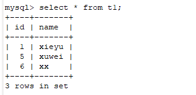
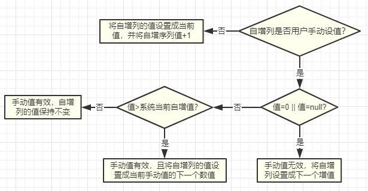

# 关于Mysql中自增ID列的生成逻辑

关于Mysql中的自增ID，平时使用过程中我们一般都是直接用，可能有一些细节也没有去注意。现在考虑如下的一种场景。

有表t1如下：

| 列名 | 类型    | 索引                    |
| ---- | ------- | ----------------------- |
| id   | int     | primary，auto_increment |
| name | varchar | unique                  |

我们执行如下操作：

```mysql
insert into t1 values(1,"xxx");
insert into t1(name) values ("aa"),("bb"),("cc");
delete from t1;
insert into t1 values(0, "yyy");
insert into t1 values(1, "xxx");
insert into t1(name) values("uuu");
select * from t1;
```

**第一步：**指定id=1插入，第一行id是1；

**第二步：**不指定id，依赖自增机制，插入3行数据；此时，id应该分别对应为2,3,4；此时下一个自增值为5；

**第三步：**delete删除所有记录；

**第四步：**指定id=0插入；

**第五步：**指定id=1插入；

**第六步：**不指定id，依赖自增机制，插入1行；

**第七步：**执行查询，请问此时表中的数据是怎么样的？

将结果贴出如下：



根据结果，我们会发现如下几个奇怪的地方：

1. delete清空表中数据之后，自增值不会变，即使插入过id=1的一条记录；但如果我们再插入一条id值为10的记录之后，下一个自增id会是什么呢？
2. 我们在**第四步**明明插入了一条id为0的记录，但是查询结果中没有发现，这是为什么，怎么解决？

针对上述第一个问题，总结如下：

首先，delete并不会重置自增id的值（这一点我想大家都清楚，truncate会重置）。针对第一个问题中问的问题下一个自增id是什么呢？我告诉你是11。故总结自增id改变逻辑如下：



原则如下：在自增列不冲突的前期下，如果用户手动设置了自增列id的值，则直接使用用户设置的值；如果用户手动设置的值超过系统当前保存的下一个自增值，则要重新调整系统当前保存的自增值为用户手动值+1；否则不需要改变；如果用户没有手动设置自增列id的值，则直接走自增逻辑即可。


针对第二个问题，如果用户手动设置的自增id列的值为0，查询结果中确没发现的问题，这个其实在上面的流程图里有画；mysql默认逻辑是：如果用户手动设置自增列的值为0或者是null的情况，则依然会走自增逻辑，而不会将用户手动设置的0或者null插入到自增列上。那么如果我们只想在插入为null的时候才用自增值，而插入为0的时候将自增列的值设置为0，有没有办法解决呢？mysql提供的方案如下：

改变系统变量sql_mode的值，将NO_AUTO_VALUE_ON_ZERO这个值加入到sql_mode这个变量中，这样在用户手动设置自增列为0的时候将会成功设置。

```mysql
-- 当前会话有效
set @@sql_mode=(select concat(@@sql_mode, ",NO_AUTO_VALUE_ON_ZERO"));

-- 全局有效
set @@global.sql_mode=(select concat(@@global.sql_mode, ",NO_AUTO_VALUE_ON_ZERO"));
```

如果需要重启生效，则需要修改配置文件，具体的修改方式感兴趣的可以继续了解一下，这里不再详述。