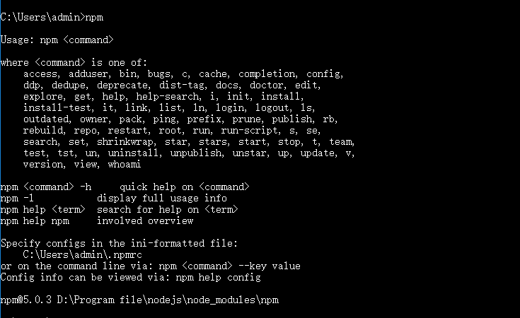
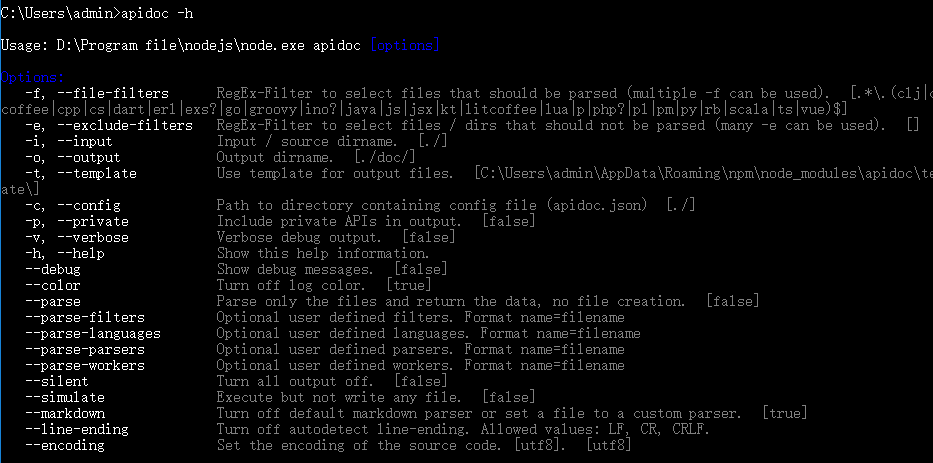
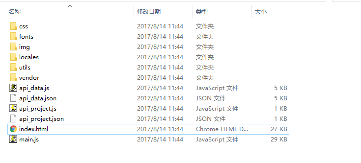
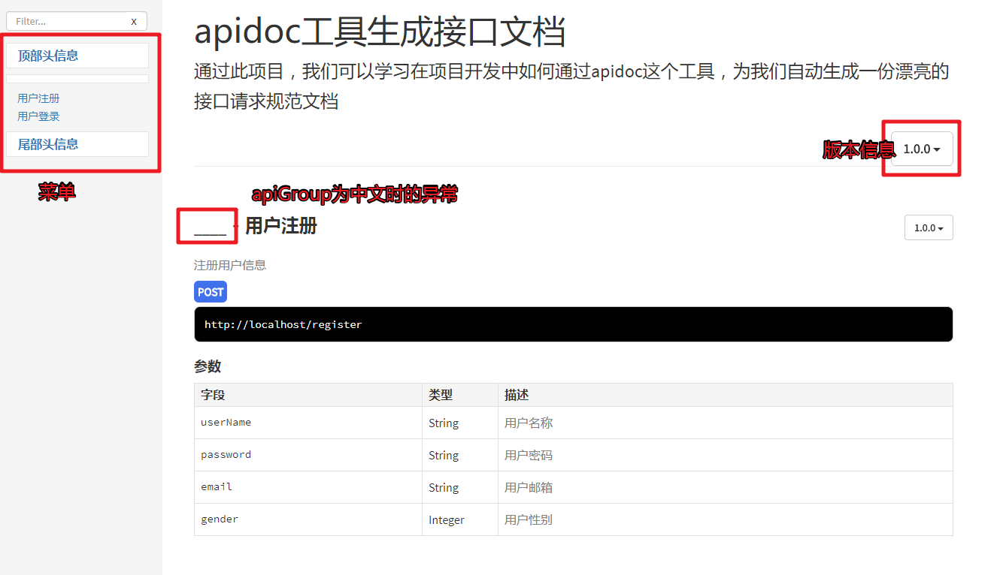
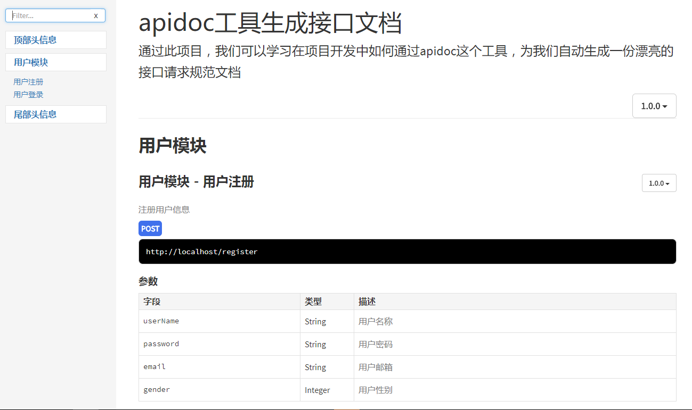
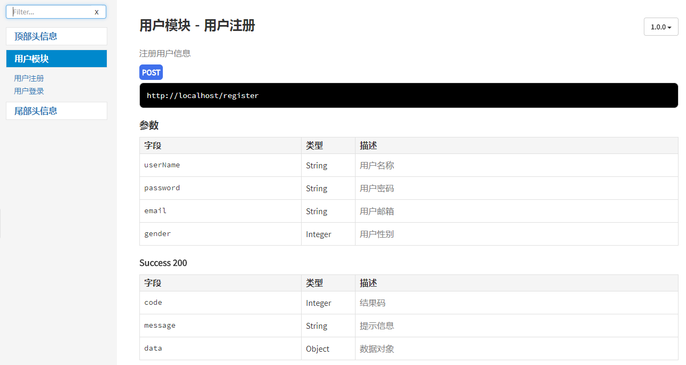
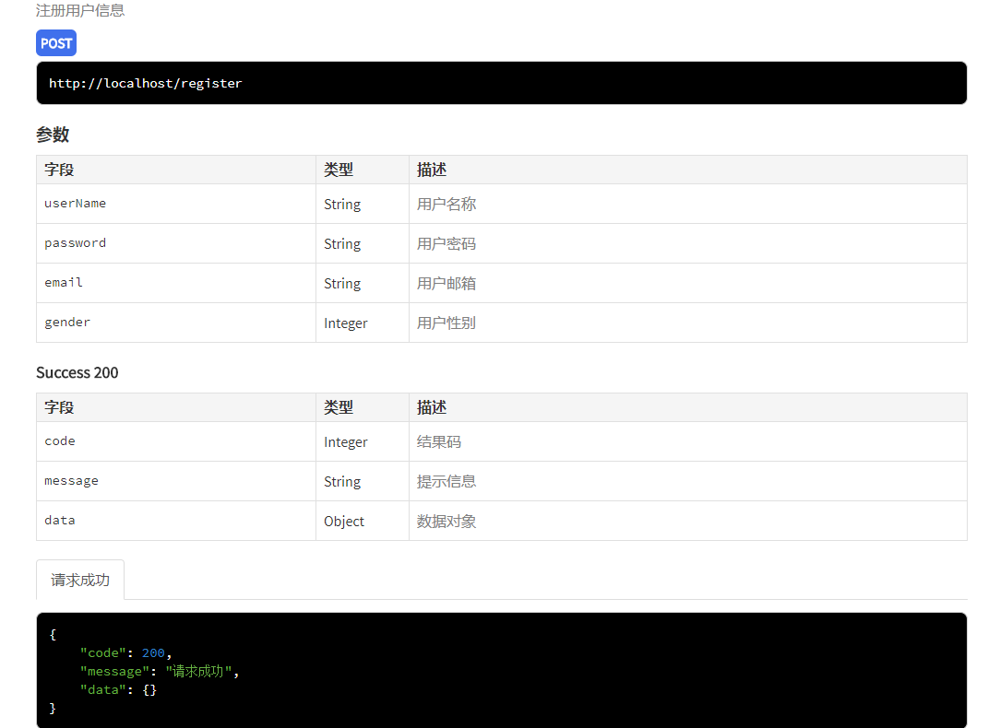
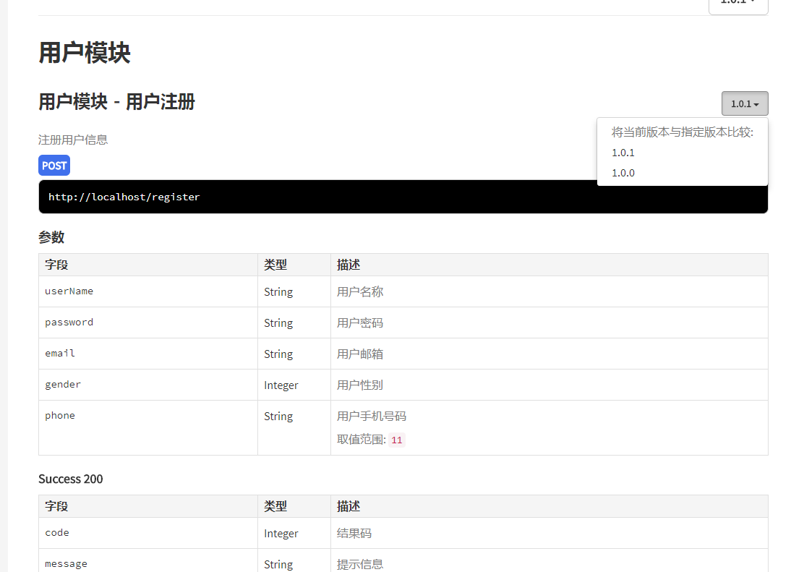
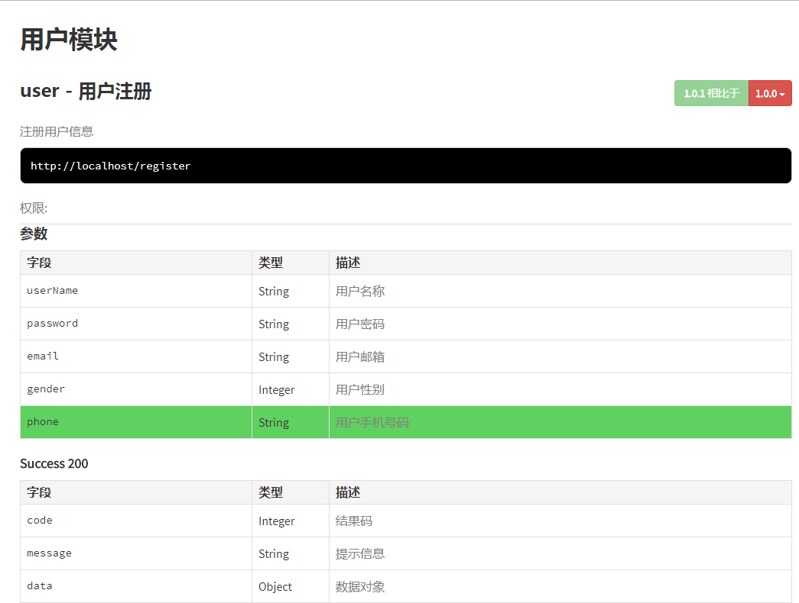

# 接口文档生成工具-APIDOC

每一个做服务端程序的程序员也许都曾有过无休止编写或修改接口请求规范文档的经历，都渴望能有这样或者那样的工具帮助我们自动生成一份漂亮的接口请求规范文档。在我没有用这些工具之前，我也是老老实实一个字一个字的编写接口请求访问规范文档；从最初的用word文档编写，再到用markdown语法编写；使用word文档编写调整文档格式及生成漂亮的代码示例都很麻烦，用markdown语法编写，不管是格式和还是美观，我认为都是在word编写的文档之上；之后也就有一段时间一直是用markdown编写的接口请求规范文档。直到后来，有听同学问到是否有自动生成接口文档的工具，我才突然想到为什么没有在网上找找这种类似的工具。

网上确实有很多这种类似的工具，比如：swagger，blueprint，yaml，apidoc等等，一找一大堆。之前也简单的用过swagger，确实相对自己手工编写要方便很多，只需要在代码里面简单的配置，在相应的接口上添加swagger定义的注解就可以生成很漂亮的接口文档，并可以提供接口测试，但是我认为有一点不好的是：代码侵入性太强，由于swagger是直接通过java注解实现的，要生成文档必须在controller层的每个接口方法上添加必要的注解，这样会导致生成文档的注解代码和原本的业务实现耦合在一起了；所以我认为这一点上不太优雅。

apidoc是最近找到的一个文档生成工具：
**优点：**

- 生成文档的代码可以防止单独的文件中，可以和原本业务代码完美的解耦；
- 支持文档的版本化，并且可以直接对比各个不同版本之间，接口文档之间的具体变化，相当于可以记住历史；
- 界面简洁漂亮。

**缺点：**

- js实现的框架，必须通过nodejs工具生成文档；
- 需根据其定义规范额外的编写接口请求文档，有一点点维护成本。

下面我将一步步介绍如何使用apidoc这个工具。

## 一、环境准备安装

正如前文所说，apidoc是一个js框架，可以借助nodejs的包管理工具来安装，首先下载[nodejs](https://nodejs.org/en/)并安装，安装成功之后，打开命令行输入npm命令看到如下信息表示nodejs已经安装成功。



nodejs安装成功之后，我们就可以直接通过npm工具安装apidoc了，在命令行输入如下命令来安装apidoc环境：

```
npm install apidoc -g
```

输入如下命令检查apidoc安装是否成功：

```
apidoc -h
```




## 二、使用

apidoc是通过读取特定目录下指定文件的内容自动生成的文档；根据开发语言的不同，读取文件中注释格式的内容，其中注释内容需使用apidoc指定的标记注解来定义接口文档内容。例如：

Java语言会读取文件中如下注解格式的内容来生成文档：

```java
/**
 * This is a comment.
 */
```

python语言会读取文件中如下注解格式的内容来生成文档：

```python
"""
This is a comment.
"""
```

下面，我将以javaweb项目为例，讲解apidoc的使用。

### 2.1 新建项目

首先，我们新建一个javaweb项目，我给这个项目取名：apidoc-study；创建完项目之后，我们需要说明这个项目的一些基本信息；那我们就可以通过apidoc提供的项目级配置文件（**apidoc.json**）来配置项目的这些信息；此文件可配置内容包括：项目名称、项目当前版本、项目描述等等信息；我们可以通过配置这个文件内容，来设置我们整个项目的基本信息；文件的具体内容如下：

```json
{
  "name": "apidoc工具生成接口文档",
  "version": "1.0.0",
  "description": "通过此项目，我们可以学习在项目开发中如何通过apidoc这个工具，为我们自动生成一份漂亮的接口请求规范文档",
  "title": "apidoc工具生成接口文档",
  "url" : "http://localhost",
  
  "header" : {
  	"title" : "顶部头信息",
  	"filename" : "header.md"
  },
  
  "footer" : {
  	"title" : "尾部头信息",
  	"filename" : "footer.md"
  },
  
  "order" : [],
  
  "template" : {
  	"withCompare" : true,
  	"withGenerator" : true
  }
}
```

各个配置项的具体意义，可参考apidoc的[官方文档](http://apidocjs.com/)。

### 2.2 配置接口

因为apidoc-study项目只是用来说明apidoc这个工具的使用，所以我代码里面不会去实现具体的代码，只以接口来进行说明。现在我已用户注册、登录接口为例来讲解。

首先，我们完成用户注册和登录的接口代码，代码放置在controller层中，如下：

```java
package com.shell.apidoc.controller;

public interface UserController {
	/**用户注册接口，用户注册假设我们需要用户名称、密码、邮箱、性别这几个字段信息，我们规定它的请求方式是POST*/
	Object register();
	/**用户登录，我们需要用户名称、密码和验证码，我们规定它的请求方式为POST*/
	Object login();
}

```

好了，针对上面这样的两个接口，那么如果用apidoc来生成文档，我们需要怎么做呢。

首先，新建一个文件：UserApiDoc.java，此文件的内容就是接口文档的内容，我们先生成一个最简单的接口文档，文档内容只包含：接口名字、接口描述、接口的请求方式及请求参数这些基本的信息，生成这样一份接口文档，我们需要哪些配置呢，内容如下：

```Java
/**
 * @api {post} /register 用户注册
 * @apiVersion 1.0.0
 * @apiGroup 用户模块
 * @apiDescription 注册用户信息
 * 
 * @apiParam {String} userName 用户名称
 * @apiParam {String} password 用户密码
 * @apiParam {String} email 用户邮箱
 * @apiParam {Integer} gender 用户性别
 */
 
 /**
 * @api {post} /login 用户登录
 * @apiVersion 1.0.0
 * @apiGroup 用户模块
 * @apiDescription 用户登录
 * 
 * @apiParam {String} userName 用户名称
 * @apiParam {String} password 用户密码
 * @apiParam {String} verifiedCode 验证码
 */
```

将上面内容拷贝到UserApiDoc.java文件中，在apidoc-study项目所在的同级目标打开命令行窗口，输入如下命令：

```
apidoc -i apidoc-study/ -o apidoc/ -f ".java$"
```

其中，``-i``参数的值指定输入目录(这里就是我们的项目所在目录)，``-o``参数的值指定生成的接口文档输出目录位置(这里我们输出的目录为项目同级目录下的apidoc目录)，``-f``参数的值指定apidoc解析读取的文件名格式(这里指定读取扩展名为api的文件)。运行命令后，输出：``info:Done.``表示生成文档成功，输出目录内容结构如下：



用浏览器打开index.html文件如下：



至此，我们已经看到通过apidoc工具生成的接口文档内容，但是我们发现用户注册头和左侧菜单有些空白，这是因为使用**@apiGroup**语法时，对中文支持的bug，我们可以将UserApiDoc.java文件内容修改如下来修改这个bug：

```Java
/**
 * @apiDefine user
 * 用户模块
 */
/**
 * @api {post} /register 用户注册
 * @apiVersion 1.0.0
 * @apiGroup user
 * @apiDescription 注册用户信息
 * 
 * @apiParam {String} userName 用户名称
 * @apiParam {String} password 用户密码
 * @apiParam {String} email 用户邮箱
 * @apiParam {Integer} gender 用户性别
 */
 
/**
 * @api {post} /login 用户登录
 * @apiVersion 1.0.0
 * @apiGroup user
 * @apiDescription 用户登录
 * 
 * @apiParam {String} userName 用户名称
 * @apiParam {String} password 用户密码
 * @apiParam {String} verifiedCode 验证码
 */
```

使用**@apiDefine**预定义语法，将==用户模块==通过==user==来定义，而在**@apiGroup**中直接使用==user==来指向，修改文件内容之后，重新运行命令：``apidoc -i apidoc-study/ -o apidoc/ -f ".java$"``，修改后的效果如下：



至此，一份简单的接口文档内容结构已经齐全，下面我对上面用到的一些关键语法进行解释说明：

#### @api

语法：``@api {method} path [title]``

必选字段，如果注释块没有提供这个字段，那么apidoc转换器会自动将此注释块忽略掉不进行转换；apidoc会自动将这里的path值和我们在**apidoc.json文件中设置的url属性值**拼接起来形成完整的api请求路径。

举例：

```Java
/**
 * @api {post} /register 用户注册
 */
```

#### @apiGroup

语法：``@apiGroup name``

必选字段，用于将接口分组合，适合将不同的接口分模块组织起来，这样便于使用者清晰的定位。

举例：

```Java
/**
 * @api {post} /register 用户注册
 * @apiGroup user
 */
```


#### @apiDescription

语法：``@apiDescription text``

描述接口的详细作用。

举例：

```json
/**
 * @api {post} /register 用户注册
 * @apiGroup user
 * @apiDescription 注册用户信息
 */
```

#### @apiParam

语法：``@apiParam [(group)] [{type}] [field=defaultValue] [description]``

描述接口的请求参数。

举例：

```java
/**
 * @api {post} /register 用户注册
 * @apiParam {String{4..8}} userName 用户名称，表示限定长度4～8位
 * @apiParam {String} password 用户密码
 * @apiParam {String} [email] 用户邮箱，尖括号表示此参数可选
 * @apiParam {Integer} gender=1 用户性别，表示默认值为1
 */
```

至此，我们目前用到的关于apidoc生成接口文档的语法已经介绍完毕。那么如果我们想要我们生成的文档内容更加丰富些，apidoc工具还有哪些其他支持呢？答案是：有，apidoc还支持返回结果实例、返回参数解释、在线接口测试等等诸多功能。

### 2.3 返回结果

几乎所有的请求接口都是有返回结果数据，不管是文本数据还是二进制数据，那么在apidoc里面，我们怎么表示返回结果呢。配置如下：

```Java
/**
 * @apiDefine user
 * 用户模块
 */
/**
 * @api {post} /register 用户注册
 * @apiVersion 1.0.0
 * @apiGroup user
 * @apiDescription 注册用户信息
 * 
 * @apiParam {String} userName 用户名称
 * @apiParam {String} password 用户密码
 * @apiParam {String} email 用户邮箱
 * @apiParam {Integer} gender 用户性别
 * 
 * @apiSuccess {Integer} code 结果码
 * @apiSuccess {String}	message 提示信息
 * @apiSuccess {Object} data 数据对象
 */
 
/**
 * @api {post} /login 用户登录
 * @apiVersion 1.0.0
 * @apiGroup user
 * @apiDescription 用户登录
 * 
 * @apiParam {String} userName 用户名称
 * @apiParam {String} password 用户密码
 * @apiParam {String} verifiedCode 验证码
 
 * @apiSuccess {Integer} code 结果码
 * @apiSuccess {String}	message 提示信息
 * @apiSuccess {Object} data 数据对象
 */
```

上面配置，对应的生成文档内容如下：



如果我们需要为返回结果进行实例，我们可以修改内容如下：

```Java
/**
 * @apiDefine user
 * 用户模块
 */
/**
 * @api {post} /register 用户注册
 * @apiVersion 1.0.0
 * @apiGroup user
 * @apiDescription 注册用户信息
 * 
 * @apiParam {String} userName 用户名称
 * @apiParam {String} password 用户密码
 * @apiParam {String} email 用户邮箱
 * @apiParam {Integer} gender 用户性别
 * 
 * @apiSuccess {Integer} code 结果码
 * @apiSuccess {String}	message 提示信息
 * @apiSuccess {Object} data 数据对象
 *
 * @apiSuccessExample {json} 请求成功
 *     {
 *         "code": 200,
 *         "message": "请求成功",
 *         "data": {}
 *     }
 */
 
/**
 * @api {post} /login 用户登录
 * @apiVersion 1.0.0
 * @apiGroup user
 * @apiDescription 用户登录
 * 
 * @apiParam {String} userName 用户名称
 * @apiParam {String} password 用户密码
 * @apiParam {String} verifiedCode 验证码
 
 * @apiSuccess {Integer} code 结果码
 * @apiSuccess {String}	message 提示信息
 * @apiSuccess {Object} data 数据对象
 *
 * @apiSuccessExample {json} 请求成功
 *     {
 *         "code": 200,
 *         "message": "请求成功",
 *         "data": {}
 *     }
 */
```

修改之后的效果如下：



如果我们想要为每个接口添加在线测试地方，那么我们可以做如下修改：

```java
/**
 * @apiDefine user
 * 用户模块
 */
/**
 * @api {post} /register 用户注册
 * @apiVersion 1.0.0
 * @apiGroup user
 * @apiDescription 注册用户信息
 * 
 * @apiParam {String} userName 用户名称
 * @apiParam {String} password 用户密码
 * @apiParam {String} email 用户邮箱
 * @apiParam {Integer} gender 用户性别
 * 
 * @apiSuccess {Integer} code 结果码
 * @apiSuccess {String}	message 提示信息
 * @apiSuccess {Object} data 数据对象
 *
 * @apiSuccessExample {json} 请求成功
 *     {
 *         "code": 200,
 *         "message": "请求成功",
 *         "data": {}
 *     }
 *
 * @apiSampleRequest /register
 */
 
/**
 * @api {post} /login 用户登录
 * @apiVersion 1.0.0
 * @apiGroup user
 * @apiDescription 用户登录
 * 
 * @apiParam {String} userName 用户名称
 * @apiParam {String} password 用户密码
 * @apiParam {String} verifiedCode 验证码
 
 * @apiSuccess {Integer} code 结果码
 * @apiSuccess {String}	message 提示信息
 * @apiSuccess {Object} data 数据对象
 *
 * @apiSuccessExample {json} 请求成功
 *     {
 *         "code": 200,
 *         "message": "请求成功",
 *         "data": {}
 *     }
 *
 * @apiSampleRequest /login
 */
```

修改之后的效果如下：


下面对我们用到的关键字进行解释说明：

#### @apiSuccess

语法：``@apiSuccess [(group)] [{type}] field [description]``

请求成功后，返回的字段及其类型和描述。在apidoc中有对应的请求失败后的语法，@apiError

举例：

```Java
/**
 * @apiSuccess {Integer} code 结果码
 */
```

#### @apiSuccessExample

语法：``@apiSuccessExample [{type}][title] example``

请求成功返回的结果示例。对应的也有@apiErrorExample用于请求失败的结果示例

举例：

```Java
/**
 * @apiSuccessExample {json} 请求成功
 *     {
 *         "code": 200,
 *         "message": "请求成功",
 *         "data": {}
 *     }
 */
```

#### @apiSampleRequest

语法：``@apiSampleRequest url``

在生成的接口文档中，生成一个测试接口的表单。注意这里url要和apidoc.json文件中的**sampleUrl属性**（在本文档例子中没有添加这个属性，你可以自行配置添加）配合使用，如果我们在测试接口时，找不到对应的请求接口，多半是因为这两个配置没有配置好。

举例：

```java
/**
 * @apiSampleRequest /register
 */
```

### 2.4 版本比对

apidoc提供了一个非常酷炫的功能，就是不同版本之间接口的变化比对，这功能通过@apiVersion这个配置来实现。

#### @apiVersion

语法：``@apiVersion version``

用于说明当前接口的版本，在做历史版本比对时非常有用。

举例：

```Java
/**
 * @api {post} /register 用户注册
 * @apiGroup user
 * @apiDescription 注册用户信息
 * @apiVersion 1.0.0
 */
```

假设现在我们的用户注册接口发生了变化，需要用户再提供手机号码，那么我们可以针对用户注册接口升级一个版本；原来之前的版本配置我们需要保留，不能删，我们可以在现有的文件中新增也可以新建一个文件；我这里直接在现有文件中新增，内容如下：

```Java
/**
 * @apiDefine user 
 * 用户模块
 */
 
/**
 * @api {post} /register 用户注册
 * @apiVersion 1.0.1
 * @apiGroup user
 * @apiDescription 注册用户信息
 * 
 * @apiParam {String} userName 用户名称
 * @apiParam {String} password 用户密码
 * @apiParam {String} email 用户邮箱
 * @apiParam {Integer} gender 用户性别
 * @apiParam {String{11}} phone 用户手机号码
 * 
 * @apiSuccess {Integer} code 结果码
 * @apiSuccess {String}	message 提示信息
 * @apiSuccess {Object} data 数据对象
 *
 * @apiSuccessExample {json} 请求成功
 *     {
 *         "code": 200,
 *         "message": "请求成功",
 *         "data": {}
 *     }
 *
 * @apiSampleRequest /register
 */
 
/**
 * @api {post} /register 用户注册
 * @apiVersion 1.0.0
 * @apiGroup user
 * @apiDescription 注册用户信息
 * 
 * @apiParam {String} userName 用户名称
 * @apiParam {String} password 用户密码
 * @apiParam {String} email 用户邮箱
 * @apiParam {Integer} gender 用户性别
 * 
 * @apiSuccess {Integer} code 结果码
 * @apiSuccess {String}	message 提示信息
 * @apiSuccess {Object} data 数据对象
 *
 * @apiSuccessExample {json} 请求成功
 *     {
 *         "code": 200,
 *         "message": "请求成功",
 *         "data": {}
 *     }
 *
 * @apiSampleRequest /register
 */
 
/**
 * @api {post} /login 用户登录
 * @apiVersion 1.0.0
 * @apiGroup user
 * @apiDescription 用户登录
 * 
 * @apiParam {String} userName 用户名称
 * @apiParam {String} password 用户密码
 * @apiParam {String} verifiedCode 验证码
 
 * @apiSuccess {Integer} code 结果码
 * @apiSuccess {String}	message 提示信息
 * @apiSuccess {Object} data 数据对象
 *
 * @apiSuccessExample {json} 请求成功
 *     {
 *         "code": 200,
 *         "message": "请求成功",
 *         "data": {}
 *     }
 *
 * @apiSampleRequest /login
 */
```

同时，将apidoc.json配置文件中的**version**属性值修改到当前版本，生成的文档效果如下：



比对的效果如下：



综上，apidoc比较有用的特色已经介绍完毕。还有其他配置可[参考官方文档](http://apidocjs.com/)。