##Git命令

### 一、Git的基本常用命令

#### 仓库的创建和获取

git提供了两种创建仓库的方式，分别如下。

> init命令

创建一个新的项目或在已有的项目路径下，打开git bash命令行窗口，输入如下命令：

``````shell
git init
``````

即表示在当前目录中创建了仓库，会在当前文件夹下新建一个`.git`目录，用于存放所有版本管理相关的文件和数据等；再通过`git add <file>`和`git commit -m 'message'`接口添加和提交文件到创建的仓库中。


> clone命令

`git init`命令是直接在本地新建仓库，那么如果我们要将远程或者公司内部git仓库拷贝一个仓库到本地，又应该怎么办？如下命令：

``````shell
git clone <url>
``````

就是做这件事情的，它以指定url的方式将指定的远程仓库完全拷贝到本地。例如：在命令行中执行如下命令：

``````shell
git clone https://github.com/alibaba/easyexcel.git
``````

将从github上将easyexcel这个仓库下载拷贝到当前目录的easyexcel目录中，如果你想将其放在当前目录的其他目录中，则可以执行：

``````shell
git clone https://github.com/alibaba/easyexcel.git myeasyexcel
``````

这个命令，将会把远程的easyexcel目录中的文件拷贝到当前目录的myeasyexcel文件夹中。

#### 将修改记录到仓库中

首先，git针对工作的目录中的文件，有几种状态区分，如下图：

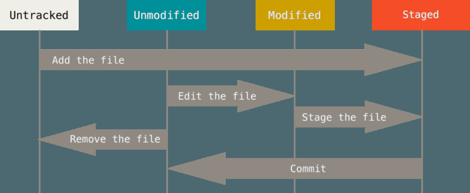

工作目录中的所有文件被分为两大类：*tracked*和*untracked*：

- tracked：表示文件已经被git管理跟踪起来的文件，他们可以是unmodified、modified和staged，简而言之就是git知道这些文件的存在；
- untracked：表示git不知道的，简单理解就是刚刚新创建的文件且还没有被add或commit的文件；


> status命令

作用：跟踪当前工作目录下，各个文件当前的状态；

通过执行：

``````shell
git status
``````

我们可以知道哪些文件是untracked，哪些tracked的文件modified过，哪些被add了，当前可以commit的是哪些文件等。

``````shell
$ git status
On branch master
Changes to be committed:
  (use "git reset HEAD <file>..." to unstage)

        modified:   README.md

Changes not staged for commit:
  (use "git add <file>..." to update what will be committed)
  (use "git checkout -- <file>..." to discard changes in working directory)

        modified:   LISENCE

Untracked files:
  (use "git add <file>..." to include in what will be committed)

        config
``````

上面是在某些操作之后执行status命令之后的结果，其中Changes to be committed：列表展示的是文件有修改了的，且通过执行add命令将文件提交到staged区的文件；而Changes not staged for commit：列表展示的是文件有修改的，但是还没有执行add命令将文件提交到staged区的文件；Untracked files：列表则展示的是新创建的文件，且还没有执行add命令将文件交给git管理的，如果执行git add config命令，那么config将会加到Changes to be commited：列表下去，如下：

``````shell
On branch master
Changes to be committed:
  (use "git reset HEAD <file>..." to unstage)

        modified:   README.md
        new file:   config

Changes not staged for commit:
  (use "git add <file>..." to update what will be committed)
  (use "git checkout -- <file>..." to discard changes in working directory)

        modified:   LISENCE
``````

status命令默认输出的信息是完整的，如果我们只想看简单的状态信息可以在status命令后增加-s或--short参数，如下：

``````shell
$ git status -s
 M LISENCE
M  README.md
A  config
``````


> add命令

作用：将新建文件或者是修改过的文件加入到staged区

``````shell
git add file
``````

在我们修改一个tracked文件或者是新建一个文件后，我们可以通过上述命令，将新增的或者是修改后的文件提交到staged区；注意此时文件还只是在staged区，并没有被提交到仓库中。执行了add命令的文件，在status命令的结果中，将被列在Changes to be committed的列表中。

如果我们一次性有很多文件要add，很显然一个一个的add是非常麻烦且耗时的，add提供了命令参数-A可以让我们一次性将所有修改过和新建的文件提交到staged区，如下：

``````shell
git add -A
``````


> .gitignore文件

作用：指定哪些文件是需要git忽略的

我们在使用某些构建工具时，会自动在我们的工作目录下创建一些文件或者文件夹，比如maven会自动创建target目录；那么我们在使用git时，如何自动忽略掉这些文件呢？在工作目录下创建一个.gitignore文件，在文件中指定要忽略的文件列表即可；比如：

``````
$ cat .gitignore
*.[oa]
*~
``````

会忽略以.o或者.a结尾的文件，以及忽略以～结尾的文件，.gitignore文件中支持正则表达式。

.gitignore忽略规则简单说明：

```properties
#               表示此为注释,将被Git忽略
*.a             表示忽略所有 .a 结尾的文件
!lib.a          表示但lib.a除外
/TODO           表示仅仅忽略项目根目录下的 TODO 文件，不包括 subdir/TODO
build/          表示忽略 build/目录下的所有文件，过滤整个build文件夹；
doc/*.txt       表示会忽略doc/notes.txt但不包括 doc/server/arch.txt
 
bin/:           表示忽略当前路径下的bin文件夹，该文件夹下的所有内容都会被忽略，不忽略 bin 文件
/bin:           表示忽略根目录下的bin文件
/*.c:           表示忽略cat.c，不忽略 build/cat.c
debug/*.obj:    表示忽略debug/io.obj，不忽略 debug/common/io.obj和tools/debug/io.obj
**/foo:         表示忽略/foo,a/foo,a/b/foo等
a/**/b:         表示忽略a/b, a/x/b,a/x/y/b等
!/bin/run.sh    表示不忽略bin目录下的run.sh文件
*.log:          表示忽略所有 .log 文件
config.php:     表示忽略当前路径的 config.php 文件
 
/mtk/           表示过滤整个文件夹
*.zip           表示过滤所有.zip文件
/mtk/do.c       表示过滤某个具体文件
 
被过滤掉的文件就不会出现在git仓库中（gitlab或github）了，当然本地库中还有，只是push的时候不会上传。
 
需要注意的是，gitignore还可以指定要将哪些文件添加到版本管理中，如下：
!*.zip
!/mtk/one.txt
 
唯一的区别就是规则开头多了一个感叹号，Git会将满足这类规则的文件添加到版本管理中。为什么要有两种规则呢？
想象一个场景：假如我们只需要管理/mtk/目录中的one.txt文件，这个目录中的其他文件都不需要管理，那么.gitignore规则应写为：：
/mtk/*
!/mtk/one.txt
 
假设我们只有过滤规则，而没有添加规则，那么我们就需要把/mtk/目录下除了one.txt以外的所有文件都写出来！
注意上面的/mtk/*不能写为/mtk/，否则父目录被前面的规则排除掉了，one.txt文件虽然加了!过滤规则，也不会生效！
 
----------------------------------------------------------------------------------
还有一些规则如下：
fd1/*
说明：忽略目录 fd1 下的全部内容；注意，不管是根目录下的 /fd1/ 目录，还是某个子目录 /child/fd1/ 目录，都会被忽略；
 
/fd1/*
说明：忽略根目录下的 /fd1/ 目录的全部内容；
 
/*
!.gitignore
!/fw/ 
/fw/*
!/fw/bin/
!/fw/sf/
说明：忽略全部内容，但是不忽略 .gitignore 文件、根目录下的 /fw/bin/ 和 /fw/sf/ 目录；注意要先对bin/的父目录使用!规则，使其不被排除。
```


> diff命令

作用：比较版本之间的变化。

当我们修改了某些文件或者add了一些文件之后，我们想查看这一次做了哪些改变，status命令只能告诉我们哪些文件有变化，但是具体改变的内容并不知道，所以git提供diff命令供我们查看具体的改变内容。

``````shell
git diff
``````

比较工作目录中的文件与staged区的文件，并列出改变的内容；

``````shell
git diff --staged
``````

比较staged区的文件与仓库中的文件，并列出改变内容。


> commit命令

作用：将staged区的文件提交到仓库。

在我们将文件add到staged区之后，文件并没有提交到仓库，我们还需要执行commit命令将staged区的文件提交到仓库中；注意：commit提交的只是staged区的内容，也就是说如果你在最后一次add命令之后，还修改了文件且没有add到staged区，那么commit的时候并不会把你最后的修改提交。

``````shell
git commit -m '提交注释'
``````

有时我们不想add之后在commit，因为感觉这样麻烦，那么我们可以执行：

``````shell
git commit -a -m '提交注释'
``````

上面这个命令会将所有的修改直接提交到仓库，而不需要执行add命令；但是不建议直接这样做。


> rm命令

作用：移除文件，将文件从工作目录和staged区删除

有时，我们可能需要删除某些文件，那么我们可以执行：

``````shell
git rm file
``````

执行这个命令之后，会将file从工作目录和staged区同时删除，然后我们再执行commit命令即可从仓库中将指定文件删除；有时，我们想继续将文件保留在工作目录，只想将文件从staged区删除，那么我们可以执行如下命令

``````shell
git rm --cached file
``````


> mv命令

作用：移动或者重命名文件

``````shell
git mv file_from file_to
``````

这等价于下面三条命令：

``````shell
mv file_from file_to
git rm file_from
git add file_to
``````


####查看提交历史命令

> log命令

作用：查看所有的提交历史记录信息

我们将文件提交到git仓库之后，随着时间的过去和提交次数变多，我们想查看之前每次提交时所做的改变，那么log命令就很有用了，它可以让你查看你的所有提交记录，执行：

``````shell
git log
``````

执行这个命令之后，会以分页的方式将所有的提交历史信息显示出来；log命令提供了很多的参数让我们可以过滤出我们想关注和查看的指定提交，比如：

``````shell
git log -p
``````

列出每次提交具体修改的内容信息；

``````shell
git log -2
``````

列出最近的2次提交信息，2可以换成任意正整数；

``````shell
git log -stat
``````

列出每次提交的简要信息，比如修改了哪个文件，哪个文件增加了多少，删除了多少行等信息；

``````shell
git log --pretty=oneline
``````

将每次的提交信息美化之后打印出来，提供了不同的值：short、full、fuller，提供了一个强大的format值，可以按照指定的格式输出信息：

``````shell
git log --pretty=format:"%h - %an, %ar : %s"
``````

format选项值：

| Option | Description of Output                           |
| ------ | ----------------------------------------------- |
| %H     | Commit hash                                     |
| %h     | Abbreviated commit hash                         |
| %T     | Tree hash                                       |
| %t     | Abbreviated tree hash                           |
| %P     | Parent hashes                                   |
| %p     | Abbreviated parent hashes                       |
| %an    | Author name                                     |
| %ae    | Author email                                    |
| %ad    | Author date (format respects the --date=option) |
| %ar    | Author date, relative                           |
| %cn    | Committer name                                  |
| %ce    | Committer email                                 |
| %cd    | Committer date                                  |
| %cr    | Committer date, relative                        |
| %s     | Subject                                         |

log的常用参数选项：

| Option          | Description                                                  |
| --------------- | ------------------------------------------------------------ |
| -p              | Show the patch introduced with each commit.                  |
| --stat          | Show statistics for files modified in each commit.           |
| --shortstat     | Display only the changed/insertions/deletions line from the --stat command. |
| --name-only     | Show the list of files modified after the commit information. |
| --name-status   | Show the list of files affected with added/modified/deleted information as well. |
| --abbrev-commit | Show only the first few characters of the SHA-1 checksum instead of all 40. |
| --relative-date | Display the date in a relative format (for example, “2 weeks ago”) instead of using the full date format. |
| --graph         | Display an ASCII graph of the branch and merge history beside the log output. |
| --pretty        | Show commits in an alternate format. Options include oneline, short, full, fuller, and format (where you specify your own format). |
| --oneline       | Shorthand for --pretty=oneline --abbrev-commit used together. |

**限制log命令的输出**

| Option            | Description                                                  |
| ----------------- | ------------------------------------------------------------ |
| -\<n>             | Show only the last n commits                                 |
| --since, --after  | Limit the commits to those made after the specified date.    |
| --until, --before | Limit the commits to those made before the specified date.   |
| --author          | Only show commits in which the author entry matches the specified string. |
| --committer       | Only show commits in which the committer entry matches the specified string. |
| --grep            | Only show commits with a commit message containing the string |
| -S                | Only show commits adding or removing code matching the string |

``````shell
git log -3 # 显示最近3此的提交信息
git log --since=2.weeks # 显示最近两个星期的提交记录
git log --since="2018-01-01" #显示从2018-01-01日以来的提交记录
git log --since="2 years 1 day 3 minutes ago" #显示从2年一天3分钟之前以来的提交记录
git log -S "sayHello" #显示修改内容包含sayHello字符的提交记录
``````

所有的这些命令参数可以联合一起使用

``````shell
git log --pretty="%h - %s" --author='Junio C Hamano' --since="2008-10-01" \
 --before="2008-11-01" --no-merges -- t/
``````

两个中划线(--)指定文件夹或者文件名字，这个命令参数必须放在最后面。


#### 撤销修改命令

> reset命令

作用：重置某个文件的状态，或者说将某个文件从stage区重置为unstaged状态

某些情况下，我们将一个修改了的，但是不还不想提交到stage区域的文件add到了stage区域，我们可以通过reset命令来讲这个文件从stage区域清楚，让其返回到unstaged的状态，执行：

``````shell
git reset HEAD file
``````


> checkout命令

作用：将修改的文件恢复到上一次的状态

我们修改了一个文件之后，没有提交到stage区域，如果在这个时候要将这些修改清除，那么可以执行：

``````shell
git checkout -- file
``````


#### 远程仓库命令

> remote命令

作用：查看你配置的远程仓库服务器地址

``````shell
git remote
``````

显示你配置的远程仓库服务器在你本地的简称

``````shell
git remote -v
``````

显示远程仓库的简称和对应的服务器仓库地址路径

``````shell
git remote add <shortname> <url>
``````

添加一个远程仓库地址路径url，并制定一个简称名字shortname


> fetch|pull命令

作用：将远程仓库更新下载到本地

区别：

fetch：只下载到本地，不会自动合并到你的工作目录

pull：下载到本地之后，会自动合并到你的工作目录

``````shell
git fetch <remote-shortname>
``````


> push命令

作用：将你本地仓库或者修改推送到远程仓库

``````shell
git push <remote> <branch>
``````


**查看远程仓库的详细信息**

``````shell
git remote show <remote-shortname>
``````

此命令会列出远程仓库的路径地址，以及远程仓库上的分支信息

 **重命名和删除远程仓库**

``````shell
git remote rename <from-remote-name> <to-remote-name>
``````

``````shell
git remote remove <remote-name>
``````


#### 标签命令

标签命令用于在发布版本时用。

git中有两种标签：

- *lightweight*: 跟分支很像，它只是指向一个特定提交点的指针
- *annotated*: 会包含标签名、邮件地址和日期等信息存在仓库数据中，常用的是这种标签。

> tag命令

``````shell
git tag
``````

列出打过的所有标签名

``````shell
git tag -l "v1.8.5*"
``````

列出匹配v1.8.5\*的所有标签


``````shell
git tag -a v1.4 -m "my version 1.4"
``````

添加一个annotated类型的标签，-m指定标签的信息

``````shell
git show v1.4
``````

显示标签v1.4的信息


``````shell
git tag v1.4-aa
``````

添加一个lightweight类型的标签

``````shell
git show v1.4-aa
``````


``````shell
git tag -a v1.2 9fceb02
``````

有时我们在某个提交完成之后会忘了打标签，但是接着又提交了多次，那么如果我们还想在之前某个提交处打标签怎么办呢？上面命令就是在指定的提交处(9fceb02：某次提交的hash码缩写值)打标签的命令

``````shell
git push <remote-name> <tagname>
``````

将我们打的某个标签信息数据提交到指定的远程仓库地址上，如果我们有很多标签信息需要一次提交到远程仓库上怎么办呢？可以执行如下命令：

``````shell
git push <remote-name> --tags
``````

上述命令会将本地仓库还没有提交的标签信息提交到远程仓库上


``````shell
git tag -d v1.4
``````

在本地仓库中删除名称为v1.4的标签

``````shell
git push <remote-name> :refs/tags/v1.4
``````

在远程仓库名字为\<remote-name>的仓库中删除名称为v1.4的标签


#### 取别名命令

有时候有些命令很长，我们输入太多字符嫌麻烦，那么我们可以按照自己的习惯给这些命令取一个简单的别名。

``````shell
git config --global alias.co checkout	# chekout命令别名为co
git config --global alias.br branch	    # brach命令别名为br
git config --global alias.ci commit     # commit命令别名为ci
git config --global alias.st status     # status命令别名为st
``````

执行完上面命令之后，如果我们要提交文件到仓库就只需执行：`git ci`即可。

### 二、分支

在理解git的分支概念之前，我们首先得知道如下内容：

Git不会将数据存储为一系列变更集或差异，而是存储为一系列快照-*snapshots*；当执行一个commit操作，git会存储一个commit对象，对象包含了一个指向你staged的内容快照的指针，包含作者的名称、右键地址以及提交注释，同时还包含一个指向前一次提交commit对象的一个指针或多个。

为了可视化这个场景，假设有一个包含三个文件的目录，你staged并commit了，在staged之后每个文件都会计算出一个验证码-checksum，存储着每个文件的版本信息(在git中他们被称作blobs对象)；当我们运行git commit之后，git计算每个子目录的checksum并且在仓库中存储一颗树，然后再创建一个commit对象和一个指向树的指针。现在，git仓库中包含有5个对象：3个blobs对象(每个代表着三个文件的内容)，一个树对象(列出每个文件目录的结构以及文件和blobs的匹配关系)，还有一个commit对象，图示如下：

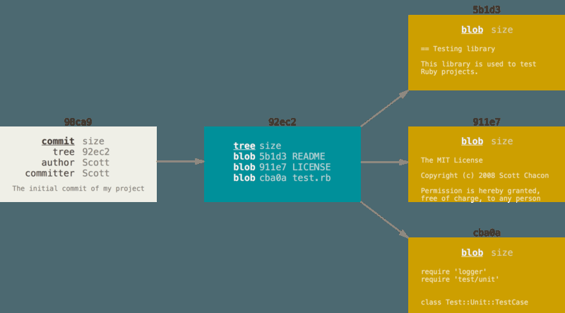

现在我们修改文件并再次提交，那么这次的commit对象会包含多一个指向上次commit对象的指针，如下图：

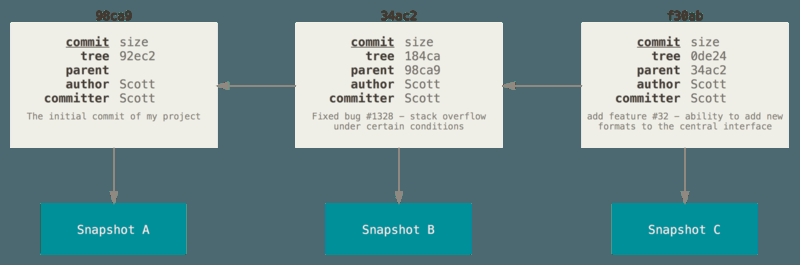

而git中的分支就是一个可移动的指针，指向这些commit中的某一个。默认的分支名字是master，当我们开始commit时，我们就是创建了一个master分支，并让master指向最新的一次commit上，这些都是git自动做的。

master分支并不是一个特别的分支，它跟其他分支一样，在用git init初始化git仓库时默认都会创建这个分支。

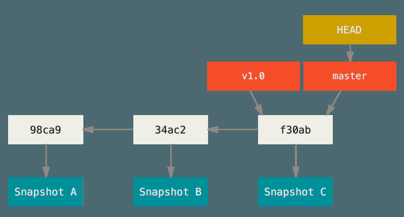

#### 创建分支

> git branch testing

作用：创建一个叫做testing的新分支，将会创建一个指针，图示如下：

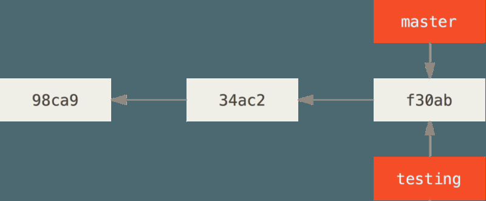

git怎么知道你现在处于哪个分支下呢？git维护了一个HEAD指针，它始终指向你当前所处的本地分支，git branch命令只是创建了一个新的分支，并不会切换到你新创建的分支，所以现在你还处在master分支上，如下图：

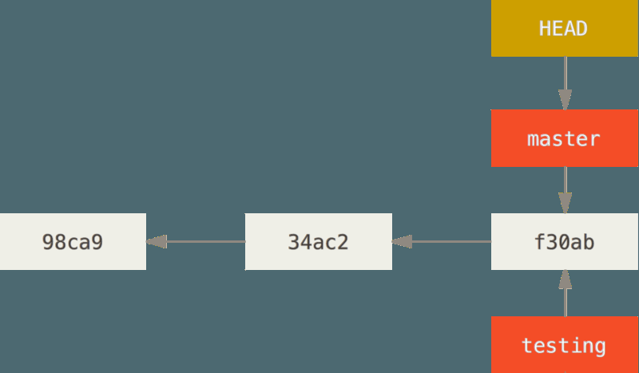

你可以通过git log命令来查看分支指针的情况，如下：

``````shell
$ git log --oneline --decorate
f30ab (HEAD -> master, testing) add feature #32 - ability to add new formats to the
central interface
34ac2 Fixed bug #1328 - stack overflow under certain conditions
98ca9 The initial commit of my project
``````

#### 切换分支

> git checkout testing

作用：切换到一个存在的分支(testing分支)，此命令会让HEAD指针指向testing分支。

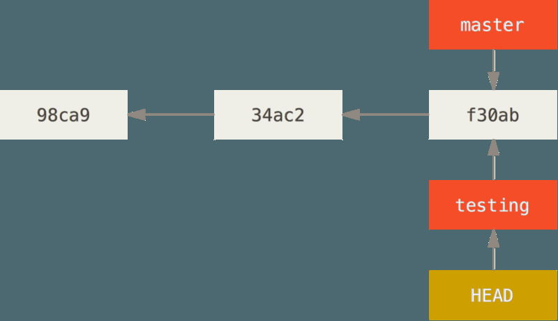

好，现在让我们做一些提交操作，看看会发生什么样的变化？执行如下操作：

``````shell
$ vim test.rb
$ git commit -a -m 'made a change'
``````

提交之后，情况如下图：

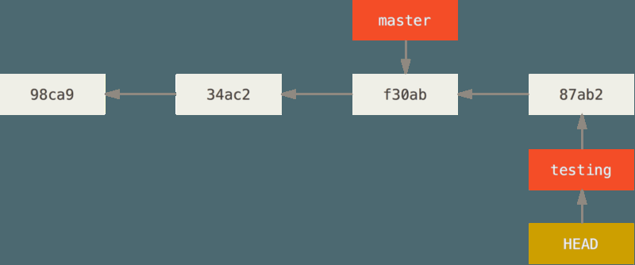

我们可以看到当前分支往前进了，而master分支依然在原来的位置没有发生变化。

现在如果切换到master分支会发生什么呢？执行如下命令切回到master分支：

``````shell
git checkout master
``````

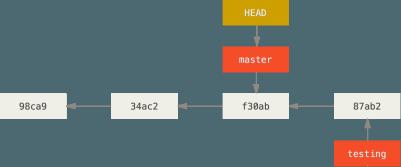

HEAD指针变成指向master分支，同时我们的工作空间目录内容会恢复到master分支时的快照版本；这也就意味着如果你现在在master再提交内容，那么你的版本就是在f30ab处发生分离。

现在让我们在master分支上也做一些提交看看会发生什么？执行如下操作：

``````shell
$ vim test.rb
$ git commit -a -m 'made other changes'
``````

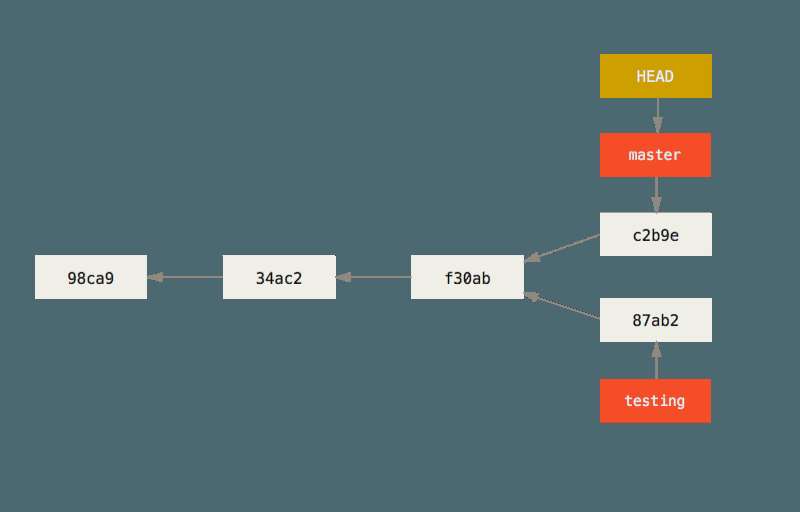

如前面说的，已经产生了两个不同内容的分支了，你可以在你以后需要的时候，将这两个分支合并。

#### 分支和合并

现在我们做一个简单的例子，来模拟真实场景中创建分支和合并分支的过程。你将执行以下操作：

1. 在当前工作空间创建一个新的分支；
2. 在新的分支上做一些工作；

此时，你收到线上提交的一个严重bug，需要立即修复，你将执行如下操作：

1. 切换到你的线上产品分支master；
2. 创建一个新的分支hotfix来修复这个bug；
3. 新的bug测试通过之后，将hotfix合并到master上。

首先，假设我们已经创建了工作项目并且在工作目录的master分支上做了一些提交，commit历史如下图：

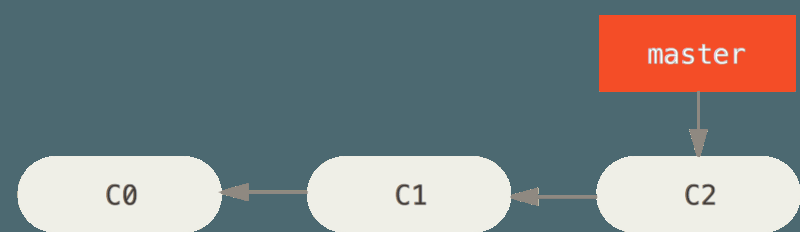

此时，我们准备完成公司缺陷跟踪系统里面的#53号bug，那么我们可以创建一个新的分支并切换到这个新的分支上，执行如下命令：

``````shell
$ git checkout -b iss53
Switched to a new branch "iss53"
``````

上面命令就是如下两个命令的合并：

``````shell
$ git branch iss53
$ git checkout iss53
``````

此时，你的分支结构如下图：

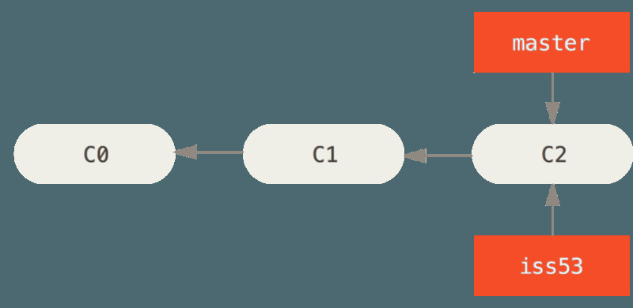

现在让我们在新建的分支iss53上做一些事情并提交：

``````shell
$ vim index.html
$ git commit -a -m 'added a new footer [issue 53]'
``````

此时，iss53分支会向前进，而master分支不变，如下图：

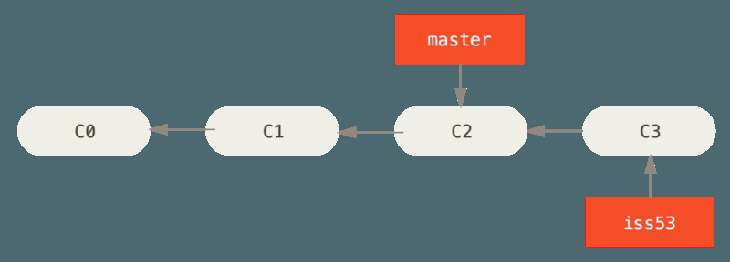

你做完这些事情之后，你收到通知线上环境出现了紧急bug需要立即修复，但是此时基于当时线上的环境你已经做了一些改变，你不可能恢复到之前的情况将你刚做的工作全部丢弃。所以为了修复这个紧急bug，你需要做的就是回到线上环境所处的代码位置，所以你必须切换到master分支上去修复这个问题。有一点需要注意的是：在你切换到master分支之前，请确保在iss53这个分支上的修改全部commit了，否则你切换的时候会有冲突git是不会让你切换成功的。

好了，现在让我们切换到master分支上去修复这个紧急bug，执行如下命令切换到master分支：

``````shell
$ git checkout master
Switched to branch 'master'
``````

此时，你的工作目录会恢复到之前master分支的最后一次提交时的状态。

接下来，让我们创建一个hotfix分支来修复这个紧急bug，执行如下命令：

``````shell
$ git checkout -b hotfix
Switched to a new branch 'hotfix'
$ vim index.html
$ git commit -a -m 'fixed the broken email address'
[hotfix 1fb7853] fixed the broken email address
 1 file changed, 2 insertions(+)
``````

当前，你的分支结构类似下图：

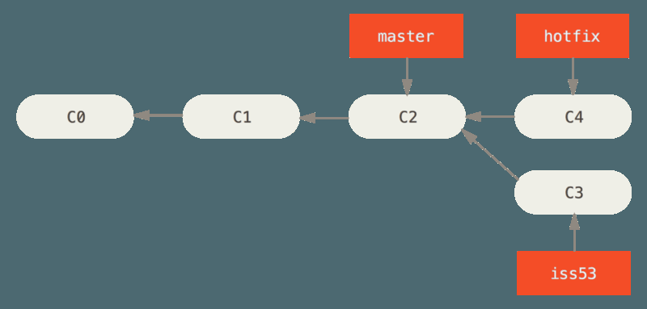

等你执行完你的测试，确保这个bug修复完成之后，你可以把hotfix这个分支合并到master上去发布到线上，你可以执行如下命令：

``````shell
$ git checkout master
$ git merge hotfix
Updating f42c576..3a0874c
Fast-forward
 index.html | 2 ++
 1 file changed, 2 insertions(+)
``````

你会发现这个合并过程是非常快速的，因为git只需简单的将master指向C2的指针指向C4即可，合并之后，你工作目录的分支结构如下图：

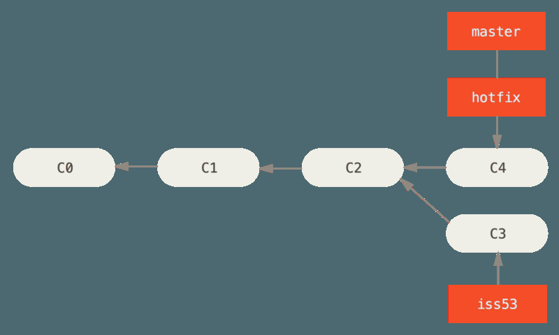

在你修复完这个紧急bug之后，你准备切换到iss53这个分支，以继续完成你之前被打断的工作；但是在你切换到iss53这个分支之前，你应该先删除hotfix这个分支，因为你已经把这个分支合并到master上了，不再需要这个分支了，你可以通过如下命令来删除hotfix分支：

``````shell
$ git branch -d hotfix
Deleted branch hotfix (3a0874c).
``````

好了，现在你可以切换会iss53这个分支了：

``````shell
$ git checkout iss53
Switched to branch "iss53"
$ vim index.html
$ git commit -a -m 'finished the new footer [issue 53]'
[iss53 ad82d7a] finished the new footer [issue 53]
1 file changed, 1 insertion(+)
``````

当前的分支结构将变成下图：

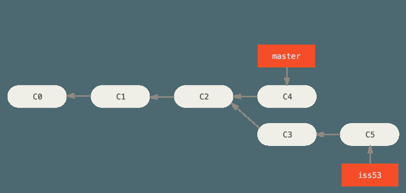

这里值得注意的是，你在hotfix分支做的事情并没有包含到iss53这个分支中，如果你需要把这些事情拉到iss53分支里面，那么你可以运行`git merge master`命令来实现；或者你可以等到你决定把iss53这个分支合并到master分支时才处理这些变化。

现在让我们将iss53分支合并到master分支上，那么我们需要先切换到master分支上，然后在执行merge命令，过程如下：

``````shell
$ git checkout master
Switched to branch 'master'
$ git merge iss53
Merge made by the 'recursive' strategy.
index.html | 1 +
1 file changed, 1 insertion(+)
``````

此处的merge命令就不会跟合并hotfix分支到master分支上那么简单了，此时git会新创建一个commit对象，分别指向3个合并线，具体如下图：

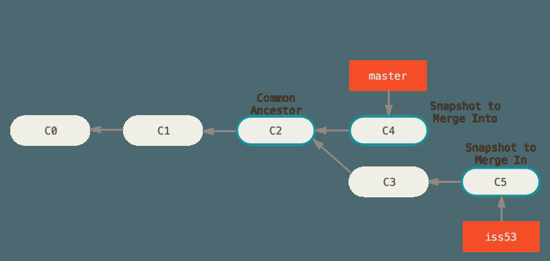

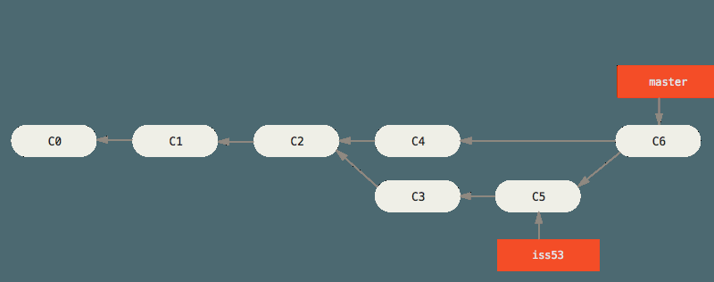

至此，我们一套基本的流程算是走完了。

那么如果我们在合并分支的过程中，有文件冲突怎么处置呢？

比如在我们修改hotfix分支和iss53分支时都修改了同一个文件index.html，那么我们在合并时将会出现如下提示，且合并会阻塞，不会完成：

``````shell
$ git merge iss53
Auto-merging index.html
CONFLICT (content): Merge conflict in index.html
Automatic merge failed; fix conflicts and then commit the result.
``````

你可以通过如下命令查看冲突状态：

``````shell
$ git status
On branch master
You have unmerged paths.
 (fix conflicts and run "git commit")
Unmerged paths:
 (use "git add <file>..." to mark resolution)
 both modified: index.html
no changes added to commit (use "git add" and/or "git commit -a")
``````

如果你打开index.html这个文件看到的是如下内容：

``````html
<<<<<<< HEAD:index.html
<div id="footer">contact : email.support@github.com</div>
=======
<div id="footer">
 please contact us at support@github.com
</div>
>>>>>>> iss53:index.html
``````

其中\=\=\===\=\=上面的内容是HEAD分支(当前也就是master分支)的内容，在\=\=\=\=\=\=\=下面的内容则为iss53分支下这个文件的内容；为了解决这个冲突，你必须选择一个分支的内容丢弃另一个分支的内容，或者是合并这个两个分支的内容，为了说明情况，你可能处理这个文件的内容如下：

``````html
<div id="footer">
please contact us at email.support@github.com
</div>
``````

在你把每个冲突文件处理完之后，你必须运行`git add`命令把每个冲突文件add一边，表示已经解决了冲突。

此时，你再执行`git status`命令看到的是如下提示：

``````shell
$ git status
On branch master
All conflicts fixed but you are still merging.
 (use "git commit" to conclude merge)
Changes to be committed:
 modified: index.html
``````

此时，你只需执行`git commit`命令即可完成之前合并时未完成的工作。