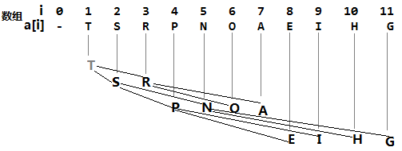

# 堆

## 一、定义

堆又称二叉堆，以数组形式存在，且数组中的每个元素都要保证大于等于另两个特定位置的元素；相应的，这些位置的元素又至少要大于等于数组中的另两个元素，以此类推。如果我们将所有元素画成一颗二叉树，将每个较大元素和两个较小的元素用边连接就可以很容易看出这种结构。

> 当由堆所有元素画成的二叉树的每个节点都大于等于它的两个子节点时，这个堆被称为堆有序；根节点是堆有序的二叉树中的最大结点。

画一颗完全二叉树，我们可以先定下根节点，然后一层一层地由上向下、从左至右，在每个节点的下方连接两个更小的节点，直至将N个结点全部连接完毕；像这样的一颗完全二叉树只用数组而不需要指针就可以表示出来。具体方法就是：将二叉树的节点按照层级顺序放入数组中，根节点在位置1（数组的第一个位置不用），它的子节点在位置2和3，而子结点的子结点则分别在位置4、5、6和7，以此类推，将树中的结点一层一层的存放在数组中，就组成了一个二叉堆的数据结构，这也是为什么二叉堆中每个元素都要大于等于另两个特定位置的元素的原因。

在一个堆中，位置为$k$的结点的父结点的位置为$k/2$，而它的两个子结点的位置则分别为$2k$和$2k+1$，因此在不使用指针的情况下我们也可以通过计算数组的索引在树中上下移动：从$a[k]$向上一层就令$k$等于$k/2$，向下一层则另$k$等于$2k$或$2k+1$。如下图例：

## 二、有序化算法

