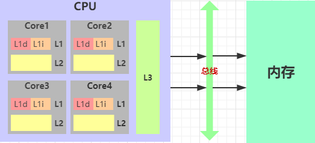
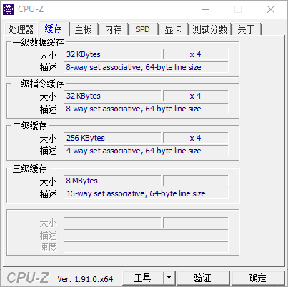

### 一、什么是CPU高速缓存

估计所有的程序员都知道这样一个概念：CPU的速度是非常快的，而内存的速度是比较慢，硬盘则更慢。至于为什么会有这样的差别，并不是本文所要讲的内容，感兴趣可自行查找资料了解。一个速度非常快，而另一个速度相比非常慢，显然就会造成快的那个有很多空闲的时间，这就会导致快的也就是CPU资源的严重浪费；为了缓解这个问题，设计CPU的前辈就在CPU和内存之间增加了一个缓存（即高速缓存）。高速缓存所用的材料和工艺跟内存有很大区别，价格也非常昂贵，但是它的速度是非常快的，只比寄存器稍逊。

CPU的高速缓存分为三个级别，我们分别称之为：L1、L2和L3。L1、L2高速缓存是属于核级别的，而L3是整个CPU中所有核心共享的。其中L1又可以细分为数据缓存L1d和指令缓存L1i，数据缓存用于缓存数据，而指令缓存是存储的指令；数据和指令缓存容量大小是一样的。用图表示如下：

CPU访问数据的流程：首先访问L1，命中则直接访问；否则L1从L2中取数，命中则返回给CPU并缓存到L1中，依次类推直到L3，如果L3依然没有命中，则通过**MMU**（内存管理单元控制器）访问内存。

下面截图是我的电脑CPU缓存的相关配置数据：

我的CPU是4核心，其中L1总大小为（32KB+32KB）\*4，L2总大小为256KB\*4，而L3则为8M。从数据我们可以很直观的看出，L1、L2和L3是越来越大的，同时他们的速度也是越来越慢。

缓存能有效加速的理论基础：局部性原理，又可分为空间局部性和时间局部性：

- 空间局部性原理：即访问某个地址的数据时，接下来很大可能会访问这个地址附近的数据；
- 时间局部性原理：即访问过某个数据之后，在短时间内很大可能会再次访问这个数据。

### 二、高速缓存结构

每一个Cache被分成多个set(组），每个set分成多个行，行就是所谓的Cache Line（缓存行）；**Cache Line是Cache的基本单位，从内存向Cache迁移数据就是按照Cache Line的大小进行的，一般是32字节（ARM架构）或者是64字节（X86架构）**。一个Cache Line的逻辑结构由三个部分组成，这三个部分分别为：状态位（valid）、标志位（tag）和数据块（block）；图示如下：

其中数据块block的大小是确定的，**X86架构下是64字节，ARM架构下是32字节**；而valid部分在普通结构中是一个bit位用于表示当前缓存行是否有效，而在缓存一致性协议（MESI协议）结构中是2个bit位，下面会详细介绍；tag则跟缓存的组织结构有关。

根据缓存行的逻辑结构，我们可以得到整个高速缓存的逻辑结构如下图：

以我电脑cpu数据为例，L1、L2和L3结构分别如下：

- L1：8-way set associative，64-byte line size，即Cache Line为64个字节，每个组包含8个Cache Line(8-way)，从而可以推算出L1的指令缓存和数据缓存中的组的数量均为：32KB/64B/8=64个set；
- L2：4-way set associative，64-byte line size，即Cache Line为64个字节，每个组包含4个Cache Line(4-way)，从而可以推算出L2中组的数量为：256KB/64B/4=1K个set；
- L3：16-way set associative，64-byte line size，即Cache Line为64个字节，每个组包含16个Cache Line(16-way)，从而可以推算出L3中组的数量为：8MB/64B/16=8K个set。

#### 如何确认数据是否在缓存中？

以我的CPU为例，我们拿一个32位的地址来说。因为我们一个缓存行的大小为64B=2^6，也就是说通过6个bit位的偏移量大小我们就可以访问到这个64个字节的数据，因此我们可以考虑把32位地址值低6位用作偏移量；同时我CPU的L1共有64个组=2^6，我们可以通过hash定位到地址属于哪一个组，因此我们可以用低7到低12共6来作为组的定位值，剩余的高20位我们可以作为tag值放置在cache line的tag中。即将一个地址分为若干部分，每个部分用于不同的计算，用图示如下：

所以当一个32位的地址给到Cache中，判断其是否命中缓存的过程如下：

1. 取出地址的低7到低12位的值，与组的大小（即64）做hash，确定此地址属于哪一个组；
2. 确定组之后，取出地址的高20位，挨个与组中的每个Cache Line中的tag做比对，是否有一致的；
3. 找到tag一致，且valid标志表示此Cache Line有效，则命中缓存，直接根据地址低6位偏移量可以从缓存行取出数据；
4. 否则，缓存未命中。

其实呢，根据set和cache line的关系，可以分成三类：

1. **直接映射高速缓存：**即每个set中只有一个cache line，选中组之后只需要和仅有得一个line比对即可，这样一个地址每个部分占有位数就会发生改变；
2. **组相联高速缓存：**就是我CPU的形式，即每个set中包含有多个cache line，选中组之后再和组中的每个line做比对，判断是否命中；
3. **全相联高速缓存：**整个缓存只有一个组，所有的行都放在这一个组内，不再用hash方式来确定组，直接挨个比对高位地址来确定是否命中；可以想见这种方式针对大缓存非常不合适，比如有个4M的大缓存，每个cache line大小为64B，采用全相联的话，就意味着4\*1024\*1024/64=64K个line，意味着要确定缓存是否命中要比对64K次，可以想象这是多要命的事情。

### 三、缓存一致性

