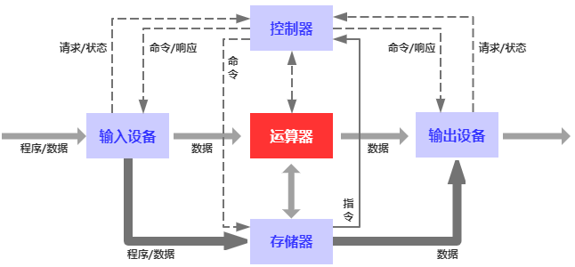
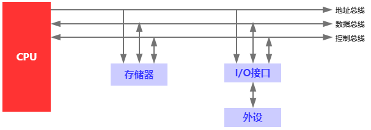

## 计算机主要技术指标结构和工作过程梳理

### 一、主要技术指标

#### 1. 机器字长

机器字长是指计算机中CPU一次能够处理的数据的二进制位数。它决定了运算器、寄存器和数据总线的位数。一般有8位、16位、32位和64位，现在大部分都是64位的机器字长，这也就意味CPU一次能够处理数据的最大长度为64位。

#### 2. 存储容量

计算机的存储容量包括两个部分：主存储器的容量（内存）和辅助存储器的容量（硬盘等）。一般用字节为单位来表示，一个字节（byte，简写B）由8位二进制信息组成。

#### 3. 运算速度

运算速度通过单位时间内执行指令的平均条数来衡量；执行的指令越多表明速度越快，我们用MIPS作为计量单位。主要涉及如下几个硬件指标：

- **主频：**又叫时钟频率，单位Hz；计算机的操作是在时钟信号（数字脉冲）的控制下分步执行的，每个时钟信号周期完成一步操作；主频则表示CPU在单位时间内数字脉冲信号震荡的次数，所以主频反映的是CPU速度的快慢；
- **指令周期：**计算机执行一条指令的时间。

### 二、计算机的基本结构

#### 1. 冯诺依曼计算机结构

在冯诺依曼计算机体系中，计算机由五个部分组成分别如下：

- **运算器：**计算机中实现算术运算和逻辑运算的功能部件；
- **存储器：**计算机中用来存放程序和数据的功能部件，它使计算机具有记忆功能；
- **控制器：**整个计算机的指挥控制中心，控制全机的各功能部件，使其有条不紊的工作；
- **输入设备：**将各种形式的输入信息转换成计算机可接受的编码形式的设备；
- **输出设备：**将计算机的输出信息换成人们可接受的信息形式的设备。

#### 2. 现代计算机的基本结构

现代计算机的结构基本还是遵循的冯诺依曼的设计，只不过在运算器和控制器上将这个两者结合起来集成在一块半导体芯片上，而这块芯片就称为微处理器，又称中央处理器（CPU）。如下图：

由图可知，现代计算机主要有CPU、存储器和输入/输出（I/O）设备组成，它们之间通过地址总线（AB）、数据总线（DB）和控制总线（CB）相连接；外部设备（键盘、鼠标、网卡等等）通过暴露的I/O接口接入计算机之后，从而使CPU可通过总线进行控制。

其中，**地址总线为单项传输线，**用来传输CPU发出的地址信息；**数据总线则为双向传输线，**当CPU写存储器器时，数据从CPU经数据总线传输到存储器写入被指定的存储单元之中；当CPU读存储器时，被指定存储单元中的数据经数据总线传输到CPU。**控制总线是一组传输控制信息的双向总线，**因为有从CPU发出的控制信息，也有CPU接收的外部反馈信息和外部请求信息，**就一组总线而言是双向总线，但其中的每一根控制线都是单向传输线。**

### 三、计算机的工作过程

从普通用户角度来看，计算机的工作过程就是我双击某个软件图标，然后计算机开始运行软件；用户通过点击不同的图标完成各种各样的工作。从这个角度来看，计算机的工作过程遵循如下流程：

那从程序员角度，我们怎么看待计算机的工作过程呢？我认为可以从如下几个方面来分析：

#### 1. 软件加载

我们都知道软件都是用代码写出来，在不运行软件的情况下，这些代码就作为一个文件夹及其下面的文件静静的躺在文件系统里面，而文件系统是存放在硬盘上面的，也就是在不运行软件的情况下，软件就是放在硬盘上的。那么当我们双击一个软件图标的时候发生了什么呢？

我们知道软件都是依附于操作系统的，当我们双击一个软件图标的时候，操作系统会监听到这个双击事件，利用操作系统自己提供的一个**程序装载器**去加载相应的程序，加载程序的过程就是：把原本在硬盘上的文件拷贝到内存中。那么这个过程就涉及到操作系统的硬盘读取、内存分配（后续会专门来讲内存分配）等等工作。当把文件加载到内存之后，操作系统会负责初始化一些程序运行的必要参数：比如说**程序计数器的初始指针、基址寄存器的值等等**，完成这些工作之后，操作系统会把控制权移交到程序本身。

#### 2. 程序运行

我们知道程序是由一系列指令序列和数据组成的，而程序的运行其实就是CPU执行程序包含的指令的过程。那么CPU是如何执行这些指令的呢？主要分为如下三个步骤：

1. **取指令：**CPU根据**程序计数器（PC寄存器）**中的内容从内存中的某个地址单元中取出要执行的指令送到CPU内部的**指令寄存器（IR）**赞存；
2. **分析指令：**即指令译码，把保存在**指令寄存器**中的指令送到**指令译码器（ID）**，译出该指令对应的操作信号；
3. **执行指令：**根据指令译码的结果，向各个部件发出相应的操作控制信号，从而完成指令规定的各种操作；并保存结果。

如此循环往复，不断的取指令、分析指令和执行指令来完成程序的功能，这也就是计算机所要完成的工作内容。

