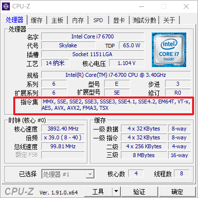

## 指令的认识

### 一、概念

**指令是指示计算机执行某些操作的命令，一台计算机的所有指令的集合就构成了这台计算机的指令系统。**严格来说并不能说是一台计算机，应该是CPU，当一块CPU被生产出来之后，这块CPU支持的指令就固定了，也就是CPU所支持的指令已经是做成了电路烧在了CPU上面。**现代CPU从体系架构上来看主要有：x86架构和ARM架构；在这两个架构下分别存在着一系列的指令集，x86体系指令集发展情况可参考[此网址](https://www.cnblogs.com/zyl910/archive/2012/02/26/x86_simd_table.html)。** 以我电脑CPU（i7-6700）为例，其支持多种指令集如下：

**计算机的指令集也是计算机设计人员和软件编程人员所能看见的同一机器的分界面。**

### 二、基本格式

#### 指令字长

### 三、类型

#### 1. 操作的类型

#### 2. 操作数的类型

### 四、寻址方式

#### 1. 指令寻址方式

#### 2. 操作数寻址方式

