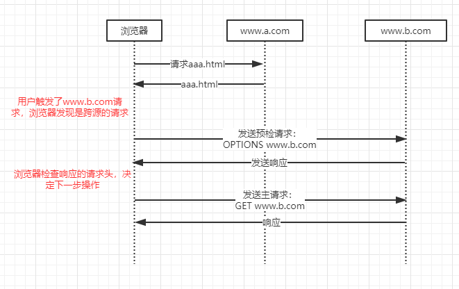

在当前互联网开发环境中，JS前端比如：Vue、React、AngularJS等框架技术越来越成熟，模块化支持也越来越好；在实际的应用项目中也不再跟以前一样前后端代码全都耦合在同一个项目，部署在同一个项目下。很多新项目直接基于前后端分离的思想，将前端和后端完全分开。因此我想大多数前后端分离开发者基本都遇到过这样一个问题：**跨域**，甚至被其搞得焦头烂额。今天这篇文章主要讲解我对跨域产生的原因及其理解，附带常见的解决方案。

### 一、同源策略

同源策略是什么呢？为什么会出现同源策略？

这个得从浏览器的角度来讲，浏览器把从**同一个地方**获得的资源叫做同源的资源。那么浏览器是怎么定义同一个地方的呢？三方面：**请求资源的协议、请求获得资源的目的主机以及请求目的主机的端口号**。注意：ip和域名即使是映射到同一个主机上，对浏览器来说也是不同源的。举例如下：
同源的资源：
http://www.a.com/aaa.html;
http://www.a.com/bbb.html;
http://www.a.com/dir/ccc.html;
http://www.a.com/dirctory/ddd.html;
不同源的资源：
http://www.a.com/aaa.html;
http://www.c.a.com/aaa.html; （即使是二级域名，也是不同源的）
http://www.a.com:8080/aaa.html;（端口不同）
https://www.a.com/aaa.html;（协议不同）
http://241.212.23.12/aaa.html;（即使www.a.com映射到的地址是241.212.23.12，也是不同源的）

而同源策略就是针对不同源资源的，当浏览器访问了http://www.a.com/aaa.html这个页面，然后在点击操作这个页面的过程中，触发脚本访问了http://www.a.com:8080/something这个资源，浏览器就认为这两个资源是不同源的，会根据响应条件决定如何处理。

其实，在浏览器的发展历史上，同源策略并不是一开始就被支持的。同源策略的出现是浏览器为了限制从脚本内发起的跨源请求。

###二、跨域

我们了解了同源策略之后，对跨域的问题就很容易理解了。在浏览器中，在地址栏我们输入http://www.a.com/aaa.html这个地址之后，浏览器发送请求、解析获取的html页面、展示页面；这个时候当用户点击页面中的某个按钮触发ajax请求获取http://www.a.com:8080/something地址的资源时，浏览器就会解析到这不是同一个源的请求(即发生了跨域请求)，浏览器就会通过一系列的流程来处理这个请求。

注意，如下情况不会触发跨域：

1. html页面通过\的src请求跨源的图片；
2. \<link>的href加载跨源的css资源；
3. \<script>的src加载跨源的脚本；
4. 原生的form表单提交(这里为什么说原生的是因为当前有很多开发者是使用js获取到表单值之后再使用ajax的方式提交的请求)。

浏览器处理跨源请求的流程如下图：


1. 浏览器检测到用户触发了跨域请求时，会根据此跨域请求的**请求方式**组装一个预检(请求方式为OPTIONS)请求发送到目的地(www.b.com)；
2. www.b.com收到浏览器发送的预检请求后，会根据自己服务器的设置发送响应；
3. 浏览器收到www.b.com服务器的响应后，**根据其响应的某些请求头去判断接下来的操作**；如果请求头是符合某些要求的，则浏览器发送真正的请求从www.b.com获取数据；如果不符合，则直接在浏览器控制台打印跨域错误信息。

### 三、CORS协议

在上一小节，我们说浏览器会根据预检请求的某些响应头去判定是否发送真正的请求，那么具体是哪些头字段呢？

CORS(跨域资源共享)协议是一种机制，它使用额外的HTTP头来告诉浏览器让在某一个源上的资源准许访问来自另一个源上的指定资源。CORS标准新增了一组HTTP首部字段，允许服务器声明哪些源站通过浏览器有权限访问哪些资源。同时，标准要求，对那些可能对服务器数据产生副作用的HTTP请求方法，浏览器必须首先发送预检请求(OPTIONS请求)，从而得知服务器是否允许该跨域请求，只有在服务器确认允许之后，浏览器才能发送真正的请求。

哪些请求需要发送预检请求，哪些不需要呢？
**简单请求**不会触发预检请求，判断简单请求的规则：

1. 使用下列方法之一：
   - GET
   - HEAD
   - POST
2. 请求头必须在如下组合：
   - Accept
   - Accept-Language
   - Content-Language
   - Content-Type
3. Content-Type的值仅限下列之一：
   - text/plain
   - multipart/form-data
   - application/x-www-form-urlencoded

针对符合上述条件的简单请求，浏览器不会发送预检请求，只是在请求头中会增加Origin请求头来表明是来自哪里的源。任何不符合上述条件的请求，浏览器默认会自动发送一个预检请求(注意：不需要开发者实现，浏览器自带功能实现)，同时会在预检请求的请求头中加入如下值：

```
Origin: http://www.a.com
Access-Control-Request-Method: POST
Access-Control-Request-Headers: X-PINGOTHER, Content-Type
```

服务器如果有针对预检请求的处理，一般会发送如下形式的响应(增加了额外的请求)：

```
HTTP/1.1 200 OK
Date: Mon, 01 Dec 2008 01:15:39 GMT
Server: Apache/2.0.61 (Unix)
Access-Control-Allow-Origin: http://foo.example
Access-Control-Allow-Methods: POST, GET, OPTIONS
Access-Control-Allow-Headers: X-PINGOTHER, Content-Type
Access-Control-Max-Age: 86400
Vary: Accept-Encoding, Origin
Content-Encoding: gzip
Content-Length: 0
Keep-Alive: timeout=2, max=100
Connection: Keep-Alive
Content-Type: text/plain
```

如果服务器没有针对预检请求的处理，则大部分情况下会报404。

**针对新增请求头的说明解释**

> 跨域预检请求的新增首部字段

==Origin==：表明预检请求或实际请求的源站，为源站URI。上面例子中的话就是：www.a.com。

==Access-Control-Request-Method==：表明正在的请求所使用的HTTP请求方式。

==Access-Control-Reqeust-Headers==：将实际请求所携带的首部字段告诉服务器。

> 跨域预检响应的新增首部字段

**浏览器就是通过响应中的这些首部字段来决定下一步是发送正在的请求，还是在控制台打印异常信息的。**

==Access-Control-Allow-Origin==：指定了允许访问该资源的外域URI，对于不需要携带身份凭证的请求，服务端可以指定该字段的值为通配符。例如：下面的响应字段值将只允许http://mozilla.com的源获取我服务器的资源

```
Access-Control-Allow-Origin: http://mozilla.com
```

==Access-Control-Expose-Headers==：表明XMLHttpRequest.getResponseHeader()方法能够访问的除基本响应头之外的其他请求头。

==Access-Control-Max-Age==：表明此预检请求的结果能够被缓存多久，即在指定时间内，浏览器不必重复发送预检请求。

==Access-Control-Allow-Credentials==：指定实际的请求是否可以使用credentials。

==Access-Control-Allow-Methods==：指定了实际请求所被允许使用的HTTP请求方式。

==Access-Control-Allow-Headers==：指明了实际请求中允许携带的首部字段。

注意：Access-Control-Allow-Origin设置为通配符\*时，Access-Control-Allow-Credentials不能设置为true。

### 四、跨域常见解决方案

当我们了解了跨域产生的原因之后，我们可以在各个环节来处理跨域的问题，这里整理如下方式：

#### 1. nginx反向代理

上面我们说了，引起跨域的根源是浏览器不允许访问跨源的资源。那么我们可以通过在nginx里面配置反向代理使得资源在同一个源上。通过一定的规则，我们将所有的前端资源请求和后端数据请求全都发送到nginx处理，由ngnix根据设置的规则请求到不同的主机上获取资源后再将数据回送到浏览器，这样就从跨域的根因上解决了这个问题。

#### 2. 在服务端针对所有的预检请求处理

以java为例，我们可以在过滤器里面判断请求的请求方式是否为OPTIONS，如果是OPTIONS，则在响应头上添加特定的请求头值再直接返回即可。代码如下：

```java
public class CorsFilter implements Filter {

	@Override
	public void init(FilterConfig filterConfig) throws ServletException { }

	@Override
	public void doFilter(ServletRequest servletRequest, ServletResponse 			 
                         servletResponse, FilterChain filterChain) 
			throws IOException, ServletException {
		HttpServletResponse response = (HttpServletResponse) servletResponse;
		HttpServletRequest request = (HttpServletRequest) servletRequest;

		// 指定允许其他域名访问
		response.setHeader("Access-Control-Allow-Origin", "*");
		// 允许访问的方法
		response.setHeader("Access-Control-Allow-Methods", "POST, GET, DELETE, OPTIONS, DELETE");
		// 响应头设置
		response.setHeader("Access-Control-Allow-Headers", "Content-Type, x-requested-with, X-Custom-Header, HaiYi-Access-Token");

		if ("OPTIONS".equals(request.getMethod())){
			response.setStatus(HttpStatus.SC_NO_CONTENT);
            return;
		}
		filterChain.doFilter(servletRequest, servletResponse);
	}

	@Override
	public void destroy() { }

}
```

#### 3. jsonp方式

网上有很多说jsonp方式解决跨域问题，本人没有实践过，这里不再整理，有感兴趣的可以自行查找。

### 五、总结

跨域的起因是浏览器的安全限制，但解决的方式却不再于前端，而是被跨源服务端，也就是说被跨源服务端要配合浏览器返回其预检请求想要的响应请求头信息，从而能让浏览器决定是否发出真正的请求。

以前跨域问题遇到过很多次，但是一直对其没有深入，尤其对各个特殊的请求头也是一脸懵。这一次把跨域的原因和解决方式整理一下，方便自己查询。同时也希望对大家有所帮助。

[参考]: https://developer.mozilla.org/zh-CN/docs/Web/HTTP/Access_control_CORS	"HTTP访问控制"


