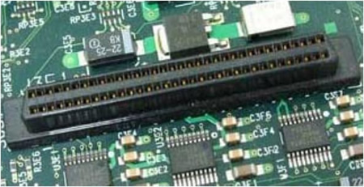

# 硬盘结构

硬盘是计算机的主要外部存储设备。计算机中的存储设备种类非常多，常见的主要有软盘、硬盘、光盘、U 盘等，甚至还有网络存储设备 SAN、NAS 等，不过我们使用最多的还是硬盘。

## 1. 分类

从存储数据的介质上来区分，硬盘可以分为机械硬盘(Hard Disk Drive，HDD)和固态硬盘(Solid State Disk，SSD)，机械硬盘采用磁性碟片来存储数据，而固态硬盘是通过闪存颗粒来存储数据。

### 1.1 机械硬盘

####物理结构

机械硬盘主要由磁盘盘片、磁头、主轴与传动轴等组成，我们的数据就存放在磁盘盘片当中。

##### 盘面

硬盘的盘片一般用铝合金材料做基片，高速硬盘也可能用玻璃做基片。硬盘的每一个盘片都有**两个盘面（Side），即上、下盘面，一般每个盘面都会利用，都可以存储数据，成为有效盘片，也有极个别的硬盘盘面数为单数**。每一个这样的有效盘面都有一个盘面号，按顺序从上至下从“0”开始依次编号。在硬盘系统中，盘面号又叫磁头号，因为每一个有效盘面都有一个对应的读写磁头。硬盘的盘片组在2～14片不等，通常有2～3个盘片，故盘面号（磁头号）为0～3或 0～5。

##### 磁道

磁盘在格式化时被划分成许多同心圆，这些同心圆轨迹叫做磁道（Track）。磁道从外向内从0开始顺序编号。硬盘的每一个盘面有300～1 024个磁道，新式大容量硬盘每面的磁道数更多。信息以脉冲串的形式记录在这些轨迹中，这些同心圆不是连续记录数据，而是被划分成一段段的圆弧，这些圆弧的角速度一样。由于径向长度不一样，所以，线速度也不一样，外圈的线速度较内圈的线速度大，即同样的转速下，外圈在同样时间段里，划过的圆弧长度要比内圈 划过的圆弧长度大。每段圆弧叫做一个扇区，扇区从“1”开始编号，**每个扇区中的数据作为一个单元同时读出或写入**。一个标准的3.5寸硬盘盘面通常有几百到几千条磁道。磁道是“看”不见的，只是盘面上以特殊形式磁化了的一些磁化区，在磁盘格式化时就已规划完毕。

##### 柱面

所有盘面上的同一磁道构成一个圆柱，通常称做柱面（Cylinder），每个圆柱上的磁头由上而下从“0”开始编号。数据的读/写按柱面进行，即磁 头读/写数据时首先在同一柱面内从“0”磁头开始进行操作，依次向下在同一柱面的不同盘面即磁头上进行操作，只在同一柱面所有的磁头全部读/写完毕后磁头 才转移到下一柱面（同心圆的再往里的柱面），因为选取磁头只需通过电子切换即可，而选取柱面则必须通过机械切换。电子切换相当快，比在机械上磁头向邻近磁道移动快得多，所以，数据的读/写按柱面进行，而不按盘面进行。也就是说，一个磁道写满数据后，就在同一柱面的下一个盘面来写，**一个柱面写满后，才移到下一个扇区开始写数据**。读数据也按照这种方式进行，这样就提高了硬盘的读/写效率。
一块硬盘驱动器的圆柱数（或每个盘面的磁道数）既取决于每条磁道的宽窄（同样，也与磁头的大小有关），也取决于定位机构所决定的磁道间步距的大小。

##### 扇区

操作系统以扇区（Sector）形式将信息存储在硬盘上，每个扇区包括512个字节的数据和一些其他信息。一个扇区有两个主要部分：存储数据地点的标识符和存储数据的数据段。

扇区的第一个主要部分是标识符。标识符，就是扇区头标，包括组成扇区三维地址的三个数字：

- 盘面号：扇区所在的磁头（或盘面）；
- 柱面号：磁道，确定磁头的径向方向；
- 扇区号：在磁道上的位置。也叫块号。确定了数据在盘片圆圈上的位置。

头标中还包括一个字段，其中有显示扇区是否能可靠存储数据，或者是否已发现某个故障因而不宜使用的标记。有些硬盘控制器在扇区头标中还记录有指示字，可在原扇区出错时指引磁盘转到替换扇区或磁道。最后，扇区头标以循环冗余校验（CRC）值作为结束，以供控制器检验扇区头标的读出情况，确保准确无误。
扇区的第二个主要部分是存储数据的数据段，可分为数据和保护数据的纠错码（ECC）。在初始准备期间，计算机用512个虚拟信息字节（实际数据的存放地）和与这些虚拟信息字节相应的ECC数字填入这个部分。

#### 逻辑结构

机械硬盘的逻辑结构主要分为磁道、扇区和柱面。

什么是磁道呢？每个盘片都在逻辑上有很多的同心圆，最外面的同心圆就是 0 磁道。我们将每个同心圆称作磁道（注意，磁道只是逻辑结构，在盘面上并没有真正的同心圆）。硬盘的磁道密度非常高，通常一面上就有上千个磁道。但是相邻的磁道之间并不是紧挨着的，这是因为磁化单元相隔太近会相互产生影响。

扇区其实是很形象的，大家都见过折叠的纸扇吧，纸扇打开后是半圆形或扇形的，不过这个扇形是由每个扇骨组合形成的。在磁盘上每个同心圆是磁道，从圆心向外呈放射状地产生分割线（扇骨），将每个磁道等分为若干弧段，每个弧段就是一个扇区。**每个扇区的大小是固定的，为 512Byte。扇区也是磁盘的最小存储单位**。

硬盘是由多个盘片组成的，每个盘面都被划分为数目相等的磁道，那么所有盘片都会从外向内进行磁道编号，最外侧的就是 0 磁道。具有相同编号的磁道会形成一个圆柱，这个圆柱就被称作磁盘的柱面。

**注意，扇区的布局形式分为两种；第一种：每个磁道上分布着相等数量的扇区，因为外面磁道周长更长，这也就意味着靠近圆心处磁道的扇区密度和数据密度都更大，这种类型是老式磁盘的结构；第二种：每个磁道上不再分布着相等数量的扇区，整个盘片的扇区和数据密度一样，靠近圆心处的磁道扇区少，外围磁道的扇区数量多。**由于存在着这样的两种布局形式，所以在寻址方法上也会有差别。

#### 接口种类

##### IDE硬盘接口

IDE 硬盘接口（Integrated Drive Eectronics，并口，即电子集成驱动器）也称作"ATA硬盘"或"PATA硬盘"是早期机械硬盘的主要接口，ATA133 硬盘的理论速度可以达到 133MB/s（此速度为理论平均值）。

##### SATA硬盘接口

SATA 接口（Serial ATA，串口）是速度更高的硬盘标准，具备了更高的传输速度，并具备了更强的纠错能力。目前已经是 SATA 三代，理论传输速度达到 600MB/s（此速度为理论平均值）。

##### SCSI硬盘接口

SCSI 接口（Small Computer System Interface，小型计算机系统接口）广泛应用在服务器上，具有应用范围广、多任务、带宽大、CPU 占用率低及热插拔等优点，理论传输速度达到 320MB/s。

##### SAS硬盘接口

### 1.2 固态硬盘

####物理结构

固态硬盘和传统的机械硬盘最大的区别就是不再采用盘片进行数据存储，而采用存储芯片进行数据存储。固态硬盘的存储芯片主要分为两种：一种是采用闪存作为存储介质的；另一种是采用DRAM作为存储介质的。目前使用较多的主要是采用闪存作为存储介质的固态硬盘。

固态硬盘最重要的三个组件就是NAND闪存，控制器及固件。NAND闪存负责重要的存储任务，控制器和固件需要协作来完成复杂且同样重要的任务，即管理数据存储、维护SSD性能和使用寿命等。

控制器是一种嵌入式微芯片(如电脑中CPU)，其功能就像命令中心，发出SSD的所有操作请求----从实际读取和写入数据到执行垃圾回收和耗损均衡算法等，以保证SSD的速度及整洁度，可以说主控是SSD的大脑中枢。目前主流的控制器有Marvell、SandForce、Samsung、Indilinx等。像Marvell各方面都很强劲，代表型号为Marvell 88SS9187/89/90主控，运用在浦科特、闪迪、英睿达等品牌的SSD上。

SSD的固件是确保SSD性能的最重要组件，用于驱动控制器。主控将使用SSD中固件算法中的控制程序，去执行自动信号处理，耗损平衡，错误校正码(ECC)，坏块管理、垃圾回收算法、与主机设备(如电脑)通信，以及执行数据加密等任务。由于固件冗余存储至NAND闪存中，因此当SSD制造商发布一个更新时，需要手动更新固件来改进和扩大SSD的功能。

SSD用户的数据全部存储于NAND闪存里，它是SSD的存储媒介。SSD最主要的成本就集中在NAND闪存上。NAND闪存不仅决定了SSD的使用寿命，而且对SSD的性能影响也非常大。

NAND闪存颗粒结构及工作原理都很复杂，这里主要来了解一下大家平常选购SSD经常接触到的SLC、MLC及TLC闪存。这几年NAND闪存的技术发展迅猛同，从企业级标准的SLC闪存到被广泛运用在消费级SSD上的MLC闪存再到目前正在兴起的TLC闪存，短短时间里，我们看到NAND技术显著进步。简单来说，NAND闪存中存储的数据是以电荷的方式存储在每个NAND存储单元内的，SLC、MLC及TLC就是存储的位数不同。

SLC(Single-Level Cell)单层式存储每个存储单元仅能储存1bit数据，同样，MLC(Multi-Level Cell)可储存2bit数据，TLC(Trinary-Level)可储存3bit数据。一个存储单元上，一次存储的位数越多，该单元拥有的容量就越大，这样能节约闪存的成本，提高NAND的生产量。

#### 逻辑结构

[参考](https://blog.csdn.net/lyon_yong/article/details/79178794)

## 2. 磁盘读写

### 2.1 机械硬盘

####访盘过程

当需要从磁盘读取数据时，系统会将数据逻辑地址传给磁盘，磁盘的控制电路按照寻址逻辑将逻辑地址翻译成物理地址，即确定要读的数据在哪个磁道，哪个扇区。

为了读取这个扇区的数据，需要将磁头放到这个扇区上方，为了实现这一点：

1. 首先必须找到柱面，即磁头需要移动对准相应磁道，这个过程叫做寻道，所耗费时间叫做寻道时间；
2. 然后目标扇区旋转到磁头下，即磁盘旋转将目标扇区旋转到磁头下。这个过程耗费的时间叫做旋转时间。

即一次访盘请求（读/写）完成过程由三个动作组成：

1. 寻道（时间）：磁头移动定位到指定磁道；
2. 旋转延迟（时间）：等待指定扇区从磁头下旋转经过；
3. 数据传输（时间）：数据在磁盘与内存之间的实际传输

因此在磁盘上读取扇区数据（一块数据）所需时间：Ti/o=tseek +tla + n\*twm；其中：tseek 为寻道时间；tla为旋转时间；twm 为传输时间。

#### 读写原理

**从上到下，然后从外到内。数据的读/写按柱面进行，而不按盘面进行**

系统将文件存储到磁盘上时，按柱面、磁头、扇区的方式进行，即最先是第1磁道的第一磁头下（也就是第1盘面的第一磁道）的所有扇区，然后，是同一柱面的下一磁头，……，一个柱面存储满后就推进到下一个柱面，直到把文件内容全部写入磁盘。（文件的记录在同一盘组上存放时，应先集中放在一个柱面上，然后再顺序存放在相邻的柱面上，对应同一柱面，则应该按盘面的次序顺序存放）。

系统也以相同的顺序读出数据。读出数据时通过告诉磁盘控制器要读出扇区所在的柱面号、磁头号和扇区号（物理地址的三个组成部分）进行。磁盘控制器则 直接使磁头部件步进到相应的柱面，选通相应的磁头，等待要求的扇区移动到磁头下。在扇区到来时，磁盘控制器读出每个扇区的头标，把这些头标中的地址信息与期待检出的磁头和柱面号做比较（即寻道），然后，寻找要求的扇区号。待磁盘控制器找到该扇区头标时，根据其任务是写扇区还是读扇区，来决定是转换写电路， 还是读出数据和尾部记录。找到扇区后，磁盘控制器必须在继续寻找下一个扇区之前对该扇区的信息进行后处理。如果是读数据，控制器计算此数据的ECC码，然 后，把ECC码与已记录的ECC码相比较。如果是写数据，控制器计算出此数据的ECC码，与数据一起存储。在控制器对此扇区中的数据进行必要处理期间，磁盘继续旋转。

#### 局部性原理与磁盘预读

由于存储介质的特性，磁盘本身存取就比主存慢很多，再加上机械运动耗费，磁盘的存取速度往往是主存的几百分分之一，因此为了提高效率，要尽量减少磁盘I/O。为了达到这个目的，磁盘往往不是严格按需读取，而是每次都会预读，即使只需要一个字节，磁盘也会从这个位置开始，顺序向后读取一定长度的数据放入内存。这样做的理论依据是计算机科学中著名的局部性原理：当一个数据被用到时，其附近的数据也通常会马上被使用。程序运行期间所需要的数据通常比较集中。

由于磁盘**顺序读取的效率很高**（不需要寻道时间，只需很少的旋转时间），因此对于具有局部性的程序来说，预读可以提高I/O效率。

预读的长度一般为页（page）的整倍数。**页是计算机管理存储器的逻辑块，硬件及操作系统往往将主存和磁盘存储区分割为连续的大小相等的块，每个存储块称为一页（在许多操作系统中，页得大小通常为4k），主存和磁盘以页为单位交换数据**。当程序要读取的数据不在主存中时，会触发一个缺页异常，此时系统会向磁盘发出读盘信号，磁盘会找到数据的起始位置并向后连续读取一页或几页载入内存中，然后异常返回，程序继续运行。

### 2.2 固态硬盘

[参考](https://blog.csdn.net/lyon_yong/article/details/79178794)

