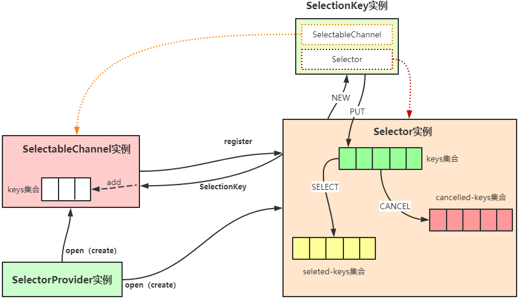
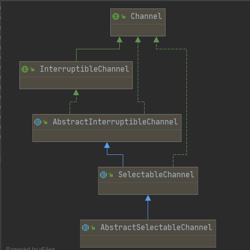
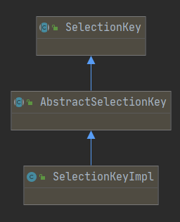
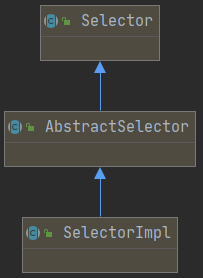
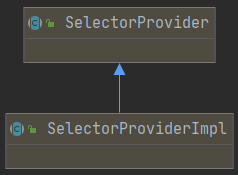

# Java中多路复用的抽象

平时，我们就算没用过也听过多路复用这个名词，诸如各个平台的相关实现，比如Windows下的select、Linux下的select、poll、epoll，甚至还有kqueue等等这些大家应该也都有耳闻。从1.4版本开始，Java中也提供了一个多路复用器Selector，本文旨在阐述Java层面对Selector的实现，至于更底层的实现将在后续文章中阐述。



## 一、关键类

在Java中为了提供多路复用的功能，提供了几个很关键的接口(或抽象类)，分别是：

1. SelectableChannel(抽象类)：可选择通道，完成的主要功能为注册到选择器Selector中；
2. SelectionKey(抽象类)：完成的主要功能是建立Selector与SelectableChannel的关联；
3. Selector(抽象类)：选择器，完成的主要功能是从注册的通道集合中选择出已经准备就绪的通道集合；
4. SelectorProvider(抽象类)：提供器，它可以提供Selector、Channel等的具体实现，其实现跟具体的底层平台相关。

### 1. 详解：SelectableChannel类



**SelectableChannel**为那些需要通过注册到**Selector**选择器来实现多路复用功能的通道提供了基础能力。所有的**SelectableChannel**的实例都可以通过调用其***register()***方法注册到某一个**Selector**甚至是多个**Selector**实例上，但是在同一个**Selector**上最多只能注册一次。**SelectableChannel**是线程安全的。

#### （1） 阻塞模式

SelectableChannel有阻塞和非阻塞两种模式，在阻塞模式下，通道的每一个I/O操作都会阻塞直到其完成；在非阻塞模式下，每一个I/O操作都会立即返回；可以通过***isBlocking()***方法来确定通道当前的阻塞模式。一个新创建的SelectableChannel总是处于阻塞模式下，可以通过***configureBlocking(false)***方法将通道切换为非阻塞模式。

> :warning: 把一个通道注册到选择器之前必须要把通道的阻塞模式设置为非阻塞，编程规范如下：
>
> ```java
> SelectableChannel channel = ...;
> channel.configuraBlocking(false);
> channel.register(Selector, ops);
> ```
>
> 在通道已经注册到某个选择器之后，不能将阻塞模式变更为阻塞，必须一直维持在非阻塞模式下，即不能做如下操作：
>
> ```java
> channel.register(Selector, ops);
> channel.configureBlocking(true);	// 不能这么做，会抛异常
> ```

#### （2） 注册方法

SelectableChannel类中提供了重载的两个register方法，一个是带attachment参数和不带attachment参数，不带attachment参数的register方法内部也是调用的另一个重载register方法，所以这里只对带attachment参数的register方法进行讲解，在AbstractSelectableChannel抽象类中给出了这个方法的实现，代码如下：

```java
/**
 * 作用：
 * 将当前通道注册到sel指定的选择器上，并设置通道感兴趣事件ops，att可以用于保存通道的上下文环境，在感兴趣的时间发生时可以通过att获取注册时的环境信息
 */
public final SelectionKey register(Selector sel, int ops, Object att)
        throws ClosedChannelException
    {
        synchronized (regLock) {	// 获取注册锁
            if (!isOpen())			// 检查通道是否是open状态（这个是Channel接口的基本功能，所有的通道都具有这个功能，且所有通道创建时都是open状态的）
                throw new ClosedChannelException();
            /**
             * 注册的事件是否是当前通道支持的事件
             * 不同的通道类型支持的事件类型是不一样的，比如SocketChannel支持Read、Write、Connect；
             * 而ServerSocketChannel只支持Accept事件。
             * 其实，在底层实现来说，SocketChanel和ServerSocketChannel支持的事件是没有区别的，都是socket类型的文件描述符；
             * Java层面做这个区别应该是为了简化编程逻辑，让代码看上去更清晰更容易理解吧。
             */
            if ((ops & ~validOps()) != 0)
                throw new IllegalArgumentException();
            if (blocking)		// 如果通道处于阻塞模式，则抛出异常，blocking属性通过configureBlocking方法来修改
                throw new IllegalBlockingModeException();
            /**
             * 每个通道实例会维护一个SelectionKey的keys数组，其作用有：
             * 1. 用于记录当前通道注册过哪些Selector，可以避免通道多次注册到同一个Selector上；
             * 2. 当通道调用close关闭自己的时候，方便通道从注册过的Selector中被注销；
             **/
            SelectionKey k = findKey(sel); // 查找keys数组中是否存在sel这个通道
            if (k != null) {	// 不为空，说明注册过
                k.interestOps(ops);		// 更新感兴趣的事件类型
                k.attach(att);			// 更新att属性
            }
            if (k == null) {			// 没注册过
                synchronized (keyLock) {	// 获取控制keys数组修改的锁
                    if (!isOpen())		// 再次验证当前通道是否关闭
                        throw new ClosedChannelException();
                    // 没有关闭，则通过Selector的register方法将当前通道注册到Selector上
                    k = ((AbstractSelector)sel).register(this, ops, att);
                    addKey(k);	// 注册成功之后，加入到keys数组的末尾
                    // addKey的执行过程中，会涉及到keys数组的扩容问题；
                    // 首次分配时，keys数组大小为3，满了之后容量扩大为原来的2倍；
                    // 实现代码很简单，这里就不列出来了
                }
            }
            return k;	// 返回代表当前通道与sel指定的选择器的SelectionKey实例。
        }
    }
```

#### （3） 关闭通道

**SelectableChannel**类型的通道在关闭过程中，除了关闭通道自身之外，还需要将其注册到相应Selector的关联关系也取消掉，以方便在Selector做select操作时可以将这些通道注销掉。**SelectableChannel**中具体关闭会执行的动作源码如下(关闭操作由父接口Channel提供)：

```java
/**
 * close方法通过子类AbstractInterruptiableChannel的实现最终调用如下方法来完成close相关的动作。
 */
protected final void implCloseChannel() throws IOException {
    implCloseSelectableChannel();	// 调用本类的impleCloseSelectableChannel抽象方法(完成通道本身关闭需要的动作)
    synchronized (keyLock) {		// 获取keys数组的控制锁
        int count = (keys == null) ? 0 : keys.length;
        for (int i = 0; i < count; i++) {	// 遍历数组中的每一个元素，并调用他们的cancel方法（cancel方法具体做了什么，在SelectionKey中介绍）
            SelectionKey k = keys[i];
            if (k != null)
                k.cancel();
        }
    }
}
```

### 2. 详解：SelectionKey类



用于表示一个**SelectableChannel**类型的实例向一个**Selector**实例注册的关系。每当一个**SelectableChannel**向一个**Selector**注册的时候都会创建一个**SelectionKey**实例用于记录这个注册关系。

一个SelectionKey实例在下面三种情况下会变成失效状态：

1. 调用SelectionKey的***cancel()***方法；
2. 调用SelectionKey关联的Channel的***close()***方法；在上面讲SelectableChannel的实现时我们说过通道的关闭方法会调用SelectionKey的cancel()方法，所以这种方式其实跟第一种方式本质上是一样的；
3. 调用Selector的***close()***方法；

> :warning:执行cancel方法时，并没有立即把SelectionKey从Selector中移除，其实只是做了两件事：
>
> 1. 把SelectionKey的valid状态变为false；
> 2. 把当前SelectionKey实例加入到Selector选择器的取消列表中，待下次执行select的时候从真正列表中移除这个实例。

#### （1） I/O操作类型

在SelectionKey中定义了所有已知的I/O操作类型bit位，如下表：

| I/O操作    | 值   | 描述               |
| ---------- | ---- | ------------------ |
| OP_READ    | 1<<0 | 表示读操作对应位   |
| OP_WRITE   | 1<<2 | 表示写操作对应位   |
| OP_CONNECT | 1<<3 | 表示连接操作对应位 |
| OP_ACCEPT  | 1<<4 | 表示接受操作对应位 |

> :warning:不同的通道可能支持的I/O操作是不同的，每个通道支持哪种I/O操作，可以通过其对应的***validOps()***方法（属于SelectableChannel提供的方法）定义和查看。

#### （2） I/O操作集合

在SelectionK中维护了两个I/O操作集合，都是用一个整数来表示，特定的bit位分别代表不同类型的操作，0和1的状态也分别表示这个SelectionKey关联的Channel所关注或者已处于就绪状态的I/O操作。

##### a. interest set

这个I/O操作集合决定了在下次进行select操作时，此SelectionKey关联的通道哪些I/O操作会被检测其是否已经处于就绪状态；这个集合属性值可以通过SelectionKey的***interestOps(int)***方法来设置和修改；

##### b. ready set

这个I/O操作集合用于标识在select操作后，此SelectionKey关联的通道哪些I/O操作已经处于就绪状态，是*interest set*的一个子集；这个集合是select后设置的结果集不用被用户修改；

#### （3） 附件attachment

在SelectionKey中提供了一对***attach(Object)***和***attachment()***方法，用于将应用的某些数据或对象绑定到SelectionKey实例和获取绑定的对象，以便在某些I/O操作发生时，可通过这些数据或对象获取应用上下文信息甚至是处理相应的I/O就绪操作（这一点在Tomcat的实现中可以很好的参考一下）。

> :warning:这个attachment是Java提供的应用层面的实现，更操作系统底层逻辑没有任何关系。

#### （4） 方法解析

##### a. 检测I/O操作是否就绪的方法

```java
public final boolean isReadable() {		// 用于检测SelectionKey绑定的通道是否可读
	return (readyOps() & OP_READ) != 0;
}
public final boolean isWritable() {		// 用于检测SelectionKey绑定的通道是否可写
	return (readyOps() & OP_WRITE) != 0;
}
public final boolean isConnectable() {	// 用于检测SelectionKey绑定的通道的Socket连接操作是否完成或失败
    return (readyOps() & OP_CONNECT) != 0;
}
public final boolean isAcceptable() {	// 用于检测SelectionKey绑定的通道是否有新的连接已经就绪
    return (readyOps() & OP_ACCEPT) != 0;
}
```

##### b. cancel方法

上面我们说了cancel方法的注意点，我们现在看看其具体的实现代码是怎么样的：

```java
public final void cancel() {
    synchronized (this) {
        if (valid) {
            valid = false;	// 首先修改状态为失效
            ((AbstractSelector)selector()).cancel(this);	// 然后通过SelectionKey关联的Selector选择器的cancel方法来取消这个实例，至于Selector的cancel方法做了什么了，在Selector中分析
        }
    }
}
```

SelectionKey中的其他方法都很简单，基本都是Getter和Setter方法，感兴趣的读者可以自行通过源码了解。

### 3. 详解：Selector类



针对**SelectableChannel**对象的多路复用器类。创建一个**Selector**实例有如下两种方式：

1. 调用**Selector.open()**方法，这是我们平时开发中通常使用的方式；
2. 实现**SelectorProvider**抽象类中的***openSelector()***方法，通过这个方法提供一个**Selector**实例；其实第一种方法的内部就是通过这种机制实现的，不同的平台实现自己的**SelectorProvider**类，来提供不同的**Selector**实现。

在**SelectableChannel**部分，我们讲过一个SelectableChannel实例通过自己的register方法将自己注册到Selector上，并返回一个SelectionKey实例代表这个注册关系，在Selector中维护了三个SelectionKey的集合，分别如下：

- keys：包含了所有的SelectableChannel注册到当前Selector的SelectionKey集合，可通过***Selector.keys()***取到这个集合；
- selected-keys：包含所有有I/O操作就绪的且通道感兴趣的SelectionKey的集合，这个集合在***select()***操作之后生成和更新，属于keys的一个子集，可通过***Selector.selectedKeys()***取到这个集合；
- cancelled-keys：包含SelectionKey已经被取消但其对应通道还未被注销的SelectionKey的集合，这个集合内容通过通道的close和SelectionKey的cancel来生成，也属于keys的一个子集，这个集合是由**AbstractSelector**维护的，可通过***AbstractSelect.canceledKeys()***取到；在***Selector.select()***执行过程中，会把cancelled-keys集合中所有的通道注销，同时对应得SelectionKey也会从三个集合中清除。

在**Selector**中提供了***select(), select(long), selectNow()***三个方法来完成选择操作，这三个操作主要执行步骤如下：

1. 清空cancelled-keys集合，并对集合里面每个SelectionKey关联的SelectionChannel执行注销操作，并从keys和selected-keys集合中移除对应的SelectionKey；
2. 底层操作系统针对keys集合里面剩余的SelectionKey中对应通道执行查询，看通道感兴趣的I/O操作中处于就绪状态的是否有更新，有则执行如下操作：
   - 如果通道对应的SelectionKey不在selected-keys集合中，则将这个SelectionKey加入到selected-keys集合中，并将这个SelectionKey的**ready set**重置为当前发生的I/O就绪操作状态（意味着readyset中之前的未被处理的就绪操作将会被屏蔽丢弃）；
   - 如果通道对应的SelectionKey在selected-keys集合中，则只将这个SelectionKey的**ready set**和当前新发生的I/O就绪操作执行并集操作（按位或）。
3. 再次清空cancelled-keys集合，也就是说在操作系统执行select期间被加入到cancelled-keys的数据也将被注销和从keys、selected-keys中移除。

当一个线程阻塞在***select()***或***select(long)***方法时，可以通过如下三种方法调用来中断：

1. 调用***Selector.wakeup()***方法；
2. 调用***Selector.close()***方法；
3. 调用此线程的***interrupt()***方法。

后面的两个方式其实都是通过调用***wakeup()***方法来实现的，至于wakeup的原理是什么，请参考。

#### （1） 方法解析

##### open方法

用于创建一个**Selector**实例，其实现非常简单，就包含一句代码，具体如下：

```java
public static Selector open() throws IOException {
    return SelectorProvider.provider().openSelector();	// 通过SelectorProvider.provider()获取一个提供器，用这个提供器来打开一个Selector
}
```

##### register方法

在SelectableChannel中，我们提到SelectableChannel的register方法最终是通过调用Selector的register方法来完成将通道注册到Selector上的，我们现在来看看Selector的register方法的实现（Selector抽象类中并没有提供register方法，其实在AbstractSelector中提供的，具体的实现也是由**SelectorImpl*提供）：

```java
/**
 * 将AbstractSelectableChannel类型的通道注册到Selector中，ops是通道关注的I/O操作类型集，attachment用于保存额外的信息
 */
protected final SelectionKey register(AbstractSelectableChannel ch, int ops, Object attachment)
{
    /**
     * 通道除了是AbstractSelectableChannel类型外，还必须是sun.nio.ch.SelChImpl类型
     * SelChImpl接口提供获取文件描述以及I/O操作事件状态转换的能力
     */
    if (!(ch instanceof SelChImpl))
        throw new IllegalSelectorException();
    SelectionKeyImpl k = new SelectionKeyImpl((SelChImpl)ch, this);	// new一个SelectionKey对象，用于保存Channel和Selector的关系
    k.attach(attachment);	// 将attachment黏贴到SelectionKey实例上
    synchronized (publicKeys) {		 // 获取publicKeys的锁，publicKeys是由keys集合通过Collections.unmodifiableSet(keys)获取的
        implRegister(k);	// 实现真正的注册
    }
    k.interestOps(ops);		// 将I/O操作设置到SelectionKey实例上，最终也会将这些事件设置到本地堆内存的指定位置
    return k;
}

/**
 * 实现最终的注册
 * 我们可以看到在SelectorImpl实现类中只提供了这个方法的抽象，并没有提供真正的实现
 * 这个方法的真正实现，不同的操作系统平台会提供不同的实现
 * 在Windows系统中，由WindowsSelectorImpl类提供实现
 * 在Linux系统中，由EPollSelectorImpl类提供实现
 *
 * 不管哪个平台，这个方法完成的主要工作如下：
 * 1. 将ski加入到keys集合中；
 * 2. 将ski中关联通道对应的文件描述符拷贝到Java进程的本地堆内存指定位置
 */
protected abstract void implRegister(SelectionKeyImpl ski);
```

##### deregister方法

也是由AbstractSelector提供，其实现如下：

```java
/**
 * 注销的时候是根据SelectionKey来注销的
 */
protected final void deregister(AbstractSelectionKey key) {
    // 1. 调用通道的removeKey方法，将会把SelectionKey从通道的keys集合中移除
    // 2. removeKey里面会调用SelectionKey的invalidate方法，将当前SelectionKey的状态置为invalid
    ((AbstractSelectableChannel)key.channel()).removeKey(key);
}
```

##### select方法

在Selector中提供了三个抽象的select方法，定义分别如下：

```java
/**
 * 阻塞方法，直到有I/O操作就绪，此方法才会返回
 */
public abstract int select() throws IOException;
/**
 * 超时阻塞方法，1. 有I/O操作就绪立即返回；2. 无I/O操作就绪，则等待timeout毫秒返回
 */
public abstract int select(long timeout) throws IOException;
/**
 * 非阻塞方法，不管有没有I/O操作就绪，此方法立即返回
 */
public abstract int selectNow() throws IOException;
```

在**SelectorImpl*类中分别为这三个类提供了实现，我们看一下：

```java
public int select(long timeout)
        throws IOException
{
    if (timeout < 0)
        throw new IllegalArgumentException("Negative timeout");
    return lockAndDoSelect((timeout == 0) ? -1 : timeout);
}

public int select() throws IOException {
    return select(0);
}

public int selectNow() throws IOException {
    return lockAndDoSelect(0);
}
```

可以看到最终是通过调用***lockAndDoSelect()***方法实现的select，我们看下这个方法做了什么？

```java
/**
 * timeout=0，不阻塞，遍历完当前所有通道的状态就返回；
 * timeout=-1，阻塞，直到有通道有I/O操作变为就绪状态才返回；
 * timeout>0，超时阻塞
 */
private int lockAndDoSelect(long timeout) throws IOException {
    /**
     * 获取当前Selector实例的锁
     * 意味着如果有多个线程同时调用同一个Selector实例的任意一个select方法，只有一个线程能成功，其余的线程将等待获取对象锁
     */
    synchronized (this) {
        if (!isOpen())	// 检查Selector是否处于打开状态（创建的时候就是打开状态，直到调用close方法才会关闭）
            throw new ClosedSelectorException();
        /**
         * 获取publicKeys的锁，从上面的register方法我们就可以得出: 
         * 当有一个select操作正在进行的时候，如果此时有一个通道要注册到这个Selector实例上，那么这个通道的注册将由于等待锁而处于阻塞状态，
         * 直到select操作结束（或者通道在register之前先wakeup这个Selector从而避免获取锁时阻塞）
         */
        synchronized (publicKeys) {
            synchronized (publicSelectedKeys) {
                return doSelect(timeout);	// 实现真正的select操作，抽象方法，具体的实现就会涉及到底层系统接口的调用了
            }
        }
    }
}

/**
 * 真正的多路复用的实现，抽象方法
 * 具体实现根据不同操作系统不同，具体为：
 * 在Windows系统中，由WindowsSelectorImpl类提供实现
 * 在Linux系统中，由EPollSelectorImpl类提供实现
 *
 * 不管在哪个平台，完成的主要工作：
 * 1. 跟踪注册到这个Selector实例的通道对应的文件描述符上的I/O就绪事件（具体怎么跟踪，就不同系统不同方法了）；
 * 2. 将有I/O就绪事件的通道对应的SelectionKey放入到selected-keys集合中；
 * 3. 返回SelectionKey的个数。
 */
protected abstract int doSelect(long timeout) throws IOException;
```

##### wakeup方法

由Selector提供的抽象方法，我们看一下它的定义：

```java
/**
 * Causes the first selection operation that has not yet returned to return
 * immediately.(这是翻译：让第一个尚未返回结果的selection操作立即返回)
 * 
 * wakeup操作实际工作：
 * 如果有一个线程在执行select()的过程中，阻塞了（一直在等待I/O就绪事件的发生），那么可以通过调用这个selector的wakeup方法让这个线程从阻塞状态恢复过来；
 */
public abstract Selector wakeup();
```

> :warning:如果selector当前没有任何select操作正在执行时，如果调用wakeup方法，那么将造成接下来的一次select调用无效；意思是：虽然你调用了select方法，但其实这次调用并不会真正的去做查询通道I/O状态的事情就会直接返回。

##### close方法

由Selector提供的抽象方法，这个方法会关闭Selector，同时与这个Selector关联的所有的资源都会被释放，包括SelectionKey集合以及未注销的通道。其实现如下：

```java
public final void close() throws IOException {
    boolean open = selectorOpen.getAndSet(false);	// 将Selector的开启状态设置为false
    if (!open)
        return;
    implCloseSelector();
}

protected abstract void implCloseSelector() throws IOException;
```

implCloseSelector由子类**SelectorImpl**提供：

```java
public void implCloseSelector() throws IOException {
    wakeup();		// 调用wakeup方法，这也是我们上面提到的close方法能使在select上阻塞的线程恢复的原因
    synchronized (this) {	// 获取selector实例的锁，上面wakeup一调用，在select上阻塞的线程恢复执行，执行完毕释放selector锁，close方法就能很快执行
        synchronized (publicKeys) {
            synchronized (publicSelectedKeys) {
                implClose();	// 实现关闭
            }
        }
    }
}

/**
 * 也是由不同的操作系统提供实现
 * 主要完成如下工作：
 * 1. 将所有keys中的SelectionKey从selector中注销;
 * 2. 释放分配的本地堆内存；
 * 3. 所有相关资源引用置空。
 */
protected abstract void implClose() throws IOException;
```

### 4. 详解：SelectorProvider类



服务提供类，除了提供Selector以外，还提供SelectableChannel的实现类，通过SPI机制查找具体的实现，如果找不到则通过默认的***sun.nio.ch.DefaultSelectorProvider***来创建一个SelectorProvider实例。

上面我们提过***Selector.open()***方法就是调用的***SelectorProvider.provider().openSelector()***来获取的Selector实例，我们来看一下SelectorProvider的provider方法：

```java
public static SelectorProvider provider() {
    synchronized (lock) {
        if (provider != null)	// 如果当前的provider不为空则直接返回
            return provider;
        return AccessController.doPrivileged(
            new PrivilegedAction<SelectorProvider>() {
                public SelectorProvider run() {
                    if (loadProviderFromProperty())	// 先从系统属性(java.nio.channels.spi.SelectorProvider)加载具体的实现类
                        return provider;
                    if (loadProviderAsService())	// 系统属性没有提供实现，则通过SPI服务发现机制获取SelectorProvider的实现类
                        return provider;
                    provider = sun.nio.ch.DefaultSelectorProvider.create(); 	// 上述两种方式都没有，则利用默认提供器来创建一个SelectorProvider类型的实例
                    return provider;
                }
            });
    }
}
```

**DefaultSelectorProvider**在不同操作系统平台的JDK下具体的实现是不一样的，在Windows版本的jdk中，其具体实现如下：

```java
public class DefaultSelectorProvider {
    private DefaultSelectorProvider() {
    }

    public static SelectorProvider create() {
        return new WindowsSelectorProvider(); // 创建一个Windows平台下的提供器，这个类继承自SelectorProviderImpl类
    }
}
```

在Linux版本的jdk中，其具体实现如下：

```java
public class DefaultSelectorProvider {

    /**
     * Prevent instantiation.
     */
    private DefaultSelectorProvider() { }

    @SuppressWarnings("unchecked")
    private static SelectorProvider createProvider(String cn) {
        Class<SelectorProvider> c;
        try {
            c = (Class<SelectorProvider>)Class.forName(cn);
        } catch (ClassNotFoundException x) {
            throw new AssertionError(x);
        }
        try {
            return c.newInstance();
        } catch (IllegalAccessException | InstantiationException x) {
            throw new AssertionError(x);
        }

    }

    /**
     * Returns the default SelectorProvider.
     */
    public static SelectorProvider create() {
        String osname = AccessController
            .doPrivileged(new GetPropertyAction("os.name"));
        if (osname.equals("SunOS"))	// 检测到时SunOS系统，则提供的是DevPoll类型的提供器
            return createProvider("sun.nio.ch.DevPollSelectorProvider");
        if (osname.equals("Linux"))	// 是Linux系统，则提供的是EPoll类型的提供器
            return createProvider("sun.nio.ch.EPollSelectorProvider");
        return new sun.nio.ch.PollSelectorProvider();	// 否则是Poll类型的提供器
        // 这些类都继承自SelectorProviderImpl类
    }

}
```

**SelectorProvider**除了提供Selector实例外，还用于提供TCP版本的ServerSocketChannel、SocketChannel和UDP版本的DatagramChannel以及管道，其默认实现类**SelectorProviderImpl**代码如下：

```java
public abstract class SelectorProviderImpl
    extends SelectorProvider
{
	/**
	 * 创建一个默认协议族的UDP通道实例
	 */
    public DatagramChannel openDatagramChannel() throws IOException {
        return new DatagramChannelImpl(this);
    }

    /**
	 * 创建一个指定协议族的UDP通道实例
	 */
    public DatagramChannel openDatagramChannel(ProtocolFamily family) throws IOException {
        return new DatagramChannelImpl(this, family);
    }

    /**
     * 创建一个管道
     */
    public Pipe openPipe() throws IOException {
        return new PipeImpl(this);
    }
	
    /**
     * 创建一个Selector实例的抽象方法
     * 其实现由具体平台的实现类提供：如Windows下的WindowsSelectorImple类、Linux下的EPollSelectorImpl类提供实现
     */
    public abstract AbstractSelector openSelector() throws IOException;

    /**
     * 创建一个用于服务端监听端口的TCP通道实例
     */
    public ServerSocketChannel openServerSocketChannel() throws IOException {
        return new ServerSocketChannelImpl(this);
    }

    /**
     * 创建一个用于客户端发送请求的TCP通道实例
     */
    public SocketChannel openSocketChannel() throws IOException {
        return new SocketChannelImpl(this);
    }
}
```

## 二、多路复用的理解

### 1. 多路

指的是多个不同的SelectableChannel实例

### 2. 复用

指的是一个Selector实例

### 3. 多路复用

指的是将多个SelectableChannel实例注册到同一个Selector实例上，由这一个Selector实例来跟踪每个通道上的I/O事件。在实际的应用中，根据Selector实例的个数会有多种网络模型，比如如果只有一个Selector实例，那就将所有的通道都注册到这一个Selector上；如果有多个Selector实例，就将通道分开分别注册到Selector实例上。

## 三、编程模型

> 一、创建服务端监听通道

```java
ServerSocketChannel servChannel = ServerSocketChannel.open();
servChannel.bind();
```

> 二、创建一个Selector实例

```java
Selector selector = Selector.open();
```

> 三、接受请求，获取客户端通道实例

```java
SocketChannel socketChannel = servChannel.accept(); // 阻塞等待，直到有请求到来（这一步也可以通过注册到selector来做）
```

> 四、将客户端通道注册到Selector

```java
socketChannel.register(selector, SelectionKey.OP_READ);
```

> 五、执行select，获取I/O就绪的通道集合

```java
selector.select();  // 根据需要选择一个select方法进行调用
Set<SelectionKey> selectedKeys = selector.selectedKeys(); // 获取就绪的SelectionKey
Iterator<SelectionKey> it = selectedKeys.iterator();
```

> 六、处理结果

```java
while (it.hasNext()) {
    SelectionKey key = it.next();
    it.remove();
    process(key); // 处理这个key，开线程处理，开线程池处理都行
}
```

> 循环第五、六个步骤

