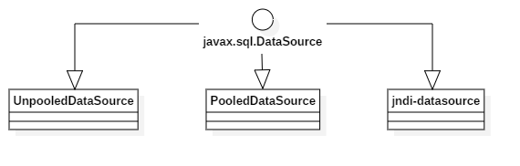

## Mybatis自带的连接池源码分析

在Mybatis框架，它自身的实现包中提供了三种连接池的实现，分别为：*UnpooledDataSource*、*PooledDataSource*以及jndi的数据源。他们三者的类关系如下图：



- **UnpooledDataSource**
  在每次请求数据库连接时才建立连接，数据库操作完成之后就关闭数据库连接；
- **PooledDataSource**
  以池的形式存储数据库连接，在每次请求数据库连接时，会先检查池中是否有可用的连接，有则直接返回，没有时才会根据配置决定是继续新建连接还是等待空闲连接；
- **JNDI**
  利用本地提供的连接池，具体的数据源实现类不是由Mybatis创建的，而是本地提供。

### 一、UnpooledDataSource源码分析

####1. 属性

这里只列出可配置的属性：

| 属性名                           | 属性描述                                                     |
| -------------------------------- | ------------------------------------------------------------ |
| driver                           | JDBC 驱动的 Java 类的完全限定名                              |
| url                              | 数据库的 JDBC URL 地址                                       |
| username                         | 登录数据库的用户名                                           |
| password                         | 登录数据库的密码                                             |
| defaultTransactionIsolationLevel | 默认的连接事务隔离级别                                       |
| driverProperties                 | 作为可选项，可以传递属性给数据库驱动。要这样做，在配置文件中属性的前缀为“driver.” 例如：driver.encoding=UTF8 |

####2. 构造方式

UnpooledDataSource提供了多种构造方式，分别如下：

``````java
public UnpooledDataSource();
public UnpooledDataSource(String driver, String url, String username, String password);
public UnpooledDataSource(String driver, String url, Properties driverProperties);
public UnpooledDataSource(ClassLoader driverClassLoader, String driver, String url, String username, String password);
public UnpooledDataSource(ClassLoader driverClassLoader, String driver, String url, Properties driverProperties);
``````

从各个构造方法来看，构造方式都很简单，我们只需要提供驱动器类(driver)，数据库连接地址(url)、数据库连接用户名(username)以及数据库连接密码(password)即可；同时这些构造方法都只是简单的初始化指定的属性值，并不会建立数据库连接。

#### 3. 获取连接

建立数据库连接的过程是在UnpooledDataSource调用getConnection()方法时实现的，而getConnection方法在内部又是调用的doGetConnection方法来实现的，这个方法也是重中之重的一个方法，下面我们来具体看看这个方法是怎么实现的：

``````java
private Connection doGetConnection(String username, String password) throws SQLException {
    Properties props = new Properties();
    // 在构造时如果有传这个属性值
    if (driverProperties != null) {
        props.putAll(driverProperties);
    }
    if (username != null) {
        props.setProperty("user", username);
    }
    if (password != null) {
        props.setProperty("password", password);
    }
    return doGetConnection(props);	// 继续调用内部的另一个重载方法
}

/**
 * 获取数据库连接的步骤
 * 1. 初始化数据库驱动器类;
 * 2. 创建数据库连接
 * 3. 配置数据库连接属性
 */
private Connection doGetConnection(Properties properties) throws SQLException {
    initializeDriver();
    Connection connection = DriverManager.getConnection(url, properties);
    configureConnection(connection);
    return connection;
}

/**
 * 初始化数据库驱动器类
 */
private synchronized void initializeDriver() throws SQLException {
    /**
     * registeredDrivers是本类中的一个静态变量，它在静态代码块中被初始化,
     * 它存储的是类路径下能够找到的所有jdbc驱动器类实现
     */
    if (!registeredDrivers.containsKey(driver)) {
        // 如果没有找到对应的驱动器类，则重新查找并实例化后注册到DriverManager中
        Class<?> driverType;
        try {
            if (driverClassLoader != null) {
                driverType = Class.forName(driver, true, driverClassLoader);
            } else {
                driverType = Resources.classForName(driver);
            }
            // DriverManager requires the driver to be loaded via the system ClassLoader.
            // http://www.kfu.com/~nsayer/Java/dyn-jdbc.html
            Driver driverInstance = (Driver)driverType.newInstance();
            DriverManager.registerDriver(new DriverProxy(driverInstance));
            registeredDrivers.put(driver, driverInstance);
        } catch (Exception e) {
            throw new SQLException("Error setting driver on UnpooledDataSource. Cause: " + e);
        }
    }
}

/**
 * 配置数据库连接属性:是否自动提交以及事物的隔离级别
 */
private void configureConnection(Connection conn) throws SQLException {
    if (autoCommit != null && autoCommit != conn.getAutoCommit()) {
        conn.setAutoCommit(autoCommit);
    }
    if (defaultTransactionIsolationLevel != null) {
        conn.setTransactionIsolation(defaultTransactionIsolationLevel);
    }
}
``````

从UnpooledDataSource的实现我们可以看出他的流程很简单，每次创建连接就是分三步走。

### 二、PooledDataSource源码分析

#### 1. 属性

| 属性                                   | 属性描述                                                     |
| -------------------------------------- | ------------------------------------------------------------ |
| state                                  | PoolState实例，存放数据库连接，连接池状态管理                |
| dataSource                             | UnpooledDataSource实例，通过这个实例去获取具体的数据库连接   |
| poolMaximumActiveConnections           | 连接池中可创建的最大连接数，默认值：10                       |
| poolMaximumIdleConnections             | 最大的空闲连接数，默认值：5                                  |
| poolMaximumCheckoutTime                | 池中连接被检出的最大时间，小于这个值时会等待连接被释放，大于这个值时会基于老的连接创建一个新的 |
| poolTimeToWait                         | 获取连接的等待时间，当连接池中无可用空闲连接，且创建的连接数也已经达到了最大连接数，那么再从池中获取连接时可以等待的时间，默认值：20000毫秒 |
| poolMaximumLocalBadConnectionTolerance | 坏连接容忍度，作用于每一个尝试从缓存池获取连接的线程. 如果这个线程获取到的是一个坏的连接，那么这个数据源允许这个线程尝试重新获取一个新的连接，但是这个重新尝试的次数不应该超过 `poolMaximumIdleConnections` 与 `poolMaximumLocalBadConnectionTolerance` 之和。 默认值：3 |
| poolPingQuery                          | 发送到数据库的侦测查询，用来检验连接是否正常工作；默认是“NO PING QUERY SET” |
| poolPingEnabled                        | 是否启用侦测查询。若开启，需要设置 `poolPingQuery` 属性为一个可执行的 SQL 语句（最好是一个速度非常快的 SQL 语句），默认值：false |
| poolPingConnectionsNotUsedFor          | 配置 poolPingQuery 的频率                                    |
| expectedConnectionTypeCode             | 不可配置，内部计算的值                                       |

#### 2. 构造方法

``````java
public PooledDataSource() {
    dataSource = new UnpooledDataSource();
}
public PooledDataSource(UnpooledDataSource dataSource);
public PooledDataSource(String driver, String url, String username, String password);
public PooledDataSource(String driver, String url, Properties driverProperties);
public PooledDataSource(ClassLoader driverClassLoader, String driver, String url, String username, String password);
public PooledDataSource(ClassLoader driverClassLoader, String driver, String url, Properties driverProperties);
``````

#### 3. 获取数据库连接

从上面的属性部分，我们可以看到PooledDataSource中有一个UnpooledDataSource的实例属性：dataSource；PooledDataSource通过dataSource来创建新的实例放入到连接池中；同时连接池的状态维护通过PoolState来维护。

下面，我们来看PooledDataSource获取连接的过程，代码如下：

``````java
public Connection getConnection() throws SQLException {
    return popConnection(dataSource.getUsername(), dataSource.getPassword()).getProxyConnection();
}
private PooledConnection popConnection(String username, String password) throws SQLException {
    boolean countedWait = false;
    PooledConnection conn = null;
    long t = System.currentTimeMillis();
    int localBadConnectionCount = 0;

    while (conn == null) {
        synchronized (state) {
            if (!state.idleConnections.isEmpty()) {
                // Pool has available connection
                conn = state.idleConnections.remove(0);
                if (log.isDebugEnabled()) {
                    log.debug("Checked out connection " + conn.getRealHashCode() + " from pool.");
                }
            } else {
                // Pool does not have available connection
                if (state.activeConnections.size() < poolMaximumActiveConnections) {
                    // Can create new connection
                    conn = new PooledConnection(dataSource.getConnection(), this);
                    if (log.isDebugEnabled()) {
                        log.debug("Created connection " + conn.getRealHashCode() + ".");
                    }
                } else {
                    // Cannot create new connection
                    PooledConnection oldestActiveConnection = state.activeConnections.get(0);
                    long longestCheckoutTime = oldestActiveConnection.getCheckoutTime();
                    if (longestCheckoutTime > poolMaximumCheckoutTime) {
                        // Can claim overdue connection
                        state.claimedOverdueConnectionCount++;
                        state.accumulatedCheckoutTimeOfOverdueConnections += longestCheckoutTime;
                        state.accumulatedCheckoutTime += longestCheckoutTime;
                        state.activeConnections.remove(oldestActiveConnection);
                        if (!oldestActiveConnection.getRealConnection().getAutoCommit()) {
                            try {
                                oldestActiveConnection.getRealConnection().rollback();
                            } catch (SQLException e) {
                                /*
                     Just log a message for debug and continue to execute the following
                     statement like nothing happend.
                     Wrap the bad connection with a new PooledConnection, this will help
                     to not intterupt current executing thread and give current thread a
                     chance to join the next competion for another valid/good database
                     connection. At the end of this loop, bad {@link @conn} will be set as null.
                   */
                                log.debug("Bad connection. Could not roll back");
                            }  
                        }
                        conn = new PooledConnection(oldestActiveConnection.getRealConnection(), this);
                        conn.setCreatedTimestamp(oldestActiveConnection.getCreatedTimestamp());
                        conn.setLastUsedTimestamp(oldestActiveConnection.getLastUsedTimestamp());
                        oldestActiveConnection.invalidate();
                        if (log.isDebugEnabled()) {
                            log.debug("Claimed overdue connection " + conn.getRealHashCode() + ".");
                        }
                    } else {
                        // Must wait
                        try {
                            if (!countedWait) {
                                state.hadToWaitCount++;
                                countedWait = true;
                            }
                            if (log.isDebugEnabled()) {
                                log.debug("Waiting as long as " + poolTimeToWait + " milliseconds for connection.");
                            }
                            long wt = System.currentTimeMillis();
                            state.wait(poolTimeToWait);
                            state.accumulatedWaitTime += System.currentTimeMillis() - wt;
                        } catch (InterruptedException e) {
                            break;
                        }
                    }
                }
            }
            if (conn != null) {
                // ping to server and check the connection is valid or not
                if (conn.isValid()) {
                    if (!conn.getRealConnection().getAutoCommit()) {
                        conn.getRealConnection().rollback();
                    }
                    conn.setConnectionTypeCode(assembleConnectionTypeCode(dataSource.getUrl(), username, password));
                    conn.setCheckoutTimestamp(System.currentTimeMillis());
                    conn.setLastUsedTimestamp(System.currentTimeMillis());
                    state.activeConnections.add(conn);
                    state.requestCount++;
                    state.accumulatedRequestTime += System.currentTimeMillis() - t;
                } else {
                    if (log.isDebugEnabled()) {
                        log.debug("A bad connection (" + conn.getRealHashCode() + ") was returned from the pool, getting another connection.");
                    }
                    state.badConnectionCount++;
                    localBadConnectionCount++;
                    conn = null;
                    if (localBadConnectionCount > (poolMaximumIdleConnections + poolMaximumLocalBadConnectionTolerance)) {
                        if (log.isDebugEnabled()) {
                            log.debug("PooledDataSource: Could not get a good connection to the database.");
                        }
                        throw new SQLException("PooledDataSource: Could not get a good connection to the database.");
                    }
                }
            }
        }

    }

    if (conn == null) {
        if (log.isDebugEnabled()) {
            log.debug("PooledDataSource: Unknown severe error condition.  The connection pool returned a null connection.");
        }
        throw new SQLException("PooledDataSource: Unknown severe error condition.  The connection pool returned a null connection.");
    }

    return conn;
}
``````

我们可以看到PooledDataSource获取连接主要涉及的方法是popConnection这个方法，此方法通过不断循环获取数据库连接，内部通过获取state这个属性的锁来保证线程安全性。下面我们分几种情况来分析获取连接的过程。

##### a. 有空闲连接可用

判断state.idleConnections空闲连接池是否有空闲连接，如果有，则直接获取第一个空闲连接之后设置此连接的最新检出时间以及使用时间，同时更新连接池的一些状态值并把此连接加入到活动连接池中之后，返回这个空闲连接；

##### b. 无空闲连接可用，且创建的连接数没有超过poolMaximumActiveConnections这个设置值

从代码可以看出，如果没有空闲连接可用，且创建的连接数小于poolMaximumActiveConnections时，会新建一个**PooledConnection实例**；从代码`conn = new PooledConnection(dataSource.getConnection(), this);`可以知道，PooledConnection内部包装的是通过dataSource.getConnection()创建的连接，PooledConnection的创建代码如下：

``````java
public PooledConnection(Connection connection, PooledDataSource dataSource) {
    this.hashCode = connection.hashCode();
    this.realConnection = connection;
    this.dataSource = dataSource;
    this.createdTimestamp = System.currentTimeMillis();
    this.lastUsedTimestamp = System.currentTimeMillis();
    this.valid = true;
    this.proxyConnection = (Connection) Proxy.newProxyInstance(Connection.class.getClassLoader(), IFACES, this);
}
``````

PooledConnection维护了一个UnpooledDataSource创建的连接以及一个proxyConnection动态代理连接实例，而PooledConnection.getConnection()方法返回的最终也是这个proxyConnection代理实例。

##### b. 无空闲连接可用，且创建的连接数超过了poolMaximumActiveConnections这个设置值

如果没有空闲连接可用，且创建的连接数大于等于poolMaximumActiveConnections时。首先从活动连接池中获取第一个活动连接；

1. 判断这个活动连接的检出时间(我觉得理解成被一个线程占用使用的时间长度好些)是否超过了poolMaximumCheckoutTime这个值(从而可以更好的理解poolMaximumCheckoutTime这个值的意义就是：一个线程占用使用某个连接的最大时间长度)，如果超过了这个值，则把这个连接从活动连接池中移除出来，同时回滚这个连接的操作(这里有些疑惑：如果这里在回滚这个连接，而另一个线程又在使用这个连接，不是会造成异常么？)，然后再基于这个连接封装的数据库连接创建一个新的PooledConnection实例，再让原来的PooledConnection实例失效(这里并没有销毁原来的这个实例，应该是让垃圾回收器去自动回收)；
2. 那么如果这个活动连接的检出时间没有超过poolMaximumCheckoutTime这个值，则让当前获取连接的线程等待，等待的时长为poolTimeToWait，如果在poolTimeToWait时间范围内，有某个线程释放了连接，则当前这个获取连接的线程的阻塞状态会进入运行状态，从而进入下一轮循环就可以获取到空闲连接；如果在poolTimeToWait时间范围内没有线程释放连接，而线程又获得了state锁重新进入了运行状态，则一样是进入下一轮循序继续前面的获取连接步骤，所以有可能获取连接的线程等待的时间不是一个poolTimeToWait，而是n\*poolTimeToWait。

#### 4. 释放连接

从第3小节知道，我们获取到的连接是PooledConnection中的一个动态代理实例属性proxyConnection，查看PooledConnection的代码，得到在我们执行Connection.close方法时，会释放连接，PooledConnection类中的这部分代码如下：

``````java
@Override
public Object invoke(Object proxy, Method method, Object[] args) throws Throwable {
    String methodName = method.getName();
    // 如果执行的是Connection.close方法，则会释放连接，且将当前获取的连接重新push到连接池中
    if (CLOSE.hashCode() == methodName.hashCode() && CLOSE.equals(methodName)) {
        dataSource.pushConnection(this);
        return null;
    } else {
        try {
            if (!Object.class.equals(method.getDeclaringClass())) {
                // issue #579 toString() should never fail
                // throw an SQLException instead of a Runtime
                checkConnection();
            }
            return method.invoke(realConnection, args);
        } catch (Throwable t) {
            throw ExceptionUtil.unwrapThrowable(t);
        }
    }
}
``````

而dataSource.pushConnection(this);调用的就是PooledDataSource中的pushConnection方法，实现如下：

``````java
protected void pushConnection(PooledConnection conn) throws SQLException {
	// 首先还是获取state对象的锁，控制线程的安全性
    synchronized (state) {
        // 从活动连接池中移除当前使用的数据库连接
        state.activeConnections.remove(conn);
        /**
         * 当前连接依然有效
         * 判断方式：PooledConnection中的属性值valid，以及执行pingQuery配置的语句来确保连接是否有效
         * 会调用到pingConnection这个方法去判断有效性
         */
        if (conn.isValid()) {
            /**
             * 如果空闲连接池中的连接数小于配置的poolMaximumIdleConnections值
             * 则基于原来的PooledConnection中封装的Connection实例新建一个PooledConnection实例(想不明白这里为什么要重新新建？)
             * 再重新将这个实例加入到空闲连接池中
             **/
            if (state.idleConnections.size() < poolMaximumIdleConnections && conn.getConnectionTypeCode() == expectedConnectionTypeCode) {
                state.accumulatedCheckoutTime += conn.getCheckoutTime();
                if (!conn.getRealConnection().getAutoCommit()) {
                    conn.getRealConnection().rollback();
                }
                PooledConnection newConn = new PooledConnection(conn.getRealConnection(), this);
                state.idleConnections.add(newConn);
                newConn.setCreatedTimestamp(conn.getCreatedTimestamp());
                newConn.setLastUsedTimestamp(conn.getLastUsedTimestamp());
                conn.invalidate();
                if (log.isDebugEnabled()) {
                    log.debug("Returned connection " + newConn.getRealHashCode() + " to pool.");
                }
                // 通知激活在等待获取连接的线程
                state.notifyAll();
            } else {
                /**
                 * 如果空闲连接池满了，则关闭当前使用的连接
                 */
                state.accumulatedCheckoutTime += conn.getCheckoutTime();
                if (!conn.getRealConnection().getAutoCommit()) {
                    conn.getRealConnection().rollback();
                }
                conn.getRealConnection().close();
                if (log.isDebugEnabled()) {
                    log.debug("Closed connection " + conn.getRealHashCode() + ".");
                }
                conn.invalidate();
            }
        } else {
            if (log.isDebugEnabled()) {
                log.debug("A bad connection (" + conn.getRealHashCode() + ") attempted to return to the pool, discarding connection.");
            }
            state.badConnectionCount++;
        }
    }
}
``````

