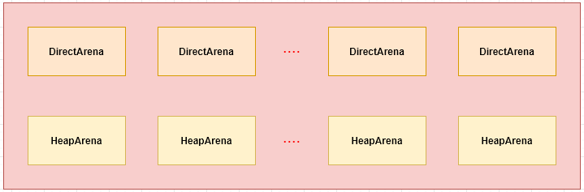

# Netty内存分配

版本：netty4.1

Netty为了提高内存分配和回收的效率，实现了一套内存分配机制；在Netty中提供了两种内存分配实现**PooledByteBufAllocator**和**UnPooledByteBufAllocator**，本文介绍Netty4.1中池化内存分配**PooledByteBufAllocator**的实现原理，其基本思想是根据jemalloc原理来实现的。

## 一、初始化

**PooledByteBufAllocator**在实例化过程中，会创建两类多个PoolArena实例，来分别管理堆内存和直接内存，创建PoolArena实例个数计算方式：

1. DirectArena：`max(0, min(processors*2, Runtime.maxDirectMemory()/defaultChunkSize/2/3))`；
2. HeapArena：`max(0, min(processors*2, Runtime.maxMemory()/defaultChunkSize/2/2))`；

其中`defaultChunkSize=defaultPageSize<<defaultMaxOrder`，defaultPageSize=8192(8k)，可通过系统属性`io.netty.allocator.pageSize`来设置；defaultMaxOrder=11，可通过系统属性`io.netty.allocator.maxOrder`来设置。

## 二、分配

## 三、释放

## 四、回收

