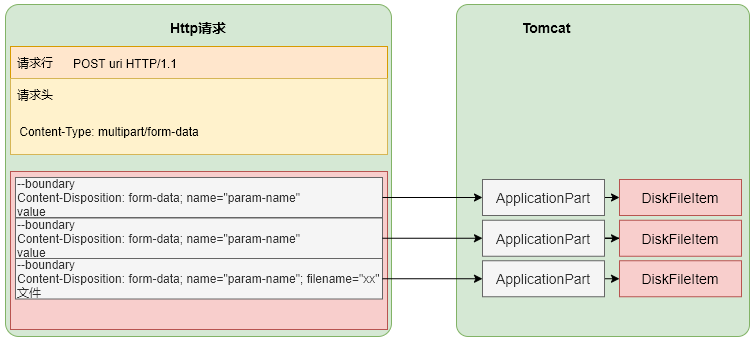
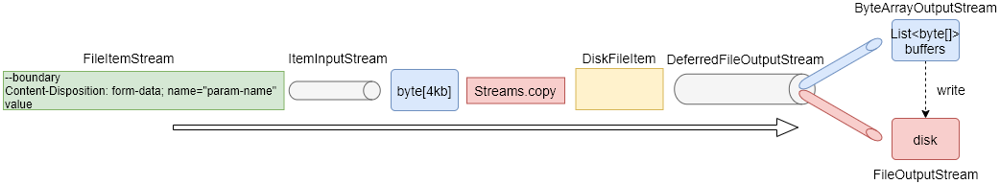

# Tomcat对上传文件的处理

在Servlet3.0标准之前，Tomcat本身是不直接支持对上传文件的解析处理的；需要依赖于commons-fileupload等jar包才能完成对上传文件的解析处理。Servlet3.0之后，其提供了对上传文件的标准处理，因此Tomcat的实现中也加入了对上传文件的解析处理。本文介绍的是Tomcat8.5中对上传文件解析处理的原理。

我们知道在Http协议中对于文件上传类的请求，请求方法必须指定为POST，且请求头Content-Type的值必须指定为multipart/form-data；所以在Tomcat对于上传文件的处理，即对应于对Content-Type为multipart/form-data类型请求的处理。

在文章《[请求解析](!请求解析.md)》中我们说过，当用户调用***getParameter()***等一系列方法的时候才会去解析Http请求的请求体数据；而对于**multipart/form-data**类型的解析也是发生在这个过程中，也就是说：如果用户没有调用过**getParamter()**方法，也没有通过流式的方式（getInputStream()和getReader()）去读取请求体内容，那么对于上传的文件内容是不会处理的。其实除了这些方法，还有getPart()系列方法，getPart()系列方法是专门针对multipart/form-data类型获取请求参数的。

## 内容存放格式

对于multipart/form-data类型的请求，请求体中被每个boundary分隔的部分在Tomcat中都会对应到一个**DiskFileItem**存储，每个DiskFilteItem被封装在ApplicationPart（实现Servlet3.0标准中的Part接口）实例中，通过getPart(paramName)方法获取的就是ApplicationPart实例对象。而对于DiskFileItem的存储方式也分为两种：内存和硬盘，请求内容是存放在内存中还是硬盘上，由两个因素决定：每个Part的大小以及Servlet中配置的参数fileSizeThreshold。

:warning:对每个part都会对应一个DiskFileItem，而不管这个part是不是文件类型。因此，如果fileSizeThreshold=0（也就是不管part的大小都直接写到磁盘上），则每个part会对应一个临时文件，每个临时文件的内容存放的就是param-name=value或者是上传文件的内容。

## 读取流程

处理multipart/form-data请求体的流程如下：

1. 解析请求体，以迭代方式处理每个part；
2. 将第一个part解析为FileItemStream类型，并创建一个DiskFileItem；
3. 获取FileItemStream对象的输入流ItemInputStream（是MultipartStream的内部类），通过输入流对象将请求体内容读取到内存中（一个字节数组，默认是4KB大小，会循环利用这个字节缓冲）；从DiskFileItem获取一个输出流DeferredFileOutputStream对象，通过Streams.copy方法将输入流的内容拷贝到输出流中；
4. 输出流内部默认的底层输出流对象是ByteArrayOutputStream，即将拷贝的内容存放在字节缓冲数组中（这个缓冲是一个字节数组列表，第一次分配一个1KB大小的字节数组放在列表接收内容；如果还有内容拷贝，再分配一个2KB大小的字节数组加入列表接收内容；如此下去每次分配一个2^(n-1)^KB大小的字节数组，直到所有内容读取完毕，或者是读取的内容超过了fileSizeThreshold）；如果读取的内容超过了fileSizeThreshold，则首先将ByteArrayOutputStream中的内容写入到临时文件中，然后将新拷贝的内容接着再写入到文件中，后续所有拷贝的内容都是直接写入到文件中了，不再写入到内存；
5. 处理完这个FileItemStream之后，继续迭代下一个FileItemStream。

:warning:

1. 在读取请求体时，是使用的同一个字节数组接收，大小为4KB；
2. fileSizeThreshold参数是通过在Servlet层面的@MultipartConfig注解参数来配置的，可以每个Servlet配置不同的参数，默认值为0，也就是不放内存，直接写到文件中；
3. tomcat层面完成请求体的读取之后，并不调用刷盘方法将文件内容确保刷盘，也就是说，写到文件是写到操作系统的文件缓存，刷盘由操作系统控制，所以在Servlet层面再处理文件的时候要注意这个问题；
4. Servlet层面的请求处理完毕之后，存放的临时文件会被删除；
5. 关于ByteArrayOutputStream中字节数组每次的分配大小，不一定是按照翻倍的方式扩容的，它会根据当次读取的内容大小与翻倍后的大小比较，取大的；
6. ByteArrayOutputStream的分配的内存再内容写入到文件之后并不会回收，所以在实际处理中要注意控制这块空间的消耗；
7. multipart/form-data类型请求中，如果请求参数不是文件类型，则请求的参数也会存在Parameters中，也就是说可以通过getParameter()方法获取，但是要注意的是，如果解析时存入到了临时文件中，会再读一次文件内容将参数读取到Parameters中存放；
8. 在Servlet中我们处理文件保存的时候，用getPart().write(dest)方式就可以将文件保存到指定的位置了，不到使用getPart().getInputStream()的方式；write方式，如果文件内容是在内存中的，会直接写到目标文件；如果是在临时文件中的，会通过rename重命名的方式来实现文件保存到指定位置，少了再拷贝的过程。

## SpringMvc中对上传文件的处理

SpringMvc对上传文件的处理是直接依赖的Tomcat层面的实现，也就是最终的文件读取写入等都是Tomcat完成的，SpringMvc只是增加了一些判断控制逻辑。在SpringMvc中增加了一个resolveLazily的参数，这个参数控制的是在收到请求之后就直接处理请求体，还是在用户需要获取请求体中的参数的时候再读取请求体，其默认值为false，也就是在收到请求之后就马上处理。

## @MultipartConfig

此注解也是Servlet3.0之后提供的一个控制multipart/form-data请求类型相关参数的一个注解，其使用在Servlet层面，对应于web.xml中<Servlet><multipart-config>元素；其包含的参数意义如下：

1. location：文件存放的位置，如果是相对路径则是相对于临时目录（一般是Catalina_Home/work/Catalina/host/context/）；
2. maxFileSize：允许上传的最大文件大小（字节数）；默认-1，无限制
3. maxRequestSize：multipart/form-data请求参数中非文件参数的最大大小，包括参数名和参数值，等于号；默认-1，无限制
4. fileSizeThreshold：文件大小或参数超过这个值之后，就需要将所有内容存入到临时文件中，不能再存放在内存；默认0，即直接写入临时文件中。

