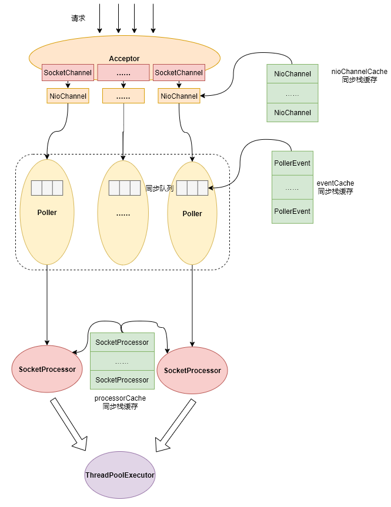

# Tomcat中NIO模式下的网络模型

本文将从宏观层面介绍一下Tomcat8.0版本下的网络处理模型，从一个请求如何接收，Tomcat内部如何流转处理的一个流程。

我画了一张图用于描述这个请求的流转过程，如下：

在Tomcat的网络模型中，有几个非常关键的角色，分别如下：

1. Acceptor：负责处理客户端连接，控制同时处理中的连接数；并将接收到的连接封装成NioChannel对象注册到Poller实例的同步队列中；
2. Pollor：负责统计其内部的PollerEvent同步队列（Acceptor注册进来的NioChannel会被包装成PollerEvent对象），如发现有PollerEvent，则通过其维护的一个Selector实例来执行select操作以发现网络IO事件，并将发现的IO事件封装到Processor实例中；
3. ThreadPoolExecutor：工作线程池，负责处理扔进来的Processor任务；
4. Processor：处理器实例，用于处理具体的请求业务逻辑，由工作线程池负责调度处理；
5. PollerEvent栈：预分配的PollerEvent实例栈，用于在接收到请求时，可以预先从栈中取出PollerEvent用于包装请求连接，从而减少实例的创建和回收；
6. Processor栈：跟PollerEvent的作用一样，也是预分配的一个实例栈，用于在处理请求时包装请求的上下文信息，从而减少实例的创建和回收。

本文只是对Tomcat网络模型的一个基本介绍，后续文章会对其中的每个组件进行详细的介绍。