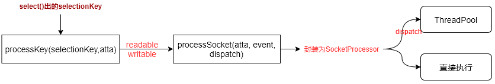
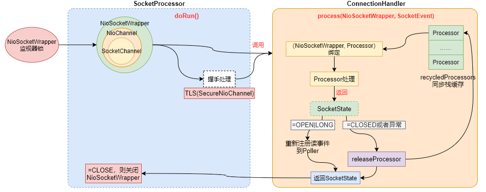

# Tomcat网络模型之SocketProcessor和Handler

在上文介绍**Poller**组件的时候，我们知道由Poller负责通过Selector选择器select出已经就绪io事件之后，会通过***processKey(selectionKey)***方法来处理发生了io事件的selectionKey，最终会通过***processSocket()***方法来封装相关属性到**SocketProcessor**中，然后将SocketProcessor扔到线程池或者是直接在当前线程中执行，图示如下：



所以，后续的处理流程完全是由**SocketProcessor**这个任务来完成。

## 一、SocketProcessor

**SocketProcessor**继承自父类**SocketProcessorBase**，其在构造的时候需要传入*SocketWrapperBase*和*SocketEvent*参数来表明其要处理的客户端socket上下文信息以及所处理的事件类型。**SocketProcessorBase**的实现如下：

```java
public abstract class SocketProcessorBase<S> implements Runnable {

    protected SocketWrapperBase<S> socketWrapper;
    protected SocketEvent event;

    public SocketProcessorBase(SocketWrapperBase<S> socketWrapper, SocketEvent event) {
        reset(socketWrapper, event);
    }

    // 重置状态，从预分配缓存processorCache中取出实例的时候要重置状态
    public void reset(SocketWrapperBase<S> socketWrapper, SocketEvent event) {
        Objects.requireNonNull(event);
        this.socketWrapper = socketWrapper;
        this.event = event;
    }

    // 执行任务
    @Override
    public final void run() {
        synchronized (socketWrapper) {	// 获取socketWrapper的锁
            if (socketWrapper.isClosed()) {
                return;
            }
            doRun();	// 具体的事情由子类控制
        }
        // 释放锁
    }

    protected abstract void doRun();
}
```

:warning:tomcat每种IO类型中（NioEndpoint、Nio2Endpoint以及AprEndpoint）都有一个**SocketProcessor**实现。

现在我们来分析一下**NioEndpoint**中**SocketProcessor**中是如何处理io的，代码如下：

```java
protected class SocketProcessor extends SocketProcessorBase<NioChannel> {
	// 构造方法
    public SocketProcessor(SocketWrapperBase<NioChannel> socketWrapper, SocketEvent event) {
        super(socketWrapper, event);	// 直接调用父类的构造方法
    }

    /**
     * 父类的run()方法实现会调用doRun()方法来处理具体的任务
     */
    @Override
    protected void doRun() {
        // 获取到socketWrapper中封装的NioChannel实例（封装了客户端socket通道SocketChannel对象）
        NioChannel socket = socketWrapper.getSocket();
        // 获取到客户端socket在selector中的selectionKey对象
        // keyFor是一个效率比较低操作，会轮询Selector中的keys数组（所有注册到selector上的客户端socket）
        // 所以这也是为什么在NIO的网络模型中一般会存在多个Selector实例的原因（将所有的客户端socket均分到个Selector上，减少遍历的耗时）
        SelectionKey key = socket.getIOChannel().keyFor(socket.getPoller().getSelector());

        try {
            int handshake = -1;	// 标记握手状态

            try {
                if (key != null) {
                    if (socket.isHandshakeComplete()) {
                        // 握手完成，如果是HTTP请求，一定是走的这个分支
                        // 如果是HTTPs请求，则要看TLS握手是否已经完成
                        handshake = 0;
                    } else if (event == SocketEvent.STOP || event == SocketEvent.DISCONNECT ||
                               event == SocketEvent.ERROR) {
                        // 如果是HTTPs请求，且TLS握手还没完成的情况下，Socket事件异常了
                        // 则都当前TLS握手失败处理
                        handshake = -1;
                    } else {
                        // 继续HTTPs的握手
                        handshake = socket.handshake(key.isReadable(), key.isWritable());
                        event = SocketEvent.OPEN_READ;
                    }
                }
            } catch (IOException x) {
                handshake = -1;
            } catch (CancelledKeyException ckx) {
                handshake = -1;
            }
            if (handshake == 0) {
                // 如果不需要握手，或者是握手已经完成
                SocketState state = SocketState.OPEN;	// 表示socket的状态应该是什么状态
                // 通过Handler处理器（ConnectionHandler）来处理请求
                if (event == null) {
                    // 如果没有指定event值，则默认当成读事件来处理
                    state = getHandler().process(socketWrapper, SocketEvent.OPEN_READ);
                } else {
                    state = getHandler().process(socketWrapper, event);
                }
                
                // 请求处理之后，如果返回socket状态应该要关闭（比如在Poller中讲的超时情况），就执行close操作
                if (state == SocketState.CLOSED) {
                    close(socket, key);	// close()操作会调用cancelledKey()方法，释放相关资源
                }
            } else if (handshake == -1 ) {
                // 如果需要握手且握手失败了，则也要通过处理器处理连接失败的事件
                getHandler().process(socketWrapper, SocketEvent.CONNECT_FAIL);
                // 处理完之后，也要关闭连接
                close(socket, key);
            } else if (handshake == SelectionKey.OP_READ){
                // 如果需要握手，且处于握手过程中，socket.handshake()方法返回的是读
                // 则需要更新此socket在selector中的事件读，以继续监听下一个请求
                socketWrapper.registerReadInterest();
            } else if (handshake == SelectionKey.OP_WRITE){
                // 如果需要握手，且处于握手过程中，socket.handshake()返回的是写
                // 则需要更新此socket在selector中的事件为写，以便将服务器内容返回给客户端
                socketWrapper.registerWriteInterest();
            }
        } catch (CancelledKeyException cx) {
            socket.getPoller().cancelledKey(key);
        } catch (VirtualMachineError vme) {
            ExceptionUtils.handleThrowable(vme);
        } catch (Throwable t) {
            socket.getPoller().cancelledKey(key);
        } finally {
            // 任务执行完毕之后，状态都置空
            // 同时将当前的SocketProcessor实例放入到预分配缓存中取，以便给下次请求使用
            socketWrapper = null;
            event = null;
            if (running && !paused) {
                processorCache.push(this);
            }
        }
    }
}
```

由实现可知，在**SocketProcessor**中主要完成两件事：

1. 完成HTTPs协议的握手，根据握手的状态来决定下一步操作；
2. 通过Handler连接处理（唯一实现类：ConnectionHandler）来处理请求；

## 二、Handler

**Handler**是**AbstractEndpoint**类中提供的一个处理器接口，用于处理各个请求，Tomcat中提供的唯一实现是在**AbstractProtocol**中的静态内部类**ConnectionHandler**，由它来负责处理各个客户端请求。在上面代码分析中的语句`getHandler().process(...)`最终就是调用的**ConnectionHandler**中的***process()***实现方法，其代码如下：

```java
@Override
public SocketState process(SocketWrapperBase<S> wrapper, SocketEvent status) {
    // 省略了相关日志代码
    
    if (wrapper == null) {
        return SocketState.CLOSED;
    }

    S socket = wrapper.getSocket();	// 获取到封装的NioChannel或者是SecureNioChannel对象

    // 从map中取socket绑定的Processor
    // Processor会负责请求内容解析、容器处理等都是通过它
    Processor processor = connections.get(socket);

    // 异步请求超时情况的处理
    if (SocketEvent.TIMEOUT == status &&
        (processor == null ||
         !processor.isAsync() && !processor.isUpgrade() ||
         processor.isAsync() && !processor.checkAsyncTimeoutGeneration())) {
        return SocketState.OPEN;
    }

    if (processor != null) {
        // 确保异步超时没有被触发
        getProtocol().removeWaitingProcessor(processor);
    } else if (status == SocketEvent.DISCONNECT || status == SocketEvent.ERROR) {
		// 待处理的socket事件是客户端断开连接或者是异常（比如请求超时了）
        // 直接返回应该关闭socket的状态，由调用方SocketProcessor去执行关闭
        return SocketState.CLOSED;
    }

    ContainerThreadMarker.set();	// 标记是tomcat容器的线程，而不是用户应用中创建的线程

    try {
        if (processor == null) {
            // 当前连接没有绑定Processor
            String negotiatedProtocol = wrapper.getNegotiatedProtocol();
            // 协议协商
            if (negotiatedProtocol != null && negotiatedProtocol.length() > 0) {
                UpgradeProtocol upgradeProtocol = getProtocol().getNegotiatedProtocol(negotiatedProtocol);
                if (upgradeProtocol != null) {
                    processor = upgradeProtocol.getProcessor(wrapper, getProtocol().getAdapter());
                } else if (negotiatedProtocol.equals("http/1.1")) {
                    
                } else {
                    return SocketState.CLOSED;
                }
            }
        }
        if (processor == null) {
            // 协议协商过程中还是没有Processor
            // 从回收栈中取出一个Processor
            processor = recycledProcessors.pop();
        }
        if (processor == null) {
            // 回收栈中也没有可用的Processor
            // 则新建一个Processor处理器
            // 会根据当前Connector的协议类型创建对应的Processor
            // Http1.1 -> Http11Processor
            // Ajp -> AjpProcessor
            // Http2 -> StreamProcessor
            processor = getProtocol().createProcessor();
            register(processor);	// 将Processor注册到JMX
        }

        // 设置Processor是否是Https的
        processor.setSslSupport(
            wrapper.getSslSupport(getProtocol().getClientCertProvider()));

        connections.put(socket, processor);	// 将连接与Processor绑定起来

        SocketState state = SocketState.CLOSED;	// 默认socket的下一步状态为关闭
        do {
            // 由Processor正式处理请求，传入SocketWrapper和SocketEvent事件类型
            // 内部流程：解析请求数据 -> 容器 -> 映射 -> servelt等这样的流程就是由Processor来做的
            // Processor的分析在后续文章中，本文暂时忽略
            // Processor处理完之后会返回socket的下一步的状态应该是什么
            state = processor.process(wrapper, status);

            if (state == SocketState.UPGRADING) {
                // 如果是需要协议升级
                UpgradeToken upgradeToken = processor.getUpgradeToken();
                ByteBuffer leftOverInput = processor.getLeftoverInput();
                if (upgradeToken == null) {
                    UpgradeProtocol upgradeProtocol = getProtocol().getUpgradeProtocol("h2c");
                    if (upgradeProtocol != null) {
                        processor = upgradeProtocol.getProcessor(
                            wrapper, getProtocol().getAdapter());
                        wrapper.unRead(leftOverInput);
                        connections.put(socket, processor);
                    } else {
                        return SocketState.CLOSED;
                    }
                } else {
                    HttpUpgradeHandler httpUpgradeHandler = upgradeToken.getHttpUpgradeHandler();
                    release(processor);
                    processor = getProtocol().createUpgradeProcessor(wrapper, upgradeToken);

                    wrapper.unRead(leftOverInput);
                    wrapper.setUpgraded(true);
                    connections.put(socket, processor);

                    if (upgradeToken.getInstanceManager() == null) {
                        httpUpgradeHandler.init((WebConnection) processor);
                    } else {
                        ClassLoader oldCL = upgradeToken.getContextBind().bind(false, null);
                        try {
                            httpUpgradeHandler.init((WebConnection) processor);
                        } finally {
                            upgradeToken.getContextBind().unbind(false, oldCL);
                        }
                    }
                }
            }
        } while ( state == SocketState.UPGRADING);	// 一直循环直接协议升级完成
        // 关于协议升级的概念，可以google一下 Http upgrade 

        if (state == SocketState.LONG) {
			// 返回的下一步状态是LONG
            //longPoll中判断processor不是异步请求则继续增加一个读事件到Poller中，否则啥也不做
            longPoll(wrapper, processor);
            if (processor.isAsync()) {
                // 如果是异步请求，将processor加入到等待队列集合中
                getProtocol().addWaitingProcessor(processor);
            }
        } else if (state == SocketState.OPEN) {
			// keep-alive形式的连接，返回的下一步状态是继续OPEN
            // 先接触连接与processor的绑定关系，并释放清空processor占用的相关资源
            // 并把processor放入到回收栈中，供下次使用
            // 再注册一个read事件到poller中，继续等待处理这个连接的下一次请求
            connections.remove(socket);
            release(processor);
            wrapper.registerReadInterest();
        } else if (state == SocketState.SENDFILE) {
			// 返回的下一步状态是SENDFILE，表示当前正在发送文件到客户端，后续socket如何处理有发送线程处理
            // 如果发送文件失败了，则发送线程会关闭这个socket；否则，要么把这个socket继续添加到poller中
            // 等待读取更多的数据要么就是继续处理请求缓存中剩余的数据（参考上篇文章的processSendfile()方法）
        } else if (state == SocketState.UPGRADED) {
			// 返回的下一步状态是UPGRADED（表示协议协商升级已经完成了）
            if (status != SocketEvent.OPEN_WRITE) {
                // 如果当前的socket事件不是写就绪事件
                longPoll(wrapper, processor);	// 继续注册一个写事件到poller
                getProtocol().addWaitingProcessor(processor);// 加入等待队列
            }
        } else if (state == SocketState.SUSPENDED) {
			// 下一步状态是SUSPENDED，则不再添加新的事件到poller中
            // 意味着后续这个连接即使还有其他的请求也不会被处理
            // 只有在WebSocket请求下才会出现这种情况
        } else {
			// 其他状态，CLOSED或者是ASYNC_END（异步请求结束状态不会发生在这里，在processor.process()方法中会处理）
            // 所以这里的分支应该就是CLOSED状态
            connections.remove(socket);	// 解除连接与processor的绑定关系
            if (processor.isUpgrade()) {
                // 如果是处理的协议升级协商，则还需要处理相关资源
                UpgradeToken upgradeToken = processor.getUpgradeToken();
                HttpUpgradeHandler httpUpgradeHandler = upgradeToken.getHttpUpgradeHandler();
                InstanceManager instanceManager = upgradeToken.getInstanceManager();
                if (instanceManager == null) {
                    httpUpgradeHandler.destroy();
                } else {
                    ClassLoader oldCL = upgradeToken.getContextBind().bind(false, null);
                    try {
                        httpUpgradeHandler.destroy();
                    } finally {
                        try {
                            instanceManager.destroyInstance(httpUpgradeHandler);
                        } catch (Throwable e) {
                            ExceptionUtils.handleThrowable(e);
                        }
                        upgradeToken.getContextBind().unbind(false, oldCL);
                    }
                }
            }
            release(processor);	// 回收processor
        }
        return state;	// 将socket的下一步状态返回给SocketProcessor，由SocketProcessor再决定后续的处理
    } catch(java.net.SocketException e) {

    } catch (java.io.IOException e) {

    } catch (ProtocolException e) {

    }

    catch (OutOfMemoryError oome) {

    } catch (Throwable e) {

    } finally {
        ContainerThreadMarker.clear();	// 清除标记
    }
	// 出现异常的情况下，会执行到这里
    connections.remove(socket);// 解除绑定
    release(processor);	// 回收processor
    return SocketState.CLOSED;	// 返回下一步状态应该关闭socket
}
```

从上面**ConnectionHandler**中的处理请求的代码逻辑，其最终处理请求是通过**Processor**来完成请求处理逻辑的，然后会根据**Processor**的处理结果，会决定后续是需要关闭这个TCP连接、继续监听读或者写事件、还是进入应用层协议协商的阶段等。

## 三、处理流程



SocketProcessor在处理具体请求的时候，首先需要获取到封装这个TCP连接实例（NioSocketWrapper实例）的监视器锁才能继续处理请求；这就意味着说，同一个TCP连接上，客户端应用层是可以连续发送多个应用请求包的（即可以发送多个Http请求，当然是否可以发送多个要看使用的工具是否有限制），但是在Tomcat中是无法并行处理这通一个连接上的多个请求的，只能是阻塞处理。如果需要同一个TCP连接上支持HTTP并发，HTTP/2版本了解一下。

另外也需要注意，在Tomcat中也维护了一个Processor实例池，在每次处理请求时也是先从这个池中拿，没有才会去创建一个新的实例；这个Processor池的大小可以通过<Connector>元素的属性***processorCache***来控制，注意这个实例池跟在**Acceptor**中的processorCache实例池是不一样的哦。

## 四、配置参数

> processorCache

控制Processor实例池的大小，默认值是200；设置为-1表示无限制。Tomcat建议如果不使用异步Servlet的情况下，设置其值为maxThreads的值可以达到最好的性能；而如果需要支持异步Servlet，则建议设置的值为你希望达到的最大并行度的值。