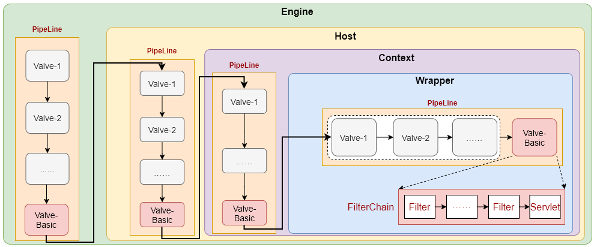

# Tomcat之请求业务逻辑处理

在上文《[Tomcat网络模型之Processor](.\Tomcat网络模型之Processor.md)》这篇文章中，我们讲了请求的业务逻辑处理最终会通过调用`getAdapter().service(request, response)`方法来处理，即通过**CoyoteAdapter**中的***service()***方法实现。所以，本文分析的就是***CoyoteAdapter.service()***方法是如何来调用到我们实现的Servlet来完成业务逻辑处理的。

## 一、CoyoteAdapter中的service方法

废话不多说，我们直接来看其实现代码：

```java
/**
 * req: coyote包下的Request对象
 * res: coyote包下的Response对象
 */
@Override
public void service(org.apache.coyote.Request req, org.apache.coyote.Response res)
    throws Exception {
	// 获取connector包下的Request对象和Response对象
    Request request = (Request) req.getNote(ADAPTER_NOTES);
    Response response = (Response) res.getNote(ADAPTER_NOTES);

    if (request == null) {
        // 不存在connector包下的Request和Response对象
        
        
        request = connector.createRequest(); // 创建一个connector包下的Request对象
        // 用connector包下的Request对象封装coyote包下的Request对象，也可以说是一个代理
        request.setCoyoteRequest(req);
        response = connector.createResponse();
        response.setCoyoteResponse(res);

        // request和Response对象绑定
        request.setResponse(response);
        response.setRequest(request);

        // 将新创建的request和response对象设置到req和res中，以便下次处理请求时使用
        req.setNote(ADAPTER_NOTES, request);
        res.setNote(ADAPTER_NOTES, response);

        // 设置queryString的字符编码为URIEncoding的值
        req.getParameters().setQueryStringCharset(connector.getURICharset());
    }

    if (connector.getXpoweredBy()) {	// 默认值为false，可通过xpoweredBy属性参数控制
        response.addHeader("X-Powered-By", POWERED_BY);// 设置响应的X-Powered-By响应头值
    }

    boolean async = false;	// 异步处理进行标志
    boolean postParseSuccess = false;	// 预处理成功

    req.getRequestProcessor().setWorkerThreadName(THREAD_NAME.get());

    try {
        // 预处理请求中的某些特定参数，主要包括：
        // 1. uri解析及映射处理
        // 2. 请求方法处理
        // 详细内容下面会分析
        postParseSuccess = postParseRequest(req, request, res, response);
        if (postParseSuccess) {
            // 预处理成功
            // 设置当前请求映射到的容器是否支持异步处理
            request.setAsyncSupported(
                connector.getService().getContainer().getPipeline().isAsyncSupported());
            // 正式调用容器来完成这个请求的业务逻辑
            // 容器处理这个请求是通过Pipeline技术的链式处理来完成最终的业务逻辑的，具体实现下面会分析
            connector.getService().getContainer().getPipeline().getFirst().invoke(
                request, response);
        }
        if (request.isAsync()) {
            // 是异步请求，并已经request.startAsync()了
            // 注意：request.startAsync()是在Servlet的业务逻辑代码中调用的
            async = true;
            // 获取IO读的监听器，这个监听器需要用户编码添加，通过request.getInputstream().setReadListener()实现
            // 注意这个读监听器是监听的Http请求的请求体的读取
            ReadListener readListener = req.getReadListener();
            if (readListener != null && request.isFinished()) {
                // IO读监听器不为空，且请求体的读取已经完毕
                ClassLoader oldCL = null;
                try {
                    oldCL = request.getContext().bind(false, null);
                    if (req.sendAllDataReadEvent()) {
                        req.getReadListener().onAllDataRead(); // 触发事件
                    }
                } finally {
                    request.getContext().unbind(false, oldCL);
                }
            }

            Throwable throwable =
                (Throwable) request.getAttribute(RequestDispatcher.ERROR_EXCEPTION);

            if (!request.isAsyncCompleting() && throwable != null) {
                // 异步请求任务刚启动，还没有开始处理就出现了异常，则触发异步错误处理
                request.getAsyncContextInternal().setErrorState(throwable, true);
            }
        } else {
            // 不是异步请求
            // 则完成请求处理流程
            request.finishRequest();
            response.finishResponse();
        }

    } catch (IOException e) {

    } finally {
        AtomicBoolean error = new AtomicBoolean(false);
        res.action(ActionCode.IS_ERROR, error);	// 获取请求处理是否发生了异常

        if (request.isAsyncCompleting() && error.get()) {
            // 异步请求，且正处于处理中的状态，但是发生了异常，会触发onComplete()事件
            res.action(ActionCode.ASYNC_POST_PROCESS,  null);
            async = false; // 
        }

        // 记录访问日志
        if (!async && postParseSuccess) {
            Context context = request.getContext();
            Host host = request.getHost();

            long time = System.currentTimeMillis() - req.getStartTime();
            if (context != null) {
                context.logAccess(request, response, time, false);
            } else if (response.isError()) {
                if (host != null) {
                    host.logAccess(request, response, time, false);
                } else {
                    connector.getService().getContainer().logAccess(
                        request, response, time, false);
                }
            }
        }

        req.getRequestProcessor().setWorkerThreadName(null);

        if (!async) {
            // 不是异步处理或异步处理已经结束了（发生了异常）
            
            // 重置状态，回收资源
            updateWrapperErrorCount(request, response); // 记录请求异常次数（内部会判断是否异常状态）
            request.recycle();
            response.recycle();
        }
    }
}
```

从整个实现来看，针对于非异步请求的逻辑是非常简单的，复杂的点在于对异步请求的处理，由于异步必然涉及到多个线程的处理逻辑所以相对要复杂。我们还是先从简单的触发，至于异步请求后续分一篇单独的文章来讲吧。我们先看一下请求预处理***postParseRequest()***方法做了什么吧：

```java
protected boolean postParseRequest(org.apache.coyote.Request req, Request request,
                                   org.apache.coyote.Response res, Response response) throws IOException, ServletException {

    if (req.scheme().isNull()) {
        req.scheme().setString(connector.getScheme());
        request.setSecure(connector.getSecure());
    } else {
        request.setSecure(req.scheme().equals("https"));
    }

	// 获取tomcat连接器配置的代理信息
    String proxyName = connector.getProxyName();
    int proxyPort = connector.getProxyPort();
    if (proxyPort != 0) {
        // 有代理，设置代理端口
        req.setServerPort(proxyPort);
    } else if (req.getServerPort() == -1) {
        // 否则设置默认的端口
        if (req.scheme().equals("https")) {
            req.setServerPort(443);
        } else {
            req.setServerPort(80);
        }
    }
    if (proxyName != null) {
        req.serverName().setString(proxyName);
    }

    // 获取请求的原始uri值，之前再Processor中已经解析存放在req的requestURI属性中的
    MessageBytes undecodedURI = req.requestURI();

    if (undecodedURI.equals("*")) {
        // 原始uri=*
        if (req.method().equalsIgnoreCase("OPTIONS")) {
            // 并且请求的方法为OPTIONS
            StringBuilder allow = new StringBuilder();
            allow.append("GET, HEAD, POST, PUT, DELETE, OPTIONS");
            if (connector.getAllowTrace()) {
                allow.append(", TRACE");
            }
            res.setHeader("Allow", allow.toString()); 	// 设置响应头Allow的值
            // 记录日志
            connector.getService().getContainer().logAccess(request, response, 0, true);
            return false;	// 返回预处理失败，Tomcat直接返回响应头Allow为指定值的200响应
        } else {
            // 请求方法不为OPTIONS，返回400响应码
            response.sendError(400, "Invalid URI");
        }
    }

    // 获取解码的uri，初次是为空值的
    MessageBytes decodedURI = req.decodedURI();

    if (undecodedURI.getType() == MessageBytes.T_BYTES) { // 原始uri还是字节状态
        // 将原始uri的内容拷贝到解码uri对象中
        decodedURI.duplicate(undecodedURI);

        // 解析请求路劲参数，放到request对象的pathParameters属性中，以URIEncoding编码解析
        // 路劲参数：/path;param1=value1;param2=value2/path1;param3=value3
        // 会将[param1,value1],[param2,value2],[param3,value3]存放到pathParameters中
        parsePathParameters(req, request);
        // 解析完路劲参数之后，decodedURI中会把路径参数取出，即变成：/path/path1

        try {
            // 解码uri中%xx转码后的值
            req.getURLDecoder().convert(decodedURI.getByteChunk(), connector.getEncodedSolidusHandlingInternal());
        } catch (IOException ioe) {
            response.sendError(400, "Invalid URI: " + ioe.getMessage());
        }
        // 规范化uri
        if (normalize(req.decodedURI())) {
            // 字符编码的解码（针对uri中含有中文等文字时的解码）
            convertURI(decodedURI, request);
            // 检测uri是否规范
            if (!checkNormalize(req.decodedURI())) {
                // 400响应码，uri非法
                response.sendError(400, "Invalid URI");
            }
        } else {
            // 规范化uri失败，400响应码，uri非法
            response.sendError(400, "Invalid URI");
        }
    } else {
        // 不是字节状态，就直接转换
        decodedURI.toChars();
        CharChunk uriCC = decodedURI.getCharChunk();
        int semicolon = uriCC.indexOf(';');
        if (semicolon > 0) {
            decodedURI.setChars(uriCC.getBuffer(), uriCC.getStart(), semicolon);
        }
    }

    MessageBytes serverName;	// 获取serverName
    if (connector.getUseIPVHosts()) {
        // 使用ip虚拟主机
        serverName = req.localName();
        if (serverName.isNull()) {
            res.action(ActionCode.REQ_LOCAL_NAME_ATTRIBUTE, null);
        }
    } else {
        serverName = req.serverName();
    }

    String version = null;
    Context versionContext = null; // context版本
    boolean mapRequired = true;	// 表示是否需要处理uri映射

    if (response.isError()) {
        // 表示uri已经是非法的，清楚非法的数据，不必要传递到Mapper中去映射处理了
        decodedURI.recycle();
    }

    while (mapRequired) {	// 循环处理映射，知道找到一个最佳的映射
        // 通过容器的映射器映射uri
        connector.getService().getMapper().map(serverName, decodedURI,
                                               version, request.getMappingData());
        // 经过映射器处理之后，会把uri对应的Host、Context、Wrapper信息保存在request的MappingData中

        if (request.getContext() == null) {
            // uri无法映射到某个Context上（也就是对应某个应用服务）
            if (!response.isError()) {
                // uri合格
                response.sendError(404); // 设置404，找不到对应资源的状态码
            }
            
            return true; // 由ErrorReportintValve来提供一个处理方式
        }

        // 成功映射到了Context上，我们可以继续处理sessionID
        String sessionID;
        if (request.getServletContext().getEffectiveSessionTrackingModes()
            .contains(SessionTrackingMode.URL)) {
            // 首先从url路径中读取sessionId的值
			// sessionId在url中是以路径参数的方法存在的，即url;jsessionid=xxxxx的方法存在
            sessionID = request.getPathParameter(
                SessionConfig.getSessionUriParamName(
                    request.getContext()));
            if (sessionID != null) {
                // 如果在url中存在sessionid，则保存在request中
                request.setRequestedSessionId(sessionID);
                request.setRequestedSessionURL(true);
            }
        }

        try {
            // 从cookie信息中读取JSESSIONID值，如果存在就覆盖url中的sessionid值
            parseSessionCookiesId(request);
        } catch (IllegalArgumentException e) {
            if (!response.isError()) {
                response.setError();
                response.sendError(400);
            }
            return true;
        }
        // 如果url和cookie中都没有sessionid，且当前请求是https的请求，则再从request.attributes中读取sessionId
        parseSessionSslId(request);

        sessionID = request.getRequestedSessionId();	// 获取读取的sessionId的值

        mapRequired = false;	// 表示uri映射成功了，不需要再映射
        if (version != null && request.getContext() == versionContext) {
            
        } else {
            // 映射的context版本与期望的版本不一致
            version = null;
            versionContext = null;

            // 获取所有的Context版本
            Context[] contexts = request.getMappingData().contexts;
            if (contexts != null && sessionID != null) {
                // 找到和sessionId关联的context版本，从大版本开始找
                for (int i = contexts.length; i > 0; i--) {
                    Context ctxt = contexts[i - 1];
                    if (ctxt.getManager().findSession(sessionID) != null) {
                        // 找到一个context
                        if (!ctxt.equals(request.getMappingData().context)) {
                            // 当前映射的版本与找到的版本不一致
                            version = ctxt.getWebappVersion();	// 记录版本号
                            versionContext = ctxt;	// 记录找到的context

                            request.getMappingData().recycle();	// 清空当前的映射信息
                            mapRequired = true;	// 需要重新再映射，继续循环

                            // 清理cookies和session信息
                            request.recycleSessionInfo();
                            request.recycleCookieInfo(true);
                        }
                        break;
                    }
                }
            }
        }

        if (!mapRequired && request.getContext().getPaused()) {
            // 找到了一个匹配的context，但是context是处于暂停状态
            try {
                Thread.sleep(1000);	// 让线程暂停1s
            } catch (InterruptedException e) {

            }
            // 再重新映射
            request.getMappingData().recycle();
            mapRequired = true; // 继续循环
        }
    }	// 退出映射

    // 获取可能需要重定向的信息
    MessageBytes redirectPathMB = request.getMappingData().redirectPath;
    if (!redirectPathMB.isNull()) {
        // 需要重定向
        String redirectPath = URLEncoder.DEFAULT.encode(
            redirectPathMB.toString(), StandardCharsets.UTF_8);
        String query = request.getQueryString();
        if (request.isRequestedSessionIdFromURL()) {
            // 如果原来的sessionid是在url中的，则在拼接sessionid到重定向url上
            redirectPath = redirectPath + ";" +
                SessionConfig.getSessionUriParamName(
                request.getContext()) +
                "=" + request.getRequestedSessionId();
        }
        if (query != null) {
            // 拼接查询参数串
            redirectPath = redirectPath + "?" + query;
        }
        response.sendRedirect(redirectPath);	// 设置重定向路径到响应头中
        request.getContext().logAccess(request, response, 0, true);// 记录日志
        return false;
    }

    if (!connector.getAllowTrace()	// 不允许TRACE请求方法
        && req.method().equalsIgnoreCase("TRACE")) {
        // 处理TRACE请求方法
        Wrapper wrapper = request.getWrapper();
        String header = null;
        if (wrapper != null) {
            String[] methods = wrapper.getServletMethods();
            if (methods != null) {
                for (String method : methods) {
                    if ("TRACE".equals(method)) {
                        continue;
                    }
                    if (header == null) {
                        header = method;
                    } else {
                        header += ", " + method;
                    }
                }
            }
        }
        if (header != null) {
            res.addHeader("Allow", header);
        }
        response.sendError(405, "TRACE method is not allowed");	// 响应一个Allow头，表示允许的请求方法
        return true;
    }

    doConnectorAuthenticationAuthorization(req, request);	// http认证处理
    return true;
}
```

所以，在请求预处理过程中，主要完成了如下几件事情：

1. uri的http解码和字符解码；
2. 路径参数的解析；
3. uri的规范化检测；
4. uri映射关系定位处理；
5. sessionId的读取；
6. http认证处理。

其中的核心在于uri的映射，即根据uri找到对应的Host、Context和Wrapper（Servlet），从而在正式处理请求的时候可以定位到真正的Servlet来完成业务逻辑处理。针对于uri映射关系的处理，在我专门的文章中有解析，这里不再赘述。

## 二、容器处理

我们在上面分析***service()***方法的时候说到，在请求预处理成功之后，会通过如下语句来触发容器对请求的业务处理：

```java
connector.getService().getContainer().getPipeline().getFirst().invoke(request, response);
```

其基本逻辑为：

1. 通过CoyoteAdapter绑定的连接器Connector实例获取与Connector关联的Service组件，这一点从Tomcat的配置文件server.xml我们就可以看到；
2. 获取到Service组件之后，我们就可以获取到Service组件中的顶级容器Engine；
3. 之后通过Pipeline技术来实现容器对请求的业务逻辑处理。

组件与容器之间的关系我们从server.xml配置就很容器清晰的认识到，关键在于Pipeline技术是如何层层递进到最终的Servlet来处理请求的，请看下图：



在每个级别的容器中都会维护自己的一个Pipeline实例，每个Pipeline实例中维护了一个Valve链，Valve链的最后一个Valve实例一定是各个容器对应的基础Valve实例，基础Valve实例是Tomcat提供的，在创建各个容器的时候就会添加到Pipeline中的，不需要我们自己再去配置的。比如：Engine容器对应的基础Valve实例类型为StandardEngineValve，Host容器对应的基础Valve实例类型为StandardHostValve等等依次命名类推；在每个Pipeline的最后一个基础Valve中都会通过当前请求对象映射到的容器实例来获取下一级容器中的Pipeline，并从第一个Valve逐个执行到最后一个。

在最终的Servlet容器Wrapper中，也可以配置多个Valve，最后会调用其对应的基础Valve实例**StandardWrapperValve**的invoke方法，就是在这个invoke方法中完成对Servlet实例的加载、初始化、过滤器的链的构造、过滤器链的执行、Servlet实例的销毁等等一系列的操作。

### Valve的配置

各个容器中基础Valve是在实例化各容器的时候就会添加到链表中的，而如果需要配置额外功能的（即可以是Tomcat提供的也可以是自定义实现的）Valve，Tomcat提供了在server.xml配置文件各容器元素的子元素中配置的方式，如下所示：

```xml
<Engine name="" defaultHost="" [backgroudProcessorDelay=""] [className=""] [jvmRoute=""] [startStopThreads=""]>
    <Valve/> 	<!-- 可多个 -->
    <Host name="" appBase="" [...]>
        <Valve/>	<!-- 可多个 -->
        <Context>	<!-- 可多个 -->
            <Valve/> <!-- 可多个 -->
        </Context>
    </Host>
</Engine>
```

:warning:在server.xml中只能配置Engine、Host及Context容器级别的Valve；而对于Wrapper级别（Servlet级别，每个Wrapper对应一个Servlet）的Valve，tomcat并没有提供可配置的方式来添加额外的Valve，web.xml中也没有提供，所以在Wrapper级别的Valve链表应该就只有StandardWrapperValve这一个类型实例的Valve在链表中。

