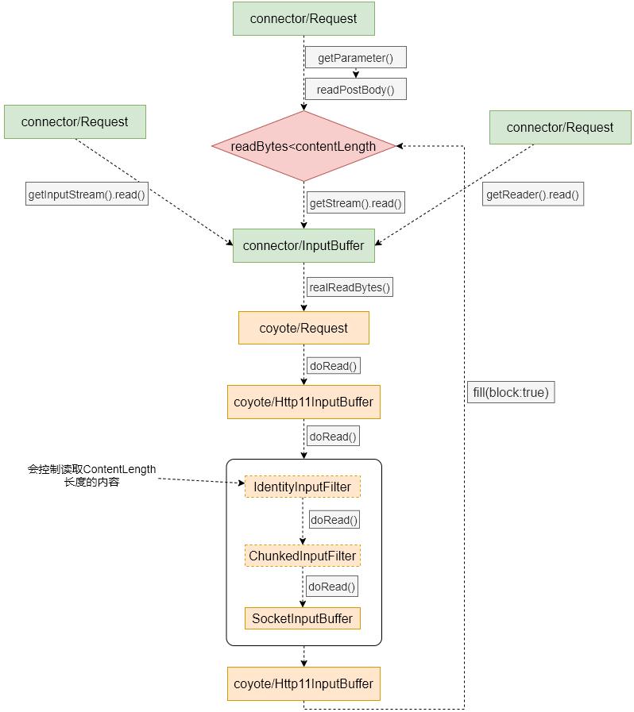

# 请求解析

在文章[网络模型之Processor](!网络模型之Processor.md)中，我们有提到会解析http请求的请求行以及请求头数据保存到coyote包下的Request对象中，那么在Tomcat中到底是如何解析Http请求的呢？响应给客户端的数据又是如何发送的呢？本文将带你一起分析Http请求内容的解析和响应发送处理的过程。

我们知道Http协议中将Http请求分成三个部分，分别是：请求行、请求头、空行以及请求体；在Tomcat解析的时候也一样，是分部解析的，先解析请求行，再解析请求头最后解析请求体。其中请求行和请求头的解析是在Processor组件中完成的（前文提到的文章中有讲）；而对于请求体的解析则由用户根据业务需求调用相关方法时进行读取。

:warning:所有内容的解析只会进行一次，解析完的内容会保存在相关对象属性中。

在Tomcat中，对Http请求的解析是由**Http11InputBuffer**类来完成，即在**Http11Processor**类中引用的解析类。

## 一. 请求行解析

请求行解析是由***parseRequestLine()***方法来完成的，其触发解析的时机是在***Http11Processor.service()***方法中被触发的；解析实现代码如下：

```java
/**
 * 请求行格式： method uri protocol  例：GET /index.do?p=xxx HTTP/1.1
 * keptAlive: 在连续解析同一个TCP连接上的多个http请求时，第一次为false，后面为true；
 * 每间断一段时间重新解析这个TCP连接上的请求时，都是先false，后true
 */
boolean parseRequestLine(boolean keptAlive) throws IOException {

    if (!parsingRequestLine) {
        // 已经解析完请求行了
        return true;
    }

    if (parsingRequestLinePhase < 2) {
        // 解析请求行
        do {
            /**
             * byteBuffer: 字节缓冲，Http11InputBuffer中属性，用于存放从socket读取的数据，
             * 其分配的大小为：headerBufferSize + Wrapper.getSocketBufferHandler.readBuffer.capacity；
             * 初始时，position = limit = 0
             */
            if (byteBuffer.position() >= byteBuffer.limit()) {
                if (keptAlive) {
                    // 读数据之前，设置超时时间为keepAliveTimeout
                    wrapper.setReadTimeout(wrapper.getEndpoint().getKeepAliveTimeout());
                }
                if (!fill(false)) { // fill()完成将socket内容读取到byteBuffer中
                    // 读取socket内容失败（没有可读内容），返回解析Http请求行失败
                    parsingRequestLinePhase = 1;
                    return false;
                }
                // 读取socket内容成功，重设超时时间为connectionTimeout
                wrapper.setReadTimeout(wrapper.getEndpoint().getConnectionTimeout());
            }
            if (!keptAlive && byteBuffer.position() == 0 && byteBuffer.limit() >= CLIENT_PREFACE_START.length - 1) {
                // 对于是否是Http/2协议请求的判断
                boolean prefaceMatch = true;
                for (int i = 0; i < CLIENT_PREFACE_START.length && prefaceMatch; i++) {
                    if (CLIENT_PREFACE_START[i] != byteBuffer.get(i)) {
                        prefaceMatch = false;
                    }
                }
                if (prefaceMatch) {
                    // 匹配，说明请求内容是匹配Http/2协议请求头的，返回false，由Processor层面去做协议升级处理
                    parsingRequestLinePhase = -1;
                    return false;
                }
            }
            if (request.getStartTime() < 0) {
                request.setStartTime(System.currentTimeMillis());
            }
            chr = byteBuffer.get();	// 获取读取的请求的第一个字节
        } while ((chr == Constants.CR) || (chr == Constants.LF));	// 如果是换行符，继续循环，第一次就应该会退出循环
        // 不是换行符之后，退出循环
        // position位置回退一位，回到非换行字符开始处
        byteBuffer.position(byteBuffer.position() - 1);

        parsingRequestLineStart = byteBuffer.position();	// 记录请求行的开始字符处
        parsingRequestLinePhase = 2;	// 进入解析请求行的第二阶段
    }
    if (parsingRequestLinePhase == 2) {
        boolean space = false;
        while (!space) {
            if (byteBuffer.position() >= byteBuffer.limit()) {
                // 字节缓冲中读取到的内容已经处理完毕
                if (!fill(false))	// 继续从socket中读取内容
                    // 读取失败（无可读内容），返回false
                    // 在分析Processor的时候我们说过，返回false时，会当成未完成请求行读取处理，即readComplete=false
                    // 会重新注册一个read事件到poller，且不会解除连接与Processor的绑定关系，以便下一次继续读取
                    return false;
            }
            // 字节缓冲中还有内容可处理
            
            int pos = byteBuffer.position(); // 记录现在待读字节的位置
            chr = byteBuffer.get(); // 获取下一个字节内容
            if (chr == Constants.SP || chr == Constants.HT) {
                // 是空格或者是tab空格，说明已经解析到请求行的method部分的结尾处，要结束此次循环读取
                space = true;
                // 将ByteBuffer中字节数组指定位置的信息保存到request对象中的method属性中（ByteChunk类型）
                request.method().setBytes(byteBuffer.array(), parsingRequestLineStart,
                                          pos - parsingRequestLineStart);
            } else if (!HttpParser.isToken(chr)) {	// 判断读取的字节是否是Http协议标准中规范的字符
                // 不是规范字符，抛出非法参数异常
                request.protocol().setString(Constants.HTTP_11);
                String invalidMethodValue = parseInvalid(parsingRequestLineStart, byteBuffer);
                throw new IllegalArgumentException(sm.getString("iib.invalidmethod", invalidMethodValue));
            }
        }
        parsingRequestLinePhase = 3;	// 解析到method之后，进入第三阶段解析
    }
    if (parsingRequestLinePhase == 3) {	// 第三阶段就是要跳过空格，methd uri之间的空格部分
        boolean space = true;
        while (space) {
            if (byteBuffer.position() >= byteBuffer.limit()) {
                if (!fill(false))
                    return false;
            }
            chr = byteBuffer.get();
            if (!(chr == Constants.SP || chr == Constants.HT)) {
                space = false;
                byteBuffer.position(byteBuffer.position() - 1);
            }
        }
        parsingRequestLineStart = byteBuffer.position();	// 再次记录开始位置，即uri部分的开头位置
        parsingRequestLinePhase = 4;	// 进入第四阶段开始解析uri部分
    }
    if (parsingRequestLinePhase == 4) {

        int end = 0;
        boolean space = false;
        while (!space) {
            if (byteBuffer.position() >= byteBuffer.limit()) {
                // 字节缓冲中的内容处理完了，继续读取socket中的请求内容
                if (!fill(false))
                    return false;
            }
            int pos = byteBuffer.position();
            prevChr = chr;	// 记录前一个字符
            chr = byteBuffer.get();	// 获取当前字符
            if (prevChr == Constants.CR && chr != Constants.LF) {
                // 不是标准的换行符格式，直接跑异常
                request.protocol().setString(Constants.HTTP_11);
                String invalidRequestTarget = parseInvalid(parsingRequestLineStart, byteBuffer);
                throw new IllegalArgumentException(sm.getString("iib.invalidRequestTarget", invalidRequestTarget));
            }
            if (chr == Constants.SP || chr == Constants.HT) {
                space = true;	// 读取到了空字符，记录结束位置和设置退出循环标记
                end = pos;
            } else if (chr == Constants.CR) {
				// Http/0.9 版本的请求协议CR在请求行是可选的字符
            } else if (chr == Constants.LF) {
                // Http/0.9 版本的请求协议
                space = true;
                request.protocol().setString("");
                parsingRequestLinePhase = 7;
                if (prevChr == Constants.CR) {
                    end = pos - 1;
                } else {
                    end = pos;
                }
            } else if (chr == Constants.QUESTION && parsingRequestLineQPos == -1) {
                // 如果是问号，记录位置
                parsingRequestLineQPos = pos;
            } else if (parsingRequestLineQPos != -1 && !httpParser.isQueryRelaxed(chr)) {
                // 非法字符，也就是说字符不是/、%、@等字符
                request.protocol().setString(Constants.HTTP_11);
                String invalidRequestTarget = parseInvalid(parsingRequestLineStart, byteBuffer);
                throw new IllegalArgumentException(sm.getString("iib.invalidRequestTarget", invalidRequestTarget));
            } else if (httpParser.isNotRequestTargetRelaxed(chr)) {
                // 非法字符
                request.protocol().setString(Constants.HTTP_11);
                String invalidRequestTarget = parseInvalid(parsingRequestLineStart, byteBuffer);
                throw new IllegalArgumentException(sm.getString("iib.invalidRequestTarget", invalidRequestTarget));
            }
        }
        if (parsingRequestLineQPos >= 0) {
            // 如果有问号，则分别记录下queryString 和 uri 到Request对象的queryString和requestURI字段
            request.queryString().setBytes(byteBuffer.array(), parsingRequestLineQPos + 1,
                                           end - parsingRequestLineQPos - 1);
            request.requestURI().setBytes(byteBuffer.array(), parsingRequestLineStart,
                                          parsingRequestLineQPos - parsingRequestLineStart);
        } else {
            // 没有问号，则记录下uri到Request对象的requestURI
            request.requestURI().setBytes(byteBuffer.array(), parsingRequestLineStart,
                                          end - parsingRequestLineStart);
        }
        if (parsingRequestLinePhase == 4) {
            parsingRequestLinePhase = 5;	// uri解析完成，进入到下一阶段
        }
    }
    if (parsingRequestLinePhase == 5) {	// 跳过uri protocol之间的空格
        boolean space = true;
        while (space) {
            if (byteBuffer.position() >= byteBuffer.limit()) {
                if (!fill(false))
                    return false;
            }
            byte chr = byteBuffer.get();
            if (!(chr == Constants.SP || chr == Constants.HT)) {
                space = false;
                byteBuffer.position(byteBuffer.position() - 1);
            }
        }
        parsingRequestLineStart = byteBuffer.position();
        parsingRequestLinePhase = 6;

        end = 0;
    }
    if (parsingRequestLinePhase == 6) {	// 开始处理protocol部分
        while (!parsingRequestLineEol) {	// 没到请求行的末尾
            if (byteBuffer.position() >= byteBuffer.limit()) {
                // 从socket中继续读取数据
                if (!fill(false)) 
                    return false;
            }

            int pos = byteBuffer.position();
            prevChr = chr;
            chr = byteBuffer.get();
            if (chr == Constants.CR) {
            } else if (prevChr == Constants.CR && chr == Constants.LF) {
                // 到了请求行末尾，记录
                end = pos - 1;
                parsingRequestLineEol = true;
            } else if (!HttpParser.isHttpProtocol(chr)) {
                // 不是请求协议的字符，抛异常
                String invalidProtocol = parseInvalid(parsingRequestLineStart, byteBuffer);
                throw new IllegalArgumentException(sm.getString("iib.invalidHttpProtocol", invalidProtocol));
            }
        }

        if ((end - parsingRequestLineStart) > 0) {
            // 记录下协议值到Request对象的protocol字段中
            request.protocol().setBytes(byteBuffer.array(), parsingRequestLineStart,
                                        end - parsingRequestLineStart);
            parsingRequestLinePhase = 7;
        }
    }
    if (parsingRequestLinePhase == 7) {	// 请求行处理完毕
        parsingRequestLine = false;	// 不需要再解析请求行了
        parsingRequestLinePhase = 0;
        parsingRequestLineEol = false;
        parsingRequestLineStart = 0;
        return true;
    }
    throw new IllegalStateException(sm.getString("iib.invalidPhase", Integer.valueOf(parsingRequestLinePhase)));
}
```

上述代码主要是对读取内容的解析，这个按照Http协议标准操作就可以，关键点我们是如何从socket中读取内容的呢，且看***fill()***方法的实现：

```java
/**
 * block：控制是否阻塞读
 */
private boolean fill(boolean block) throws IOException {

    if (parsingHeader) {	// parsingHeader初始值为true
        if (byteBuffer.limit() >= headerBufferSize) { // 如果已经从socket中读取了内容到ByteBuffer
            // 读取的内容长度超过了headerBufferSize
            // 这里很奇怪为什么是headerBufferSize呢，理论上byteBuffer中肯定包括了请求行数据、甚至请求体可能都包含在里面了啊，没想清楚
            if (parsingRequestLine) {
                request.protocol().setString(Constants.HTTP_11);
            }
            // 抛出请求头过长的异常
            throw new IllegalArgumentException(sm.getString("iib.requestheadertoolarge.error"));
        }
    } else {
        // 解析完请求头之后，end就是请求头的末尾位置
        // 再解析请求体的时候，每读一部分请求体数据就会设置position位置为请求头的末尾处
        // 所以不用担心byteBuffer空间不够用
        byteBuffer.limit(end).position(end);
    }

    byteBuffer.mark();	// 标记position的位置
    if (byteBuffer.position() < byteBuffer.limit()) {
        // byteBuffer中的内容没有全部处理完成，将position设置到limit位置，将读取的内容从limit后面接着
        // 写入到byteBuffer中
        byteBuffer.position(byteBuffer.limit());
    }
    byteBuffer.limit(byteBuffer.capacity());	// 扩充limit位置到内部字节缓冲的末尾
    int nRead = wrapper.read(block, byteBuffer);	// 通过wrapper完成从socket读取数据到byteBuffer的功能
    byteBuffer.limit(byteBuffer.position()).reset();	// 将limit设置到读取内容的末尾，并将position恢复到之前标记的位置，以便继续从原位置处理
    if (nRead > 0) {
        // 有从socket读取到内容
        return true;
    } else if (nRead == -1) {
        // 读取到EOF了
        throw new EOFException(sm.getString("iib.eof.error"));
    } else {
        // 没有读取到内容，无内容可读
        return false;
    }

}
```

真正从socket读取内容的操作是通过`warpper.read()`来实现的，它是属于**SocketWrapperBase**中的方法，在NIO模型下的实现类为***NioSocketWrapper.read()***，来围观一下它的实现：

```java
/**
 * block：用于控制是否阻塞读
 */
@Override
public int read(boolean block, ByteBuffer to) throws IOException {
    // 计算NioChannel的SocketBufferHandler中的readBuffer中是否有读取的缓存的数据
    // 如果有，则将这些数据拷贝to这个字节缓冲中，并返回拷贝的字节数
    int nRead = populateReadBuffer(to);
    if (nRead > 0) {
        // 如果readBuffer中有读的缓存数据，则返回拷贝的字节数
        return nRead;
    }

    // readBuffer中没有缓存的数据，则需要从socket中读取
    
    // 先获取设置的readBuffer缓冲区的大小，socket.appReadBufSize的大小，在Acceptor模块中有讲到
    int limit = socketBufferHandler.getReadBuffer().capacity();
    if (to.remaining() >= limit) {	// to字节缓冲中的可用空间大于limit
        to.limit(to.position() + limit);	// 重新设置limit的位置，意味着每次读取的内容长度还是不会超过readBuffer的capacity大小
        nRead = fillReadBuffer(block, to);	// 通过fillReadBuffer方法将socket中的内容读取到字节缓冲中
        updateLastRead();	// 更新最后一次读的时间，用于下次超时判断
    } else {
        // to字节缓冲中的可用空间小于limit
        nRead = fillReadBuffer(block);	// 将socket中的内容先读到readBuffer缓冲中
        updateLastRead();	// 更新读时间

        if (nRead > 0) {
            // 将读取到readBuffer中的内容拷贝到to字节缓冲中
            // 由于to字节缓冲中的可用空间比readBuffer的capacity小，所以这一次拷贝完了，可能readBuffer中还有一些内容没有拷贝完毕
            nRead = populateReadBuffer(to);
        }
    }
    return nRead;
}
```

***populateReadBuffer(to)***方法的实现比较简单，就是完成将socketBufferHandler中的readBuffer内容拷贝到指定的to指向的字节缓冲中，并返回拷贝的长度，这里就不分析了，我们来看一下***fillReadBuffer()***这个方法是如何读取socket内容的：

```java
// 将socket内容读取到socketBufferHandler的readBuffer缓冲中
private int fillReadBuffer(boolean block) throws IOException {
    socketBufferHandler.configureReadBufferForWrite();
    return fillReadBuffer(block, socketBufferHandler.getReadBuffer());	// 调用下面的方法
}

// 将socket内容读取到to指向的缓冲中
private int fillReadBuffer(boolean block, ByteBuffer to) throws IOException {
    int nRead;
    NioChannel channel = getSocket();	// 获取NioChannel对象（在创建NioSocketWrapper时会传）
    if (block) {	
        // 如果是想阻塞读
        Selector selector = null;
        try {
            selector = pool.get();	// 从SelectorPool中获取一个Selector实例
            // pool是通过构造方法传入的，至于什么时候传入的，可以参考我这个系列中Acceptor的分析文章
        } catch (IOException x) {

        }
        try {
            // 获取attachment信息，就是上下文信息
            NioEndpoint.NioSocketWrapper att = (NioEndpoint.NioSocketWrapper) channel
                .getAttachment();
            if (att == null) {
                throw new IOException("Key must be cancelled.");
            }
            // 通过pool来完成阻塞读的功能
            nRead = pool.read(to, channel, selector, att.getReadTimeout());
        } finally {
            if (selector != null) {
                pool.put(selector);
            }
        }
    } else {
        // 如果不想阻塞读，则直接通过channel的read方法来读
        // 内部就是调用的SocketChannel.read(to)方法，我们知道SocketChannel中的读方法是非阻塞的
        // nRead就是读取到的内容的字节长度
        // 这里也可以通过pool.read(to, channel, selector, att.getReadTimeout, false)来实现，不过没必要
        nRead = channel.read(to);
        if (nRead == -1) {
            // 读到了EOF，抛出EOF异常
            throw new EOFException();
        }
    }
    return nRead;
}
```

我们在Acceptor组件分析文章中知道了所有客户端socket都是非阻塞模式的，那么上面提到的阻塞读是怎么实现的呢？这就要用到之前在Acceptor文章中提到了**SelectorPool**这个类了，我们看一下它的***read()***方法吧。

```java
/////// SelectorPool.java //////

// 阻塞读
public int read(ByteBuffer buf, NioChannel socket, Selector selector, long readTimeout) throws IOException {
    return read(buf,socket,selector,readTimeout,true);	// 调用下面的重载方法
}

public int read(ByteBuffer buf, NioChannel socket, Selector selector, long readTimeout, boolean block) throws IOException {
    // SHARED默认值为true，只能通过系统属性org.apache.tomcat.util.net.NioSelectorShared来更改
    // SHARED用来表示是否共用一个selector来完成一次Http请求过程中阻塞读写操作
    if ( SHARED && block ) {
        // 当前条件下，会走这个分支，即通过blockingSelector来实现阻塞读
        // 共享selector模式下的阻塞读
        return blockingSelector.read(buf,socket,readTimeout);
    }
    SelectionKey key = null;
    int read = 0;	// 记录从socket中读取的数据量
    boolean timedout = false;	// 默认没有超时
    int keycount = 1;	// 默认有可读事件发生
    long time = System.currentTimeMillis();// 记录开始读的时间
    try {
        while ( (!timedout) ) {
            int cnt = 0;
            if ( keycount > 0 ) {
                cnt = socket.read(buf);	// 直接通过socket来读数据
                if (cnt == -1) {
                    // 读到了末尾
                    if (read == 0) {
                        // 读到的总数据量为0，设置为-1，表示已经是末尾了
                        read = -1;
                    }
                    break;// 退出循环
                }
                read += cnt;	// 加上此次读到的数据量大小
                if (cnt > 0) 	
                    // 此次读到了内容，continue继续进行下一次读，以便读取更多的数据
                    continue;
                if (cnt==0 && (read>0 || (!block) ) ) 
                    // 此次没有读取到内容，但是之前已经读到了内容或者是非阻塞模式，直接退出循环
                    break;
            }
            // 到了这里，说明此次没有读取到内容，且之前也没有读取到任何内容，并且是阻塞模式读
            // 到了这里说明是非共享模式下的阻塞读
            if ( selector != null ) {
                // 共享模式下，selector使用是同一个SHARED_SELECTOR（不会为null），非共享模式下就是从selector池中获取的一个selector实例（可能会为null）
                if (key==null) 
                    // 将当前socket注册到这个selector实例上，并关注read事件
                    key = socket.getIOChannel().register(selector, SelectionKey.OP_READ);
                else 
                    key.interestOps(SelectionKey.OP_READ);
                if (readTimeout==0) { // 如果设置的超时时间是0
                    timedout = (read==0);	// 读取的内容为0就认为超时
                } else if (readTimeout<0) {	// 设置的超时时间小于0，则一直阻塞等待事件发生
                    keycount = selector.select();
                } else {
                    keycount = selector.select(readTimeout);	// 否则等待readTimeout时间
                }
            }
            if (readTimeout > 0 && (selector == null || keycount == 0) ) 
                // 没有事件发生，则判断是否已经超时了
                timedout = (System.currentTimeMillis()-time)>=readTimeout;
        }
        if ( timedout )
            // 如果超时，抛出超时异常
            throw new SocketTimeoutException();
    } finally {
        if (key != null) {
            // 注册过socket到selector，则需要将socket取消，移到cancelledKeys集合中
            key.cancel();
            if (selector != null) 
                selector.selectNow();	// 清除cancelledKeys集合
        }
    }
    return read;	// 返回读取的总内容
}
```

上面介绍的是一种阻塞读的方式，还有一种是通过`blockingSelector.read(buf,socket,readTimeout)`实现阻塞读的方式，blockingSelector是**NioBlockingSelector**类的实例，我们也一起来看一下它实现阻塞的方式：

```java
/////// NioBlockingSelector.java //////////
public int read(ByteBuffer buf, NioChannel socket, long readTimeout) throws IOException {
    // 首先通过socket绑定的Poller中的Selector获取到SelectionKey
    SelectionKey key = socket.getIOChannel().keyFor(socket.getPoller().getSelector());
    if ( key == null ) throw new IOException("Key no longer registered");
    KeyReference reference = keyReferenceStack.pop();
    if (reference == null) {
        reference = new KeyReference();
    }
    NioSocketWrapper att = (NioSocketWrapper) key.attachment();	// 获取到attachment上下文信息
    int read = 0;
    boolean timedout = false;
    int keycount = 1;  // 假设有读事件
    long time = System.currentTimeMillis();
    try {
        while(!timedout) {	// 没有超时就循环
            if (keycount > 0) {
                read = socket.read(buf);
                if (read != 0) {
                    // 读到了内容或者是EOF直接退出循环
                    break;
                }
            }
            // 没有读到内容，阻塞读实现
            try {
                if ( att.getReadLatch()==null || att.getReadLatch().getCount()==0) 
                    // 创建一个CountDownLatch，并设置值为1
                    att.startReadLatch(1);
                // 将att，read事件，reference添加到poller中
                // 注意这里的Poller不再是NioEndpoint.Poller了，而是属于NioBlockingSelector.BlockingPoller
                // 这个Poller的实现流程跟NioEndpoint.Poller是一样的，但是就是对于就绪事件的发生时处理不一样
                // 这个Poller在就绪事件发生时，是将对应的att.readLatch或att.writeLatch进行减一操作，从而结束阻塞
                poller.add(att,SelectionKey.OP_READ, reference);
                // 通过CountdownLatch来实现阻塞
                if (readTimeout < 0) {
                    att.awaitReadLatch(Long.MAX_VALUE, TimeUnit.MILLISECONDS);
                } else {
                    att.awaitReadLatch(readTimeout, TimeUnit.MILLISECONDS);
                }
            } catch (InterruptedException ignore) {
            }
            // 到了这里，说明CountDownLatch的阻塞结束了，要不就是阻塞时间到了，要不就是read事件发生了
            if ( att.getReadLatch()!=null && att.getReadLatch().getCount()> 0) {
                // 阻塞时间到了
                keycount = 0;
            }else {
                // read时间发生了
                keycount = 1;
                att.resetReadLatch();	// 清楚latch
            }
            if (readTimeout >= 0 && (keycount == 0))
                // 没有read时间发生，计算超时
                timedout = (System.currentTimeMillis() - time) >= readTimeout;
        }
        if (timedout)
            // 超时异常
            throw new SocketTimeoutException();
    } finally {
        poller.remove(att,SelectionKey.OP_READ); // 移除read事件
        if (timedout && reference.key!=null) {
            // 超时了，就需要取消selectionkey，加入到cancelledKeys集合
            // 这里不需要通过selectNow()来清空cancelledKeys集合的原因是：
            // poller中的run方法是个无限循环，在其内部会调用相关select()方法，这些方法会清除
            poller.cancelKey(reference.key);
        }
        reference.key = null;
        keyReferenceStack.push(reference);
    }
    return read;	// 返回读取到的内容长度
}
```

所以，这里总结一下两种阻塞的实现方式：

1. 共享Selector模式下，通过CountDownLatch与BlockingPoller相结合的方式来实现阻塞读写；
2. 非共享Selector模式，即SelectorPool模式下，是直接通过池中单个Selector的select(timeout)来实现的阻塞读写。

对于控制共享模式，只能通过添加系统属性`org.apache.tomcat.util.net.NioSelectorShared`来控制，默认是共享模式的。

从后续分析我们发现，在读取请求行和请求头的时候，是以非阻塞模式去读socket的，而在读取请求体的时候则是以阻塞模式去读的，这是什么原因呢？因为读取请求行和请求头是在Processor中处理的，Processor需要根据请求行和请求头的信息才能确定到需要哪个Servlet容器来处理这个请求；这个时候如果读取到http请求行和请求头的信息不完整，说明客户端还没有发送完整个Http请求，而在服务器端也不知道客户端会什么时候发送完整个http请求，所以此时Tomcat会以非阻塞方式读取，发现读不到数据，就只能继续注册一个监听事件之后，就要释放掉占用的这个线程资源以便用于其他请求的处理；而对于请求体数据的读取都是发生在Servlet业务层面逻辑了，这个时候用户已经开始处理业务了，针对它需要的请求体数据只能等待一直到读取完成，如果在这里还已非阻塞读那对业务层面来说就存在数据的不完整性，而对于tomcat来说要保证业务层面这个数据的完整性是非常困难的。

## 二. 请求头解析

请求头解析是通过***parseHeaders()***方法来完成的，其触发也是在***Http11Processor.service()***方法中再解析完请求行之后进行的，其实现代码如下：

```java
/**
 * 解析http请求的所有请求头
 */
boolean parseHeaders() throws IOException {
    if (!parsingHeader) {
        // 已经解析过请求头，抛出状态异常
        throw new IllegalStateException(sm.getString("iib.parseheaders.ise.error"));
    }

    HeaderParseStatus status = HeaderParseStatus.HAVE_MORE_HEADERS; // 设置默认解析状态

    do {
        status = parseHeader();	// 每次解析一个请求头

        // 这里始终没有想明白，为什么大于headerBufferSize就认为是请求头过大了
        // 因为byteBuffer里面还包含请求行的数据，如果请求行的数据很大，而请求头很小，这里不会有问题？
        if (byteBuffer.position() > headerBufferSize || byteBuffer.capacity() - byteBuffer.position() < socketReadBufferSize) {
            throw new IllegalArgumentException(sm.getString("iib.requestheadertoolarge.error"));
        }
    } while (status == HeaderParseStatus.HAVE_MORE_HEADERS);	// 如果还有请求头需要解析则继续循环
    if (status == HeaderParseStatus.DONE) {
        // 请求头数据已经解析完毕
        parsingHeader = false;	// 设置解析状态
        end = byteBuffer.position();	// 记录end位置为请求头数据的末尾
        return true;	// 返回解析完成
    } else {
        return false;	// 返回解析请求头失败
    }
}

/**
 * 解析单个请求头数据
 */
private HeaderParseStatus parseHeader() throws IOException {
    // headerParsePos记录当前解析请求头的进度或阶段，默认是HEADER_START
    while (headerParsePos == HeaderParsePosition.HEADER_START) {

        // 判断是否需要从socket中继续读数据
        if (byteBuffer.position() >= byteBuffer.limit()) {
            if (!fill(false)) {
                headerParsePos = HeaderParsePosition.HEADER_START;
                // 表示还需要更多的数据，即readComplete=false，会重新注册一个read事件到Poller
                return HeaderParseStatus.NEED_MORE_DATA;
            }
        }

        // 在解析完请求行之后，chr=LF，prevChr=CR
        prevChr = chr;	// prevChr = LF
        chr = byteBuffer.get();	// chr读取一个新值

        if (chr == Constants.CR && prevChr != Constants.CR) {
            // 表示可能开始读到CRLF了，继续读下一个字节就可以了
        } else if (prevChr == Constants.CR && chr == Constants.LF) {
            // 读到了CRLF，可以认为请求头结束了，因为当前headerParsePos的状态为HEADER_START
            // 应该是要读一个新的请求头数据的，现在连续读到了CRLF，说明是读到了空行，读到空行就说明
            // 请求头解析已经结束
            return HeaderParseStatus.DONE;
        } else {
            // chr不是LF，说明是请求头名称了
            if (prevChr == Constants.CR) {
                // 说明请求头以CR开头的
                byteBuffer.position(byteBuffer.position() - 2);
            } else {
                // 请求头以chr的值开头的
                byteBuffer.position(byteBuffer.position() - 1);
            }
            break;	// 退出循环，开始解析请求头的名称
        }
    }

    if (headerParsePos == HeaderParsePosition.HEADER_START) {
        headerData.start = byteBuffer.position();	// 记录请求头名称的开始位置
        headerData.lineStart = headerData.start;
        headerParsePos = HeaderParsePosition.HEADER_NAME; // 进入解析请求头名称阶段
    }

	// 读取请求头的名称
    while (headerParsePos == HeaderParsePosition.HEADER_NAME) {

        if (byteBuffer.position() >= byteBuffer.limit()) {
            if (!fill(false)) { // parse header
                return HeaderParseStatus.NEED_MORE_DATA;
            }
        }

        int pos = byteBuffer.position();
        chr = byteBuffer.get();
        if (chr == Constants.COLON) {
            // 读到了冒号，说明请求头名称读取结束了
            headerParsePos = HeaderParsePosition.HEADER_VALUE_START; // 标记进入请求头值解析阶段
            // 在headers中新建一个MimeHeaderField用于存放这个新的请求头
            // 这里addValue是把请求头名称存放到新建的MimeHeaderField中，并返回代表这个请求头值的一个对象
            headerData.headerValue = headers.addValue(byteBuffer.array(), headerData.start,
                                                      pos - headerData.start);
            pos = byteBuffer.position();
            headerData.start = pos;	// 记录请求头值的开始位置
            headerData.realPos = pos;
            headerData.lastSignificantChar = pos; // 记录请求头值的结束位置
            break;
        } else if (!HttpParser.isToken(chr)) {
			// 如果请求头名称是不合规的字符（默认配置情况下不会抛出异常），则跳过这个请求头，不解析
            headerData.lastSignificantChar = pos;
            byteBuffer.position(byteBuffer.position() - 1);
            return skipLine();
        }

        // 把大写字符转换成小写字符
        if ((chr >= Constants.A) && (chr <= Constants.Z)) {
            byteBuffer.put(pos, (byte) (chr - Constants.LC_OFFSET));
        }
    }

    // 是SKIPLINE状态，就跳过一行
    if (headerParsePos == HeaderParsePosition.HEADER_SKIPLINE) {
        return skipLine();
    }

    //
    // 读取请求头的值
    //
    while (headerParsePos == HeaderParsePosition.HEADER_VALUE_START ||
           headerParsePos == HeaderParsePosition.HEADER_VALUE ||
           headerParsePos == HeaderParsePosition.HEADER_MULTI_LINE) {

        if (headerParsePos == HeaderParsePosition.HEADER_VALUE_START) {
            // 跳过请求头的值前面的空格
            while (true) {
                if (byteBuffer.position() >= byteBuffer.limit()) {
                    if (!fill(false)) {
                        return HeaderParseStatus.NEED_MORE_DATA;
                    }
                }

                chr = byteBuffer.get();
                if (!(chr == Constants.SP || chr == Constants.HT)) {
                    headerParsePos = HeaderParsePosition.HEADER_VALUE;
                    byteBuffer.position(byteBuffer.position() - 1);
                    break;
                }
            }
        }
        // 开始读取请求头的值
        if (headerParsePos == HeaderParsePosition.HEADER_VALUE) {

            boolean eol = false;
            while (!eol) {
                if (byteBuffer.position() >= byteBuffer.limit()) {
                    if (!fill(false)) {
                        return HeaderParseStatus.NEED_MORE_DATA;
                    }
                }

                prevChr = chr;
                chr = byteBuffer.get();
                if (chr == Constants.CR) {
                    // 可能要读取到结尾CRLF了
                } else if (prevChr == Constants.CR && chr == Constants.LF) {
                    eol = true; // 结束当前行的读取
                } else if (prevChr == Constants.CR) {
                    // 前一个字符是CR，但是当前的字符却不是LF，说明请求头的值中包含不合格字符
                    // 则需要把这个请求头给扔掉，并跳过这个请求头的解析
                    headers.removeHeader(headers.size() - 1);
                    return skipLine();
                } else if (chr != Constants.HT && HttpParser.isControl(chr)) {
                    // 请求头值中包含非\t的控制字符，也要当做不合格请求头扔掉
                    headers.removeHeader(headers.size() - 1);
                    return skipLine();
                } else if (chr == Constants.SP || chr == Constants.HT) {
                    // 是空格类字符，记录位置，但是这里没有记录lastSignificatChar的位置
                    // 说明如果空格是在值的后面而不是中间，在取值的时候也是会舍弃这些空格的
                    byteBuffer.put(headerData.realPos, chr);
                    headerData.realPos++;
                } else {
                    // 非空格类
                    byteBuffer.put(headerData.realPos, chr);
                    headerData.realPos++;
                    headerData.lastSignificantChar = headerData.realPos; // 记录lastSignificantChar位置
                }
            }

            // 忽略在后面的空格
            headerData.realPos = headerData.lastSignificantChar;

            // 当前请求头行读取完毕之后，继续判断下一行是否以LWS开头，是的话就说明这个请求头的值是多行的
            // LWS(Linear White Space)
            headerParsePos = HeaderParsePosition.HEADER_MULTI_LINE;
        }

        if (byteBuffer.position() >= byteBuffer.limit()) {
            if (!fill(false)) {
                return HeaderParseStatus.NEED_MORE_DATA;
            }
        }

        byte peek = byteBuffer.get(byteBuffer.position()); // 获取下一行的第一个字符
        if (headerParsePos == HeaderParsePosition.HEADER_MULTI_LINE) {
            if ((peek != Constants.SP) && (peek != Constants.HT)) {
                // 不是空格开头，说明不是多行的请求头值，把下一行当新的请求头处理
                headerParsePos = HeaderParsePosition.HEADER_START;
                break;
            } else {
                // 如果是空格开头，说明是多行的请求头值，继续读取下一行作为请求头的值
                byteBuffer.put(headerData.realPos, peek);
                headerData.realPos++;
                headerParsePos = HeaderParsePosition.HEADER_VALUE_START;
            }
        }
    } // 退出循环
    // 设置请求头的值，用的是lastSignificantChar-start
    headerData.headerValue.setBytes(byteBuffer.array(), headerData.start,
                                    headerData.lastSignificantChar - headerData.start);
    headerData.recycle();	// 重置标记值
    return HeaderParseStatus.HAVE_MORE_HEADERS; // 返回读取更多的请求头
}
```

其实，弄明白了请求行数据的读取、解析的过程之后，请求头的处理理解起来就很容易，对请求头的格式有个基本的认识，看代码就不会太难。在请求行的解析中，有个主意一点的就是请求头多行问题的处理，这个涉及了一个LWS的概念，通过这个LWS可以完成一些轻微的攻击手段，不过这不是本文的重点，感兴趣的可以自行搜索一下。

:warning:至此，针对Http请求的请求行、请求头以及空行都读取完毕，但是我们要注意这里读取完毕还只是将对应的字节形式的数据存放在相关的地方；而对于根据编码转换成相关的字符串、%nn格式的解析等都是在Processor的后续步骤中再单独处理的。

## 三. 请求体解析

对于Http请求体的数据解析，Tomcat采用的是一种懒解析方式；即：只有在业务方显式的调用了请求体中的数据的方法时才会去解析，否则Tomcat不会主动去解析Http请求中请求体部分的数据。

那在Tomcat中，业务层用户可以通过调用哪些方法来显式的使用请求体中的数据呢？

1. **HttpServletRequest**中的***getParameter()***等一系列获取参数的方法，会解析请求体中参数；
2. **HttpServletRequest**中获取输入流对象之后来读取请求体数据的方法，如：***getInputStream()***和***getReader()***。

用图表示请求体读取的流程如下：



首先我们要知道在Servlet层面中的HttpServletRequest实例都是通过*connector*包下的**Request**对象来获取的，代码如下：

```java
////// connector/Request.java //////////
public HttpServletRequest getRequest() {
    if (facade == null) {
        // 装饰模式封装Request对象，只对外暴露出HttpServletRequest的接口
        // 所以我们在Servlet里面操作的HttpServletRequest类型其实是RequestFacade的类型
        facade = new RequestFacade(this);
    }
    if (applicationRequest == null) {
        applicationRequest = facade;
    }
    return applicationRequest;
}
```

### 1. getParameter方式

我们首先看一下通过getParameter方式访问请求体数据时，是如何读取数据的；在**RequestFacade**类中的实现如下：

```java
/////// RequestFacade.java  //////////
@Override
public String getParameter(String name) {

    if (request == null) {
        throw new IllegalStateException(
            sm.getString("requestFacade.nullRequest"));
    }

    if (Globals.IS_SECURITY_ENABLED){
        return AccessController.doPrivileged(
            new GetParameterPrivilegedAction(name));
    } else {
        return request.getParameter(name); // 通过connector.Request类完成参数获取
    }
}
```

具体的解析操作还是通过connector/Request类来实现的，代码如下：

```java
///////  connector/Request.java ////////////
@Override
public String getParameter(String name) {

    if (!parametersParsed) {
        parseParameters(); 	// 解析参数数据，针对每个请求只需解析一次
    }

    return coyoteRequest.getParameters().getParameter(name);
}

protected void parseParameters() {
    parametersParsed = true; // 设置已经解析参数

    // 获取内部coyote层Request中的Parameters对象
    // 此时Parameters还只是创建，没有包含任何参数
    Parameters parameters = coyoteRequest.getParameters();
    boolean success = false;
    try {
        // 设置参数个数限制，默认10000
        parameters.setLimit(getConnector().getMaxParameterCount());

        // 获取字符集
        // 如果没有设置，则先从Content-Type: charset=xxx获取
        // 否则，从Context的requestCharacterEncoding
        // 否则，默认的ISO_8859_1
        Charset charset = getCharset();

        // 是否将body的编码用于URI中的queryString解析，默认false
        boolean useBodyEncodingForURI = connector.getUseBodyEncodingForURI();
        parameters.setCharset(charset);
        if (useBodyEncodingForURI) {
            // queryString的编码默认由Connector中的URIEncoding来控制的，即Connector的uriEncoding属性
            parameters.setQueryStringCharset(charset);
        }
		// 解析uri中的queryString参数，存放到parameters对象的map中存放
        parameters.handleQueryParameters();

        if (usingInputStream || usingReader) {
            // 如果调用过Request对象的流方法，即getInputStream()和getReader()方法
            // 注意，只要调用过这两个方法就行，不需要解析过body内容
            // 就退出body解析
            success = true;
            return;
        }

        String contentType = getContentType();	// 获取Content-Type的值
        if (contentType == null) {
            contentType = "";
        }
        // 解析Content-Type的类型，及;之前的才是Content-Type的类型值
        int semicolon = contentType.indexOf(';');
        if (semicolon >= 0) {
            contentType = contentType.substring(0, semicolon).trim();
        } else {
            contentType = contentType.trim();
        }

        if ("multipart/form-data".equals(contentType)) {
            // form-data类型的解析方式，这种的解析方式是最复杂的，单独分析吧
            parseParts(false);
            success = true;
            return;
        }

        // 如果请求方法不是需要解析Body的方法，则退出body中参数解析
        // 默认是只有POST方法会解析Body，可通过Connector的parseBodyMethods属性进行配置
        if( !getConnector().isParseBodyMethod(getMethod()) ) {
            success = true;
            return;
        }

        // 请求方法满足条件了，在检查contextType的值是不是urlencoded格式的
        // 如果不是，也不解析body中的参数
        if (!("application/x-www-form-urlencoded".equals(contentType))) {
            success = true;
            return;
        }

        //
        // 说明method=POST且Context-Type=application/x-www-form-urlencoded
        //
        int len = getContentLength();

        if (len > 0) {
            // 说明请求体中有数据
            
            // maxPostSize默认值为2M，即此种条件下请求体的大小不能超过2M
            int maxPostSize = connector.getMaxPostSize();
            if ((maxPostSize >= 0) && (len > maxPostSize)) {
                // body大小超过限制，设置POST参数太大的失败原因就退出BODY参数解析
                Context context = getContext();
                if (context != null && context.getLogger().isDebugEnabled()) {
                    context.getLogger().debug(
                        sm.getString("coyoteRequest.postTooLarge"));
                }
                checkSwallowInput();
                parameters.setParseFailedReason(FailReason.POST_TOO_LARGE);
                return;
            }
            // 没有超过限制，解析BODY参数
            byte[] formData = null;
            if (len < CACHED_POST_LEN) {
                // 小于8kb大小，就使用request对象的postData属性来接收
                if (postData == null) {
                    postData = new byte[CACHED_POST_LEN];
                }
                formData = postData;
            } else {
                // 否则，分配一块body大小的字节数组来接收
                formData = new byte[len];
            }
            try {
                // readPostBody将Body内容读到formData中
                if (readPostBody(formData, len) != len) {
                    // 读取的内容长度与Content-Length长度不一样，说明没有读完或者客户端没有发送完
                    // 设置failedReason原因，并退出body参数解析
                    parameters.setParseFailedReason(FailReason.REQUEST_BODY_INCOMPLETE);
                    return;
                }
            } catch (IOException e) {
                // 读的过程中出现了IO异常，设置failedReason
                // 并退出body参数解析
                Context context = getContext();
                if (context != null && context.getLogger().isDebugEnabled()) {
                    context.getLogger().debug(
                        sm.getString("coyoteRequest.parseParameters"), e);
                }
                parameters.setParseFailedReason(FailReason.CLIENT_DISCONNECT);
                return;
            }
            // body内容读完之后，有Parameters对象处理将Body参数也解析到它的map中存放
            parameters.processParameters(formData, 0, len);
        } else if ("chunked".equalsIgnoreCase(
            coyoteRequest.getHeader("transfer-encoding"))) {
            // len<=0，说明两种情况：
            // 1. 请求体中没有数据；
            // 2. transfer-encoding的方式为chunked，及块传输方式，块传输方式不是通过Content-Length来标志请求体大小的
            //    它有自己的方式来表示请求体的数据是否结束了
            
            // 如果是chunked块传输的方式
            byte[] formData = null;
            try {
                formData = readChunkedPostBody(); // 以块方式读取请求体数据
            } catch (IllegalStateException ise) {
                // 读取过程出现状态异常，标记failedReason
                // 退出body参数解析
                parameters.setParseFailedReason(FailReason.POST_TOO_LARGE);
                Context context = getContext();
                if (context != null && context.getLogger().isDebugEnabled()) {
                    context.getLogger().debug(
                        sm.getString("coyoteRequest.parseParameters"),
                        ise);
                }
                return;
            } catch (IOException e) {
                // 读过程出现io异常，标记failedReason，退出body参数解析
                parameters.setParseFailedReason(FailReason.CLIENT_DISCONNECT);
                Context context = getContext();
                if (context != null && context.getLogger().isDebugEnabled()) {
                    context.getLogger().debug(
                        sm.getString("coyoteRequest.parseParameters"), e);
                }
                return;
            }
            if (formData != null) {
                // 块方式请求体数据读取成功，则解析参数存放到parameters的map中
                parameters.processParameters(formData, 0, formData.length);
            }
        }
        success = true; // 参数解析成功
    } finally {
        if (!success) {
            // 不成功，再设置一个failedReason，如果之前设置过不会覆盖
            parameters.setParseFailedReason(FailReason.UNKNOWN);
        }
    }

}
```

除了***getParameter()***方法，其他一系列的获取参数的方法，比如：***getParameterMap()***、***getParameterNames()***、***getParameterValues()***都是从Parameters对象中存放参数的map中获取来的，所以在没有解析过body参数的情况下这些方法触发body的解析。

从上面的分析我们也可以看出，通过HttpSerlvetRequest对象，我们只能获取到Http请求中的如下参数：

1. url路径中属于queryString部分的参数值；
2. Content-Type为**multipart/form-data**类型时，请求体中的参数值；
3. 请求方法在parseBodyMethods参数控制列表范围内（默认为：POST），且Content-Type为**application/x-www-form-urlencoded**类型的请求体中的参数值。

这也是为什么我们在Servlet中操作参数时，要获取客户端传送的**application/json**类型的json数据时，通过getParameter方式获取不到，而只能通过流的方式去读取的原因。

我们看一下，上面的***readPostBody()***这个方法读取请求体内容是怎么实现的吧？

```java
protected int readPostBody(byte[] body, int len)
    throws IOException {

    int offset = 0;
    do { // 循环读取，知道读完len长度的数据，或者是读到了EOF才会结束
        // 也是通过流的方式来最终从底层读取数据的
        int inputLen = getStream().read(body, offset, len - offset);
        if (inputLen <= 0) {
            // 无内容可读之后，返回已经读取的总长度
            return offset;
        }
        offset += inputLen;
    } while ((len - offset) > 0);
    return len;

}
```

***getStream()***方法和***getInputStream()***方法返回的是同一个流对象，两个方法唯一不同的是在***getInputStream()***方法中会设置一个标志来说明使用了流方式，而getStream()只是单纯的返回。其代码如下：

```java
public InputStream getStream() {
    if (inputStream == null) {
        // 传入inputBuffer，构建CoyoteInputStream
        inputStream = new CoyoteInputStream(inputBuffer);
    }
    return inputStream; // getInputStream()中也是返回的这个对象，只不过它会设置useInputStream=true
}
```

那我们来看一下**CoyoteInputStream**这个类是怎么read的吧？

```java
@Override
public int read(final byte[] b, final int off, final int len) throws IOException {
    // 检测对请求体的读方式是阻塞读还是非阻塞读
    // 默认是阻塞读，当设置了ReadListener的时候就是非阻塞读
    checkNonBlockingRead(); // 阻塞读的情况下此方法不会做什么，否则要检测是否ready

    if (SecurityUtil.isPackageProtectionEnabled()) {
        try {
            Integer result = AccessController
                .doPrivileged(new PrivilegedExceptionAction<Integer>() {

                    @Override
                    public Integer run() throws IOException {
                        Integer integer = Integer.valueOf(ib.read(b, off, len));
                        return integer;
                    }

                });
            return result.intValue();
        } catch (PrivilegedActionException pae) {
            Exception e = pae.getException();
            if (e instanceof IOException) {
                throw (IOException) e;
            } else {
                throw new RuntimeException(e.getMessage(), e);
            }
        }
    } else {
        return ib.read(b, off, len); // 通过connector/InputBuffer来读
    }
}
```

我们继续跟踪下去，会发现最后的读还是要通过Http11InputBuffer里面的read方法来处理，我们看看：

```java
////// connector/InputBuffer.java /////
public int read(byte[] b, int off, int len) throws IOException {
    if (closed) {
        throw new IOException(sm.getString("inputBuffer.streamClosed"));
    }

    if (checkByteBufferEof()) { // 读取数据，检测是否读完了所有数据，读到的数据会存在bb属性中（字节缓冲，默认8kb大小）
        // 读完了所有数据就返回-1
        return -1;
    }
    int n = Math.min(len, bb.remaining());
    bb.get(b, off, n); // 从bb字节缓冲中将内容读到b字节中
    return n;
}

private boolean checkByteBufferEof() throws IOException {
    if (bb.remaining() == 0) { // bb中无可读内容，继续从底层读
        int n = realReadBytes();
        if (n < 0) {
            // 小于0，说明底层已经读到了EOF
            return true;
        }
    }
    return false;
}

@Override
public int realReadBytes() throws IOException {
    if (closed) {
        return -1;
    }
    if (coyoteRequest == null) {
        return -1;
    }

    if (state == INITIAL_STATE) {
        state = BYTE_STATE;
    }

    try {
        return coyoteRequest.doRead(this); // 通过coyote/Request来完成读功能
    } catch (IOException ioe) {
        throw new ClientAbortException(ioe);
    }
}

////// coyote/Request.java //////
public int doRead(ApplicationBufferHandler handler) throws IOException {
    // coyote/Request通过inputBuffer来完成读功能
    // 注意这里的inputBuffer是Http11InputBuffer的实例，注意跟上面的inputBuffer区分
    // 这里的inputBuffer是在构建Http11Processor的时候，创建coyote/Request、Response之后传进来的
    int n = inputBuffer.doRead(handler);
    if (n > 0) {
        bytesRead+=n; // 记录读取到的总字节数
    }
    return n; // 返回当前读取到的字节数
}

/////// coyote/http11/Http11InputBuffer.java //////
// Http11InputBuffer中的读方法
/**
 * 这里对底层socket的读最终是通过内部类SocketInputBuffer来完成的
 * 但是我们要注意的是，通过SocketInputBuffer读的数据会在外层的过滤器InputFilter再处理
 */
@Override
public int doRead(ApplicationBufferHandler handler) throws IOException {

    if (lastActiveFilter == -1)
        return inputStreamInputBuffer.doRead(handler);
    else
        // 是会走这里的
        return activeFilters[lastActiveFilter].doRead(handler);

}
```

我们看一下**Http11InputBuffer.SocketInputBuffer**是如何从底层socket读取内容的：

```java
@Override
public int doRead(ApplicationBufferHandler handler) throws IOException {
	// byteBuffer就是Http11InputBuffer中的属性，在上面请求行请求头解析的时候也用过
    if (byteBuffer.position() >= byteBuffer.limit()) {
        // byteBuffer中读取的内容处理完了，就继续从底层socket读
        // fill方法的解析上面已经分析过了，这里传入true参数的意思就是阻塞读的意思
        if (!fill(true))
            return -1;
    }

    int length = byteBuffer.remaining();
    // 将bb指向读到的内容
    // handler就是connector/InputBuffer实例，setByteBuffer会将bb属性指向duplicate出的字节缓冲对象
    handler.setByteBuffer(byteBuffer.duplicate());
    byteBuffer.position(byteBuffer.limit());	// byteBuffer重置position位置以便下次继续读

    return length; // 返回此次读到的内容长度
}
```

### 2. 流方式

在了解了getParameter()方式读取和解析请求体的流程之后，在来看流方式读取请求体内容其实就很简单了。因为getParameter()最终其实也是通过流方式来读的。getInputStream()和getReader()的方式是一样的，区别在于getReader()方式是先读取内容存在字节缓冲中，然后使用B2CConverter转换器将字节内容转换为字符内容的。核心的读取内容的方式也都是由**InputBuffer**开始，然后一层层的往下处理，参考上面的流程图就知道了。不再赘述。

还剩一个问题，我们说请求体的读取解析是懒加载的方式，也就是说在业务层没有使用请求体数据的时候是不会读请求体内容的；这样就会存在这样一种情况：即客户端已经把请求体内容发送到了服务器，但是服务器没有读取，也就意味这些内容会一直存在于socket的缓冲区，导致socket缓冲区一直被占用，从而会导致后续的请求都无法发送过来，因此Tomcat中必须要存在一种机制，即就算在Servlet中没有读取过请求体内容，在这个请求处理完成之后也要清空socket的缓冲区来接收下一次Http请求才行；那这种机制在Tomcat中是怎么实现的呢？

不知道大家对《[网络模型之Processor](!网络模型之Processor.md)》这篇文章中的内容还有没有印象，在那篇文章中提到过在执行完`getAdapter().service()`方法之后，如果是非异步Servlet会执行一句代码`endRequest()`，而异步Servlet则会有AsyncContext负责执行这句代码。而清空当前Http请求中的未读内容，就是在这句代码里面触发的，内部会调用`inputBuffer.endRequest()`方法，即**Http11InputBuffer**的***endRequest()***方法，我们看一下这个方法的实现：

```java
void endRequest() throws IOException {
    // swallowInput默认为true
    // lastActiveFilter在Http11InputBuffer执行addActiveFilter()方法时会改变这个值
    // 而是否调用addActiveFilter()方法是有Content-Length的值来决定的
    // 所以说，对于有请求体的Http请求lastActiveFilter肯定不会为-1
    if (swallowInput && (lastActiveFilter != -1)) {
        // 调用相应的InputFilter来处理结束，一般是IdentityInputFilter实现类，或者是ChunkedInputFilter
        // 无请求体时是VoidInputFilter
        int extraBytes = (int) activeFilters[lastActiveFilter].end();
        // 将position设置到多度的内容位置处，在开始处理下次请求时，会对byteBuffer进行compact操作
        // 从而会把多读到的下个请求的内容compact到byteBuffer的开头去
        byteBuffer.position(byteBuffer.position() - extraBytes);
    }
}
```

我们以有请求体数据时，且transfer-encoding不等于chunked，即激活的activeFilter为IdentityInputFilter时，其end方法为例来看看其实现：

```java
@Override
public long end() throws IOException {

    // remaining的初始值为contentLength的值大小
    // 首先判断remaining的大小是否超过了tomcat允许吞下的大小，即允许的没有被读的内容大小
    // 默认是2M，恰好等于maxPostSize的大小
    final boolean maxSwallowSizeExceeded = (maxSwallowSize > -1 && remaining > maxSwallowSize);
    long swallowed = 0;

    // 开始消费额外的没有读取的数据
    while (remaining > 0) {
		// 通过SocketInputBuffer读socket内容，一样是阻塞读，也是会将内容读到byteBuffer中存放
        // 读的内容会存放在IdentityInputFilter的tempRead字节缓冲中
        int nread = buffer.doRead(this);
        tempRead = null; // 置空被回收
        if (nread > 0 ) {
            swallowed += nread;	// 记录消耗掉的字节数
            remaining = remaining - nread; // 记录是否还剩余数据没有消耗完
            if (maxSwallowSizeExceeded && swallowed > maxSwallowSize) {
                // 真正消耗掉的字节数已经超标了，就要抛出异常
                throw new IOException(sm.getString("inputFilter.maxSwallow"));
            }
        } else {
            // 无可读内容直接设置为读完
            // 如果是由于客户端阻塞的原因引起的没有发送数据过来，就会造成处理下次http请求的时候失败
            remaining = 0;
        }
    }

    // 如果读多了，也就是粘包的情况下，把下一个http请求的数据也读取出来了，则需要返回多读的数据量
    return -remaining;
}
```

至此，整个请求内容的解析处理已经分析完毕。

## 四、配置参数

跟本章内容相关的可配置参数有：

> maxHttpHeaderSize

控制请求头的最大大小，默认：8kb

> socket.appReadBufSize

在读取socket的时，一次的最大读取量，默认：8kb，还有一个socket.direct属性来控制使用直接内存的

> parseBodyMethods

控制可转换body参数的http请求方法有哪些，默认：POST

> maxPostSize

用于控制在满足parseBodyMethods方法，Content-Type为application/x-www-form-urlencoded时，请求体的最大大小；默认：2M

> maxSwallowSize

用于控制tomcat应该吞下的未读请求数据的大小，默认：2M；最好和maxPostSize保持一致。
