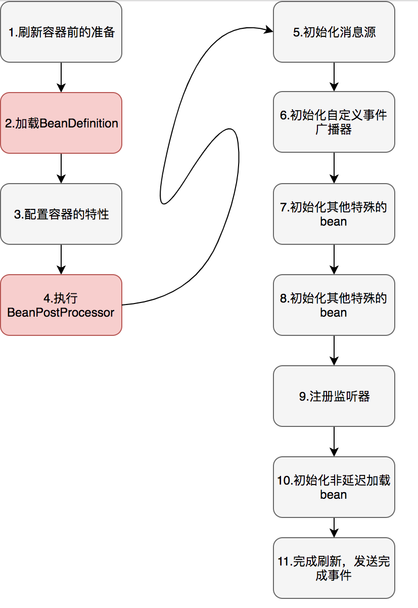

# Spring

## 0. Spring启动流程

Spring的启动流程是通过AbstractApplicationContext中的refresh方法完成，这个方法定义了如下几个步骤来完成Spring的启动：

1. **prepareRefresh()：**刷新(启动)容器前的准备，比如：设置开始时间、启动标志以及属性源初始化等；
2. **obtainFreshBeanFactory()：**刷新BeanFactory，加载xml配置文件，生成Bean信息Map<String, BeanDefinition> beanDefinitionMap；
3. **prepareBeanFactory(beanFactory)：**配置容器的一些标准特性，例如：容器类加载器，PostProcessor等；
4. **postProcessBeanFactory(beanFactory)：**修改或添加一些BeanPostProcessor；
5. **invokeBeanFactoryPostProcessors(beanFactory)：**执行扩展机制BeanFactoryPostProcessor；
6. **registerBeanPostProcessors(beanFactory)：**注册用来拦截bean创建的BeanPostProcessor；
7. **initMessageSource()：**初始化消息源：可以用于国际化；
8. **onRefresh()：**初始化其他特殊的Bean；
9. **registerListeners()：**注册监听器；
10. **finishBeanFactoryInitialization(beanFactory)：**实例化非懒加载的单例bean；
11. **finishRefresh()：**启动完成，发送完成事件；

## 1. 什么是IoC/DI？

IoC是Inversion of Control的缩写，即控制反转，将原本获取依赖对象的过程由自身控制变为了由IOC容器控制注入，这就是控制权的反转；通过控制对象的创建和管理完成对象之间依赖管理及注入等工作，从而很好的实现对象之间的解耦。通过反射技术完成对象的创建。

DI是Dependency Injection，依赖注入，因为控制反转是将获得依赖对象的过程反转了，所以有人提出了比IoC更适合的名称DI

所以IoC和DI是从不同的角度描述的同一件事情，就是指通过引入IOC容器，利用依赖关系注入的方式，实现对象之间的解耦。

## 2. 如何实现一个IOC容器？

了解了IOC是什么及完成了什么样的工作之后，我认为可以从如下几个方面入手：

1. 配置文件的设计和定义：我们怎么设计一个配置文件规范，来定义一个对象及其属性（包括生命周期、初始化、销毁、依赖等等）以及对象与对象之间的依赖关系在配置文件中要怎么设计体现出来？
2. 配置文件的解析：配置文件定义好了之后，我们要怎么将这个文件解析出来，比如识别这个文件里面的对象定义啊，依赖关系的定义等等的解析识别，那在解析过程中可能会包括配置文件合规性校验等等的相关工作；
3. 创建对象实例：解析完配置文件之后，如何根据解析结果new出我们的对象
4. 有依赖关系实例的注入：在创建完实例之后，实例之间有依赖关系配置的如何查找相应的实例完成依赖注入
5. 开发获取实例接口：所有实例化工作完成后，就是如何获取实例使用的问题了。

复杂一点的容器，可能还要考虑有有父子容器关系的问题等。

## 3. Spring IoC体系结构？

在Spring IoC容器中的两个核心是：BeanFactory和BeanDefinition，其中：

- BeanFactory是一个顶级接口，负责对象实例的管理创建工作，在其下有多个子接口负责不同类型场景，比如ListableBeanFactory、HierarchicalBeanFactory和AutowireCapableBeanFactory分别负责Bean集合、Bean的父子关系及Bean的装配等不同职责；
- BeanDefinition是一个Bean的定义接口，对应于在配置文件中的一个bean元素，负责管理一个bean的名称、class类型、生命周期属性、依赖关系属性、装配机制属性等等Bean相关的元数据，BeanFactory创建实例时就是根据这个BeanDefinition的来创建最终的实例的。

## 4. IoC容器的初始化过程？

IoC容易的初始化过程主要包括三个基本过程：配置文件加载、配置文件的解析和BeanDefinition注册到BeanFactory。

1. 配置文件加载：Spring提供了多种配置文件资源加载方式，比如classpath：，file:，url:等方式，通过提供不同ApplicationContext子类对应不同的配置文件加载方式，最终通过一个ResourceLoader类实现配置文件的读取流；
2. 配置文件解析：通过解析配置文件，将配置文件中bean元素、其他各种命名空间中的元素配置解析为不同的BeanDefinition实例；
3. 将beandefinition实例注册到BeanFactory中

## 5. Spring IoC注入方式？

1. set注入：
2. 构造方式注入：

## 6. Bean的初始化方式？

1. 构造方式初始化
2. 静态工厂方法
3. 对象工厂方法

## 5. 什么是AOP？

AOP即面向切面编程，AOP中的基本概念就是切面，切面到底是个什么东西？我的理解：比如一根木头切一刀之后会有一个横切面，而系统也一样，如果把系统当成是有成千上万个请求线组成的，那么如果我们将每个请求线的同一个业务点或者需要做相同业务的点（比如日志输出、事物管理）抽取就会形成一个面，那这个面就是我们说的切面的意思，而面向切面编程就如何将这个共性业务抽象出来，使得这个业务跟每个请求线能很好的解耦。在Spring中通过动态代理的方式实现

## 6. AOP中的基本概念？

1. advice-通知（建言）：
   - Before：方法调用之前调用；
   - After：方法完成后调用通知，无论方法是否执行成功；
   - After-returning：方法成功执行之后调用通知；
   - After-throwing：方法抛出异常后调用通知；
   - Around：在方法的前后调用；
2. pointcut-切点：对应某个方法，在这个方法的前后会调用通知，这个方法就是一个切点；
3. aspect-切面：切点+通知组成了一个切面，在开发中一般就是一个类；
4. joinpoint-连接点：在通知里面用到的，可以获取到切点信息的东西
5. weaving-织入：

## 7. Spring AOP和Aspectj的比较？

Aspectj是一个AOP框架，它能够对java代码进行AOP编译（编译器进行），让java代码具有AspectJ的AOP功能（需要特殊的编译器：ajc），可以这样说Aspectj是目前实行AOP框架中最成熟，功能最丰富的语言，且AspectJ能与java程序完全兼容，其实Aspectj单独就是一门语言，需要专门的编译器(ajc编译器)。Spring AOP并不尝试提供完整的AOP功能，注重与Spring IOC容器的结合来解决横切业务的问题。Spring不依赖于特殊的编译器，而是采用动态代理技术的实现原理来构建AOP，Spring只是使用了与Aspectj一样的注解。

## 8. Spring事物管理？

事物特性-ACID：

1. 原子性：事务是最小的执行单位，不允许分割。事务的原子性确保动作要么全部完成，要么完全不起作用；
2. 一致性：执行事务前后，数据保持一致；
3. 隔离性：并发访问数据库时，一个用户的事物不被其他事物所干扰，各并发事务之间数据库是独立的；
4. 持久性：一个事务被提交之后。它对数据库中数据的改变是持久的，即使数据库发生故障也不应该对其有任何影响。

所谓的事物管理，其实就是“按照给定的事物规则来执行提交或者回滚操作”。Spring提供的相应接口有：

- **PlatformTransactionManager：** （平台）事务管理器
- **TransactionDefinition：** 事务定义信息(事务隔离级别、传播行为、超时、只读、回滚规则)
- **TransactionStatus：** 事务运行状态

## 9. Spring事物属性？

- 隔离级别：定义一个事物可能受其他并发事务影响的程度；

  **并发事务带来的问题：**

  1. 脏读：当一个事务正在访问数据并且对数据进行了修改，而这种修改还没有提交到数据库中，这时另外一个事务也访问了这个数据，然后使用了这个数据。因为这个数据是还没有提交的数据，那么另外一个事务读到的这个数据是“脏数据”，依据“脏数据”所做的操作可能是不正确的。
  2. 丢失修改：指在一个事务读取一个数据时，另外一个事务也访问了该数据，那么在第一个事务中修改了这个数据后，第二个事务也修改了这个数据。这样第一个事务内的修改结果就被丢失，因此称为丢失修改。
  3. 不可重复读：指在一个事务内多次读同一数据。在这个事务还没有结束时，另一个事务也访问该数据。那么，在第一个事务中的两次读数据之间，由于第二个事务的修改导致第一个事务两次读取的数据可能不太一样。这就发生了在一个事务内两次读到的数据是不一样的情况，因此称为不可重复读。
  4. 幻读：幻读与不可重复读类似。它发生在一个事务（T1）读取了几行数据，接着另一个并发事务（T2）插入了一些数据时。在随后的查询中，第一个事务（T1）就会发现多了一些原本不存在的记录，就好像发生了幻觉一样，所以称为幻读。

  不可重复读的重点是修改，幻读的重点在于新增或者删除。

  **隔离级别**

  TransactionDefinition接口定义了五个表示隔离级别的常量：

  - **TransactionDefinition.ISOLATION_DEFAULT：**使用后端数据库默认的隔离级别，Mysql 默认采用的 REPEATABLE_READ隔离级别 Oracle 默认采用的 READ_COMMITTED隔离级别；
  - **TransactionDefinition.ISOLATION_READ_UNCOMMITTED:** 最低的隔离级别，允许读取尚未提交的数据变更，**可能会导致脏读、幻读或不可重复读**；
  - **TransactionDefinition.ISOLATION_READ_COMMITTED:** 允许读取并发事务已经提交的数据，**可以阻止脏读，但是幻读或不可重复读仍有可能发生**；
  - **TransactionDefinition.ISOLATION_REPEATABLE_READ:** 对同一字段的多次读取结果都是一致的，除非数据是被本身事务自己所修改，**可以阻止脏读和不可重复读，但幻读仍有可能发生。**
  - **TransactionDefinition.ISOLATION_SERIALIZABLE:** 	最高的隔离级别，完全服从ACID的隔离级别。所有的事务依次逐个执行，这样事务之间就完全不可能产生干扰，也就是说，**该级别可以防止脏读、不可重复读以及幻读**。但是这将严重影响程序的性能。通常情况下也不会用到该级别。

- 传播行为：为了解决业务层方法之间互相调用的事务问题，当事务方法被另一个事务方法调用时，必须指定事务应该如何传播，例如：方法可能继续在现有事物中运行，也可能开启一个新事物，并在自己的事物中运行。Spring中定义了如下传播行为：
  **支持当前事务的情况：**

  - **TransactionDefinition.PROPAGATION_REQUIRED：** 如果当前存在事务，则加入该事务；如果当前没有事务，则创建一个新的事务。

  - **TransactionDefinition.PROPAGATION_SUPPORTS：** 如果当前存在事务，则加入该事务；如果当前没有事务，则以非事务的方式继续运行。

  - **TransactionDefinition.PROPAGATION_MANDATORY：** 如果当前存在事务，则加入该事务；如果当前没有事务，则抛出异常。

  **不支持当前事务的情况：**

  - **TransactionDefinition.PROPAGATION_REQUIRES_NEW：** 创建一个新的事务，如果当前存在事务，则把当前事务挂起。

  - **TransactionDefinition.PROPAGATION_NOT_SUPPORTED：** 以非事务方式运行，如果当前存在事务，则把当前事务挂起。

  - **TransactionDefinition.PROPAGATION_NEVER：** 以非事务方式运行，如果当前存在事务，则抛出异常。

  **其他情况：**

  - **TransactionDefinition.PROPAGATION_NESTED：** 如果当前存在事务，则创建一个事务作为当前事务的嵌套事务来运行；如果当前没有事务，则该取值等价于TransactionDefinition.PROPAGATION_REQUIRED。

- 回滚规则：定义事物回滚规则，这些规则定义了哪些异常会导致事务回滚而哪些不会。默认情况下，事务只有遇到运行期异常时才会回滚，而在遇到检查型异常时不会回滚（这一行为与EJB的回滚行为是一致的）。 但是你可以声明事务在遇到特定的检查型异常时像遇到运行期异常那样回滚。同样，你还可以声明事务遇到特定的异常不回滚，即使这些异常是运行期异常。
- 是否只读：对事物资源是否执行只读操作，或者是读写操作。所谓事务性资源就是指那些被事务管理的资源，比如数据源、 JMS 资源，以及自定义的事务性资源等等。如果确定只对事务性资源进行只读操作，那么我们可以将事务标志为只读的，以提高事务处理的性能。在 TransactionDefinition 中以 boolean 类型来表示该事务是否只读。
- 事物超时：就是指一个事务所允许执行的最长时间，如果超过该时间限制但事务还没有完成，则自动回滚事务。在 TransactionDefinition 中以 int 的值来表示超时时间，其单位是秒。

## 10. 什么是MVC模式？

## 11. Springmvc工作原理？

SpringMVC框架是以请求为驱动，围绕Servlet设计，将请求发给控制器，然后通过模型对象，分派器来展示请求结果视图。

工作原理：

简单来说，客户端发送请求->前端控制器 DispatcherServlet 接受客户端请求 -> 找到处理器映射 HandlerMapping 解析请求对应的 Handler-> HandlerAdapter 会根据 Handler 来调用真正的处理器开处理请求，并处理相应的业务逻辑 -> 处理器返回一个模型视图 ModelAndView -> 视图解析器进行解析 -> 返回一个视图对象->前端控制器 DispatcherServlet 渲染数据（Moder）->将得到视图对象返回给用户，如下图：

流程说明：

1. 客户端（浏览器）发送请求，直接请求到 DispatcherServlet。

2. DispatcherServlet 根据请求信息调用 HandlerMapping，解析请求对应的 Handler。

3. 解析到对应的 Handler（也就是我们平常说的 Controller 控制器）后，开始由 HandlerAdapter 适配器处理。

4. HandlerAdapter 会根据 Handler 来调用真正的处理器开始处理请求，并处理相应的业务逻辑。

5. 处理器处理完业务后，会返回一个 ModelAndView 对象，Model 是返回的数据对象，View 是个逻辑上的 View。

6. ViewResolver 会根据逻辑 View 查找实际的 View。

7. DispaterServlet 把返回的 Model 传给 View（视图渲染）。

8. 把 View 返回给请求者（浏览器）

**SpringMVC重要组件**

1. **前端控制器DispatcherServlet：**Spring MVC 的入口函数。接收请求，响应结果，相当于转发器，中央处理器。有了 DispatcherServlet 减少了其它组件之间的耦合度。用户请求到达前端控制器，它就相当于mvc模式中的c，DispatcherServlet是整个流程控制的中心，由它调用其它组件处理用户的请求，DispatcherServlet的存在降低了组件之间的耦合性。
2. **处理器映射器HandlerMapping：**根据请求的url查找Handler。HandlerMapping负责根据用户请求找到Handler即处理器（Controller），SpringMVC提供了不同的映射器实现不同的映射方式，例如：配置文件方式，实现接口方式，注解方式等。
3. **处理器适配器HandlerAdapter：**按照特定规则（HandlerAdapter要求的规则）去执行Handler 通过HandlerAdapter对处理器进行执行，这是适配器模式的应用，通过扩展适配器可以对更多类型的处理器进行执行；
4. **处理器Handler(Controller开发)：**编写Handler时按照HandlerAdapter的要求去做，这样适配器才可以去正确执行Handler Handler 是继DispatcherServlet前端控制器的后端控制器，在DispatcherServlet的控制下Handler对具体的用户请求进行处理。 由于Handler涉及到具体的用户业务请求，所以一般情况需要工程师根据业务需求开发Handler；
5. **视图解析器View resolver：**进行视图解析，根据逻辑视图名解析成真正的视图（view） View Resolver负责将处理结果生成View视图，View Resolver首先根据逻辑视图名解析成物理视图名即具体的页面地址，再生成View视图对象，最后对View进行渲染将处理结果通过页面展示给用户。 springmvc框架提供了很多的View视图类型，包括：jstlView、freemarkerView、pdfView等。 一般情况下需要通过页面标签或页面模版技术将模型数据通过页面展示给用户，需要由工程师根据业务需求开发具体的页面；
6. **视图View（工程师开发）：**View是一个接口，实现类支持不同的View类型（jsp、freemarker、pdf...）