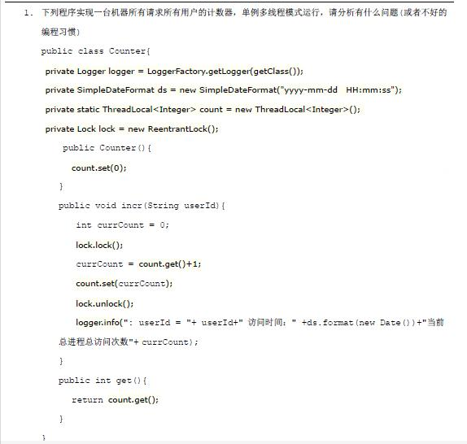
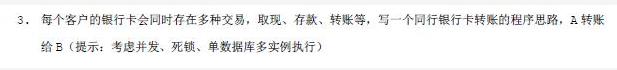

##2021 Java开发面筋（7年工作经验）

### 一、顺丰

面试职级：高级

#### 一面

面试官职级：架构师

1. 自我介绍；
2. 你认为做过的最好的项目，并介绍；
3. 项目中的数据是怎么存储的（项目用户量2亿+）？考点：分库分表；
4. 分库分表逻辑，路由规则是自己开发还是用了什么开源框架？
5. 多账户融合的问题？因为项目中没有解决这个问题，所以问我可能的解决方案？
6. 项目重构遇到的难点？（因为我说了我重构了整个项目）
7. 重构过程中在框架选型时你起的作用是什么？
8. 项目里面的安全性是怎么做的（简历里面写了，所以问了）？有知道哪些限流或者是频率控制得开源框架？
9. OAuth2的理解？（项目中用到了这个）
10. 雪花算法的原理？会不会产生重复ID？如果qps过高怎么办（核心还是怎么避免重复ID）？
11. 有了解过哪些分布式任务调度框架（简历中写了分布式任务调度系统）？
12. 新生代和老年代的回收算法？知道哪些非分代回收算法？
13. 项目中多线程使用的场景？线程池的核心参数有哪些？
14. MySQL联合索引A、B、C，AC查和BC查的区别？
15. MyBatis中$和#的区别？安全性？
16. Feign中重试和超时是怎么做的（项目中说跨服务调用是用的Feign）？
17. 消息可靠性问题（简历上写了了解Kafka和Rabbit，说了项目中用了Rabbit，就问了这个）？
18. 问了解过哪些Nosql数据库，回答了redis，就没有接着问？
19. Map的存储结构？线程安全版本CHM是怎么保证安全的，锁的粒度是怎么样？
20. 线上遇到过什么问题？是怎么解决的？
21. 如果发现内存泄露，你该如何解决？
22. 项目里的高并发场景是什么？是怎么做高并发的（简历里面写了了解高并发开发）？

面试官评价：技术还行，技术面不够广，对开源框架使用的过少

自我总结：答得不好

1. 自我介绍虚，逻辑不清晰；
2. 连最基本的CHM锁粒度都给忘了，JVM里面回收算法也答得不自信，模棱两可；Mysql索引都答得不好，这应该是强项才对。基础知识一定要记牢固。
3. 最好项目的介绍内心不够坚定，也没把认为优秀项目的优秀点说出来；
4. 问题解决方式的总结提炼还不够；

==结果：第二天通知的约第二面。==

#### 二面

面试官不知道什么职级，看聊天情况应该是个小领导吧。

视频面，面试官给我的印象不行，临到面试的时候面试官连简历都没有。开始聊得时候问我现在在什么公司（随手记，当时随手记不行走下坡路），然后面试官就开始全程鄙视了（什么随手记现在还在啊，哪一年进的随手记啊，怎么随手记走下坡路了还选择进随手记呢，怎么现在才离职啊）。

1. 你说说你的项目吧，你做过啥项目；
2. 说工作经历、项目经历；
3. 项目的赢利点是啥啊，公司是怎么养活你们的呢
4. 你做的项目都是失败的项目啊（因为我说项目经历的时候都是实打实的说，用户少啊，目前还没有赢利啊，靠投资啊这种的）。

总结：可能面试官是领导层，考虑的问题不一样。自己确实也没想过这些产品、运营、赢利模式、行业等方面问题，这个跟性格有关，确实也是自己要补足的一些点。

==结果：挂==

### 二、微众

岗位：贷款核心账务后台开发

#### 一面

简述：无自我介绍、无基础面试；全程是基于方案设计的面试。

1. 说说你与面试岗位的匹配情况；
2. redis集群，一致性哈希的原理，Java中HashMap的哈希是一致性哈希算法吗；
3. 说说你项目里面你认为有挑战的点（说了一下分库分表、以及数据均衡的事（后续方案就大部分全是基于均衡的问题））；
4. 如果让你做一个一致性哈希算法，你是直接用现有开源的，还是自己设计？
5. 现在有这样一个借据场景，你能不能设计一个方案让数据均匀分库：有用户，每个用户下可能借据（有多又少），设计一个分库方案，让每个用户的借据在同一个库中，同时要保持每个库的数据均衡。
6. 项目中有用过分布式事务嘛（没等我回答有没有），现在有这样一种场景，你能不能设计一个分布式事务的方案来实现：现在有大量用户要同时转账，你设计一个分布式事务的方案，保证用户查看到的余额是实时的？（大概说了一下方案，有考虑不全，就接着问了不全的地方怎么处理）接着问那在对同一个账户进行操作时，大量并发你怎么保证正确性和实时性？（说了乐观锁、分布式锁方案）。
7. 简历里面写了分布式任务的项目，就问了你们分布式任务的分片执行原理是怎么样的？然后又开始让设计方案：现在有大量的借据任务，你怎么保证这些借据任务均匀分配到各执行节点执行？（然后说了一下方案，又继续加难度）那如果是借据下面有很多流水，然后要针对这些流水做任务，但是要保证每个借据下的流水是在同一个节点执行的，同时又要保证各节点的均衡，你有什么方案？（给了一个效率低一点的方案，面试官说你这效率有点低，有没有更简单的（没想到，事后想到了一种更简单的方案））。
8. 最后问了个简单的数据库联合索引问题。

总结：总体来说，这次面试是我面过的最有挑战的一次。总体表现还算可以，基本每个场景都给了大体的方案（但是描述过程中逻辑还有待加强（这个是我表述能力的诟病，一直没有得到好的锻炼）），也是一次独特的面试官直白的问与岗位匹配度的一次体验（后来跟朋友讨论了一下，面试官问这个问题的意义应该是想了解我对银行贷款业务方面是否有经验）。时长1个小时，面完当天晚上就收到二面通知（看来面试官对我表现还算认可的）。

==结果：当晚HR通知约第二面时间。==

#### 二面

1. 自我介绍；
2. 在微信上发截图题，直接做题；
   - 
   - 
3. 问了一下数据库联合索引问题；
4. 问了接口安全性；

总结：面试完感觉不好，截图第一题答得不完善，第二题说了两种方案：基于redis分布式锁和直接基于数据库读锁实现，但感觉不是面试官想要的答案。

==结果：经朋友打听二面是过了，但是等了一个月都没消息，后来询问HR，HR没有理我。基本可以确认是找到更加合适的人了。==

### 三、OPPO

岗位：内容产品-Java开发

职级要求：3年以上Java开发经验

#### 一面

1. 自我介绍；
2. 介绍自己认为好的项目；
3. 问项目实现方案、细节（问的不是我在第二个问题里面介绍的项目）；
4. 问了用户量级别，日活等；
5. 分库分表时，怎么分库分表才能防止迁移的数据最少（参考redis集群原理就行）；
6. 问我们数据使用的事务隔离级别是什么（答了RC（实际是RR），没继续问，不知道问的点在哪）？
7. UUID会不会重复（这个我不确定，我直接说了不确定）？
8. token实现，写库和写缓存的逻辑是怎么样的（这点我自己也不确定，就直接说了不确定）？
9. ThreadLocal的作用，在项目中怎么用的？
10. 线程的wait和blocking状态有什么区别？
11. 项目用的是什么垃圾回收器（答了java8默认回收器，用的啥我也忘了）？
12. 虚引用的作用？
13. 操作系统中哪个进程使用的内存最大怎么查看？
14. http中表示响应体大小的响应头是啥？
15. redis里面要执行两个写操作，怎么做到要么同时成功要么同时失败？
16. 有没有做过gc优化？内存泄漏怎么排查？

总结：项目那一块答得还可以，八股文相关问题答得不行，很多看了都忘记了。

==结果：第二天猎头通知约第二面。==

### 四、Shopee

岗位：Java资深开发工程师-数字银行

职级要求：忘了

#### 一面

面试官很好，提前说了此次面试侧重在基础知识，会分几个部分来考察，如下：

- 数据库
- Java基础
- 算法
- 计算机系统（没有问）

问题：

1. 自我介绍；

2. 数据库部分：

   - 数据库日志中提示的慢SQL你会怎么去进行优化？然后写了一个SQL语句，让你针对这个SQL提出可能的优化方案？
   - explain输出结果中各个字段的意义是什么？
   - MySQL的架构？或者说是MySQL包含有哪些模块？
   - MySQL中的连接管理模块是怎么管理连接的？是一对一的么？还是连接池的方式？
   - MySQL默认的隔离级别是什么？RR有解决幻读的问题么？RR级别下的一致性读是怎么做（怎么问的不清楚了，就是让你说MVCC在RR级别下是怎么工作的）？
   - MySQL高版本中为什么要去除查询缓存？
   - MySQL中有哪些常用的存储引擎？Innodb的工作原理（怎么问的忘了，让你说数据的存储结构或者说是方式）？
   - MySQL中的索引为什么用B+树？可以用其他方式么？

3. Java部分：

   - java集合里面用过哪些类？
   - HashMap的存储结构？1.8相比1.7里面有哪些变化？
   - CHM是怎么实现的？CAS和synchronize是怎么运用的？跟1.7比区别在哪？在项目中怎么使用的？
   - 单例模式有用过么？静态内部类（我答得是用的这种）跟其他方式比有什么好处？Double check的了解么，Double check的时候要用volatile来修饰，这个关键字的作用是什么？
   - volatile的可见性是怎么实现的？那说说Java的内存模型吧，它是怎么样的一个执行过程？
   - synchronize的实现原理是什么？使用方式是什么？各使用方式有什么区别？可重入是怎么实现的？
   - Jvm了解么？那GC优化有做过么？你认为GC优化是优化的什么？然后面试官就引导我一起聊了JVM方面的东西，比如：对象怎么晋升的，分配流程是怎么样的，新生代为什么要分两个survivor区？对象一定是在eden去分配吗？这一块聊得也比较久，至少15分钟往上了。

4. 写算法：

   - 出的是：在字符串里面求出最长无重复字符子串的长度（[leetcode](https://leetcode-cn.com/problems/longest-substring-without-repeating-characters/)）。

   算法大概做了20分钟左右。做完之后，面试官会让你解释代码。做算法期间面试官就在看我简历，本以为算法做完就结束了（因为时间已经有个多小时了），结果又接着问了下面部分。

5. 最后部分：

   - 说说你自己觉得最好的项目？
   - Eureka的实现原理说一说？整个工作流程是怎么样的？Feign是怎么跟Eureka搭配的呢？然后两个人针对Eureka里面的一些缓冲机制，实例crash多久才会感知等问题进行了一些讨论（这一块代码之前有看过，但是印象不深，答得马马虎虎）。
   - SpringBoot的启动流程（这个也记得不详细，只能说个大概）？聊了聊关键的几个配置？SpringBoot的jar包是怎么运行的？为什么不需要Tomcat？
   - kafka中Topic、partition、producer、consumer之间的一些关系？在哪些点会发生可靠性的问题？ISR的一些东西？kafka能保证全局顺序性么？如果可以损失一些性能硬要保证顺序性你可以怎么做？然后就是讨论了一些consumer和partition之间消费的一些关系？
   - rabbitmq你们是怎么部署的？镜像部署的性能瓶颈可以怎么处理呢？为什么你们项目用rabbitmq而不用kafka呢？
   - 你认为Rabbitmq和kafka的本质区别是什么？我想了半天，没想到，后来想想应该是在于一个是天生分布式，而另一个不是。
   - Java中创建线程有几种方式？线程池你们项目中是怎么用的？有哪些核心参数？工作流程是个什么样子？如果一个固定大小的线程池中的线程crash掉了会发生什么？

总结：整体面试过程确实非常注重基础，原理；面试官非常好，他担心问的方式不对，会通过多种不同的提问方式来问你，让你能更好的回答。个人感觉整体表现还算及格吧，有很多东西都看过，但就是记不住（比如eureka相关的、springboot相关的）。整个过程持续了2个半小时。

==结果：当天HR加了微信，约了第二面时间，好好对待二面吧。==

