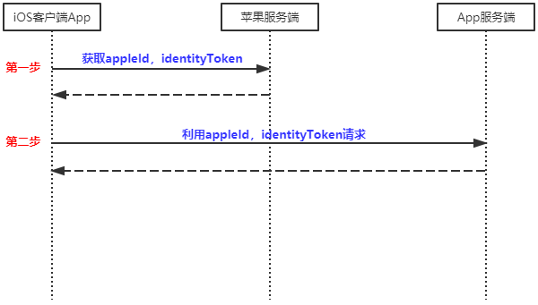
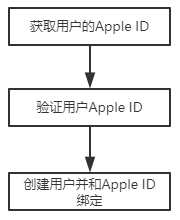

## 苹果登录

由于公司项目需要，前段时间完成了接入苹果登录的功能实现；在此过程中遇到不少问题，为了避免下次再次遇到相同的问题，特此记录；也希望对大家有所帮助。

####1. 苹果应用注册流程

因为我是服务端开发，所以具体的注册流程我这里无法给到，相信各位ios开发者对这个流程应该都是滚瓜烂熟。

####2. 登录流程详解

流程图如下：



##### 第一步：App本地获取信息

根据iOS认证服务提供的api，客户端app通过如下三个关键api可以获得代表用户的AppleId：

- ASAuthorizationAppleIDProvider：用于生成基于用户AppleId认证的请求对象；
- ASAuthorizationController：一个用于管理由ASAuthorizationAppleIDProvider生成的请求的控制器；
- ASAuthorizationAppleIDCredential：在成功认证AppleID之后生成的一个凭证结果，从这个对象里面可以获得如下信息：
  - identityToken：一个用于交流信息的安全的**JSON Web Token（JWT）**标准的字符串；
  - authorizationCode：当与app应用服务器交互时，可以用于证明身份信息的有时效性的令牌；
  - state：一个随机字符串，你的app在请求凭证的时候提供的；
  - user：代表用户的标识（Apple ID）。

##### 第二步：跟App服务端交互

app获取到用户的相关凭证信息之后，剩下的就是如何和我们的应用服务端交互，从而免去用户输入类似用户名密码或者验证码这样的信息，简化用户操作行为从而提升用户的使用体验。

针对我们项目的场景是：用户在一次使用苹果登录过我们app之后，如果以后再用苹果登录，要使这个用户的历史数据可以重现，而不是每次都是新的。简单点说就是用户的苹果账户信息和我们服务的账户信息要是绑定打通的。所以，针对这种情况我们服务端的要做的事情主要是获取到用户的Apple ID的信息，然后在服务端创建一个用户对象并和这个Apple ID绑定起来，就可以做到利用苹果登录功能来优化用户体验。

服务端处理流程如下：



用户的Apple ID可以由App端获取后传递给应用服务端，关键步骤在于如何验证Apple ID的合法性呢？在第一步中App获取的信息里面有个**identityToken**的JWT标准字符串，按照这个字符串的解释是用于安全信息传输的，同时我们参考[JWT字符串的格式标准详解]()可以了解到其格式组成中有一个签名的部分，而苹果服务端生成的这个**identityToken字符串的签名部分是通过公私钥这种非对称加密的方式生成的，**因此很容易联想到我们只要通过公钥去验证identityToken签名的合法性就可以来验证Apple ID是否合法。

按照苹果开发者文档，identityToken的PayLoad部分包含如下关键信息：

- iss：固定值，https://appleid.apple.com；
- sub：Apple ID；
- aud：苹果应用ID；
- exp：这个token的过期时间；
- email：用户邮箱地址。

由此我们服务的实现如下：

1. 通过接口获取到app端上传的Apple ID和identityToken信息；

2. 验证identityToken，关键代码如下：

   ```java
   private HttpClient httpClient
               = HttpClients.custom().setDefaultRequestConfig(
                       RequestConfig.custom()
                               .setSocketTimeout(100000)
                               .setConnectTimeout(100000)
                               .build())
               .build();
   
   static class Key {
       private String modulus;
       private String exponent;
   
       public Key(String modulus, String exponent) {
           this.modulus = modulus;
           this.exponent = exponent;
       }
   
       public String getModulus() {
           return modulus;
       }
   
       public void setModulus(String modulus) {
           this.modulus = modulus;
       }
   
       public String getExponent() {
           return exponent;
       }
   
       public void setExponent(String exponent) {
           this.exponent = exponent;
       }
   }
   
   /**
    * 更新苹果的公钥信息，并放在本地map中缓存；
    * 苹果公钥获取地址：https://appleid.apple.com/auth/keys
    */
   private void updateAppleKeys() throws IOException {
       HttpGet httpGet = new HttpGet(APPLE_PK_KEYS_URL);
       String response = httpClient.execute(httpGet, httpResponse ->
                                            EntityUtils.toString(httpResponse.getEntity(),"UTF-8"));
       JSONObject responseJson = JSON.parseObject(response);
    JSONArray jsonArray = responseJson.getJSONArray("keys");
       for (int i = 0; i < jsonArray.size(); i++) {
           JSONObject jsonObject = jsonArray.getJSONObject(i);
           APPLE_KEYS_CACHE.put(
               jsonObject.getString("kid"),
               new Key(jsonObject.getString("n"), jsonObject.getString("e")));
       }
   }
   private Jwt<Header, Claims> parseIdToken(String idToken) {
       String[] idTokenParts = idToken.split("\\.");	// 分割identityToken
       if (ArrayUtils.getLength(idTokenParts) != 3) {
           LOGGER.error("获取的token[{}]信息格式有误", idTokenParts);
           throw new IllegalArgumentException("参数有误");
       }
   
       // 解析identityToken的header信息，获取其中的kid。（用到的依赖包：jjwt）
       String headerString = Base64UrlCodec.BASE64URL.decodeToString(idTokenParts[0]);
       JSONObject headerJson = JSON.parseObject(headerString);
       String kid = headerJson.getString("kid");
   
       // 根据header中的kid信息获取对应的公钥
       Key cachedKey = APPLE_KEYS_CACHE.get(kid);
       // 防止苹果公钥有调整，出现过一次，所以这里多做一层判断
       if (Objects.isNull(cachedKey)) {
           try {
               updateAppleKeys();
           } catch (IOException e) {
               LOGGER.error("更新苹果公钥信息时出现异常");
               throw ex;
           }
       }
   
       cachedKey = APPLE_KEYS_CACHE.get(kid);
       if (Objects.isNull(cachedKey)) {
           LOGGER.error("获取的token信息加密秘钥没有在苹果公布的信息中，请求非法");
           throw new BadRequestException(FailureEnum.ILLEGAL_REQUEST.getMessage());
       }
   
       // 组装RSA公钥对象，并转换为Jwt对象（用到的依赖包：jjwt）
       BigInteger modulus = new BigInteger(cachedKey.getModulus());
       BigInteger exponent = new BigInteger(cachedKey.getExponent());
       KeySpec keySpec = new RSAPublicKeySpec(modulus, exponent);
       try {
           PublicKey publicKey = KeyFactory.getInstance("RSA").generatePublic(keySpec);
           Jwt<Header, Claims> jwtObj = Jwts.parser().setSigningKey(publicKey).parse(idToken);
           return jwt;
       } catch (Exception ex) {
           LOGGER.error("验证idToken时异常，idToken:{}，modulus:{}，exponent:{}",
                        idToken, modulus, exponent);
           throw ex;
       }
   }
   ```
   
   可能的坑：
   
   - 获取苹果公钥，地址为https://appleid.apple.com/auth/keys，这里要注意由于这个功能苹果发布不久，公钥信息可能会调整（我们上线之后遇到过一次导致功能出现异常），所以这里在本地缓存找不到对应公钥的时候要更新一下缓存；
   
   - 理论上我们只要能用公钥正常验证签名能通过就表示客户端发的信息的合法的，但是这里jjwt包在把字符串格式转换对象格式时，会去验证过期时间是否过期从而抛出异常导致验签失败；所以这里可以根据你自己的常见选择是自己实现验签还是用jjwt提供的方式去验签。自己验证的代码如下：
   
     ```java
     byte[] data = (idTokenParts[0] + "." + idTokenParts[1]).getBytes(StandardCharsets.UTF_8);
     sign = Base64UrlCodec.BASE64URL.decode(idTokenParts[2]);
     Signature sig = Signature.getInstantce("SHA256withRSA");
     sig.initVerify(publicKey);
     sig.update(data);
     sig.verify(sign);	// 返回true或者false
     ```
   
3. 验证通过之后，创建你自己服务端的用户对象，并和Apple ID建立绑定关系即可。

#### 3. 总结

在做这个苹果登录的过程中，主要学习到如下几点：

1. 重新认识了JSON Web Token这种信息格式；
2. 信息加密在信息交流中的重要信息；
3. Base64的两种编码格式。


